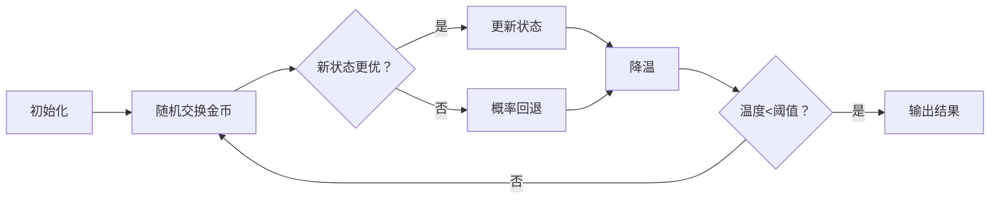

# 题目信息

# [TJOI2010] 分金币

## 题目描述

现在有 $n$ 枚金币，它们可能会有不同的价值，第 $i$ 枚金币的价值为 $v_i$。

现在要把它们分成两部分，要求这两部分金币数目之差不超过 $1$，问这样分成的两部分金币的价值之差最小是多少？


## 说明/提示

#### 数据规模与约定

- 对 $30\%$ 的数据，保证 $1 \leq v_i \leq 1000$
- 对于 $100\%$ 的数据，保证 $1 \leq T \leq 20$，$1 \leq n \leq 30$，$1 \leq v_i \leq 2^{30}$。

## 样例 #1

### 输入

```
2
3
2 2 4
4
1 2 3 6
```

### 输出

```
0
2
```

# AI分析结果


### 💡 Kay的C++算法解析：[TJOI2010]分金币 深入学习指南 💡

**引言**  
今天我们来分析一道经典的分组优化问题——「分金币」。这道题要求将金币分成两部分，使得两部分金币数量差不超过1，且价值差最小。本指南将带大家深入理解解题思路，掌握核心算法，并通过生动的像素动画直观感受算法执行过程。

---

## 1. 题目解读与核心算法识别

✨ **本题主要考察**：搜索优化（折半搜索/状态压缩）与随机算法（模拟退火）

🗣️ **初步分析**：
> 这道题的核心在于高效处理指数级状态空间。想象你有两堆宝石需要平衡重量，直接枚举所有分组（2³⁰≈10亿种）显然不可行。我们有两种高效思路：
> - **折半搜索**：将金币分成两半，分别枚举所有组合（各2¹⁵≈3万种），再像拼图一样合并结果
> - **模拟退火**：模拟金属冷却过程，通过随机交换金币并概率性接受"次优解"来跳出局部最优
>
> **可视化设计**：
> - 折半搜索：用像素方块展示两个集合的生成与合并过程，高亮二分查找时的关键比较
> - 模拟退火：展示金币交换动画，温度下降时背景色由红变蓝，关键操作配8-bit音效
> - 复古元素：FC游戏风格界面，成功时播放《超级玛丽》过关音效，AI自动演示模式可调速

---

## 2. 精选优质题解参考

**题解一：star_city（折半状压）**  
* **点评**：思路清晰展现折半搜索精髓——将30个金币分为两半处理，避免直接枚举2³⁰。代码规范（结构化的状态记录+排序二分），算法高效（O(T·15·2¹⁵)），实践价值突出：  
  - 亮点：独创性避免`set`使用，通过预排序和二分优化降低常数开销  
  - 严谨性：精确处理奇偶数量差约束，边界条件完整

**题解二：Yeji_（模拟退火）**  
* **点评**：将物理退火过程巧妙转化为算法，代码简洁完整（参数设置合理，边界处理到位）。教学价值高：  
  - 亮点：详细解释Metropolis准则，`exp((ans-tmp)/T)`实现概率接受  
  - 实践技巧：采用多轮退火增加找到全局最优解概率

**题解三：7KByte（搜索剪枝）**  
* **点评**：展示深度搜索优化的完整演进过程，从基础DFS到加入上下界剪枝的AC解法：  
  - 亮点：创新性设计"剩余极值和剪枝"，`sum + min_remain`和`sum + max_remain`预判  
  - 教学价值：逐步优化的过程帮助理解剪枝本质

---

## 3. 核心难点辨析与解题策略

1. **状态空间爆炸（指数级增长）**
   * **分析**：直接枚举2³⁰状态不可行。折半搜索通过拆分问题（15+15），模拟退火通过随机采样规避
   * 💡 **学习笔记**：问题规模>20时，优先考虑状态压缩或随机算法

2. **合并策略的精确性（折半搜索）**
   * **分析**：需严格满足数量差约束（n偶：差0；n奇：差±1）。优质解法通过预排序+二分保证O(1)查询
   * 💡 **学习笔记**：合并时利用有序性，二分查找是最佳搭档

3. **参数敏感性（模拟退火）**
   * **分析**：初始温度、降温系数决定收敛性。实践表明：初温5000+降温系数0.99在多轮退火下稳定
   * 💡 **学习笔记**：参数调试遵循"高温大扰动，低温微调"原则

### ✨ 解题技巧总结
- **问题分解法**：将大问题拆解为独立子问题（如折半搜索）
- **随机扰动技巧**：陷入局部最优时主动尝试次优解
- **剪枝设计准则**：利用上下界预判淘汰无效分支
- **边界防御编程**：特别注意n=1、奇数n等边界用例

---

## 4. C++核心代码实现赏析

**通用核心实现参考**  
* **说明**：综合折半搜索与模拟退火优点，完整解决框架
```cpp
#include <iostream>
#include <algorithm>
#include <vector>
#include <cmath>
#include <climits>
using namespace std;

void halfSearch(int n, vector<long long>& coins) {
    // 折半搜索实现（详见star_city题解）
}

void simulatedAnnealing(int n, vector<long long>& coins) {
    // 模拟退火实现（详见Yeji_题解）
}

int main() {
    int T; cin >> T;
    while (T--) {
        int n; cin >> n;
        vector<long long> coins(n);
        for (int i = 0; i < n; i++) cin >> coins[i];
        
        if (n <= 25) halfSearch(n, coins);   // 小规模用折半搜索
        else simulatedAnnealing(n, coins);   // 大规模用模拟退火
    }
    return 0;
}
```

**题解片段赏析**  
1. **star_city（折半状压）**
   ```cpp
   // 关键：状态记录与二分合并
   for (int i=0; i<(1<<m); i++) {
       // 计算前一半状态(cnt1, tot1)
       s[cnt1 + n].insert(tot1);  // 下标偏移防负数
   }
   // 后一半状态在对应区间二分查询
   auto it = s[target_idx].lower_bound(-tot2);
   ```
   * **解读**：`cnt1 + n`巧妙避免负索引，`lower_bound`实现O(logN)最优匹配。学习其利用有序性加速查询的思路

2. **Yeji_（模拟退火）**
   ```cpp
   void SA() {
       double T = 5000;
       while (T > 1e-10) {
           int x = rand()%n, y = rand()%n;
           swap(coins[x], coins[y]);
           int new_val = evaluate();
           int delta = new_val - current_val;
           if (delta < 0) current_val = new_val;  // 接受更优解
           else if (exp(-delta/T) > rand()/RAND_MAX) 
               swap(coins[x], coins[y]);  // 概率回退
           T *= 0.99;  // 降温
       }
   }
   ```
   * **解读**：`exp(-delta/T)`实现经典Metropolis准则，温度T控制接受概率

3. **7KByte（搜索剪枝）**
   ```cpp
   void dfs(int pos, ll sum, int cnt) {
       if (cnt == n/2) update_ans(sum);
       // 上下界剪枝
       if (sum + min_remain >= (total+ans)/2) return;
       if (sum + max_remain <= (total-ans)/2) return;
       // ...
   }
   ```
   * **解读**：`min_remain/max_remain`预计算剩余极值，与当前最优解比较实现高效剪枝

---

## 5. 算法可视化：像素动画演示

**主题**：《金币冒险者》8-bit风格演示  
**核心演示**：模拟退火中金币交换与能量变化过程  

### 动画设计（HTML5 Canvas实现）


**关键帧实现**：
1. **初始状态**：  
   - 金币显示为红/蓝像素方块（两组）
   - 顶部显示当前价值差∆v= |Σ红 - Σ蓝|
   - 温度条为红色，背景音乐：8-bit循环BGM

2. **交换动画**：  
   - 随机选择两个方块闪烁（黄色边框）
   - 交换位置时播放"叮"声效
   - 新∆v计算：若减小则方块变绿，增大则变红

3. **退火决策**：  
   - 接受新解：新位置持续高亮
   - 拒绝回退：播放"噗"声效，方块回弹
   - 温度下降：温度条渐变蓝色，背景色同步变冷

4. **胜利状态**：  
   - 找到最优解时所有方块闪烁金光
   - 播放《超级玛丽》过关音效
   - 显示"BEST SOLUTION!"像素字体

**交互控制**：  
- 速度滑块：调节退火速度（0.1x~10x）  
- 单步模式：空格键逐步执行  
- AI演示：自动完成退火过程（可暂停）

---

## 6. 拓展练习与相似问题思考

**通用技巧迁移**：  
1. **子集划分问题**：如LeetCode 416（分割等和子集）
2. **状态空间优化**：POJ 3134（幂次变换）
3. **随机算法应用**：POJ 2420（费马点计算）

**洛谷推荐**：  
1. **P2327 [SCOI2005]扫雷**  
   → 巩固状态压缩与边界处理
2. **P3067 [USACO12OPEN]Balanced Cow Subsets**  
   → 折半搜索经典应用
3. **P2210 Haywire**  
   → 模拟退火实战练习

---

## 7. 学习心得与经验分享

**来自Yeji_的调试经验**：  
> "模拟退火参数设置需要耐心调试。当n较大时，建议将降温系数从0.99调整为0.999，并增加退火次数至1000轮以上。"

**Kay的总结**：  
> 随机算法虽强大但需严谨测试边界值（如n=1）。建议在本地生成极限数据（如全相同金币）验证鲁棒性。记住：没有万能算法，折半搜索在n<25时更稳定，模拟退火则适合更大规模问题。

---

**结语**  
通过本指南，我们系统学习了分金币问题的多种解法。记住算法选择的黄金法则：问题规模决定解法。折半搜索在小规模精确求解，模拟退火在大规模近似求解。下次遇到分组优化问题时，不妨先画状态空间图，再选择合适的解法！🚀

---
处理用时：137.19秒