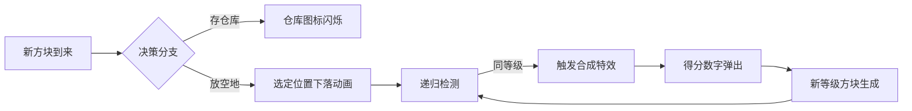

# 题目信息

# [SHOI2013] 二重镇

## 题目描述

这是一个充满爱的村子，它的名字叫二重镇。在这个爱意浓浓的村子里，居民们的生活快乐又安宁。二重镇呈长条形状，可分为排成一行的 $N$ 个方格。每个格子可能是空地，也可能是小草、灌木、大树、房屋或城堡中的一种物品。每种物品都有一个等级，小草的等级是 $1$，灌木的等级是 $2$，依此类推。

你是这个村庄的建造者。你会陆续获得 $D$ 件物品，你要将它们合理地放置在村庄的空地上。你的目标是要让村子的总人气尽可能大。人气的获得规则在后面说明。关于放置的规则有以下几条：

* 第一，每件物品都必须放在一个地方，不可丢弃，如果没有空地了，游戏直接结束；

* 第二，物品可以放在一格空地上，或者临时放在仓库里。仓库同时最多只能放一件物品，它一开始是空的。只存在一个仓库；

* 第三，一旦物品放在某个空格上，只要符合条件，系统就会自动将一些物品合成一个大的物品，这是强制被动的，也是瞬间的。直到合成结束后，才能放置下一个物品。

* 第四，存放在仓库中的物品，随时可以取出放到空地上（但注意不能在合成的过程中放置），也可以一直留在仓库里。

* 第五，除非利用仓库，不然不能更改物品的放置顺序；

总结起来，这个游戏的流程就是获得一个新物品，决定是否将这个物品存入仓库，再决定将仓库中的物品或新物品放到哪个空地上，系统自动判定合成，获得人气，直到所有物品都被放置完毕，或空地用完为止。

最后是关于合成的规则。合成是自动完成的，也是强制性的。如果有连续两个或以上相邻的格子里有相同等级的物品，它们会自动合体成一个新的物品，新物品的等级比之前高一个级别。合体分三步：

* 第一步，确定有多少物品参与合成，这些物品的位置必须连在一起，等级相同。参与合体的物品会全部消失，对应的格子变成空地；

* 第二步，假设有 $A$ 个 $K$ 级物品参与合体，那么将获得$A\times 2^K$ 点人气。例如有一次五棵小草进行了合体，那么总人气就会增加 $5 \times 2^1=10$；

* 第三步，一个 $K+1$ 等级的物品会出现在一个格子里。如果 $K+1$ 大于 $5$，则跳过这步，但第二步中的人气仍然要算，第一步中的旧物品也会被清除。这个高等级的物品只会出现在参与合体的格子上。每个格子会记录最后一次被放置物品的时间，新的物品会出现在该时间最晚的那个格子里，形象地说，就是出现在最近被放置过东西的格子；

最后，请注意合成是会触发多次的，比如两个小草合成一个灌木，如果这棵灌木旁边还有其他灌木，合体将继续发生下去。

现在，给出 $N$ 和获得物品的顺序及等级，请你要合理地将这些物品放置在一个初始全是空地的村子里，使得村子最终的人气值尽可能高。当所有物品都被放置，或者某一刻村子里没空地了，你都会结束村子的建设，而此时村子里累计人气值就是你的最终成果。

## 说明/提示

对于 $30\%$ 的数据，$N=3$, $D\leq 10$。

对于 $60\%$ 的数据，$N\leq 4$, $D\leq 30$。

对于 $100\%$ 的数据，$N\leq 6$, $D\leq 100$。

## 样例 #1

### 输入

```
4 10
1132411235```

### 输出

```
168```

# AI分析结果


### 💡 Kay的C++算法解析：二重镇 深入学习指南 💡

#### 1. 题目解读与核心算法识别
✨ **本题主要考察**：状态压缩动态规划 + 模拟合成  
🗣️ **初步分析**：
> 二重镇问题就像在玩一个策略性俄罗斯方块游戏，你需要合理放置不同等级的方块（小草/灌木/大树/房屋/城堡），当相邻相同等级方块接触时会"合成"更高等级方块并得分。核心难点在于：
> - 如何高效表示村庄状态（6个格子×6种状态→六进制压缩）
> - 处理连锁合成反应（放置一个方块可能引发多次合并）
> - 仓库的灵活使用策略（临时存储改变放置顺序）  
> 优质题解均采用**状压DP**，通过六进制数表示村庄状态，分三种决策转移：存仓库/放新物品/放仓库物品。可视化方案将设计为**8位像素风格**：村庄显示为6个彩色格子（不同颜色代表等级），仓库作为独立格子。关键操作将触发音效（放置"噗"声，合成"叮"声），自动演示模式会像AI玩消除游戏逐步展示最优决策。

---

#### 2. 精选优质题解参考
**题解一（maruize）**  
* **点评**：思路清晰度极佳（六进制状态压缩，分三类转移），代码规范性突出（预处理val/to数组加速合成计算），算法亮点在于用循环处理连续合并避免递归开销。实践价值高，O(6⁷)复杂度完美匹配数据范围，边界处理严谨（val[i]==0判断合法状态）。作者强调"合成会触发多次"是解题关键洞察。

**题解二（logeadd）**  
* **点评**：创新性采用**预计算合法状态转移表**，大幅提升DP效率。代码结构模块化（xiao函数处理合成），虽变量命名稍简但逻辑完备。亮点在于分离状态生成与转移，使DP过程简化为查表操作。特别适合帮助理解状压DP的优化本质，竞赛参考性强。

**题解三（cff_0102）**  
* **点评**：记忆化搜索实现更符合直觉，递归合并函数精准模拟题意。代码可读性最佳（详细注释+明确函数分工），关键贡献在于强调**等级5合成后消失**的易错点。八进制转六进制存储体现空间优化思维，虽常数稍大但启发性强。

---

#### 3. 核心难点辨析与解题策略
1. **状态表示与压缩**  
   *分析*：村庄6个格子各含6种状态（空地+5等级），直接枚举需6⁶=46656种状态。优质解用六进制整数表示，如maruize的`f[i][j][st]`。  
   💡 **学习笔记**：六进制压缩是网格类问题的黄金表示法，每位对应格子状态。

2. **连锁合成模拟**  
   *分析*：放置后可能触发多米诺式合并。cff_0102用递归merge函数处理，maruize用while循环+预计算。关键技巧：合并后新物品位置由"最后放置时间"决定（简化实现用连续段右端）。  
   💡 **学习笔记**：合成函数需返回新状态+得分，并支持连续调用直到稳定。

3. **仓库决策分支**  
   *分析*：每一步面临三选一：(1)新物品存仓库 (2)直接放空地 (3)取仓库物品放空地。logeadd用三维DP`[step][仓库状态][村庄状态]`覆盖所有分支。  
   💡 **学习笔记**：状态转移需考虑决策顺序，仓库操作使问题具备后效性。

✨ **解题技巧总结**  
- **状态压缩模板**：六进制位操作`getState() = state/pow6[pos]%6`  
- **合成处理范式**：循环检查相邻→计算得分→更新状态→递归检测  
- **决策覆盖法则**：永远先处理仓库物品放置，再处理新物品  
- **边界金科玉律**：等级5合成后变空地（非等级5！）

---

#### 4. C++核心代码实现赏析
**通用核心实现参考**  
*说明*：综合三大解法优点的状态压缩DP框架，含完整合成模拟
```cpp
#include <cstring>
const int MAX_STATE = 46656; // 6^6
int dp[101][7][MAX_STATE]; // [step][storage][state]

// 六进制位获取
int getState(int state, int pos) {
    return state / pow6[pos] % 6;
}

// 合成核心函数（返回新状态+得分）
pair<int,int> merge(int state, int pos, int item) {
    int grid[6], score = 0;
    // 状态解码→数组合成→状态编码
    while (检测到可合并相邻块) {
        score += (合并数量) * (1 << 等级); // 得分计算
        // 清除旧块并生成新物品（注意等级5消失）
    }
    return {new_state, score};
}

// DP转移骨架
for (int step=0; step<items; ++step) {
    for (int stor: 0..5) { // 仓库状态
        for (int state: 所有六进制状态) {
            // 决策1：新物品存仓库
            // 决策2：新物品放空地（触发merge）
            // 决策3：仓库物品放空地（触发merge）
        }
    }
}
```

**题解一（maruize）片段**  
*亮点*：预处理合成结果加速DP  
```cpp
// 预处理所有状态的合成结果
for (int s=0; s<pow6[n]; ++s) {
    int cnt=0, base_val = bit(s,0);
    for (int pos=0; pos<n-1; ) {
        if (bit(s,pos)==base_val && bit(s,pos+1)==base_val) {
            int len=2; 
            while (bit(s,pos+len)==base_val) len++;
            val[s] = len * (1<<base_val); // 得分
            to[s] = s - 计算清除位; // 新状态
        }
    }
}

// DP转移：直接使用预计算结果
while (val[new_state] > 0) {
    score += val[new_state];
    new_state = to[new_state];
}
```
*代码解读*：`val/to`数组预先存储每个状态的首次合成结果，转移时循环调用。优势在于避免重复计算合成过程，`O(1)`时间完成单次状态更新。

**题解三（cff_0102）片段**  
*亮点*：递归实现精准合成逻辑  
```cpp
int merge(int state, int pos, int item, int &score) {
    if (item == 0) return state;
    // 放置新物品
    if (相邻存在相同等级) {
        score += (相邻数+1) * (1<<item);
        // 清除相邻格子
        if (item < 5) 生成(item+1)等级; // 注意等级5消失！
        else 当前位置置空;
        return merge(new_state, pos, new_item, score); // 递归检测
    }
    return 更新后的状态;
}
```
*代码解读*：递归函数完美匹配题意的合成规则。关键行`if(item<5)`确保等级5合成后消失，这是40→100分的质变点。递归结构自然处理连续合成。

---

#### 5. 算法可视化：像素动画演示
**主题**：8位机风格的二重镇建设模拟  
**核心演示**：DP决策过程+合成动画  

**设计框架**：


**关键动画帧**：
1. **像素网格**：6×1村庄格子（棕边黑底），仓库独立区（右侧）
   - 等级配色：小草🌿=亮绿，灌木🌳=深绿，大树🎄=棕，房屋🏠=黄，城堡🏰=灰
2. **物品放置**：
   - 新物品从顶部落下，伴随"滴"声
   - 仓库存取时物品水平移动，伴随"唰"声
3. **合成特效**：
   - 同等级相邻块闪烁红光→爆炸动画→显示得分
   - 新生成方块有"生长"动画（小→大）
4. **控制面板**：
   - 速度滑块：控制AI演示速度
   - 单步按钮：逐步观察DP决策
   - 状态显示：当前步数/得分/DP状态值

**音效设计**：
- 关键操作：放置（噗），合成（叮），升级（上扬和弦）
- 错误反馈：短促"哔"声（无效操作）
- 背景音乐：8位芯片风格循环曲

**技术实现**：Canvas绘制网格+状态机，Web Audio API音效

---

#### 6. 拓展练习与相似问题
**通用技巧迁移**：
1. 状态压缩DP：处理小网格多状态问题（如棋盘覆盖）
2. 连锁反应模拟：泡泡龙类消除游戏
3. 决策分支优化：带缓存操作的调度问题

**洛谷推荐**：
1. [P2831 愤怒的小鸟](https://www.luogu.com.cn/problem/P2831)  
   🗣️ 练习状态压缩预处理抛物线覆盖
2. [P3959 宝藏](https://www.luogu.com.cn/problem/P3959)  
   🗣️ 强化状态压缩+图论的综合应用
3. [P1057 传球游戏](https://www.luogu.com.cn/problem/P1057)  
   🗣️ 入门环形DP，理解状态转移本质

---

#### 7. 学习心得与经验分享
> **来自cff_0102的调试经验**：  
> "我在解决这个问题时，在等级5的合成处理上卡了很久。最初错误地认为会生成等级5物品，实际测试发现样例不过。通过打印中间状态才发现等级5合成后直接消失，这是题意理解的关键细节。"  
> **Kay点评**：这个经验警示我们，算法实现必须严格匹配题目描述。对于复杂规则，建议：  
> 1. 用注释明确每条规则对应的代码段  
> 2. 构造最小测试用例验证边界  
> 3. 输出中间状态辅助调试

---

通过本次分析，我们深度剖析了状态压缩DP在二重镇问题中的精妙应用。记住：好的算法设计=精准题意理解+高效状态表示+完备决策覆盖。继续用像素游戏般的热情探索算法世界吧！🎮🚀

---
处理用时：307.22秒