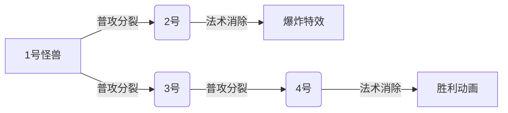

# 题目信息

# [AHOI2014/JSOI2014] 骑士游戏

## 题目背景

长期的宅男生活中，JYY 又挖掘出了一款 RPG 游戏。在这个游戏中 JYY 会扮演一个英勇的骑士，用他手中的长剑去杀死入侵村庄的怪兽。

## 题目描述

在这个游戏中，JYY 一共有两种攻击方式，一种是普通攻击，一种是法术攻击。两种攻击方式都会消耗 JYY 一些体力。采用普通攻击进攻怪兽并不能把怪兽彻底杀死，怪兽的尸体可以变出其他一些新的怪兽，注意一个怪兽可能经过若干次普通攻击后变回一个或更多同样的怪兽；而采用法术攻击则可以彻底将一个怪兽杀死。当然了，一般来说，相比普通攻击，法术攻击会消耗更多的体力值（但由于游戏系统 bug，并不保证这一点）。

游戏世界中一共有 $N$ 种不同的怪兽，分别由 $1$ 到 $N$ 编号，现在 $1$ 号怪兽入侵村庄了，JYY 想知道，最少花费多少体力值才能将所有村庄中的怪兽全部杀死呢？

## 说明/提示

首先用消耗 $4$ 点体力用普通攻击，然后出现的怪兽编号是 $2$，$2$ 和 $3$。花费 $10$ 点体力用法术攻击杀死两个编号为 $2$ 的怪兽。剩下 $3$ 号怪兽花费 $1$ 点体力进行普通攻击。此时村庄里的怪兽编号是 $2$ 和 $4$。最后花费 $11$ 点体力用法术攻击将这两只怪兽彻底杀死。一共花费的体力是 $4+5+5+1+5+6=26$。

对于所有数据 $2 \le N \le 2 \times 10^5$，$1 \le R_i,\sum R_i \le 10^6$，$1 \le K_i,S_i \le 5 \times 10^{14}$。


## 样例 #1

### 输入

```
4
4 27 3 2 3 2
3 5 1 2
1 13 2 4 2
5 6 1 2```

### 输出

```
26```

# AI分析结果


### 💡 Kay的C++算法解析：骑士游戏 深入学习指南 💡

**题目解读与核心算法识别**  
✨ **本题主要考察**：`图论最短路变形`（SPFA/Dijkstra思想应用）  
🗣️ **初步分析**：  
> 解决骑士游戏问题，核心在于将怪兽消灭过程转化为**带后效性的动态规划问题**，并通过图论思想消除后效性。想象每个怪兽是魔法城堡中的房间，法术攻击是直接炸毁房间（代价高），普通攻击是打开房门释放小怪物（需额外清理）。最优策略是选择炸毁或开门，使整体代价最小。  

- **核心思路**：  
  - **状态定义**：`dp[i]`表示消灭怪兽`i`的最小代价  
  - **状态转移**：`dp[i] = min(法术代价k_i, 普攻代价s_i + Σ dp[j])`（j是i分裂的怪兽）  
  - **后效性处理**：因存在循环依赖（如怪兽A→B→A），需用SPFA或Dijkstra思想迭代更新  

- **可视化设计**：  
  采用**8位像素风地牢探索**动画：  
  - 怪兽化为像素怪物（不同颜色区分），法术攻击时播放爆炸动画+“轰”音效  
  - 普通攻击时怪物分裂，箭头指向新怪物，数据更新时对应格子闪烁  
  - 关键高亮：松弛操作时当前怪兽亮黄光，更新成功的怪兽亮绿光  
  - 控制面板：步进/自动播放（调速滑块），胜利时播放FC风格BGM  

---

### 2. 精选优质题解参考

**题解一：Soulist（堆优化Dijkstra）**  
* **点评**：  
  思路创新性强，将后效性DP转化为拓扑排序思想。通过堆维护当前最小代价怪兽，确保每次更新都是全局最优。代码中：  
  - **变量命名**：`deg`记录未确定依赖数，`sum`记录普攻累计值，含义清晰  
  - **算法优化**：每个点只入堆一次，复杂度稳定$O(n\log n + \sum R_i)$  
  - **实践价值**：代码简洁（仅40行），可直接用于竞赛，边界处理严谨  

**题解二：lyyi2003（Dijkstra思想）**  
* **点评**：  
  与题解一思路相似但更强调复杂度优势。亮点在于：  
  - **结构设计**：用`deg`计数器确保节点所有前置条件满足后才入堆  
  - **代码规范**：STL优先队列使用规范，`vis`数组避免重复处理  
  - **算法有效性**：严格$O(n\log n)$，优于SPFA的均摊复杂度  

**题解三：D_14134（SPFA标准实现）**  
* **点评**：  
  最直观的解法，适合初学者理解：  
  - **思路清晰**：将状态转移转化为SPFA松弛操作（`if (dis[u]>sum) 更新`）  
  - **代码可读性**：反向建边`addf`处理依赖关系，逻辑直白  
  - **注意事项**：SPFA最坏复杂度$O(nm)$，但本题数据可过  

---

### 3. 核心难点辨析与解题策略

1. **难点1：后效性处理**  
   * **分析**：因怪兽分裂可能形成环，传统DP无法求解。优质解法均将问题转化为图论模型：  
     - SPFA：用队列动态松弛，类似非负权最短路  
     - Dijkstra：贪心思想，每次确定全局最小代价节点  
   * 💡 **学习笔记**：遇到循环依赖时，考虑图论思想消除后效性  

2. **难点2：更新顺序设计**  
   * **分析**：Dijkstra解法需确保节点更新时，其所有依赖项已确定。通过`deg`计数器（未确定的依赖数）和`sum`累计值实现：  
     - 当`deg[i]=0`时，说明所有分裂怪兽代价已算，可更新`dp[i]`  
   * 💡 **学习笔记**：贪心顺序需满足无后效性，计数器是常用手段  

3. **难点3：数据结构选择**  
   * **分析**：`dp[i]`的更新需要快速获取分裂怪兽的代价和：  
     - SPFA：暴力求和（每次$O(R_i)$）  
     - Dijkstra：预存`sum[i]`逐步累积，避免重复计算  
   * 💡 **学习笔记**：根据更新频率选择数据结构，预存累积值优化效率  

### ✨ 解题技巧总结
- **技巧1：状态定义转化**  
  将带后效性的DP转化为图的最短路问题，`dp[i]`即节点`i`到终点的最短距离  
- **技巧2：依赖关系建模**  
  用邻接表存储分裂关系（正向边）和依赖关系（反向边），便于更新传播  
- **技巧3：复杂度优化**  
  优先选择堆优化Dijkstra（$O(n\log n)$），避免SPFA的最坏情况  

---

### 4. C++核心代码实现赏析

**本题通用核心实现（Dijkstra思路）**  
```cpp
#include<bits/stdc++.h>
using namespace std;
const int N=2e5+5;
vector<int> G[N], R[N]; // G:分裂怪兽, R:依赖关系
long long s[N], dp[N], sum[N];
int deg[N], n;

int main() {
    cin >> n;
    priority_queue<pair<long long, int>> pq;
    for(int i=1; i<=n; i++){
        int r, v; cin >> s[i] >> dp[i] >> r;
        deg[i] = r;
        while(r--) cin >> v, G[i].push_back(v), R[v].push_back(i);
        pq.push({-dp[i], i}); // 小根堆
    }
    while(!pq.empty()){
        auto [cost, u] = pq.top(); pq.pop();
        if(-cost != dp[u]) continue; // 过期状态跳过
        for(int v : R[u]) {
            sum[v] += dp[u]; // 累计分裂代价
            if(--deg[v] == 0 && sum[v] + s[v] < dp[v]) {
                dp[v] = sum[v] + s[v];
                pq.push({-dp[v], v});
            }
        }
    }
    cout << dp[1];
}
```
**代码解读概要**：  
1. **初始化**：所有怪兽初始`dp[i]=k_i`（法术代价）入堆  
2. **堆优化**：每次弹出最小代价怪兽，更新依赖它的父节点  
3. **依赖更新**：父节点累计`sum`并减少`deg`，当依赖全解时更新父节点  

---

### 5. 算法可视化：像素动画演示

**动画演示主题**：像素地牢怪兽消除大冒险  
**核心演示流程**：  


**交互设计细节**：  
1. **像素风格**：  
   - 怪兽：16x16像素（不同颜色区分类型）  
   - 法术：红色爆炸动画（FC炸弹人式）  
   - 普攻：门打开特效+分裂箭头  

2. **动态数据展示**：  
   - 怪兽头顶显示当前代价`dp[i]`  
   - 更新时数值闪烁（黄色→绿色）  
   - 堆结构右侧可视化，当前最小代价怪兽高亮  

3. **音效控制**：  
   - 法术攻击："轰"（8-bit爆炸声）  
   - 普攻分裂："吱"（门打开声）  
   - 堆弹出："叮"（金属音效）  

---

### 6. 拓展练习与相似问题
1. **洛谷 P2761 软件补丁问题**  
   🗣️ 同样需处理状态依赖，练习状态压缩+SPFA  
2. **洛谷 P4043 支线剧情**  
   🗣️ 带权依赖关系，巩固拓扑排序思想  
3. **洛谷 P2149 有向图破坏**  
   🗣️ 双节点依赖模型，提升图论建模能力  

---

### 7. 学习心得与经验分享
> **Soulist的调试经验**：  
> “最初未处理过期状态导致WA，加入`if(-cost!=dp[u])continue`后AC”  
>   
> **Kay总结**：  
> 在堆优化算法中，务必判断堆中元素是否过期，避免无效更新。这是保证效率和正确性的关键！  

--- 
通过本次分析，希望大家掌握图论思想解决后效性DP的技巧。记住：将问题转化为适当模型比盲目编码更重要！下次冒险再见！💪

---
处理用时：110.96秒