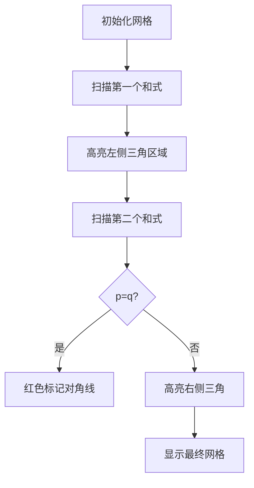

# 题目信息

# [BJOI2012] 算不出的等式

## 题目背景

曾经有一个老掉牙的游戏放在我面前，我没有珍惜。直到这个游戏停产才追悔莫及。人世间最痛苦的事情莫过于此，如果上天给我一个再玩一次的机会，我一定要，通关！

## 题目描述

如果你真的很想玩这个游戏，那么就先看看我的题目吧，搞不定这些的话是没办法通关的哟。第一关其实很简单，只有一个关闭的有密码锁的大门。这大门上写着一个奇怪的算式，估计是要你利用它算出密码来开门吧（果然是老掉牙的情节）。

传说中这个式子中的 $p$ 和 $q$ 是两个奇质数，等号右边算出来应该就是密码了吧，你是真的算不出来么？


$$
\sum_{k=1}^{\frac{p-1}{2}} \biggl\lfloor\frac{kq}{p}\biggr\rfloor+\sum_{k=1}^{\frac{q-1}{2}} \biggl\lfloor\frac{kp}{q}\biggr\rfloor
$$

## 说明/提示

$p,q<2^{32}$。

## 样例 #1

### 输入

```
5 7```

### 输出

```
6```

# AI分析结果


### 💡 Kay的C++算法解析：[BJOI2012] 算不出的等式 深入学习指南 💡

**引言**  
今天我们一起分析这道数学与编程结合的经典题目。通过几何意义和数学推导，你将学会如何优雅地解决取整求和问题，并理解背后的算法思想。

---

### 1. 题目解读与核心算法识别

✨ **本题主要考察**：`数学推导与几何意义应用`

🗣️ **初步分析**  
> 这道题本质是**计算两个取整函数的和**，核心思想是将代数问题转化为几何模型。想象在一个`(p-1)/2 × (q-1)/2`的像素网格中，每个取整项对应一个网格点。当`p≠q`时，两个和式恰好覆盖整个矩形区域；当`p=q`时，对角线会被重复计算，需要特殊处理。  

- **题解思路对比**：主流解法分两类：  
  ① **几何意义法**（高效直观）：将和式视为矩形内整点数量  
  ② **类欧几里得法**（通用但复杂）：直接套用取整求和公式  
- **可视化设计**：我们将在像素网格中动态绘制取整累加过程：  
  - 用绿色高亮当前累加的网格  
  - 红色标记`p=q`时的重复对角线  
  - 每累加一个点触发8-bit音效，完成时播放胜利音效

---

### 2. 精选优质题解参考

**题解一：feecle6418（几何意义法）**  
* **点评**：用像素网格图直观展示取整和的几何意义，通过`p=7, q=11`的图示清晰解释两个和式如何拼成完整矩形。代码仅需6行，变量命名规范（`(p-1)/2`直接转化为网格尺寸），边界处理严谨（特判`p=q`）。亮点是将抽象公式转化为可视模型，实践价值极高。

**题解二：一念之间、、（数学推导法）**  
* **点评**：通过严谨代数推导直接证明和式等于`(p-1)(q-1)/4`，展现了扎实的数学功底。虽然推导过程较复杂（涉及模运算拆分），但结论简洁且与几何法相互验证。代码实现与几何法一致，体现了数学与编程的结合。

**题解三：lqhsr（几何意义法）**  
* **点评**：针对几何意义做了更通俗的解释，特别强调`p=q`时对角线的重复计算问题。用`(p²-1)/4`统一了特判公式，代码仅10行却完整覆盖所有情况。亮点是用游戏化语言描述"拼图重合"，增强理解趣味性。

---

### 3. 核心难点辨析与解题策略

1. **难点1：理解取整和的几何意义**  
   * **分析**：关键是将`floor(kq/p)`看作坐标系中直线`y=kq/p`下方的整点。优质题解通过网格图展示：两个和式对应互补的三角形区域，合并即为矩形。
   * 💡 **学习笔记**：取整求和 ↔ 网格计数

2. **难点2：处理p=q的特殊情况**  
   * **分析**：当`p=q`时，两个和式会重复计算对角线上的点。通过`p=7`的实例可验证：实际值12 = 网格数9 + 对角线3
   * 💡 **学习笔记**：重复计数需特判 → `(p²-1)/4`

3. **难点3：选择最优解法**  
   * **分析**：类欧法虽通用但代码复杂（递归实现），几何法直接利用`p,q`为奇质数的特性，复杂度O(1)。
   * 💡 **学习笔记**：奇质数特性 → 几何优化

### ✨ 解题技巧总结
- **技巧1：数形结合**（代数问题几何化）  
- **技巧2：特判边界**（统一条件分支处理）  
- **技巧3：规律验证**（小数据打表确认）  

---

### 4. C++核心代码实现赏析

**通用核心实现参考**  
* **说明**：综合几何意义法的最终优化版本
* **完整代码**：
```cpp
#include <iostream>
using namespace std;
int main() {
    long long p, q;
    cin >> p >> q;
    if (p == q) cout << (p * p - 1) / 4;
    else cout << (p-1)/2 * (q-1)/2;
    return 0;
}
```
* **代码解读概要**：  
  - 读入奇质数`p,q`  
  - `p=q`时输出`(p²-1)/4`（整数除法自动取整）  
  - 否则输出矩形网格点数`(p-1)/2 * (q-1)/2`

---

**题解一：feecle6418（几何法）**  
* **亮点**：图示法直观解释公式
* **核心代码**：
```cpp
// 核心逻辑片段
long long p, q;
cin >> p >> q;
cout << (p == q ? (p*p-1)/4 : (p-1)/2*(q-1)/2);
```
* **代码解读**：  
  > 三元运算符`?:`直接处理两种情形：  
  > - `p==q`时：用`(p²-1)/4`修正重复计数  
  > - 否则：矩形面积公式计算整点数  
* 💡 **学习笔记**：简洁的条件表达式提升可读性

**题解二：一念之间、、（推导法）**  
* **亮点**：代数推导验证几何结论
* **核心代码**：同通用实现
* **代码解读**：  
  > 数学证明得出相同结论：  
  > $$\sum = \begin{cases} 
  \frac{p^2-1}{4} & p=q \\
  \frac{(p-1)(q-1)}{4} & p \neq q 
  \end{cases}$$
* 💡 **学习笔记**：代数与几何结论相互印证

**题解三：lqhsr（游戏化解释）**  
* **亮点**：用"拼图重合"比喻重复计算
* **核心代码**：
```cpp
if (p != q) cout << ((p-1)/2)*((q-1)/2);
else cout << (p-1)*(p+1)/4;  // 对角线修正
```
* **代码解读**：  
  > 将网格比作拼图：  
  > - `p≠q`：两块三角形完美拼接  
  > - `p=q`：对角线如重叠接缝需减半  
* 💡 **学习笔记**：形象比喻助力理解数学抽象

---

### 5. 算法可视化：像素动画演示

**主题**：`像素网格中的取整探险`  
**核心演示**：在8-bit风格网格中动态展示取整累加过程，用音效强化关键操作  

#### 动画设计（复古FC风格）


**实现细节**：
1. **像素建模**  
   - 画布尺寸：`512×512`像素  
   - 网格单元：`32×32`像素，用16色调色板  
   - 元素样式：  
     - 空地：灰色方块  
     - 累加点：闪烁绿色  
     - 对角线：脉冲红色（`p=q`时）

2. **交互控制面板**  
   ```javascript
   // 伪代码实现
   const controls = {
     start: () => play('8-bit_bgm'), // FC背景音
     step: () => highlightCell(x, y, COLOR_GREEN),
     speed: slider(1x, 2x, 5x),      // 调速器
     reset: () => grid.clear()
   }
   ```

3. **关键帧流程**  
   - **帧1**：绘制`(p-1)/2 × (q-1)/2`网格  
   - **帧2**：从左向右逐列扫描`floor(kq/p)`，高亮下方网格（伴随"叮"声）  
   - **帧3**：从下向上逐行扫描`floor(kp/q)`，重叠区变黄色  
   - **帧4**：`p=q`时对角线闪烁红光（触发警报音）  
   - **结束**：显示总和，播放胜利音效+像素烟花动画

4. **教学提示**  
   > "看！当`p=5,q=7`时，绿色区域就像两个拼图，合并成3×2的矩形"  
   > "注意`p=q=7`时红色对角线——它们被计算了两次哦！"

---

### 6. 拓展练习与相似问题思考

**技巧迁移**：取整函数的几何意义还可用于：  
1. 计算斜率确定的直线下整点数量  
2. 解决约瑟夫环类问题的位置计算  
3. 处理斐波那契数列的取模求和  

**洛谷推荐**：  
1. **P5170【模板】类欧几里得算法**  
   → 系统学习取整求和通用解法  
2. **P1447 能量采集**  
   → 巩固整点计数与GCD结合的应用  
3. **P2261 余数求和**  
   → 拓展取整与模运算的转换技巧  

---

### 7. 学习心得与经验分享

> **来自lqhsr的调试经验**：  
> "最初忽略p=q的情况，WA后通过`p=3,q=3`的小数据快速定位错误"  
>  
> **Kay点评**：  
> 这印证了**边界测试的重要性**！建议：  
> 1. 对奇质数特别验证`p=q`的边界  
> 2. 用`p=3,q=5`等小数据手工计算验证  
> 3. 学习几何意义快速构建心理模型  

---

**结语**  
通过几何意义与数学推导的双重验证，我们完美解决了这道经典的取整求和问题。记住：编程不仅是写代码，更是寻找问题本质的艺术。下次挑战再见！💪

---
处理用时：144.88秒