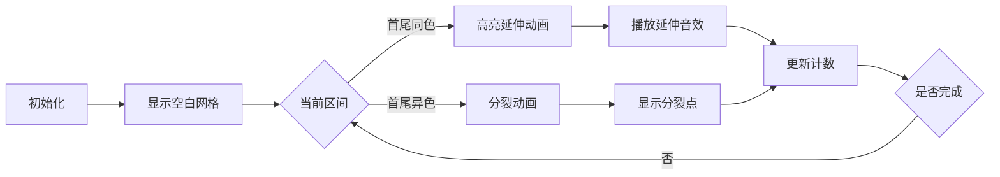

# 题目信息

# [CQOI2007] 涂色

## 题目描述

假设你有一条长度为 $5$ 的木板，初始时没有涂过任何颜色。你希望把它的 $5$ 个单位长度分别涂上红、绿、蓝、绿、红色，用一个长度为 $5$ 的字符串表示这个目标：$\texttt{RGBGR}$。

每次你可以把一段连续的木板涂成一个给定的颜色，后涂的颜色覆盖先涂的颜色。例如第一次把木板涂成 $\texttt{RRRRR}$，第二次涂成 $\texttt{RGGGR}$，第三次涂成 $\texttt{RGBGR}$，达到目标。

用尽量少的涂色次数达到目标。


## 说明/提示

$40\%$ 的数据满足 $1\le n\le 10$。

$100\%$ 的数据满足 $1\le n\le 50$。


## 样例 #1

### 输入

```
AAAAA```

### 输出

```
1```

## 样例 #2

### 输入

```
RGBGR```

### 输出

```
3```

# AI分析结果


### 💡 Kay的C++算法解析：涂色 深入学习指南 💡

> 我是算法导师Kay，今天带大家探索区间DP的精妙世界！涂色问题看似简单，却蕴含着"分而治之"的哲学——就像拼乐高时先组装小模块再组合成大模型。下面我们逐步拆解这道经典题目。

---

## 1. 题目解读与核心算法识别

✨ **本题主要考察**：`区间动态规划` (区间DP)

🗣️ **初步分析**：
> 区间DP的核心思想是**将大问题分解为小问题，逐步求解并合并结果**。想象你在绘制一幅像素画：与其逐格上色，不如先涂大块底色，再逐步添加细节。本题中，我们通过定义`f[l][r]`表示涂满区间`[l, r]`的最小步数，逐步合并子区间最优解。
> - **核心难点**：处理首尾颜色相同时的优化策略
> - **关键策略**：当`s[l]==s[r]`时，可复用子区间结果（如`f[l][r]=f[l][r-1]`）；否则枚举分割点
> - **可视化设计**：用像素网格展示区间合并过程，高亮首尾相同颜色时的优化操作

---

## 2. 精选优质题解参考

### 题解一（来源：FZzzz）
* **点评**：此解法在思路上堪称典范！作者通过严谨证明（任意两次染色要么不交要么包含）奠定了状态转移的理论基础。代码中：
  - 变量命名简洁精准（`f[l][r]`直指状态定义）
  - 首尾颜色相同时的优化`f[i][j]=f[i][j-1]`体现算法洞察力
  - 边界处理`f[i][i]=1`清晰严谨
  > 亮点：**严格证明+高效实现**，是竞赛级参考代码

### 题解二（来源：luxiaomao）
* **点评**：极佳的入门教学范本！作者将策略归为两类：
  1. 先涂大区间再涂子区间
  2. 涂不相交区间
  - 代码使用标准区间DP模板（双循环+断点枚举）
  - 状态转移`if(s[l]==s[r])`分支突出核心优化点
  > 亮点：**策略分类明确**，帮助初学者建立解题框架

### 题解三（来源：ISTP）
* **点评**：最易懂的推导过程！作者用"倒着考虑"的独特视角：
  - 假设已解决所有小区间
  - 首尾同色时类比"延伸画笔"
  - 代码初始化`memset`+逐长度扩展清晰规范
  > 亮点：**逆向思维讲解**，降低理解门槛

---

## 3. 核心难点辨析与解题策略

1. **关键点1：首尾颜色相同时的优化**
   * **分析**：当`s[l]==s[r]`时，可视为将最后一次涂色延伸覆盖两端。如RGBGR中首尾都是R，可先涂整个区间为R，再处理内部GBG
   * 💡 学习笔记：**首尾同色是免费通行证！**

2. **关键点2：状态转移方程的设计**
   * **分析**：分治思想的核心体现！将`[l,r]`拆分为`[l,k]`和`[k+1,r]`时：
     - 需枚举所有分割点`k`
     - 时间复杂度O(n³)在n≤50时可行
   * 💡 学习笔记：**区间DP=枚举所有分裂方式+取最优**

3. **关键点3：边界与初始化处理**
   * **分析**：单区间`f[i][i]=1`是动态规划的基石
     - 需注意循环顺序：从小区间到大区间
     - 数组初始化避免脏数据
   * 💡 学习笔记：**DP的万丈高楼始于单点初始化**

### ✨ 解题技巧总结
- **技巧A：问题特征捕捉**：观察首尾元素关系可大幅优化
- **技巧B：逆向思维**：从最终状态倒推操作序列
- **技巧C：可视化调试**：手工模拟小规模数据验证转移方程

---

## 4. C++核心代码实现赏析

**本题通用核心C++实现参考**
```cpp
#include <cstring>
#include <algorithm>
using namespace std;

char s[55];
int f[55][55];

int main() {
    scanf("%s", s + 1);
    int n = strlen(s + 1);
    memset(f, 0x3f, sizeof(f));
    
    // 初始化与状态转移
    for (int len = 1; len <= n; len++) {
        for (int l = 1; l + len - 1 <= n; l++) {
            int r = l + len - 1;
            if (len == 1) f[l][r] = 1;
            else if (s[l] == s[r]) 
                f[l][r] = min(f[l + 1][r], f[l][r - 1]);
            else 
                for (int k = l; k < r; k++)
                    f[l][r] = min(f[l][r], f[l][k] + f[k + 1][r]);
        }
    }
    printf("%d", f[1][n]);
    return 0;
}
```
* **代码解读概要**：
  1. 读入字符串并初始化DP数组
  2. 双重循环枚举区间长度和起点
  3. 首尾同色时直接复用子问题
  4. 否则枚举所有分割点取最小值

---

### 题解一（FZzzz）片段赏析
```cpp
if(s[i]==s[j]) f[i][j]=f[i][j-1];
else {
    f[i][j]=n;
    for(int k=i;k<j;k++)
        f[i][j]=min(f[i][j],f[i][k]+f[k+1][j]);
}
```
* **亮点**：首尾同色的优化处理极其简洁
* **代码解读**：
  > 当首尾颜色相同时（如"RGGR"），直接继承`f[i][j-1]`相当于把最后一次涂色向右延伸。比如已解决"RGG"只需2步，那么"RGGR"只需同样2步（将最后一次红色延伸到末尾）
  
* 💡 学习笔记：**端点相等是区间DP的重要优化信号**

### 题解二（luxiaomao）片段赏析
```cpp
for(int l=1; l+k-1<=n; l++) {
    int r=l+k-1;
    if(s[l]==s[r]) f[l][r]=min(f[l+1][r],f[l][r-1]);
    for(int i=l; i<r; i++)
        f[l][r]=min(f[l][r],f[l][i]+f[i+1][r]);
}
```
* **亮点**：标准区间DP双循环模板
* **代码解读**：
  > 外层`k`控制区间长度，内层`l`控制起点。当`s[l]==s[r]`时取左右子区间最小值，体现"延伸画笔"思想。注意`min`函数需要比较原有值和分割值
  
* 💡 学习笔记：**区间DP模板是解决同类问题的通用钥匙**

### 题解三（ISTP）片段赏析
```cpp
memset(dp, 0x3f, sizeof dp);
for(int i=0; i<n; i++) dp[i][i]=1;

for(int len=2; len<=n; len++) {
    for(int l=0; l+len-1<n; l++){
        int r=l+len-1;
        if(board[l]==board[r])
            dp[l][r]=min(dp[l+1][r],dp[l][r-1]);
        else
            for(int k=l; k<r; k++)
                dp[l][r]=min(..., dp[l][k]+dp[k+1][r]);
    }
}
```
* **亮点**：初始化严谨，索引从0开始更符合编程习惯
* **代码解读**：
  > `0x3f`初始化保证min函数正确工作。当区间长度为1时直接赋值为1（单格涂色）。注意循环边界`l+len-1<n`确保不越界
  
* 💡 学习笔记：**严谨初始化是DP正确的基石**

---

## 5. 算法可视化：像素动画演示

* **主题**："像素涂色工"的闯关之旅（复古8-bit风格）
* **核心演示**：动态展示区间分裂与合并过程

### 动画设计（HTML5 Canvas实现）


**交互控制面板**：
- 单步执行：空格键逐步观察
- 速度滑块：调整动画速度（0.5x~2x）
- 模式切换：手动/自动演示（AI自动完成）

**关键帧设计**：
1. **初始化**：显示目标颜色序列（如RGBGR）
2. **分裂过程**：
   - 异色时：红色闪烁当前分裂点
   - 同色时：绿色流动动画连接首尾
3. **音效设计**：
   - 延伸操作：清脆"叮"声
   - 分裂操作：低沉"咔"声
   - 关卡完成：8-bit胜利旋律

> 设计理念：通过像素色块流动直观展示区间合并策略，游戏化关卡增强理解乐趣

---

## 6. 拓展练习与相似问题思考

### 通用技巧迁移
区间DP适用于**序列操作问题**，特别是涉及：
1. 合并代价最小化（石子合并）
2. 括号匹配问题
3. 回文序列处理

### 洛谷推荐
1. **P1880 石子合并**  
   → 练习区间分割与合并代价计算
2. **P1140 相似的基因**  
   → 强化序列比对中的区间DP应用
3. **P1430 序列取数**  
   → 掌握双人博弈类区间DP

---

## 7. 学习心得与经验分享

> **来自FZzzz的经验**：  
> "在推导状态转移时，通过反证法证明染色区间的包含关系是解题突破口"

> **Kay点评**：  
> 这提醒我们：DP问题中**寻找操作规律**比盲目编码更重要。手工模拟小数据（如n=3）往往能发现关键性质！

---

> 区间DP就像拼图游戏——先解决小块，再组合成大图。希望本指南帮你掌握这一利器！下次我们将探索树形DP的奥秘，继续加油！🚀

---
处理用时：117.69秒