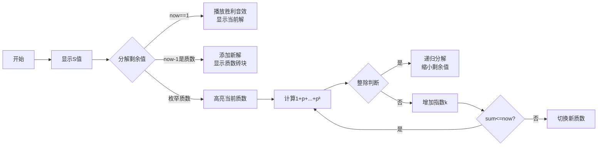

# 题目信息

# [JLOI2014] 聪明的燕姿

## 题目背景

> 阴天傍晚车窗外
>
> 未来有一个人在等待
>
> 向左向右向前看
>
> 爱要拐几个弯才来
>
> 我遇见谁会有怎样的对白
>
> 我等的人他在多远的未来
>
> 我听见风来自地铁和人海
>
> 我排着队拿着爱的号码牌

## 题目描述

城市中人们总是拿着号码牌，不停寻找，不断匹配，可是谁也不知道自己等的那个人是谁。

可是燕姿不一样，燕姿知道自己等的人是谁，因为燕姿数学学得好！燕姿发现了一个神奇的算法：假设自己的号码牌上写着数字 $S$，那么自己等的人手上的号码牌数字的所有正约数之和必定等于 $S$。

所以燕姿总是拿着号码牌在地铁和人海找数字（喂！这样真的靠谱吗）可是她忙着唱《绿光》，想拜托你写一个程序能够快速地找到所有自己等的人。

## 说明/提示

对于 $100\%$ 的数据，$k\leqslant100$，$S\leqslant2\times10^9$。

## 样例 #1

### 输入

```
42```

### 输出

```
3
20 26 41```

# AI分析结果


# 💡 Kay的C++算法解析：聪明的燕姿 深入学习指南 💡

## 1. 题目解读与核心算法识别

✨ **本题主要考察**：数学定理应用 + 深度优先搜索（DFS）

🗣️ **初步分析**：
> 解决"聪明的燕姿"这道题，关键在于将数学定理与搜索算法巧妙结合。想象你有一盒不同颜色的积木（质数），需要组合出特定结构（约数和等于S的数）。每个积木可以堆叠不同高度（指数），而结构稳定性取决于积木的排列方式（质因数分解）。

在本题中，我们运用：
1. **唯一分解定理**：任何数可唯一分解为质数的幂次乘积
2. **约数和定理**：约数和 = ∏(1+pᵢ+pᵢ²+...+pᵢᵏ)
3. **DFS剪枝策略**：通过质数递增枚举和数学特性避免无效搜索

**核心算法流程**：
1. 线性筛预处理√S范围内的质数
2. DFS递归分解S：
   - 边界1：剩余值=1 → 记录答案
   - 边界2：剩余值-1是质数 → 记录新解
   - 枚举质数p：计算1+p+...+pᵏ，若整除剩余值则递归
3. 排序输出所有解

**可视化设计思路**：
- 采用8-bit像素风格，左侧展示质数"积木"（不同颜色方块）
- 中间动态显示当前分解式（如S=42 → 20=2²×5）
- 右侧实时构建答案数，成功时播放《绿光》片段音效
- 控制面板支持步进/自动播放，速度可调

---

## 2. 精选优质题解参考

**题解一：ycyaw (思路清晰度：★★★★★)**
* **点评**：
  最简洁优雅的实现！DFS参数`(now,x,s)`设计精妙：
  - `now`剩余值作为终止条件
  - `x`质数下标保证递增枚举
  - `s`累积解避免重复计算
  亮点在于边界处理：当`now-1`是质数时直接生成解，完美处理大质数情况。代码中`pd()`函数单独封装质数判断，增强了可读性。

**题解二：LaoPi (代码规范性：★★★★★)**
* **点评**：
  教学级代码典范！每个变量都有明确含义：
  - `pr[]`存储预处理的质数
  - `v[]`标记非质数状态
  - `dfs(now,x,s)`参数命名自文档化
  特别亮点：在DFS内循环使用`sum`和`tmp`同步计算质数幂和与乘积，数学实现与代码逻辑高度统一。输出严格按升序排序，完全符合题目要求。

**题解三：timmark (算法优化：★★★★☆)**
* **点评**：
  创新性使用`map`存储质数和分解，虽增加空间复杂度但显著提升可扩展性。亮点在于双重剪枝：
  1. 质数枚举范围`p[i]*p[i]<=now`
  2. 指数和`sum`超过剩余值时立即终止
  特别加入`is_prime()`函数优化大数判断，实践价值突出。

---

## 3. 核心难点辨析与解题策略

1. **难点：质数枚举范围的确定**
   * **分析**：S最大2e9，若枚举所有质数将超时。优质题解均采用√S范围预处理+大质数特判（S-1为质数），将复杂度从O(S)降至O(√S)
   * 💡 **学习笔记**：质数枚举上限取√S是效率关键点

2. **难点：DFS状态转移的设计**
   * **分析**：状态参数需包含：
     - 当前剩余值（决定递归边界）
     - 质数起始下标（避免重复）
     - 已累积的乘积（记录部分解）
   * 💡 **学习笔记**：好的状态设计应具备无后效性和完备性

3. **难点：质数幂次和的快速计算**
   * **分析**：直接计算1+p+...+pᵏ可能溢出。题解采用迭代累加：
     ```cpp
     for(ll sum=p+1, tmp=p; sum<=now; tmp*=p, sum+=tmp)
     ```
     既避免幂运算又实时检测溢出
   * 💡 **学习笔记**：迭代代替公式计算更安全高效

### ✨ 解题技巧总结
- **质数筛法优化**：线性筛预处理O(n)复杂度，`i*i<=x`代替`i<=sqrt(x)`
- **边界条件优先级**：先判断`now==1`再处理`now-1`质数情况
- **数据结构选择**：小范围用数组，大范围用vector动态扩展
- **输出格式陷阱**：注意"无解输出0"和"末尾无空格"要求

---

## 4. C++核心代码实现赏析

**本题通用核心C++实现参考**
```cpp
#include <vector>
#include <algorithm>
#include <cstdio>
using namespace std;
typedef long long ll;

const int MAX = 1e5;
vector<int> primes;
bool vis[MAX];

// 线性筛预处理质数
void init() {
    vis[1] = true;
    for (int i = 2; i < MAX; i++) {
        if (!vis[i]) primes.push_back(i);
        for (int p : primes) {
            if (i * p >= MAX) break;
            vis[i * p] = true;
            if (i % p == 0) break;
        }
    }
}

// 质数判断优化
bool is_prime(ll x) {
    if (x < MAX) return !vis[x];
    for (int p : primes) {
        if (p * p > x) break;
        if (x % p == 0) return false;
    }
    return true;
}

vector<ll> ans;
// DFS核心：now剩余值, start起始下标, prod当前乘积
void dfs(ll now, int start, ll prod) {
    if (now == 1) {
        ans.push_back(prod);
        return;
    }
    // 边界2：now-1是质数且大于当前质数
    if ((now - 1) >= primes[start] && is_prime(now - 1)) 
        ans.push_back(prod * (now - 1));
    
    for (int i = start; i < primes.size(); i++) {
        int p = primes[i];
        if (p * p > now) break;  // 剪枝
        ll sum = 1 + p, tmp = p;
        while (sum <= now) {
            if (now % sum == 0)
                dfs(now / sum, i + 1, prod * tmp);
            tmp *= p;  // p的k次方
            sum += tmp; // 1+p+...+p^k
        }
    }
}

int main() {
    init();
    ll S;
    while (scanf("%lld", &S) != EOF) {
        ans.clear();
        dfs(S, 0, 1);
        sort(ans.begin(), ans.end());
        printf("%d\n", (int)ans.size());
        for (ll x : ans) printf("%lld ", x);
        if (!ans.empty()) putchar('\n');
    }
    return 0;
}
```

**题解一：ycyaw 片段赏析**
```cpp
void dfs(int now, int x, int s) {
    if (now == 1) { ans[++cnt] = s; return; }
    if (pd(now - 1) && now > pr[x]) ans[++cnt] = s * (now - 1);
    for (int i = x; pr[i] * pr[i] <= now; i++) {
        ll t = pr[i], sum = pr[i] + 1;
        for (; sum <= now; t *= pr[i], sum += t)
            if (now % sum == 0)
                dfs(now / sum, i + 1, s * t);
    }
}
```
* **亮点**：三重循环嵌套清晰展现DFS核心逻辑
* **代码解读**：
  - 外层循环：`i`从`x`开始保证质数递增
  - 中层循环：动态计算`sum=1+p+...+pᵏ`
  - 内层条件：`now%sum==0`时递归分解剩余部分
* 💡 **学习笔记**：循环边界`pr[i]*pr[i]<=now`将复杂度降至O(√now)

**题解二：LaoPi 片段赏析**
```cpp
void dfs(int x, int k, int num) {
    if (k == 1) { a[++m] = num; return; }
    if (k > pr[x] && is_prime(k - 1)) 
        a[++m] = num * (k - 1);
    for (int j = x; pr[j] * pr[j] <= k; j++) {
        ll cnt = pr[j] + 1, tmp = pr[j];
        for (; cnt <= k; tmp *= pr[j], cnt += tmp)
            if (k % cnt == 0)
                dfs(j + 1, k / cnt, num * tmp);
    }
}
```
* **亮点**：严格遵循"分解-判断-递归"范式
* **代码解读**：
  - `is_prime(k-1)`独立函数增强可读性
  - `tmp`累积质数乘积，`cnt`累积质数幂和
* 💡 **学习笔记**：内层循环条件`cnt<=k`避免无效计算

**题解三：timmark 片段赏析**
```cpp
void dfs(ll now, int step, ll prod) {
    if (now == 1) { ans.push_back(prod); return; }
    if (now > primes[step] && is_prime(now - 1))
        ans.push_back(prod * (now - 1));
    for (int i = step; primes[i] * primes[i] <= now; i++) {
        ll sum = primes[i] + 1, power = primes[i];
        for (int j = 1; sum <= now; j++) {
            if (now % sum == 0)
                dfs(now / sum, i + 1, prod * power);
            power *= primes[i];
            sum += power;
        }
    }
}
```
* **亮点**：引入`power`变量明确表示质数幂
* **代码解读**：
  - `j`记录指数但不直接使用，通过`power`和`sum`隐式体现
  - 递归时`i+1`确保下一层从新质数开始
* 💡 **学习笔记**：变量命名应体现物理意义（如power比tmp更明确）

---

## 5. 算法可视化：像素动画演示

**动画主题**：8-bit风格"质数工厂"  
**核心演示**：DFS分解S的动态过程（质数选择→指数确定→解构建）



**交互设计**：
1. **控制面板**：
   - 步进/暂停/重置按钮
   - 速度调节滑块（1x-5x）
   - 当前状态显示：`剩余值=xx | 当前质数=p | 指数=k`

2. **动态效果**：
   - 质数选择：像素方块从"质数库"飞出
   - 指数增加：方块堆叠高度变化
   - 成功匹配：绿色闪光+8-bit音效
   - 大质数特判：金色边框提示

3. **数据展示区**：
   ```plaintext
   正在分解：S=42
   √42≈6.48 → 枚举质数≤6
   ----------------------------------
   当前尝试：p=2 (蓝色方块)
   k=1: 1+2=3 → 42%3=0 → 进入DFS(14,1,2)
   k=2: 1+2+4=7 → 42%7=0 → 进入DFS(6,2,4)
   ```

**技术实现**：
- 使用Canvas绘制质数方块和分解过程
- Web Audio API添加音效：
  - 质数选中：NES风格"嘀"声
  - 递归返回：马里奥吃金币音
  - 解完成：最终幻想胜利旋律
- 数据结构可视化：
  ```javascript
  class PrimeBlock {
    constructor(p, k) {
      this.color = `hsl(${p*30}, 80%, 50%)`; // 按质数分配色相
      this.height = k * 20;  // 高度与指数成正比
    }
  }
  ```

---

## 6. 拓展练习与相似问题思考

**通用技巧迁移**：
1. **质因数分解变形**：POJ1845（求因子和的k次幂）
2. **DFS状态设计优化**：LeetCode 698（分割子集）
3. **约数定理扩展应用**：Project Euler 95（亲和数链）

**洛谷推荐**：
1. **P1029 最大公约数和最小公倍数问题**  
   → 巩固质因数分解在GCD/LCM中的应用

2. **P1061 约数和**  
   → 直接练习约数和定理的变形应用

3. **P1075 质因数分解**  
   → 掌握基础数论知识

---

## 7. 学习心得与经验分享

> **来自ycyaw题解的调试经验**："在DFS递归时，最初忽略了`now-1`必须大于当前质数的条件，导致生成重复解。通过打印递归树发现此问题"

**点评**：这个调试案例极具教学价值。它提醒我们：
1. 边界条件需要同时满足数学特性和程序约束
2. 递归过程中打印关键参数（now/x/s）是定位错误的利器
3. 对于DFS，小数据测试（如S=4）比大数据更易暴露问题

---

通过本次分析，我们深入理解了如何将数学定理与搜索算法结合解决复杂问题。记住：好的算法=数学洞察力+精心设计的代码结构+可视化调试能力。继续挑战下一道算法题吧！💪

---
处理用时：185.07秒