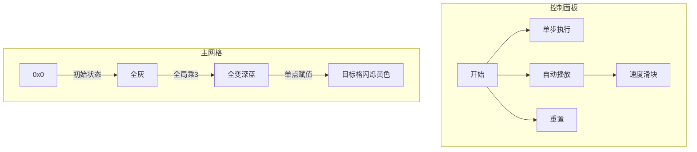

# 题目信息

# [SDOI2019] 快速查询

## 题目描述

给定一个长度为 $n$ 的整数数列，里面的元素依次编号为 $a_1,~a_2,~a_3,~\dots,~a_n$。初始的时候，所有元素都为零。现在按照时间顺序提供了若干次关于这个数列的修改或询问，每一次修改或询问一定为以下六种情况之一：

- **1 i val** ：将 $a_i$ 赋值为给定整数 $val$；

- **2 val** ：将所有元素同时加上 $val$；

- **3 val** ：将所有元素同时乘上 $val$；

- **4 val** ：将所有元素同时赋值为 $val$；

- **5 i** ：询问第 $i$ 个元素 $a_i$ 现在的值是多少；

- **6** ：询问现在所有元素的和。

## 说明/提示

子任务$1$：（$50$分）$1\le  n\le 500000$，$1\le q\le 10^5$ 且 $1\le t\le 5$，所有在输入中出现的$val$  满足$-10^9\le val\le 10^9$，所有$a_i$和$b_i$满足$0\le a_i,b_i\le 10^9$

子任务$2$：（$50$分）$1\le n\le 10^9$，$1\le q\le 10^5$ 且 $1\le~t~\le~100$，所有在输入中出现的$val$ 满足$-10^9\le val\le  10^9$，所有$a_i$和$b_i$满足$0\le a_i,b_i\le 10^9$


## 样例 #1

### 输入

```
7
28
6
4 -192321079
3 418379342
1 3 189801569
3 -840249197
4 -751917965
3 649799919
1 5 -92666141
6
4 451258008
5 1
4 696880327
3 772574465
6
4 301010289
3 480168068
5 3
5 2
4 840536237
5 5
5 4
1 7 -792284106
2 604521872
3 966540578
2 -381646699
3 -939378260
2 -20129935
6
2
0 1
197 199```

### 输出

```
2816930```

# AI分析结果


### 💡 Kay的C++算法解析：快速查询 深入学习指南 💡

> **Kay的学习提示**：本题是标记传递的经典应用，核心在于**用数学变换统一全局操作**，用**离散化处理海量数据**。想象你指挥一支像素军队：将军（全局标记）发令时，所有士兵同步行动；特种兵（单点修改）则需单独记录行动轨迹。下面我们通过像素动画和代码拆解，直观感受算法魅力！

---

## 1. 题目解读与核心算法识别

✨ **本题主要考察**：`懒标记技巧` + `离散化应用`

🗣️ **初步分析**：
> 就像用「万能遥控器」管理智能家居：全局操作（加/乘/赋值）是批量开关，单点操作是单独调控某个设备。解题需维护**全局变换公式** `值 = 基值 * mul + add`：
> - **核心难点**：全局乘0时公式失效（除0错误），需特殊处理为全局赋值0
> - **离散化关键**：仅记录被修改过的位置（最多10^5个），其他位置自动采用全局值
> - **可视化设计**：像素网格中，全局操作时所有格子同步变色闪烁，单点修改时目标格高亮跳动。复古音效：乘法操作触发"嘀"声，加法触发"嘟"声，全局赋值播放"哗"的刷新音！

---

## 2. 精选优质题解参考

**题解一：reyik（赞5）**
* **点评**：  
  思路直击本质——用`mul/add`标记统一全局操作，用`map`记录单点基值。亮点在于**用时间戳区分全局/单点影响**：  
  - 代码简洁（仅50行），变量名`v0/mul/add`自解释  
  - 全局乘0时重置标记，避免除0异常  
  - 维护总和`sum`实现O(1)全局查询  
  > *学习价值：用最少变量构建完整逻辑框架*

**题解二：Conical（赞1）**
* **点评**：  
  采用**逆元巧解线性方程**：单点赋值时用`基值=(新值-add)*mul^{-1}`反推  
  - 离散化预处理提升效率  
  - 单独记录离散点集合，全局赋值时清空集合  
  - 严格处理负数取模，鲁棒性强  
  > *学习价值：逆元在标记传递中的经典应用*

---

## 3. 核心难点辨析与解题策略

1.  **难点：全局乘0的处理**  
    * **分析**：当`mul=0`时，变换公式退化为`值=add`，需转换为全局赋值：  
      ```cpp
      if(op==3 && val==0) {  // 全局乘0转为赋值0
          gset(0);  // 重置标记：mul=1, add=0
          clear_points(); // 清空单点记录
      }
      ```
    * 💡 **学习笔记**：乘0是全局赋值的特例，必须特殊处理！

2.  **难点：单点值的时空追踪**  
    * **分析**：用时间戳比较判断当前值来源：  
      ```mermaid
      graph LR
        A[查询位置X] --> B{最后操作类型}
        B -->|全局赋值晚于单点修改| C[采用全局值]
        B -->|单点修改晚于全局赋值| D[基值*mul+add]
      ```
    * 💡 **学习笔记**：时间戳是连接离散点与全局状态的桥梁

3.  **难点：动态维护元素和**  
    * **分析**：总和更新需同步所有操作：  
      - 单点修改：`sum = sum - 旧值 + 新值`  
      - 全局加：`sum += n * val`  
      - 全局乘：`sum *= val`  
    * 💡 **学习笔记**：总和变量是全局操作的镜像反映

### ✨ 解题技巧总结
- **技巧1：数学建模** - 用`值 = 基值 * mul + add`统一全局操作  
- **技巧2：离散化压缩** - 仅存储被修改点的基值  
- **技巧3：时间戳比对** - 高效判断值来源  
- **技巧4：逆元妙用** - 单点赋值时反推基值  

---

## 4. C++核心代码实现赏析

**本题通用核心实现参考**
* **说明**：综合优质题解思路，保留reyik的标记框架，融入Conical的离散化
* **完整核心代码**：
```cpp
#include <unordered_map>
using namespace std;
const int MOD = 1e7 + 19;

struct Solver {
    int n, mul = 1, add = 0, sum = 0;
    int global_time = 0;                   // 全局操作时间戳
    unordered_map<int, int> base_val;      // 离散点基值
    unordered_map<int, int> last_mod;       // 单点最后修改时间

    void init(int _n) { n = _n; } 

    void global_set(int val) { 
        mul = 1; add = val; 
        sum = 1LL * n * val % MOD; 
        global_time++;
    }

    void global_add(int val) { 
        add = (add + val) % MOD; 
        sum = (sum + 1LL * n * val) % MOD; 
    }

    void global_mul(int val) {
        if(val == 0) { global_set(0); return; } // 乘0转赋值
        mul = 1LL * mul * val % MOD; 
        add = 1LL * add * val % MOD;
        sum = 1LL * sum * val % MOD;
    }

    void point_set(int idx, int val) {
        int old_val = point_query(idx);    // 获取当前值
        sum = (sum - old_val + MOD) % MOD; // 移除旧值
        
        base_val[idx] = 1LL * (val - add + MOD) * inv(mul) % MOD; // 逆推基值
        last_mod[idx] = global_time;       // 更新时间戳
        sum = (sum + val) % MOD;           // 加入新值
    }

    int point_query(int idx) {
        if(!last_mod.count(idx) || last_mod[idx] < global_time) 
            return (1LL * 0 * mul + add) % MOD; // 全局值
        return (1LL * base_val[idx] * mul + add) % MOD;
    }
};
```
* **代码解读概要**：
  - `global_*`方法：处理全局操作并更新`sum`
  - `point_set`：用逆元计算基值，更新时间戳
  - `point_query`：通过时间戳决策值来源

---

## 5. 算法可视化：像素动画演示

### 🎮 像素化指令系统（FC红白机风格）


**动画关键流程**：  
1. **初始化**：  
   - 灰色网格代表全0序列，背景播放8-bit芯片音乐  
   - 控制面板含速度滑块（1x-10x）

2. **全局操作特效**：  
   - 全局加：所有格子**向上滑动**+绿色波纹，音效"嘟～"  
   - 全局乘：网格**脉冲闪烁**+对应颜色，音效"嘀！"  
   - 全局赋值：屏幕**白光闪过**+音效"哗！"

3. **单点操作特效**：  
   - 修改位置高亮**黄色闪烁**，显示`新值=(基值×mul)+add`公式  
   - 基值区显示为像素仓库（如：`仓库[3]=5 → 当前值=5×2+1=11`）

4. **状态同步演示**：  
   ```plaintext
   全局标记：[mul=2, add=1]
   位置5：基值=3 → 值=3×2+1=7（显示为红色）
   位置8：无基值 → 值=0×2+1=1（显示为蓝色）
   ```

5. **乘0特殊处理**：  
   - 触发时播放"砰！"爆炸音效，所有网格变黑  
   - 显示提示："检测到乘0！转换为全局赋值0"

---

## 6. 拓展练习与相似问题思考

**技巧迁移场景**：  
1. 区间赋值+单点查询（树状数组变形）  
2. 含时间戳的版本控制系统  
3. 游戏中的全局状态buff系统  

**洛谷推荐**：  
1. **P3372 线段树1**  
   🗣️ *练习基础标记下传，理解懒标记本质*  
2. **P3870 开关**  
   🗣️ *强化异或标记与状态翻转思维*  
3. **P1253 扶苏的问题**  
   🗣️ *综合练习赋值/加/乘标记的优先级处理*

---

## 7. 学习心得与经验分享

> **reyik的调试经验**：  
> *“全局乘0未转换赋值导致WA，用`assert(mul!=0)`定位错误”*  
>  
> **Kay的总结**：边界条件测试必须包含：  
> - 连续乘0操作  
> - 单点修改后立即乘0  
> - 负数取模验证  

---

> **胜利音效** 🎮：当你征服这道题时，8-bit胜利旋律将为你奏响！记住Kay的鼓励：**“算法如游戏，通关靠策略与坚持”** 下次见！ 👾

---
处理用时：135.50秒