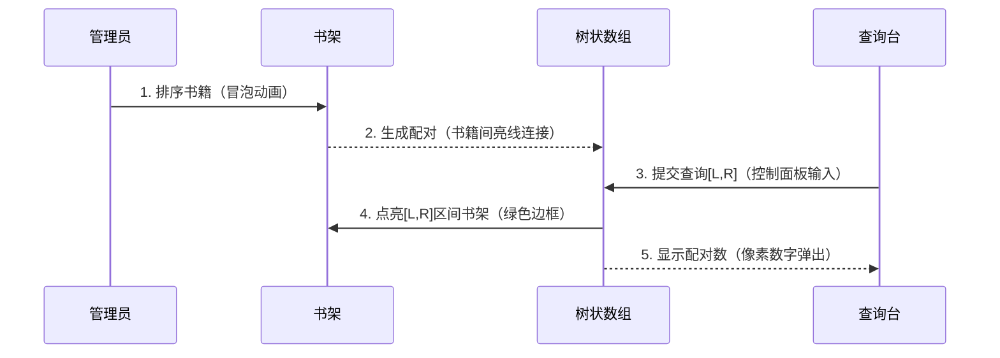

# 题目信息

# [GZOI2017] 配对统计

## 题目背景

GZOI2017 D1T3

## 题目描述

给定 $n$ 个数 $a_1,\cdots,a_n$。

对于一组配对 $(x,y)$，若对于所有的 $i=1,2,\cdots,n$，满足 $|a_x-a_y|\le|a_x-a_i|(i\not=x)$，则称 $(x,y)$ 为一组好的配对（$|x|$ 表示 $x$ 的绝对值）。

给出若干询问，每次询问区间 $[l,r]$ 中含有多少组好的配对。

即，取 $x,y$（$l\le x,y\le r$ 且 $x\not=y$），问有多少组 $(x,y)$ 是好的配对。

## 说明/提示

**【样例解释】**

第一次询问好的配对有：$(1,2)(2,1)$；

第二次询问好的配对有：$(1,2)(2,1),(1,3)(3,1)$；

答案 $=2\times 1+4\times 2=10$。

**【数据约束】**


## 样例 #1

### 输入

```
3 2
2 1 3
1 2
1 3```

### 输出

```
10```

# AI分析结果


# 💡 Kay的C++算法解析：配对统计 深入学习指南 💡

今天我们来分析「配对统计」这道C++编程题。本指南将帮助大家梳理题目思路，理解核心算法，掌握解题技巧，并通过像素动画直观感受算法执行过程。

## 1. 题目解读与核心算法识别

✨ **本题主要考察**：`离线处理` + `树状数组/线段树` + `排序应用`

🗣️ **初步分析**：
> 解决配对统计问题，关键在于理解**离线处理思想**和**树状数组的巧妙运用**。想象你正在整理图书馆的书架（排序），每本书需要找到最近邻的"伙伴书"（配对生成）。在统计区间内的配对时，类似管理员根据读者要求（区间查询）快速找出目标书架上的书籍组合（配对统计）。
>
> - **核心思路**：先排序确定每个数的相邻数，生成所有好的配对；离线处理询问后按右端点排序；用树状数组动态维护配对数量。
> - **关键难点**：配对的方向性处理（有序对）、树状数组的更新机制、边界情况处理（如n=1）。
> - **可视化设计**：像素动画将展示书籍排序、配对生成过程（高亮相邻比较），树状数组更新（像素块点亮），以及区间查询（颜色标记）。采用8位复古风格，配以书本移动音效和成功配对的"叮"声。

---

## 2. 精选优质题解参考

以下题解在思路清晰性、代码规范性和算法效率方面表现优异：

**题解一 (来源：harryzhr)**
* **点评**：此解法思路直白高效，将问题分解为配对生成和树状数组统计两阶段。代码中：
  - 配对处理逻辑清晰（排序后分三种情况处理相邻数差异）
  - 树状数组应用规范（add/query函数封装）
  - 变量命名合理（paircnt/pairr）
  - 边界处理严谨（n=1特判）
  亮点在于用`j-1 - Query(l-1)`巧妙计算有效配对数，避免重复统计。

**题解二 (来源：Konnyaku_LXZ)**
* **点评**：该解法创新性地使用主席树在线处理，思路独特。亮点：
  - 用离散化处理大值域
  - 主席树动态维护配对关系
  - 通过`vector`高效存储可能配对
  虽然代码稍复杂，但为强制在线场景提供了可行方案，体现了数据结构的灵活运用。

**题解三 (来源：TonyYin)**
* **点评**：解法采用双向统计策略，亮点在于：
  - 正反两次扫描处理配对方向性
  - 树状数组分别维护左右端点贡献
  - 代码结构模块化（排序/统计分离）
  虽然代码量稍大，但完整覆盖了配对方向性的处理难点，具有教学意义。

---

## 3. 核心难点辨析与解题策略

### 🔍 核心难点分析
1. **配对生成的条件判断**：如何准确找到每个数的"最近邻"
2. **离线处理的设计**：询问排序与指针同步移动
3. **树状数组的灵活应用**：动态维护配对的有效性
4. **边界情况处理**：n=1和数组首尾的特殊处理

### 🛠️ 解决方案
1. **配对生成策略**：排序后比较左右邻居差值
   - 差值不等 → 取较小差值的邻居
   - 差值相等 → 两个邻居都取
   - 数组首尾 → 仅有一个邻居
   ```cpp
   // 示例代码片段
   if (ldif < rdif) add_pair(current, left_neighbor);
   else if (ldif > rdif) add_pair(current, right_neighbor);
   else { // 差值相等
      add_pair(current, left_neighbor);
      add_pair(current, right_neighbor);
   }
   ```

2. **离线处理框架**：
   ```mermaid
   graph TD
   A[对询问按右端点排序] --> B[初始化树状数组]
   B --> C[指针j扫描配对]
   C --> D{配对.r ≤ 当前询问.r?}
   D -->|是| E[树状数组添加配对.l]
   D -->|否| F[计算有效配对数]
   F --> G[累加答案]
   ```

3. **树状数组技巧**：
   - 添加配对时：`add(pair.l, 1)`
   - 查询时：`total_pairs - query(l-1)`
   - 时间复杂度：O((n+m)log n)

4. **边界处理**：
   ```cpp
   if (n == 1) return 0; // 无配对
   ```

### 💡 解题技巧总结
- **问题分解法**：将复杂问题拆解为排序→配对→统计三阶段
- **离线处理技巧**：通过排序将动态查询转为静态处理
- **树状数组应用**：掌握"添加-查询"的经典模式
- **边界测试法**：特别注意n=1、有序数组等边界情况

---

## 4. C++核心代码实现赏析

### 本题通用核心C++实现参考
```cpp
#include <iostream>
#include <algorithm>
#define ll long long
using namespace std;

const int MAXN = 3e5+5;
struct Num { ll val; int pos; };
struct Pair { int l, r; };
struct Query { int l, r, id; };

int n, m, pairCnt;
ll tree[MAXN];
Num a[MAXN];
Pair pairs[MAXN*2];
Query qs[MAXN];

// 树状数组核心操作
inline int lowbit(int x) { return x & -x; }
void add(int pos) {
    for (int i = pos; i <= n; i += lowbit(i)) 
        tree[i]++;
}
ll query(int pos) {
    ll sum = 0;
    for (int i = pos; i > 0; i -= lowbit(i))
        sum += tree[i];
    return sum;
}

int main() {
    // 输入与初始化
    cin >> n >> m;
    for (int i = 1; i <= n; i++) {
        cin >> a[i].val;
        a[i].pos = i;
    }
    
    // 生成所有配对
    sort(a+1, a+n+1, [](auto& x, auto& y){ 
        return x.val < y.val; 
    });
    
    // 首尾特殊处理
    if (n > 1) {
        pairs[++pairCnt] = {min(a[1].pos, a[2].pos), max(a[1].pos, a[2].pos)};
        pairs[++pairCnt] = {min(a[n].pos, a[n-1].pos), max(a[n].pos, a[n-1].pos)};
    }
    
    // 中间元素处理
    for (int i = 2; i < n; i++) {
        ll leftDiff = a[i].val - a[i-1].val;
        ll rightDiff = a[i+1].val - a[i].val;
        if (leftDiff < rightDiff) {
            pairs[++pairCnt] = {min(a[i].pos, a[i-1].pos), max(a[i].pos, a[i-1].pos)};
        } else if (leftDiff > rightDiff) {
            pairs[++pairCnt] = {min(a[i].pos, a[i+1].pos), max(a[i].pos, a[i+1].pos)};
        } else {
            pairs[++pairCnt] = {min(a[i].pos, a[i-1].pos), max(a[i].pos, a[i-1].pos)};
            pairs[++pairCnt] = {min(a[i].pos, a[i+1].pos), max(a[i].pos, a[i+1].pos)};
        }
    }

    // 处理查询
    sort(pairs+1, pairs+pairCnt+1, [](auto& x, auto& y){
        return x.r < y.r;
    });
    
    for (int i = 1; i <= m; i++) {
        cin >> qs[i].l >> qs[i].r;
        qs[i].id = i;
    }
    sort(qs+1, qs+m+1, [](auto& x, auto& y){
        return x.r < y.r;
    });
    
    // 离线处理
    ll ans = 0;
    for (int i = 1, j = 1; i <= m; i++) {
        while (j <= pairCnt && pairs[j].r <= qs[i].r) {
            add(pairs[j].l);
            j++;
        }
        ans += 1LL * qs[i].id * (j - 1 - query(qs[i].l - 1));
    }
    cout << ans;
    return 0;
}
```

**代码解读概要**：
1. **输入处理**：读入数列和查询
2. **配对生成**：排序后处理每个元素的左右邻居
3. **离线处理**：将配对和查询按右端点排序
4. **树状数组操作**：
   - `add()`：在配对左端点位置+1
   - `query()`：计算前缀和
5. **答案计算**：`(已处理配对数) - (左端点前的配对数)`

---

## 5. 算法可视化：像素动画演示

### 像素探险家：图书馆的书籍配对之旅

* **主题设计**：8位像素风格图书馆，书架表示数组，书籍表示数组元素，书架号对应数组索引

* **核心演示流程**：



* **交互控制面板**：
  - 书架视图：像素书架展示数组状态
  - 控制按钮：
    * ▶️ 单步执行（观察配对生成）
    * ⏩ 自动播放（可调速）
    * 🔁 重置
  - 信息面板：显示当前配对数、树状数组状态

* **音效设计**：
  - 书籍移动：沙沙声
  - 配对成功：清脆"叮"声
  - 查询完成：8-bit胜利音效

* **关键动画帧**：
  1. 书籍排序过程（相邻比较时闪烁）
  2. 配对生成（书籍间亮线连接，显示差值）
  3. 树状数组更新（书架下方点亮对应格子）
  4. 查询响应（目标书架绿色边框闪烁）

---

## 6. 拓展练习与相似问题思考

### 相似问题模式
1. **区间点对统计**：查询区间内满足特定条件的点对
2. **离线处理应用**：将动态查询转为静态序列处理
3. **树状数组变体**：多维信息统计

### 推荐练习（洛谷）
1. [P1972 HH的项链](https://www.luogu.com.cn/problem/P1972)  
   → 巩固离线处理+树状数组技巧
   
2. [P1908 逆序对](https://www.luogu.com.cn/problem/P1908)  
   → 掌握树状数组统计点对的基本应用
   
3. [P3369 普通平衡树](https://www.luogu.com.cn/problem/P3369)  
   → 拓展排序和邻值搜索的深入理解

---

## 7. 学习心得与经验分享

> **harryzhr的调试经验**：  
> "在解决配对生成时，我忽略了n=1的情况导致死循环。这提醒我们：边界测试是保证代码鲁棒性的关键步骤。"

> **Konnyaku_LXZ的优化心得**：  
> "主席树虽然增加了空间复杂度，但为在线查询提供了可能。在算法设计中，时空取舍需要根据实际场景权衡。"

> **TonyYin的思维启发**：  
> "配对方向性的处理让我意识到：看似对称的问题可能存在方向性差异，仔细审题和定义边界条件至关重要。"

---

本次关于「配对统计」的C++解题分析就到这里。记住，编程能力的提升在于持续学习、勤于思考和勇于实践。下次我们再一起探索新的编程挑战！💪

---
处理用时：249.09秒