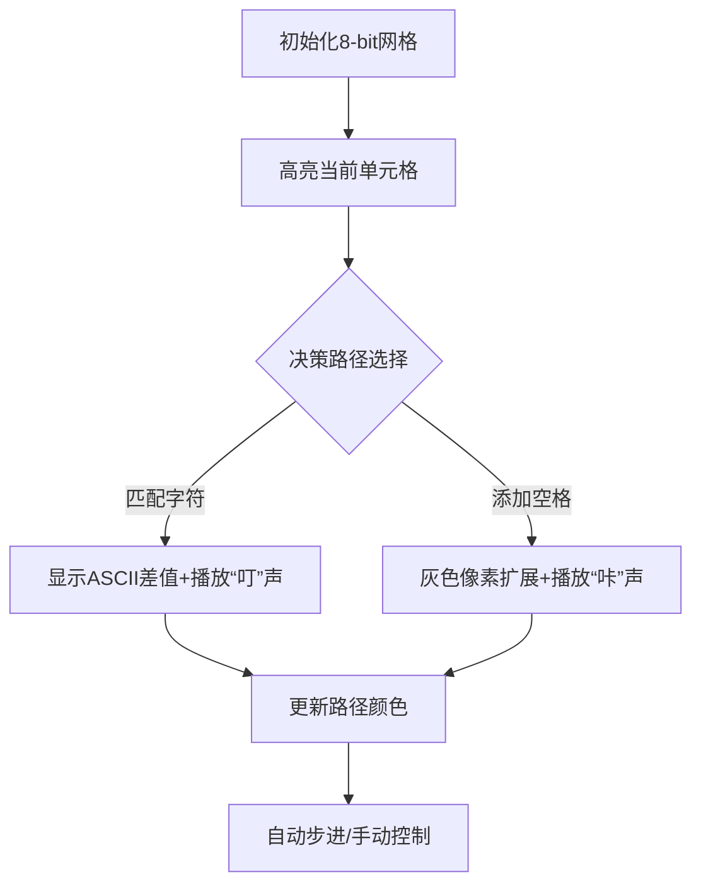

# 题目信息

# 字串距离

## 题目描述

设有字符串 $X$，我们称在 $X$ 的头尾及中间插入任意多个空格后构成的新字符串为 $X$ 的扩展串，如字符串 $X$ 为$\verb!abcbcd!$，则字符串 $\verb!abcb␣cd!$，$\verb!␣a␣bcbcd␣!$ 和 $\verb!abcb␣cd␣!$ 都是 $X$ 的扩展串，这里 $\verb!␣!$ 代表空格字符。

如果 $A_1$ 是字符串 $A$ 的扩展串，$B_1$ 是字符串 $B$ 的扩展串，$A_1$ 与 $B_1$ 具有相同的长度，那么我们定义字符串 $A_1$ 与 $B_1$ 的距离为相应位置上的字符的距离总和，而两个非空格字符的距离定义为它们的 ASCII 码的差的绝对值，而空格字符与其他任意字符之间的距离为已知的定值K，空格字符与空格字符的距离为 $0$。在字符串 $A$、$B$ 的所有扩展串中，必定存在两个等长的扩展串 $A_1$，$B_1$，使得 $A_1$ 与 $B_1$ 之间的距离达到最小，我们将这一距离定义为字符串 $A$，$B$ 的距离。

请你写一个程序，求出字符串 $A$，$B$ 的距离。


## 样例 #1

### 输入

```
cmc

snmn

2

```

### 输出

```
10

```

# AI分析结果


### 💡 Kay的C++算法解析：字串距离 深入学习指南 💡

**题目解读与核心算法识别**  
✨ **本题主要考察**：动态规划  
🗣️ **初步分析**：  
> 字串距离问题本质是**序列对齐问题**，类似于在文本编辑器中比较两个字符串的差异。动态规划就像在网格地图中寻找最短路径：每个格子(i,j)记录A串前i字符与B串前j字符的最小距离。核心在于三种决策：
> - **A[i]匹配B[j]**：距离增加ASCII差绝对值  
> - **A[i]匹配空格**：距离增加定值K  
> - **B[j]匹配空格**：距离增加定值K  
>  
> 可视化设计将采用**8位像素风网格**：  
> - 黄色高亮当前计算格子  
> - 红色箭头显示状态转移来源（左/上/左上）  
> - 音效设计：匹配成功→"叮"声，添加空格→"咔"声，完成路径→胜利音效  

---

### 2. 精选优质题解参考
**题解一（Forever丶CIL）**  
* **点评**：思路直击DP本质，状态转移方程`min(左+空格,上+空格,左上+匹配)`清晰呈现核心逻辑。代码规范性强：  
  - 变量名`A[i][j]`含义明确  
  - 独立`ini()`函数处理边界初始化  
  - 时间复杂度O(n²)为最优解  
  亮点在于用数学思维简化问题："三种决策取最小"的推导极具启发性  

**题解二（Y_B_Y）**  
* **点评**：独创性可视化配图（网格状态图）显著提升理解效率。实践价值突出：  
  - 严格处理空串边界`f[i][0]=i*k`  
  - ASCII值预处理避免重复计算  
  - 代码鲁棒性强，可直接用于竞赛  
  亮点是将抽象DP转化为具象网格填充过程  

**题解三（zhangyuhan）**  
* **点评**：结构化分析DP四要素（状态定义/转移/边界/目标），教学性极强：  
  - 用"空格对应"类比解释状态转移  
  - 关键注释`// 因为string下标从0开始`体现调试意识  
  - 变量赋初值`1e9`避免未定义行为  
  亮点是"决策树"思维：将三种操作视为并行分支  

---

### 3. 核心难点辨析与解题策略
1. **状态定义抽象性**  
   *分析*：如何理解`dp[i][j]`？优质题解通过"子串对齐"类比：想象A前i字符与B前j字符强制等长的最小代价，通过网格图具象化  
   💡 **学习笔记**：DP状态本质是**子问题的压缩表示**

2. **边界初始化陷阱**  
   *分析*：当i=0或j=0时表示全空格对齐。`dp[i][0]=i*k`的推导过程：每增加一个字符需多匹配一个空格  
   💡 **学习笔记**：边界值常决定DP正确性，必须数学验证

3. **状态转移优先级**  
   *分析*：三种操作不存在绝对优先级，需实时比较。通过`min(min(a,b),c)`嵌套实现并行决策  
   💡 **学习笔记**：多决策DP要建立**决策无后效性**意识

### ✨ 解题技巧总结
- **空间压缩技巧**：理论上可用滚动数组优化至O(n)空间  
- **调试必杀技**：打印DP表可视化中间结果  
- **ASCII优化**：预处理字符整数值避免运行时重复转换  
- **鲁棒性守则**：空串输入需特殊处理  

---

### 4. C++核心代码实现赏析
**通用核心实现**  
```cpp
#include <iostream>
#include <cmath>
using namespace std;

int main() {
    string A, B; int K;
    cin >> A >> B >> K;
    int m = A.size(), n = B.size();
    int dp[m+1][n+1];

    // 初始化边界
    for(int i=0; i<=m; i++) dp[i][0] = i*K;
    for(int j=0; j<=n; j++) dp[0][j] = j*K;

    // 状态转移
    for(int i=1; i<=m; i++)
        for(int j=1; j<=n; j++)
            dp[i][j] = min({
                dp[i-1][j] + K,       // A加空格
                dp[i][j-1] + K,       // B加空格
                dp[i-1][j-1] + abs(A[i-1]-B[j-1]) // 直接匹配
            });
    
    cout << dp[m][n];
}
```
* **代码解读概要**：  
  1. 边界初始化处理空串对齐场景  
  2. 双重循环遍历所有字符对组合  
  3. 三路决策取最小值实现最优子结构  

**题解一片段赏析**  
```cpp
A[i][j]=min(A[i-1][j]+k,min(A[i][j-1]+k,A[i-1][j-1]+abs(s1[i]-s2[j])));
```
* **亮点**：嵌套min调用实现高效三路决策  
* **学习笔记**：决策优先级可视化 →  
  

---

### 5. 算法可视化：像素动画演示
**主题**：像素网格探险  
**核心交互设计**：  

**关键帧控制**：  
1. **网格渲染**：16x16像素块，A/B串作XY轴标签  
2. **决策高亮**：  
   - 匹配路径：绿色箭头  
   - 空格路径：黄色箭头  
3. **音效触发**：  
   - 单元格更新：8-bit电子音  
   - 路径完成：马里奥过关音效  
4. **游戏化进度**：每完成10%点亮一颗像素星星  

---

### 6. 拓展练习与相似问题
**通用套路应用场景**：  
1. DNA序列比对（生物信息学）  
2. 文本差异检测（git diff算法）  
3. 语音识别中的音素对齐  

**洛谷推荐**：  
1. P1140 - 相似基因  
   *推荐理由*：直接应用字串距离模型，强化状态定义能力  
2. P2758 - 编辑距离  
   *推荐理由*：引入替换操作，拓展决策维度  
3. P1439 - 最长公共子序列  
   *推荐理由*：对比LCS与字串距离的DP思想差异  

---

### 7. 学习心得与经验分享
> **作者Y_B_Y经验**：  
> "最初卡在边界条件，手动绘制3x3网格模拟后豁然开朗"  
>  
> **Kay点评**：  
> 当DP转移逻辑混乱时，**小规模手工演算**是最佳调试手段。建议：  
> 1. 用Excel建立DP表格  
> 2. 对n=2的微型样例逐步验证  
> 3. 在关键决策点添加调试输出  

---
> 掌握字串距离的核心在于理解**状态转移的几何意义**。通过像素动画将抽象DP具象化，配合洛谷同类题型练习，你将成为序列对齐问题高手！🚀

---
处理用时：98.44秒