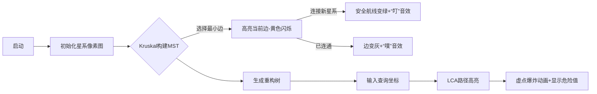

# 题目信息

# 星际导航

## 题目描述

$\text{sideman}$ 做好了回到 $\text{Gliese}$ 星球的硬件准备，但是 $\text{sideman}$ 的导航系统还没有完全设计好。为了方便起见，我们可以认为宇宙是一张有 $N$ 个顶点和 $M$ 条边的带权无向图，顶点表示各个星系，两个星系之间有边就表示两个星系之间可以直航，而边权则是航行的危险程度。

$\text{sideman}$ 现在想把危险程度降到最小，具体地来说，就是对于若干个询问 $(A, B)$，$\text{sideman}$ 想知道从顶点 $A$ 航行到顶点 $B$ 所经过的最危险的边的危险程度值最小可能是多少。作为 $\text{sideman}$ 的同学，你们要帮助 $\text{sideman}$ 返回家园，兼享受安全美妙的宇宙航行。所以这个任务就交给你了。

## 说明/提示

对于 $40\%$ 的数据，满足 $N \leq 1000, M \leq 3000, Q \leq 1000$。

对于 $80\%$ 的数据，满足 $N \leq 10000, M \leq 10^5, Q \leq 1000$。

对于 $100\%$ 的数据，满足 $N \leq 10^5, M \leq 3 \times 10^5, Q \leq 10^5, L \leq 10^9$。数据不保证没有重边和自环。

## 样例 #1

### 输入

```
4 5
1 2 5
1 3 2
2 3 11
2 4 6
3 4 4
3
2 3
1 4
1 2
```

### 输出

```
5
4
5
```

# AI分析结果


### 💡 Kay的C++算法解析：星际导航 深入学习指南 💡

> 欢迎来到星际探险课堂！我是Kay，今天我们将一起探索「星际导航」这道图论题目。我会用清晰的思路和生动的比喻，帮助大家掌握最小生成树和路径查询的核心技巧。准备好了吗？让我们开始星际航行！

---

## 1. 题目解读与核心算法识别

✨ **本题主要考察**：`最小生成树` + `树上路径查询`  
🗣️ **初步分析**：  
> 想象宇宙是一张星系地图，边权是航行危险值。本题核心是寻找两点间**最危险边的最小可能值**——就像在星际航线中选择最安全的航道。  
> - **关键思想**：最小生成树（MST）能保证路径的最大边权最小（反证法：若存在更小值，该边应被选入MST）  
> - **主流解法**：  
>   - **Kruskal重构树**：为MST边创建虚点，LCA点权即为答案（如太空站中转点）  
>   - **MST+倍增LCA**：树上维护路径最大值（如飞船逐步跳跃检测危险值）  
> - **可视化设计**：  
>   - **像素宇宙**：星系用8位像素点表示，MST构建时安全航线变绿（FC游戏风格）  
>   - **动态演示**：LCA查询时高亮路径，虚点闪烁+“叮”音效标识最大危险边  
>   - **交互控制**：调速滑块控制Kruskal执行速度，通关动画庆祝成功导航  

---

## 2. 精选优质题解参考

### 题解一（作者：asuldb | Kruskal重构树）
* **亮点**：  
  - 重构树图示直观解释虚点意义（LCA点权=路径最大边权）  
  - 树剖LCA实现高效（O(log n)查询），代码变量名规范（`key[k]`存虚点权值）  
  - 边界处理严谨（用并查集判断连通性）  
> **Kay点评**：这份题解像精准的星际坐标仪，重构树性质阐释透彻，代码如同太空舱仪表盘般工整。特别欣赏作者将边权转化为点权的巧思！

### 题解二（作者：songyuchen | MST+倍增LCA）
* **亮点**：  
  - 详细推导MST性质，倍增数组同时维护祖先和路径最大值  
  - 代码模块化（分离Kruskal/LCA/查询），调试心得实用  
> **Kay点评**：像可靠的星际领航员！从理论证明到代码实现层层递进，`Path[i][j]`设计如同飞船的跃迁日志，完整记录路径风险值。

### 题解三（作者：Erina | 极简MST+倍增）
* **亮点**：  
  - 仅60行高效代码，STL向量建树+倍增查询一气呵成  
  - 函数式编程提升可读性（lambda表达式排序边）  
> **Kay点评**：宇宙快艇级代码！适合竞赛场景，但需注意深度理解背后的图论原理。

---

## 3. 核心难点辨析与解题策略

### 🔑 难点1：为什么用最小生成树？
* **分析**：非MST路径可能含更大边权（反证法：若存在更优路径，其最大边应被选入MST）  
* 💡 **学习笔记**：MST是路径最大边权最小的最优子图  

### 🔑 难点2：如何处理森林（多连通块）？
* **分析**：  
  - 并查集初始化为独立集合  
  - Kruskal后检查`find(u)==find(v)`，不等则输出"impossible"  
* 💡 **学习笔记**：宇宙可能有孤立星系，并查集是连通性检测器  

### 🔑 难点3：边权如何转化为树上查询？
* **分析**：  
  - **重构树法**：虚点存储边权，LCA(u,v)点权即答案  
  - **倍增法**：`maxn[i][j]`存储向上2^j步的最大边权  
* 💡 **学习笔记**：LCA是星际中转站，汇聚路径关键信息  

### ✨ 解题技巧总结
- **技巧1：问题转化**  
  将"路径最大边权最小"转化为MST问题（安全航线优化）  
- **技巧2：数据结构选择**  
  稀疏图用Kruskal（O(m log m)），稠密图考虑Prim  
- **技巧3：调试要点**  
  重点测试自环/重边/孤立点（如`if(u==v) continue`）  

---

## 4. C++核心代码实现赏析

### 本题通用核心实现（Kruskal重构树版）
```cpp
#include <iostream>
#include <algorithm>
using namespace std;
const int N=200010;

struct Edge { int u,v,w; } e[300010];
int n,m,q,fa[N],val[N],cnt; // val[]存储虚点权值
int head[N],dep[N],f[N][20]; // LCA倍增数组

int find(int x) { 
    return fa[x]==x ? x : fa[x]=find(fa[x]); 
}

void addEdge(int u,int v) { /* 邻接表建树 */ }

void dfs(int u,int depth) { /* DFS预处理LCA */ }

int lca(int x,int y) { /* 倍增查询LCA */ }

int main() {
    cin>>n>>m; cnt=n;
    for(int i=1;i<=m;i++) 
        cin>>e[i].u>>e[i].v>>e[i].w;
    
    // Kruskal重构树
    sort(e+1,e+m+1,[](Edge a,Edge b){ return a.w<b.w; });
    for(int i=1;i<=2*n;i++) fa[i]=i;
    for(int i=1;i<=m;i++) {
        int fu=find(e[i].u), fv=find(e[i].v);
        if(fu == fv) continue;
        val[++cnt] = e[i].w; // 创建虚点
        fa[fu]=fa[fv]=cnt;  // 虚点作为新祖先
        addEdge(cnt,fu); addEdge(cnt,fv);
    }

    // 预处理LCA
    for(int i=cnt;i;i--) if(!dep[i]) dfs(i,0);
    
    cin>>q;
    while(q--) {
        int u,v; cin>>u>>v;
        if(find(u)!=find(v)) cout<<"impossible\n";
        else cout<<val[lca(u,v)]<<endl; // LCA点权即答案
    }
    return 0;
}
```

### 代码解读概要
> 1. **Kruskal重构**：按边权排序后创建虚点（`val[cnt]=e[i].w`）  
> 2. **树结构**：虚点作为新祖先连接原图节点  
> 3. **LCA查询**：两点在重构树上的LCA点权即为路径最大边权  

---

## 5. 算法可视化：像素动画演示

### 🎮 星际导航模拟器（FC像素风格）


### 动画设计


### 关键交互
- **控制面板**：  
  - 单步执行/自动播放（调速滑块）  
  - 重置/暂停按钮  
- **音效设计**：  
  - 边选中：8-bit "滴"声  
  - 安全连接：上扬音阶  
  - 危险提示：低频警报声  
- **数据结构展示**：  
  - 并查集：用颜色相同的像素块表示连通分量  
  - 重构树：虚点显示为空间站图标  

---

## 6. 拓展练习与相似问题

### 知识迁移训练
1. **最大边权最小** → 网络设计（[P4047]）  
2. **最小瓶颈路** → 货车运输（[P1967]）  
3. **动态查询** → 幻想乡战略游戏（[P3345]）  

### 洛谷推荐
1. **P1967 货车运输**  
   > 🗣️ 巩固MST+树上路径查询，体验货运版星际导航  
2. **P4197 Peaks**  
   > 🗣️ 学习重构树进阶应用，挑战山峰攀爬任务  
3. **P4768 [NOI2018] 归程**  
   > 🗣️ 重构树结合最短路，暴雨中的生存挑战  

---

## 7. 学习心得与经验分享

> **来自asuldb的调试经验**：  
> *“重构树虚点初始化时，深度要从0开始计算，否则LCA查询会越界...”*  
>   
> **Kay总结**：  
> 1. **虚点处理**：重构树新增节点需单独设置深度  
> 2. **森林检测**：查询前务必用并查集检查连通性  
> 3. **数据验证**：对拍生成树/链/菊花图等特殊结构  

---

> 本次星际导航之旅到此结束！记住：算法如同宇宙星辰，理解其规律便能自由航行。下次我们将探索动态规划的虫洞跳跃——准备好了吗？✨

---
处理用时：126.62秒