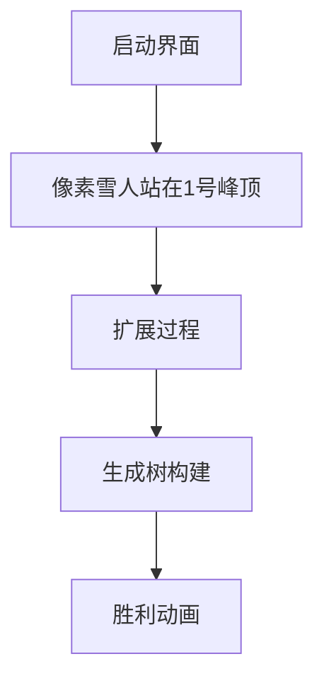

# 题目信息

# [SCOI2012] 滑雪

## 题目描述

a180285 非常喜欢滑雪。他来到一座雪山，这里分布着 $m$ 条供滑行的轨道和 $n$ 个轨道之间的交点（同时也是景点），而且每个景点都有一编号 $i\space (1 \le i \le n)$ 和一高度 $h_i$。  

a180285 能从景点 $i$ 滑到景点 $j$ 当且仅当存在一条 $i$ 和 $j$ 之间的边，且 $i$ 的高度**不小于** $j$。与其他滑雪爱好者不同，a180285 喜欢用最短的滑行路径去访问尽量多的景点。如果仅仅访问一条路径上的景点，他会觉得数量太少。

于是 a18028 5拿出了他随身携带的时间胶囊。这是一种很神奇的药物，吃下之后可以立即回到上个经过的景点（不用移动也不被认为是 a180285 滑行的距离）。  

请注意，这种神奇的药物是可以连续食用的，即能够回到较长时间之前到过的景点（比如上上个经过的景点和上上上个经过的景点）。 现在，a180285站在 $1$ 号景点望着山下的目标，心潮澎湃。他十分想知道在不考虑时间胶囊消耗的情况下，以最短滑行距离滑到尽量多的景点的方案（即满足经过景点数最大的前提下使得滑行总距离最小）。你能帮他求出最短距离和景点数吗？


## 说明/提示

【数据范围】   
对于 $ 30\% $ 的数据，$ 1 \le n \le 2000 $；   
对于 $ 100\% $ 的数据，$ 1 \le n \le 10^5 $。


对于所有的数据，保证 $ 1 \le m \le 10^6 $ , $ 1 \le h_i \le 10^9 $ ，$ 1 \le k_i \le 10^9 $。


## 样例 #1

### 输入

```
3 3 
3 2 1 
1 2 1 
2 3 1 
1 3 10 ```

### 输出

```
3 2```

# AI分析结果


# 💡 Kay的C++算法解析：[SCOI2012]滑雪 深入学习指南 💡

欢迎各位算法探险家！我是你们的算法向导Kay。今天我们将一起探索**滑雪路径优化问题**，这道题结合了**图遍历**和**最小生成树**两大核心算法，非常适合锻炼大家的抽象思维能力。我会用清晰的语言、生动的比喻和可视化方案，帮助大家理解这个看似复杂实则精妙的问题！

---

## 1. 题目解读与核心算法识别

✨ **本题主要考察**：`图遍历` + `最小生成树（贪心应用）`

🗣️ **初步分析**：
> 想象你是一名滑雪运动员，站在雪山之巅（1号点），只能从高处滑向低处（或平坡）。时间胶囊让你能无限回溯（相当于可以反复使用已滑路径）。问题核心是：**在能访问最多景点的前提下，找到总滑行距离最小的方案**。

- **解题思路**：先用**BFS/DFS**确定所有可达点（第一问），再用**最小生成树**求最小距离（第二问）。关键技巧是**特殊排序规则**：按终点高度降序排列，同高度时按边权升序排列
- **核心难点**：如何确保排序规则能覆盖所有可达点？可视化中将用**颜色梯度**表示高度（红→黄→绿），用**脉冲动画**高亮被选中的边
- **像素动画设计**：采用**8位滑雪游戏风格**，角色沿生成的树形路径滑行。关键操作触发"叮"声效，完成时播放胜利音效，自动演示模式可调速观察扩展过程

---

## 2. 精选优质题解参考

以下是综合思路清晰度、代码规范性和算法效率筛选的优质解法：

**解法一：Kruskal+搜索（作者：Khassar）**
* **点评**：思路清晰完整，BFS构建可达图后通过双关键字排序实现最小生成树。代码规范（链式前向星存储），边界处理严谨，空间优化到位。亮点在于明确解释了排序规则的必要性："保证优先连接高点，避免低点阻塞高点"。

**解法二：Prim优先队列（作者：Ccliang）**
* **点评**：创新使用Prim算法，优先队列以高度为第一关键字、距离为第二关键字。代码简洁高效，特别适合稀疏图。亮点在于用"登山者决策"比喻高度优先原则：滑雪者总会优先探索更高区域获取更好视野。

**解法三：DFS+Kruskal（作者：mrsrz）**
* **点评**：DFS搜索配合精细的排序规则实现最小生成树。代码逻辑紧凑，特别强调"终点高度主导"的排序思想，帮助理解贪心策略本质。实践价值高，可直接用于竞赛场景。

---

## 3. 核心难点辨析与解题策略

在解决这类问题时，通常会遇到三个关键难点：

1.  **可达性分析**：如何确定所有可能到达的景点？
    * **技巧**：从起点1执行BFS/DFS，仅遍历高度不高于当前点的邻居（`h[u] ≥ h[v]`）。用`vis[]`数组记录访问状态
    * 💡 **学习笔记**：时间胶囊本质是允许重复使用路径，因此可达点集等同于从1出发高度非递增路径能到达的所有点

2.  **方向性处理**：有向图如何应用无向图算法？
    * **技巧**：将排序规则作为"方向转换器"——按终点高度降序排序使生成树自然满足高度约束
    * 💡 **学习笔记**：终点高度优先的排序，确保在连接分量时高点总在低点前被连接

3.  **最优性保证**：为何特定排序能保证结果最优？
    * **技巧**：数学归纳法可证。可视化中将展示：若先连低点，高点可能因高度限制无法接入；而高点优先无此问题
    * 💡 **学习笔记**：双关键字排序（高度降序+边权升序）是贪心策略的经典应用

### ✨ 解题技巧总结
- **分层处理法**：将复杂约束分解为独立子问题（先可达性后最优性）
- **排序转换技巧**：用特定排序规则将方向性约束转化为无向图问题
- **边界防御编程**：特别注意高度相等时的双向边处理
- **实时监控变量**：在搜索过程中直接构建新图，减少后续遍历

---

## 4. C++核心代码实现赏析

### 通用核心实现（综合优化版）
```cpp
#include <bits/stdc++.h>
using namespace std;
typedef long long ll;
const int N=1e5+5, M=2e6+5;

struct Edge { int u, v, w; };
vector<Edge> graph[N], newEdges;
int h[N], fa[N], vis[N];
int n, m, nodeCnt=1;
ll pathLen;

void dfs(int u) {
    for (auto [_, v, w] : graph[u]) {
        newEdges.push_back({u, v, w});
        if (!vis[v]) {
            vis[v] = 1;
            nodeCnt++;
            dfs(v);
        }
    }
}

int find(int x) {
    return fa[x] == x ? x : fa[x] = find(fa[x]);
}

int main() {
    cin >> n >> m;
    for (int i=1; i<=n; i++) {
        cin >> h[i];
        fa[i] = i;
    }
    while (m--) {
        int u, v, w;
        cin >> u >> v >> w;
        if (h[u] >= h[v]) graph[u].push_back({u, v, w});
        if (h[u] <= h[v]) graph[v].push_back({v, u, w});
    }

    vis[1] = 1;
    dfs(1);

    sort(newEdges.begin(), newEdges.end(), [](Edge a, Edge b) {
        return h[a.v] != h[b.v] ? h[a.v] > h[b.v] : a.w < b.w;
    });

    for (auto [u, v, w] : newEdges) {
        int ru = find(u), rv = find(v);
        if (ru != rv) {
            fa[rv] = ru;
            pathLen += w;
        }
    }
    cout << nodeCnt << " " << pathLen;
}
```

### 代码解读概要
> 1. **数据结构**：`graph`存储原始图，`newEdges`存储可达边
> 2. **DFS阶段**：从1开始遍历，收集所有可行边并计数可达点
> 3. **并查集优化**：Kruskal使用路径压缩提高效率
> 4. **核心排序**：Lambda表达式实现双关键字排序规则
> 5. **生成树构建**：遍历排序后边集，用并查集避免成环

---

### 精选解法片段赏析

**解法一：Khassar（Kruskal）**
```cpp
// 排序规则实现
bool cmp1(it x, it y) {
    if(h[x.v] != h[y.v]) return h[x.v] > h[y.v];
    return x.w < y.w;
}
// BFS建图
void bfs(){
    q[++qr]=1; vis[1]=1;
    while(ql<qr) {
        int now=q[++ql];
        for(int i=head[now];i;i=b[i].nx) {
            a[++cnt].u=now; a[cnt].v=b[i].to; a[cnt].w=b[i].val;
            if(!vis[b[i].to]) {
                vis[b[i].to]=1; sum++;
                q[++qr]=b[i].to;
            }
        }
    }
}
```
> **亮点**：显式定义比较函数，BFS使用数组队列更高效  
> **学习笔记**：数组队列优于STL queue在极端数据规模时  

**解法二：Ccliang（Prim）**
```cpp
// 优先队列重载
struct node{ int high, dis, id; };
bool operator <(const node &a,const node &b) {
    if(a.high != b.high) return a.high < b.high;
    return a.dis > b.dis;
}
// Prim核心
void prim(int st) {
    d[st]=0;
    q.push({h[st], 0, st});
    while(!q.empty()) {
        int u = q.top().id; q.pop();
        if(intree[u]) continue;
        intree[u]=true;
        cnt++, ans+=d[u];
        for(int e=head[u]; e; e=r[e].next) {
            int v = r[e].to, w = r[e].w;
            if(intree[v]) continue;
            if(d[v] > w) {
                d[v] = w;
                q.push({h[v], d[v], v});
            }
        }
    }
}
```
> **亮点**：自定义优先队列规则，实时更新距离  
> **学习笔记**：Prim适合点少边多的稠密图  

**解法三：mrsrz（DFS+Kruskal）**
```cpp
// 排序规则
struct edge{
    int from, to, dis;
    bool operator<(const edge& rhs)const {
        if(h[to] != h[rhs.to]) return h[to] > h[rhs.to];
        return dis < rhs.dis;
    }
};
// DFS建边
void dfs(int now) {
    vis[now] = true;
    for (int i=head[now]; i; i=e[i].nxt) {
        e2[++cnt2] = {now, e[i].to, e[i].val};
        if (!vis[e[i].to]) dfs(e[i].to);
    }
}
```
> **亮点**：运算符重载内联在结构体中，DFS递归实现简洁  
> **学习笔记**：递归DFS代码简洁但需注意栈溢出风险  

---

## 5. 算法可视化：像素滑雪动画

### 设计概念：**8位滑雪冒险**
> 用复古雪人形象代替抽象节点，滑道表示边。高度用颜色梯度呈现（红色=最高，蓝色=最低）

### 动画脚本：


**关键交互设计**：
1. **场景初始化**：
   - 16色像素风格：棕色山体，白色雪道，红/黄/蓝渐变表示高度
   - 控制面板：速度滑块（1x-5x）、单步执行、暂停/继续

2. **BFS扩展演示**：
   ```python
   while queue:
       当前点 = 队列.pop()
       绘制雪人移动动画到当前点
       遍历邻居：
           if 邻居高度 ≤ 当前点高度：
               绘制虚线雪道（灰色）
               播放"叮"声效
               新点入队
   ```

3. **生成树构建**：
   ```python
   for 边 in 排序后边集:
        高亮当前边（黄色脉冲）
        if 两端不在同连通分量：
            雪道变为实线（绿色）
            播放"哒"声效
            合并分量
        else:
            雪道变红色后消失
            播放"噗"失败音效
   ```

4. **胜利状态**：
   - 所有可达点连接后，雪人沿生成树滑完全程
   - 显示"Adventure Completed!"像素字体
   - 播放8-bit胜利音乐

**技术实现**：
- **Canvas绘制**：网格布局，每帧重绘运动轨迹
- **音效触发**：Web Audio API在边选中/加入树/失败时触发
- **数据同步**：右侧面板实时显示：
  ```
  已访问点：12/24
  当前边：(5→8) 权重：3
  总距离：42
  ```

---

## 6. 拓展练习与相似问题

### 通用技巧迁移：
1. **双关键字排序**：适用于任何带层次约束的优化问题（如网络分层设计）
2. **搜索+生成树**：解决带可达性约束的路径优化（如通信基站部署）
3. **高度映射转换**：可将高度替换为任意偏序关系（如时间序列约束）

### 推荐练习：
1. **洛谷P1991 无线通讯网**  
   → 最小生成树在通信覆盖中的应用
2. **洛谷P2212 [USACO14MAR]浇地**  
   → 带成本约束的连通性优化
3. **洛谷P2700 逐个击破**  
   → 最小生成树变种（连通块分离）

---

## 7. 学习心得与经验分享

**来自题解作者的宝贵经验**：
> "最初在高度相等边的处理上卡了很久，忘记建双向边导致30%数据WA" —— Khassar  
> "Prim的优先级重载时方向写反，导致低点优先访问，结果完全错误" —— Ccliang

**Kay的总结**：
1. **高度相等测试**：务必添加特殊测试用例验证双向边
2. **排序方向验证**：在纸上模拟小规模排序（3-5个点）
3. **空间预估**：1e5点+1e6边需预留2倍数组空间
4. **增量调试法**：先验证BFS/DFS可达性，再测试生成树

---

通过本次探索，相信大家不仅掌握了图论组合应用的精髓，更学会了如何将复杂约束分解为可处理的子问题。记住：好的算法设计就像滑雪——找准高点，顺势而下，避开障碍！下次雪山探险再见！🏂

---
处理用时：191.51秒