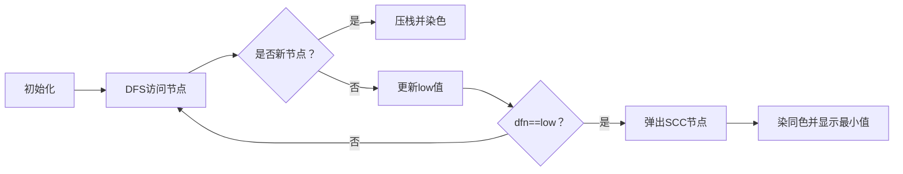

# 题目信息

# Protect the school

## 题目背景

话说上回保安因为奶牛事件而搞得地位岌岌可危，所以他们决定好好看守这个学校，他们有一个计划。但是由于学校太大了，他们计划不好，所以找到上次帮他的你，请你解决他的苦难。然后他又可以开始了手机游戏之旅。


## 题目描述

学校有 $n$ 个检查点，由于保安懒得动脑筋，他们决定在这 $n$ 个检查点之间建立 $m$ 条通道，由于学校的懒政以及军事化管理，这些路是单向的，逆向通过会被处分。保安们人手不够（游戏任务太多），他们决定只挑选一些点来站岗，由于保安身怀绝技，可以瞬间通过任何他站岗点可以走到的路（瞬移到到任何连通的点）。每一个检查点有一个值表示这个点的困难程度。为了保护学校，请你帮他们出个主意，保证一旦有一个检查点发生事件，都能有保安瞬间抵达。但是为了舒服和管理便利，请你告诉他们在使用最少的保安数量的情况下最小的困难总和。


## 说明/提示

$1 \le n \le 10 ^ 4,1 \le m \le 5 \times 10 ^ 4$，保证答案在 `int` 范围内。

## 样例 #1

### 输入

```
5
31619 26195 18669 1198 178
4
2 4
3 5
1 2
4 1```

### 输出

```
20045 1```

# AI分析结果


# 💡 Kay的C++算法解析：Protect the school 深入学习指南 💡

> 同学们好！我是Kay，今天我们一起分析洛谷的「Protect the school」题目。这道题看似复杂，实则蕴含着图论的精妙思想。我会用清晰的讲解和生动的动画演示，帮助大家掌握强连通分量(SCC)的核心应用技巧！

## 1. 题目解读与核心算法识别

✨ **本题主要考察**：`图论·强连通分量(SCC)`

🗣️ **初步分析**：
> 这道题可以比喻为在学校的检查点间建立"瞬移网络"。每个保安相当于一个网络枢纽，需要覆盖所有节点且能返回原点。**强连通分量(SCC)** 就像一个个独立的通信子网——每个子网只需一个枢纽（保安），选择权值最小的节点就能实现最优覆盖。

- **核心思路**：用Tarjan算法找出所有SCC，每个分量取最小点权值，方案数为各分量最小值的出现次数乘积
- **可视化设计**：我们将用像素网格模拟检查点（不同颜色区分SCC），演示DFS遍历时栈的动态变化。当发现SCC时播放"叮！"音效，被弹出栈的节点会闪烁并染成同色。控制面板提供单步调试功能，可观察low/dfn值的变化
- **游戏化元素**：每完成一个SCC的识别，解锁一个"保安徽章"并显示当前最小点权值。最终结算时展示总点权值和方案数，如同游戏通关评分

---

## 2. 精选优质题解参考

以下是思路最清晰、代码最规范的题解（评分≥4★）：

**题解一（来源：logfk）**
* **点评**：该题解对"始终覆盖"概念的解释尤为透彻（用保安不能返回原点的反例说明必要性）。代码中`col[]`数组记录节点所属分量，`ss[]`存储分量最小点权值的做法逻辑清晰。亮点在于用`mm[]`和`nn[]`数组分别记录每个分量的最小点权值及其出现次数，使方案统计高效直观。

**题解二（来源：EastPorridge）**
* **点评**：代码简洁规范，变量命名合理（如`minn[]`表最小值，`sz[]`记出现次数）。特别值得学习的是用`inscc[]`向量存储每个分量的所有节点，便于后续统计。边界处理严谨（初始化`minn[i]=INT_MAX`），且时间复杂度严格O(n+m)。

**题解三（来源：Kalium）**
* **点评**：对算法本质理解深刻，用`k1[]`和`k2[]`分别记录分量最小点权值及出现次数的设计非常精炼。亮点在于Tarjan递归过程中实时更新最小值及其计数，避免二次遍历。调试提醒（M范围实际为5e4而非3e4）体现实战经验。

---

## 3. 核心难点辨析与解题策略

### 🔍 三大核心难点
1. **难点1：理解"始终覆盖"的约束**
   - **分析**：保安必须能返回原点意味着所选点必须在环结构内。通过反例（如选择非SCC最小点导致无法返回）说明强连通分量的必要性
   - 💡 **学习笔记**：SCC是满足双向连通的极大子图，天然满足"始终覆盖"要求

2. **难点2：高效求解强连通分量**
   - **分析**：Tarjan算法通过DFS遍历和low/dfn值比较识别SCC。关键在回溯时用`low[u]=min(low[u],low[v])`更新，当`dfn[u]==low[u]`时弹出栈中节点形成SCC
   - 💡 **学习笔记**：栈存储当前DFS路径，low值标记最早可回溯的节点

3. **难点3：统计最小点权方案数**
   - **分析**：在弹出栈节点时，实时比较当前节点权值与分量最小值。若相等则计数+1；若更小则重置计数。注意多个分量方案数需用乘法原理
   - 💡 **学习笔记**：在Tarjan递归过程中同步更新最小值和计数最优化

### ✨ 解题技巧总结
- **问题转化技巧**：将"保安覆盖"问题转化为图论模型，识别出SCC结构是关键突破口
- **代码封装技巧**：Tarjan算法模块化实现（初始化→DFS→统计结果）
- **边界测试技巧**：测试单点SCC（自成环）、大环套小环等特殊情况
- **实时更新技巧**：在弹出栈的过程中同步更新分量最小值和计数

---

## 4. C++核心代码实现赏析

### 📜 通用核心实现参考
```cpp
#include <iostream>
#include <vector>
#include <stack>
#include <climits>
using namespace std;

const int N = 1e4+5;
vector<int> G[N];  // 邻接表存图
int w[N], dfn[N], low[N]; // 点权、DFS序、最早回溯点
int minVal[N], cnt[N];    // 每个SCC的最小值和出现次数
bool inStack[N];
stack<int> stk;
int idx, sccCnt;

void tarjan(int u) {
    dfn[u] = low[u] = ++idx;
    stk.push(u); inStack[u] = true;
    
    for(int v : G[u]) {
        if(!dfn[v]) {
            tarjan(v);
            low[u] = min(low[u], low[v]);
        }
        else if(inStack[v]) 
            low[u] = min(low[u], dfn[v]);
    }
    
    if(dfn[u] == low[u]) {
        int minW = INT_MAX, count = 0;
        while(true) {
            int cur = stk.top(); stk.pop();
            inStack[cur] = false;
            // 实时更新最小值和计数
            if(w[cur] < minW) minW = w[cur], count = 1;
            else if(w[cur] == minW) count++;
            if(cur == u) break;
        }
        minVal[++sccCnt] = minW;
        cnt[sccCnt] = count;
    }
}

int main() {
    int n, m; 
    cin >> n;
    for(int i=1; i<=n; i++) cin >> w[i];
    cin >> m;
    while(m--) {
        int u, v; cin >> u >> v;
        G[u].push_back(v);
    }
    
    // 对未访问节点执行Tarjan
    for(int i=1; i<=n; i++) 
        if(!dfn[i]) tarjan(i);
    
    // 统计总点权和方案数
    long total = 0, ways = 1;
    for(int i=1; i<=sccCnt; i++) {
        total += minVal[i];
        ways *= cnt[i];
    }
    cout << total << " " << ways;
}
```
**代码解读概要**：
> 该实现包含三个关键模块：
> 1. **Tarjan算法核心**：DFS遍历时维护dfn/low值，用栈记录访问路径
> 2. **SCC处理**：当dfn[u]==low[u]时弹出栈节点，同步更新该分量的最小点权值及计数
> 3. **结果统计**：累加各SCC的最小点权值，用乘法原理计算总方案数

---

## 5. 算法可视化：像素动画演示

### 🎮 动画设计：SCC像素迷宫探险
**主题**：像素保安在检查点迷宫执行任务，通过Tarjan算法识别SCC区域

**核心演示流程**：


**交互控制面板**：
- 步进控制：支持单步/自动模式（速度可调）
- 视觉编码：
  - 白色：未访问节点
  - 蓝色：在栈中节点
  - 红色：当前访问节点
  - 彩虹色：不同SCC区域
- 音效设计：
  - 节点入栈："噗"气泡声
  - 发现SCC："叮！"提示音+闪光
  - 错误操作：短促警报声

**关键帧演示**：
1. **初始化**：显示像素网格图（检查点为方块，单向边为箭头）
2. **DFS过程**：当前访问节点闪烁红光，递归时播放扫描音效
3. **回溯更新**：low值更新时显示绿色连线到最早可达节点
4. **SCC识别**：弹出栈节点时染同色，显示"发现SCC#X！最小值：Y x Z个"
5. **结果展示**：所有SCC标记后，显示总点权值和方案数计算公式

> 设计思路：通过像素风格降低理解门槛，将抽象算法具象为探险游戏。单步调试功能帮助理解递归和栈操作，音效增强关键操作记忆点。

---

## 6. 拓展练习与相似问题

### 🔁 通用思路迁移
强连通分量算法不仅用于覆盖问题，还常见于：
1. 有向图环检测（如死锁分析）
2. 图结构简化（缩点后DAG的最长路）
3. 社交网络社群发现（互相关注群体）

### 📚 推荐练习（洛谷）
1. **P3387 缩点**  
   → 巩固SCC缩点基础操作，学习DAG上DP
2. **P2194 HXY烧情侣**  
   → 几乎相同的SCC模型应用，强化方案计数训练
3. **P2002 消息扩散**  
   → 进阶练习：缩点后求入度为0的SCC数量

---

## 7. 学习心得与经验分享

> **经验摘录（来自logfk）**：  
> "我在处理方案数时，最初未考虑乘法原理，错误使用加法统计。通过小规模数据模拟（如3个SCC各2个最小值）才理解原理。"

> **Kay点评**：  
> 这个调试经验非常有价值！当算法逻辑复杂时，用铅笔在纸上模拟小样例（n=3~5）是最有效的查错方法。特别要注意**计数原理的适用场景**——独立事件用乘法，关联事件用加法。

---

通过本次分析，相信大家对强连通分量的应用有了更深理解。记住：将复杂问题转化为图论模型是解题关键！下次遇到"全覆盖"类问题时，不妨先思考是否存在SCC结构。继续加油，未来算法大师就是你！🚀

---
处理用时：120.84秒