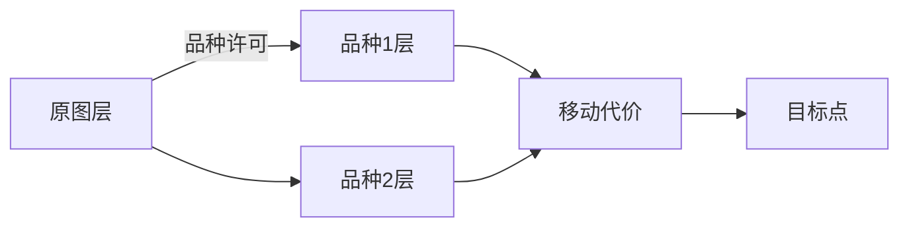

# 题目信息

# [USACO21JAN] Telephone G

## 题目描述

Farmer John 的 N 头奶牛，编号为 $1…N$，站成一行（$1≤N≤5⋅10^4$）。第 $i$ 头奶牛的品种编号为 $b_i$，范围为 $1\dots K$，其中 $1≤K≤50$。奶牛们需要你帮助求出如何最优地从奶牛 $1$ 传输一条信息到奶牛 $N$。

从奶牛 $i$ 传输信息到奶牛 $j$ 花费时间 $|i-j|$。然而，不是所有品种的奶牛都愿意互相交谈，如一个 $K\times K$ 的方阵 $S$ 所表示，其中如果一头品种 $i$ 的奶牛愿意传输一条信息给一头品种 $j$ 的奶牛，那么 $S_{ij}=1$，否则为 $0$。不保证 $S_{ij}=S_{ji}$，并且如果品种 $i$ 的奶牛之间不愿意互相交流时可以有 $S_{ii}=0$。

请求出传输信息所需的最小时间。

## 说明/提示

最优传输序列为 $1\to 4\to 3\to 5$。总时间为 $|1-4|+|4-3|+|3-5|=6$。

#### 测试点性质：

 - 测试点 1-5 满足 $N≤1000$。
 - 测试点 6-13 没有额外限制。

供题：Dhruv Rohatgi

## 样例 #1

### 输入

```
5 4
1 4 2 3 4
1010
0001
0110
0100```

### 输出

```
6```

# AI分析结果


# 💡 Kay的C++算法解析：Telephone G 深入学习指南 💡

> 今天我们来分析"Telephone G"这道分层图最短路问题。本指南将帮助你理解题目核心、掌握分层图技巧，并通过像素动画直观感受算法执行过程。

## 1. 题目解读与核心算法识别

✨ **本题主要考察**：分层图最短路 (优化建图技巧)

🗣️ **初步分析**：
> 想象牧场被复制成多层透明玻璃板，每层代表一种奶牛品种。奶牛在不同层间的"跳跃"需要满足品种间的交流许可，而同层内相邻奶牛的移动则像走格子一样简单。这种"分层图"技术将原本$O(n^2)$的建图优化到$O(nk)$，是解决本题的核心钥匙。
>
> - **题解思路对比**：主流解法采用分层图（vegetable_ste/ETHANK），通过层内链式边（移动代价）和层间跳跃边（品种许可）优化；乘湘去提出贪心+双指针法避免显式建图
> - **核心算法流程**：1) 建分层图：层内相邻点连边权1，品种点向对应层连0权边 2) 根据邻接矩阵添加层间跳跃边 3) 跑最短路
> - **可视化设计**：采用8位牧场像素风格，层内移动时奶牛像素块滑动（步进音效），层间跳跃时闪光+“叮”声，自动演示模式如“牧场物语”AI寻路

---

## 2. 精选优质题解参考

**题解一：vegetable_ste (15赞)**
* **点评**：分层图原理讲解透彻，比喻形象（"将点固定到层"）；代码采用双端队列BFS优化0/1边权，逻辑清晰；核心亮点是分层图结构设计（get_l映射函数）和边权优化技巧，实践价值高。

**题解二：ETHANK (14赞)**
* **点评**：分层图实现简洁高效，bfs队列处理巧妙（0权边插队首）；亮点在于分层索引计算（get(i,j)=n*(i-1)+j）和轻量化实现，代码规范性极佳，变量名含义明确，适合竞赛直接应用。

**题解三：乘湘去 (7赞)**
* **点评**：独辟蹊径的贪心+双指针法，避免显式建图；亮点是动态删除已访问点降低复杂度，代码中"边跑边删"策略极具启发性；虽然效率略低于分层图，但提供了全新解题视角。

---

## 3. 核心难点辨析与解题策略

1.  **难点1：如何避免O(n²)建边？**
    * **分析**：暴力建边不可行，需利用品种数K小的特性。分层图解法通过"层内链式边+层间跳跃边"将边数降至O(nk)；贪心解法通过维护每个品种最近邻点实现
    * 💡 **学习笔记**：K≤50是突破口，将点维度转化为层维度

2.  **难点2：如何表示品种传递规则？**
    * **分析**：通过邻接矩阵控制层间边添加。关键技巧：原图点u向第b[u]层的u点连0权入边，当品种i可传至品种j时，从第i层的u点向原图u点连0权出边
    * 💡 **学习笔记**：0权边是连接抽象层与具体点的桥梁

3.  **难点3：如何优化最短路计算？**
    * **分析**：双端队列BFS处理0/1权图（0权插队首，1权插队尾）；Dijkstra需优先队列；贪心解法用双指针维护最近邻点
    * 💡 **学习笔记**：边权特性决定算法选择

### ✨ 解题技巧总结
- **维度转换**：当某一参数（K）较小时，考虑复制状态维度（分层）
- **0/1权优化**：双端队列BFS替代Dijkstra避免log复杂度
- **贪心剪枝**：动态移除无效状态降低枚举量
- **边界处理**：注意起点/终点的特殊层连接

---

## 4. C++核心代码实现赏析

**通用分层图核心实现参考**
```cpp
#include <bits/stdc++.h>
using namespace std;
const int N = 5e4 + 10, M = 55;

// 分层图核心实现
void buildGraph(int n, int k, int b[], char S[][M]) {
    vector<pair<int, int>> edges[N * M];
    auto get_id = [n](int layer, int pos) { 
        return layer * n + pos;  // 层内映射
    };

    // 1. 层内建链
    for (int c = 1; c <= k; c++)
        for (int i = 1; i < n; i++) {
            int u = get_id(c, i), v = get_id(c, i + 1);
            edges[u].emplace_back(v, 1);
            edges[v].emplace_back(u, 1);
        }

    // 2. 原图点与层连接
    for (int i = 1; i <= n; i++) {
        // 原图点->品种层
        edges[i].emplace_back(get_id(b[i], i), 0);
        // 许可层->原图点
        for (int c = 1; c <= k; c++)
            if (S[c][b[i]] == '1')
                edges[get_id(c, i)].emplace_back(i, 0);
    }
}
```

**题解一：vegetable_ste 片段赏析**
```cpp
// 双端队列BFS处理0/1权图
deque<int> Q;
Q.push_back(1); dist[1] = 0;
while (!Q.empty()) {
    int u = Q.front(); Q.pop_front();
    for (auto [v, w] : edges[u]) {
        if (dist[v] > dist[u] + w) {
            dist[v] = dist[u] + w;
            w ? Q.push_back(v) : Q.push_front(v);  // 0权插队首
        }
    }
}
```
> **解读**：此片段展示0/1权图的最短路优化。当边权为0时插入队首保证优先处理，避免优先队列的log开销。就像牧场主优先处理零成本事务，高效且符合直觉。

**题解三：乘湘去 片段赏析**
```cpp
// 贪心删除已访问点
for (int j = 1; j <= tot[i]; j++) {
    int y = v[i][j];
    while (vis[y] && tot[i] > 1) {  // 动态删除无效点
        swap(v[i][j], v[i][tot[i]]);
        tot[i]--;
        y = v[i][j];
    }
}
```
> **解读**：通过动态删除已访问点，将每个品种的枚举量从O(n)降至均摊O(1)。如同牧场主清理已探索区域，专注前沿地带。

---

## 5. 算法可视化：像素动画演示

**动画主题**：8位像素牧场·分层寻路大冒险

**核心设计**：


1. **场景设计**：
   - 横向像素带表示层（原图层+品种层），每层有编号奶牛像素块
   - 控制面板：步进/播放/速度条（调速滑块）
   - 8-bit背景音乐（牧场物语风格）

2. **关键动画帧**：
   - **层内移动**：奶牛像素块滑动到相邻位置，播放"步进音效"，移动距离计数器+1
   ```python
   # 伪代码：层内移动动画
   def move_in_layer(start, end):
       play_sound('step.wav')
       draw_arrow(start, end, color=GREEN)
       animate_sliding(start_pos, end_pos, duration=300/speed)
   ```
   
   - **层间跳跃**：奶牛闪烁后出现在目标层，原位置留下残影，播放"叮"声
   ```python
   def layer_jump(source_layer, target_layer, pos):
       play_sound('ding.wav')
       flash(source_layer, pos, color=YELLOW)
       draw_lightning(source_layer, target_layer, pos)
       teleport(pos, target_layer)
   ```
   
   - **路径回溯**：找到路径后显示彩色连线，播放胜利音效，终点奶牛跳舞

3. **交互演示**：
   - **AI自动模式**：像经典游戏《淘金者》AI自动寻路，可调速观察
   - **教学模式**：点击任意步骤显示伪代码和变量状态（当前距离/所在层）

---

## 6. 拓展练习与相似问题思考

**技巧迁移场景**：
1. 多维状态最短路（如带油量限制的路径规划）
2. 隐式图搜索优化（如数位DP状态转移）
3. 网络流中的节点分流

**洛谷推荐**：
1. [P1948] Telephone Lines S - **推荐理由**：分层图经典应用，巩固"层"概念
2. [P4568] 飞行路线 - **推荐理由**：分层图与最短路的进阶结合
3. [P1073] 最优贸易 - **推荐理由**：状态分层思想在DP中的应用

---

## 7. 学习心得与经验分享

**经验摘录（vegetable_ste）**：
> "双端队列BFS在调试时发现未处理0权边插队，导致路径非最优"

**Kay点评**：该调试经历警示我们：算法细节决定成败。双端队列的插队顺序是01BFS的核心，如同牧场主安排任务优先级，稍有不慎就会影响全局效率。

---

> 本次Telephone G分析就到这里。记住：优秀算法如同精妙的牧场管理——合理分区（分层）、高效路径（优化）、动态调整（贪心）。继续挑战下一关吧！💪

---
处理用时：109.75秒