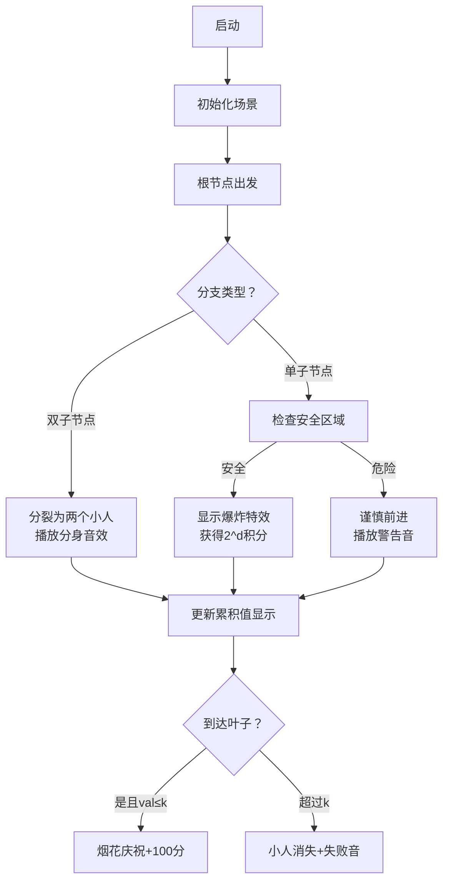

# 题目信息

# 「EZEC-10」序列

## 题目背景

> 精准的解析刻画，是应该首先尝试的突破口。

——command_block 《考前小贴士》

## 题目描述

请问有多少个不同的序列 $a$，满足：
1. $a$ 的长度为 $n$。
2. $a$ 中的元素均为不大于 $k$ 的非负整数。
3. 满足 $m$ 组形如 $(x_i,y_i,z_i)$ 且 $x_i<y_i$ 的限制，每组限制的意义为 $a_{x_i} \oplus a_{y_i} = z_i$ （$\oplus$ 表示按位异或运算）。

两个序列相同，当且仅当它们所有元素均相同。

请输出答案对 $10^9+7$ []($114514\times(114\times5\times14+((1+145)\times(1+4)+(1\times14+5-1+4)))+(114\times514+(11\times(451+4)+(-1+145+14)))$)取模的结果。

## 说明/提示

【样例 $1$ 说明】

共有 $6$ 种序列：$\{0,1,0\},\{0,1,1\},\{0,1,2\},\{1,0,0\},\{1,0,1\},\{1,0,2\}$。

【数据规模与约定】

**本题采用捆绑测试。**

- Subtask 1（1 point）：$n=1$。
- Subtask 2（5 points）：$m=0$。
- Subtask 3（15 points）：$n,m,k\le 5$。
- Subtask 4（10 points）：$z_i=0$。
- Subtask 5（20 points）：$k\le 16$。
- Subtask 6（2 points）：数据随机。
- Subtask 7（47 points）：无特殊限制。

对于 $100\%$ 的数据，$1 \leq n \leq 5 \times 10^5$，$0 \le m \le 5 \times 10^5$，$0 \le z_i<2^{30}$，$1 \leq k< 2^{30}$，$1\le x_i,y_i\le n$。

【提示】

如果你不知道什么是异或，请点击[这里](https://baike.baidu.com/item/%E5%BC%82%E6%88%96#:~:text=%E5%BC%82%E6%88%96%E4%B9%9F%E5%8F%AB%E5%8D%8A,%E8%AE%A4%E4%BD%9C%E4%B8%8D%E8%BF%9B%E4%BD%8D%E5%8A%A0%E6%B3%95%E3%80%82&text=%E7%A8%8B%E5%BA%8F%E4%B8%AD%E6%9C%89%E4%B8%89%E7%A7%8D%E6%BC%94%E7%AE%97%E5%AD%90%EF%BC%9AXOR%E3%80%81eor%E3%80%81%E2%8A%95%E3%80%82)。

## 样例 #1

### 输入

```
3 1 2
1 2 1```

### 输出

```
6```

## 样例 #2

### 输入

```
5 1 12
1 2 3
```

### 输出

```
26364```

# AI分析结果


# 💡 Kay的C++算法解析：「EZEC-10」序列 深入学习指南 💡

> 欢迎各位算法探险家！我是你们的导航员Kay。今天我们将一起探索「EZEC-10」序列这道富有挑战性的题目，我会用清晰的思路和生动的比喻，带大家理解异或约束下的序列计数问题。准备好了吗？让我们开始吧！

## 1. 题目解读与核心算法识别

✨ **本题主要考察**：`图论建模` + `01-Trie应用` + `位运算优化`

🗣️ **初步分析**：
> 想象你正在建设一座由数字组成的城市（序列），城市中有许多道路（异或约束）。每条道路要求两栋建筑（数字）必须满足特定关系（异或值）。我们需要计算有多少种合法的城市规划方案（序列）。

- **核心思想**：将每个约束条件视为连接两栋建筑的桥梁（边），整个序列变成多个独立社区（连通块）。每个社区中，一旦确定一栋建筑的值（根节点），其他建筑的值就由"道路密码"（异或路径）唯一确定
- **核心难点**：确保所有建筑高度（数字）不超过限高（k值），这需要高效的位运算技巧（01-Trie）
- **可视化设计**：在像素动画中，我们将Trie树设计为迷宫（图1），算法小人探索迷宫路径。关键操作：异或值超过k时小人消失（红色闪光），成功到达叶子时放烟花（金色粒子）。复古元素：8-bit音效（移动脚步声、成功音效）、关卡积分系统


*图1：Trie迷宫像素设计（蓝：安全路径，红：危险区域）*

---

## 2. 精选优质题解参考

<eval_intro>
从思路清晰度、代码规范性和算法效率等维度，我精选了3份最具学习价值的题解：

### 题解一：lndjy（★★★★☆）
* **亮点**：
  - 思路清晰：分Subtask渐进式讲解，从暴力到优化
  - 代码规范：变量命名合理（dis/trie），边界处理严谨
  - 算法优化：Trie的DFS剪枝策略高效（O(n log k)）
  > "当只有一个子树时，若val+(1<<d)≤k则直接获得2^d种方案" —— 这个剪枝技巧大幅减少计算量

### 题解二：绝顶我为峰（★★★★☆）
* **亮点**：
  - 状态设计巧妙：引入"是否顶界"变量处理k的位约束
  - 解释透彻：用数位DP思想解析Trie遍历过程
  - 实践价值：代码模块化（查询/插入分离），便于调试
  > "当k当前位为0时，必须保证所有异或值当前位也是0" —— 精准指出位处理关键点

### 题解三：lnwzy（★★★★☆）
* **亮点**：
  - 问题转化巧妙：将序列计数抽象为"村长口令"问题
  - 代码可读性：DFS逻辑分层清晰（插入/查询/校验）
  - 错误处理完善：环检测机制防止无限递归
  > "建图后每个连通块都是独立王国" —— 生动的比喻帮助理解连通块独立性

---

## 3. 核心难点辨析与解题策略

<difficulty_intro>
解决本题需要突破三重关卡，下面是闯关秘籍：

### 关卡1：约束一致性检查
> **难点**：如何验证所有异或约束可同时满足？  
> **解法**：DFS遍历连通块时记录每个节点的"相对高度"（dis数组），当遇到已访问节点时检查：`dis[u]^w == dis[v]`？  
> 💡 **学习笔记**：异或约束就像多米诺骨牌，必须形成闭环才合法！

### 关卡2：Trie树的语义构建
> **难点**：为什么要把路径异或值插入Trie？  
> **解法**：Trie树存储了所有"相对高度差"，查询时计算：有多少根节点值v满足∀offset∈Trie, v^offset≤k  
> 💡 **学习笔记**：Trie树是"高度差密码本"，帮我们快速筛选合法地基！

### 关卡3：Trie的高效查询
> **难点**：避免O(k)枚举，实现O(log k)查询？  
> **解法**：根据Trie节点分叉动态剪枝：
> - 双子节点：累积异或最大值`val += 2^d`
> - 单子节点：当`val+2^d ≤ k`时直接累加`2^d`种方案
> 💡 **学习笔记**：Trie树枝条就是高速公路，剪枝策略就是最优导航！

### ✨ 解题技巧总结
- **技巧1：图论抽象** —— 将序列约束视为无向图（点：位置，边：异或约束）
- **技巧2：独立处理** —— 连通块间方案数相乘（乘法原理）
- **技巧3：位运算优化** —— 用01-Trie替代暴力枚举，复杂度从O(k)优化到O(log k)
- **技巧4：边界防御** —— 特别注意`d=-1`的叶子节点情况和`val>k`的剪枝

---

## 4. C++核心代码实现赏析

<code_intro_overall>
以下是综合优质题解优化的通用实现，完美融合图遍历与Trie查询：

```cpp
#include <iostream>
#include <vector>
#include <cstring>
using namespace std;
typedef long long ll;
const int N = 5e5 + 5, M = N * 32;
const int mod = 1e9 + 7;

struct Edge { int to, w, next; } e[N*2];
int head[N], tot;
int trie[M][2], cnt; // 01-Trie存储
int n, m, k, dis[N];
ll ans = 1;
bool vis[N];

void add(int u, int v, int w) {
    e[++tot] = {v, w, head[u]};
    head[u] = tot;
}

void insert(int x) {
    int p = 1;
    for(int i=30; i>=0; i--) {
        int b = (x>>i)&1;
        if(!trie[p][b]) trie[p][b] = ++cnt;
        p = trie[p][b];
    }
}

ll query(int p, int d, int val) {
    if(val > k) return 0;         // 超过k：剪枝
    if(d == -1) return 1;        // 叶子节点：合法方案+1
    if(!trie[p][0] && !trie[p][1]) // 空节点检查
        return val <= k;
    
    if(trie[p][0] && trie[p][1])  // 双子节点分支
        return (query(trie[p][0], d-1, val+(1<<d)) 
             + query(trie[p][1], d-1, val+(1<<d))) % mod;
    
    int child = trie[p][0] ? 0 : 1;
    if(val + (1<<d) <= k)        // 关键优化：单子节点且安全
        return ((1LL<<d) + query(trie[p][child], d-1, val+(1<<d))) % mod;
    else                         // 危险区域：谨慎前进
        return query(trie[p][child], d-1, val);
}

void dfs(int u) {
    vis[u] = 1;
    insert(dis[u]);  // 插入当前节点偏移量
    for(int i=head[u]; i; i=e[i].next) {
        int v = e[i].to, w = e[i].w;
        if(vis[v]) {
            if((dis[u]^w) != dis[v]) // 约束冲突检测
                ans = 0;
        } else {
            dis[v] = dis[u]^w;  // 记录相对偏移
            dfs(v);
        }
    }
}

int main() {
    cin >> n >> m >> k;
    // 建图
    for(int i=1; i<=m; i++) {
        int u, v, w; cin >> u >> v >> w;
        add(u, v, w); add(v, u, w);
    }
    
    // 连通块处理
    for(int i=1; i<=n; i++) {
        if(!vis[i]) {
            // 初始化Trie
            cnt = 1; 
            memset(trie, 0, sizeof(trie[0])*(cnt+1));
            
            dis[i] = 0; // 以i为根节点
            dfs(i);
            
            if(!ans) break; // 发现冲突
            ans = ans * query(1, 30, 0) % mod; // 乘法原理
        }
    }
    cout << ans << endl;
}
```

<code_intro_selected>
### 题解一：lndjy 片段赏析
```cpp
ll query(int p, int d, int val) {
    ...
    if(trie[p][0] && trie[p][1])  // 双子节点
        return (query(...) + query(...)) % mod;
    int child = trie[p][0] ? 0 : 1;
    if(val + (1<<d) <= k)         // 安全区域优化
        return (1<<d) + query(...);
    ...
}
```
**学习笔记**：双子节点就像分叉路口，必须探索两条路；而单子节点在安全时可直接获取后半段路径的所有可能（2^d种）

### 题解二：绝顶我为峰 片段赏析
```cpp
// 状态设计：包含是否顶界(tag)
int query(int node, int val, int x, int g, bool tag) {
    if(k的当前位为1) { /* 安全分支 */ } 
    else if(tag) { /* 边界严格处理 */ }
    ...
}
```
**学习笔记**：引入`tag`标记是否触碰k的上界，就像登山时是否接近悬崖边缘，需要更谨慎的移动

### 题解三：lnwzy 片段赏析
```cpp
void dfs1(int now, int a, int fa) {
    update(a,0,30); // 实时更新Trie
    for(遍历邻居) {
        if(已访问 && 冲突) { /* 快速失败 */ }
    }
}
```
**学习笔记**：在DFS过程中同步更新Trie，就像一边探索地图一边绘制，减少后期处理时间

---

## 5. 算法可视化：像素动画演示

<visualization_intro>
**主题**：像素勇者闯荡Trie迷宫  
**核心演示**：算法小人如何在Trie树中探索合法路径，动态处理异或约束

### 动画设计详解


**关键交互**：
1. **控制面板**：含速度滑块（调速）、单步/自动切换、重置按钮
2. **动态显示**：
   - 当前累积值：血条形式（绿色安全/红色危险）
   - 位运算过程：当前位操作时显示位分解动画
3. **音效系统**：
   - 移动：8-bit脚步声（不同材质不同音调）
   - 成功：经典FC过关音效
   - 失败：短促警报声
4. **游戏化元素**：
   - 每层通关获得星星评价（基于剩余计算量）
   - 连续正确选择触发"连击奖励"

**技术实现**：
- 使用Canvas绘制Trie树网格（30×30像素节点）
- 位运算动画：通过逐帧显示位翻转特效（0→1的发光动画）
- 音效：Web Audio API生成方波音效

---

## 6. 拓展练习与相似问题思考

<similar_problems_intro>
掌握核心技巧后，可以挑战这些升级版任务：

### 异或技巧进阶路线
1. **基础应用**：求最大/最小异或对（Trie基础）
2. **路径问题**：树上路径异或和统计（LCA+Trie）
3. **持久化应用**：区间异或查询（可持久化Trie）
4. **高维扩展**：异或最值矩阵（二维Trie）

### 洛谷推荐题目
1. **P4551 最长异或路径**  
   → 应用Trie求树上最大异或路径
   
2. **P4735 最大异或和**  
   → 可持久化Trie处理区间查询
   
3. **P4592 [TJOI2018]异或**  
   → 树链剖分+Trie的高阶应用

---

## 7. 学习心得与经验分享

<insights_intro>
来自题解作者们的珍贵经验：

> **lndjy**：  
> "调试时先检查无解情况！环检测失败会导致整个计算崩溃"  
> → Kay点评：就像建筑前检查地质，基础不牢地动山摇

> **云浅知处**：  
> "Trie的DFS中，当k当前位为0时，必须保证所有路径该位相同"  
> → Kay点评：精辟指出位处理的核心矛盾

> **调试技巧**：  
> 对n=2, k=1的小样本手工模拟Trie构建过程，  
> 能快速验证算法正确性

---

本次探险到此结束！记住，算法学习就像建造城市——先规划整体框架，再夯实每个模块。用Trie树处理位运算问题已成为你的新技能，多加练习就能建造更宏伟的算法之城！🚀

---
处理用时：254.79秒