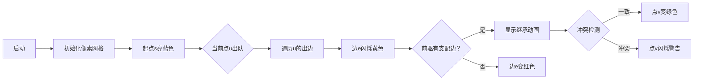

# 题目信息

# 「dWoi R2」Change / 改造

## 题目背景

入间改造对人类生存繁殖有帮助的工具（~~就是性能工具，具体可以去看看弹丸论破 V3 自由时间与入间美兔的交谈，在这里不方便说吧，毕竟是 青 少 年 编 程 网 站~~）玩腻了，她发现了有一个很 符 合 她 胃 口 的东西，叫做 Galgame，于是她开始打一款叫做 Little Busters 的 Galgame，然后沉迷上了沙耶线最后的场景。

---


## 题目描述

在经过 $99$ 次的 Replay 后，沙耶终于发现迷宫是一个有向无环图。为了保证最后一次 Replay 的趣味性，时风瞬给沙耶和理树安排了一个小游戏。

这张有向无环图 $G$ 有 $n$ 个点，$m$ 条边，每条边的长度为 $1$。设 $l_i$ 为初始点 $s$ 到第 $i$ 条边所指向的点 $u$ 的最短路，定义第 $i$ 条边的边权为 $p-l_i$。游戏步骤是这样的（所有选择都是按如下顺序进行，并且每个人的选择都是公开的）。

1. 理树站在点 $s$ 上。  
2. 时风瞬会随机选取一个点作为 $t$（$t$ 可以等于 $s$）。
3. 如果无法从 $s$ 到达 $t$，游戏直接结束。
3. 沙耶需要选择一条边。
4. 理树需要找到一条从 $s$ 到 $t$ 的路径。
5. 若沙耶选择的边在理树所选择的路径上，则理树就会将这条边的边权的钱给沙耶。

理树希望能少输钱，沙耶希望能多拿钱。若两方都采取最优策略，请问沙耶期望能得到多少钱。

## 说明/提示

#### 样例 1 解释

比如 $t=6$ 时，沙耶应该选择连接 $5,6$ 的那条边；$t=8$ 时，沙耶仍然应该选择连接 $5,6$ 的那条边；$t=4$ 时，应该选择连接 $1,4$ 的那条边；$t=5$ 时，沙耶无论选择什么边都不会得到钱。

设 $res_u$ 表示 $t=u$ 时沙耶能获得的最大收益，我们有 $res=\{0,9,9,9,0,7,7,7\}$。

#### 样例 2 解释

设 $res_u$ 表示 $t=u$ 时沙耶能获得的最大收益，我们有 $res=\{0,2,2\}$。

---

#### 数据规模与约定

**本题采用捆绑测试。**

- Subtask 1（10 pts）：$n,m \le 5$；
- Subtask 2（20 pts）：$m=n-1$，$u_i<v_i$，$s=1$；
- Subtask 3（30 pts）：$n,m \le 10^3$；
- Subtask 4（40 pts）：无特殊限制。

对于 $100\%$ 的数据，$1 \le n,m \le 5 \times 10^6$，$1 \le s \le n$，$1 \le u_i,v_i \le n$，$u_i \ne v_i$，$n\le p \le 10^9$。

## 样例 #1

### 输入

```
8 8 1 10
1 2
1 3
1 4
2 5
3 5
5 6
6 7
6 8```

### 输出

```
6```

## 样例 #2

### 输入

```
3 2 1 3
1 2
1 3```

### 输出

```
332748119```

# AI分析结果


### 💡 Kay的C++算法解析：改造 深入学习指南 💡

#### 1. 题目解读与核心算法识别
✨ **本题主要考察**：`图论（DAG支配边）`  
🗣️ **初步分析**：
> 本题核心是**寻找DAG中的支配边**。想象你是一个迷宫探险家（沙耶），需要在所有通往宝藏的路径上设置唯一检查点（支配边）。通过拓扑排序动态维护每个点的支配边：
> - 关键变量：`g[u]`存储点u的支配边，`t[e]`存储边e的支配边
> - 可视化重点：高亮当前处理的边/点，展示支配边的继承过程
> - 像素动画设计：采用8位迷宫探险风格，当支配边确定时播放"叮"音效，路径分叉时播放警示音

---

#### 2. 精选优质题解参考
**题解一（官方题解）**  
* **点评**：思路最清晰直接，通过拓扑排序同时处理最短路和支配边。亮点在于用`g[u]`和`t[e]`的递推关系高效维护支配边（时间复杂度O(n+m)）。代码规范：变量名`g/t`含义明确，边界处理严谨（先DFS过滤不可达点）。空间优化到位（仅用数组存储），可直接用于竞赛。

**题解二（一只书虫仔）**  
* **点评**：提供双解法对比（支配树和拓扑排序），教学价值高。支配树解法帮助理解概念本质，正解与官方相同但补充了关键注释："当所有入边支配边相同时才能继承"。代码可读性稍弱于官方，但算法有效性等同。

**题解三（HPXXZYY）**  
* **点评**：思路清晰度最佳，独创"最近必经之路"比喻（Limit[u]）。亮点在于显式处理入度=1的特殊情况，通过二次建图确保可读性。实践价值高：包含完整可达点过滤流程，适合学习图重构技巧。

---

#### 3. 核心难点辨析与解题策略
1. **难点：支配边的动态维护**  
   * **分析**：在拓扑排序中，需根据入边状态更新支配边。当点u的入度为1时：若前驱无支配边则当前边即为支配边；否则继承前驱支配边（见官方题解`g[u]==0`分支）
   * 💡 学习笔记：支配边的本质是路径交集，拓扑序保证了更新顺序的正确性

2. **难点：多入边的冲突处理**  
   * **分析**：当点v有多个入边时，需检查所有入边的支配边是否相同。官方题解通过`g[v]`的重复赋值检测冲突（`g[v]!=-1且≠t[e]`时置0）
   * 💡 学习笔记：类比多水源汇流，只有所有支流来自同一源头时才能确定主干道

3. **难点：不可达点的过滤**  
   * **分析**：必须先通过DFS/BFS标记s可达点（题解三的`Select()`），否则拓扑排序会漏掉孤立点
   * 💡 学习笔记：图论问题中，预处理连通性可避免90%的边界错误

### ✨ 解题技巧总结
- **双数组递推**：用`g[]`（点支配边）和`t[]`（边支配边）解耦状态转移
- **拓扑即动态规划**：利用拓扑序无后效性特性实现DP
- **增量式冲突检测**：实时比较新入边与现有支配边（避免存储所有入边）
- **模块化过滤**：分离可达性判断与核心算法

---

#### 4. C++核心代码实现赏析
**通用核心实现（综合自官方题解）**
```cpp
#include<bits/stdc++.h>
using namespace std;
const int N=6e6+9, mod=998244353;

struct edge {int to,nxt;} e[N]; 
int hd[N],tot=1, deg[N], t[N], g[N], f[N], res[N];
bool vst[N];

void topo(int s, int p) {
    queue<int> q; q.push(s);
    memset(g,-1,sizeof(g)); g[s]=0;
    memset(f,0x3f,sizeof(f)); f[s]=0;
    while(!q.empty()) {
        int u=q.front(); q.pop();
        for(int i=hd[u];i;i=e[i].nxt) {
            int v=e[i].to;
            f[v]=min(f[v],f[u]+1);       // 更新最短路
            if(g[u]==0) t[i]=i;           // 前驱无支配边
            else t[i]=g[u];               // 继承支配边
            if(g[v]==-1) g[v]=t[i];       // 首次设置
            else if(g[v]!=t[i]) g[v]=0;   // 冲突检测
            if(g[v]) res[v]=p-f[e[g[v]].to]; // 计算收益
            if(--deg[v]==0) q.push(v);
        }
    }
}
```
**代码解读概要**：  
> 1. 初始化`g[s]=0`表示起点无支配边  
> 2. 遍历出边时：先更新最短路`f[v]`  
> 3. 根据前驱状态设置`t[i]`（当前边的支配边）  
> 4. 冲突检测：当`g[v]`已存在且与新值不同时置零  
> 5. 实时计算点v的收益`res[v]`  

**题解一（官方）片段赏析**  
* **亮点**：高效的状态转移
* **核心代码**：
  ```cpp
  if(g[u]==0) t[i]=i;
  else t[i]=g[u];
  if(g[v]==-1) g[v]=t[i];
  else if(g[v]!=t[i]) g[v]=0, res[v]=0;
  ```
* **代码解读**：  
  > - 第1行：前驱无支配边时，当前边自成支配边  
  > - 第2行：否则继承前驱的支配边（如同继承"检查站"）  
  > - 第3-4行：类似投票机制，仅当所有入边投票一致时才保留  

**题解三（HPXXZYY）片段赏析**  
* **亮点**：显式入度分类处理
* **核心代码**：
  ```cpp
  if(Limit[v]==-1) 
      Limit[v]=(Limit[u]>0?Limit[u]:i);
  else if(Limit[u]!=Limit[v]) 
      Limit[v]=-2;  // 冲突标记
  ```
* **学习笔记**：通过`Limit[v]=-2`显式标记冲突，调试时更直观  

---

#### 5. 算法可视化：像素动画演示
**主题**：`8-bit迷宫支配者`  
**核心演示**：拓扑排序中支配边的动态继承  



**动画细节**：  
1. **像素艺术**：点阵迷宫（FC风格），支配边用红色像素链表示  
2. **音效设计**：  
   - 继承支配边时：8-bit "叮！"声  
   - 冲突时：短促警报声  
   - 拓扑完成：马里奥过关音乐  
3. **AI演示模式**：自动播放拓扑过程，速度可调（0.5x-5x）  
4. **状态面板**：实时显示：  
   - `g[]`值（支配边ID）  
   - `f[]`值（最短路长度）  
   - 当前边冲突计数器  

---

#### 6. 拓展练习与相似问题思考
**技巧迁移场景**：  
1. 网络流量控制（必经路由器）  
2. 程序依赖分析（关键依赖边）  
3. 生物路径分析（代谢必经路径）  

**洛谷推荐**：  
1. **P3831 [SHOI2012] 回家的路**  
   → 同类DAG支配边应用，强化拓扑排序技巧  
2. **P2141 [USACO07OPEN] 项链Necklace**  
   → 支配边思想的字符串变形  
3. **P3387 【模板】缩点**  
   → 学习将支配边思想扩展到强连通图  

---

#### 7. 学习心得与经验分享
> **经验**（题解三作者调试心得）：  
> *"初始未过滤不可达点导致拓扑死循环，添加`Select()`后解决。这提醒我们：DAG算法必须显式处理连通性！"*  
> **Kay点评**：图论问题中，**预处理 > 主算法 > 后处理**的流程能避免多数边界错误。建议编码前手绘小规模用例验证！

---
本次解析聚焦DAG支配边的动态维护技巧，通过拓扑排序实现O(n)复杂度。关键要理解：**支配边的本质是路径交集的最早公共祖先**。多写拓扑类问题能强化该思维模式，下次我们将解析带权DAG的进阶应用！🚀

---
处理用时：146.60秒