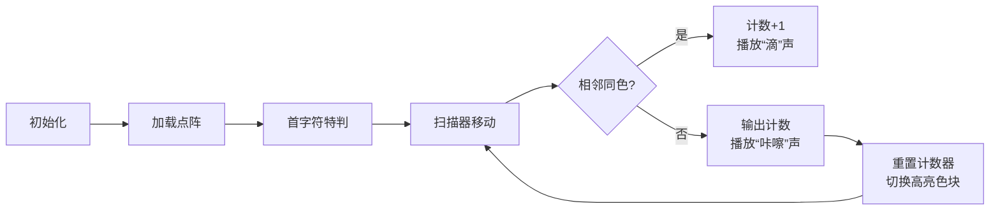

# 题目信息

# 压缩技术（续集版）

## 题目描述

设某汉字由 $N \times N$ 的 $\texttt 0$ 和 $\texttt 1$ 的点阵图案组成。

我们依照以下规则生成压缩码。连续一组数值：从汉字点阵图案的第一行第一个符号开始计算，按书写顺序从左到右，由上至下。第一个数表示连续有几个 $\texttt 0$，第二个数表示接下来连续有几个 $\texttt 1$，第三个数再接下来连续有几个 $\texttt 0$，第四个数接着连续几个 $\texttt 1$，以此类推……

例如: 以下汉字点阵图案：

```
0001000
0001000
0001111
0001000
0001000
0001000
1111111
```

对应的压缩码是： $\texttt {7 3 1 6 1 6 4 3 1 6 1 6 1 3 7}$ （第一个数是 $N$ ,其余各位表示交替表示0和1 的个数，压缩码保证 $N \times N=$ 交替的各位数之和）


## 说明/提示

数据保证，$3\leq N\leq 200$。

## 样例 #1

### 输入

```
0001000
0001000
0001111
0001000
0001000
0001000
1111111
```

### 输出

```
7 3 1 6 1 6 4 3 1 6 1 6 1 3 7```

# AI分析结果


### Kay的C++算法解析：压缩技术（续集版）深入学习指南

#### 1. 题目解读与核心算法识别
✨ **本题主要考察**：`模拟应用` (字符串连续段统计)  
🗣️ **初步分析**：  
> 解决本题的关键在于**模拟扫描过程**，就像用扫描仪逐行读取一张黑白像素图，并统计连续相同颜色的区块长度。  
> - **核心思路**：将点阵拼接成字符串，从左到右比较相邻字符：若相同则累加计数，若不同则输出当前计数并重置。
> - **难点处理**：  
>   - 首个字符特判：若首字符是'1'，需先输出0（表示0个'0'）  
>   - 末段处理：遍历结束后需输出最后一个连续段计数  
> - **可视化设计**：  
>   - 用**像素网格**动态显示点阵（0=白格，1=黑格）  
>   - **扫描指针**（发光方块）从左到右移动，遇颜色变化时：  
>     - 当前连续段高亮闪烁 + "咔嚓"音效  
>     - 侧边面板实时更新计数和输出序列  
>   - 复古元素：8-bit音效（计数更新=电子滴答声，段切换=经典FC音效）

---

#### 2. 精选优质题解参考
**题解一（volatile）**  
* **点评**：  
  思路直白清晰，直接拼接字符串后遍历相邻字符比较。亮点在于：  
  - **边界处理完善**：特判首字符'1'的场景 + 循环后补末段计数  
  - **代码简洁**：仅用`t`变量记录连续段长度，逻辑紧凑  
  - **实践友好**：输入处理用`while(cin>>a)`兼容多行，可直接用于竞赛  

**题解六（Ashankamiko）**  
* **点评**：  
  结构更模块化，独立处理首字符特判和主循环。亮点：  
  - **可读性优化**：用`cnt`替代`t`明确计数含义  
  - **安全遍历**：循环条件`i < s.size()`避免越界  
  - **鲁棒性强**：显式处理`n=1`的边界情况  

**题解三（cse071549）**  
* **点评**：  
  创新性通过计数总和反推`n`值。亮点：  
  - **数学思维应用**：利用`n² = ∑计数`特性求边长  
  - **动态存储**：用数组`k[]`暂存结果，适应大矩阵  
  - **经验提示**：作者强调"全WA时检查首字符特判"，极具调试参考价值  

---

#### 3. 核心难点辨析与解题策略
1. **难点1：首字符逻辑特判**  
   * **分析**：若首字符为'1'，需先输出0表示无连续'0'。优质解法均通过`if(s[0]=='1')`分支处理，确保压缩码以0计数起始。  
   * 💡 **学习笔记**：输入边界特判是模拟题的黄金法则  

2. **难点2：连续段切换判定**  
   * **分析**：核心在于比较`s[i]`与`s[i-1]`：  
     - 相等时计数累加（`count++`）  
     - 不等时输出计数并重置（`cout<<count; count=1;`）  
   * 💡 **学习笔记**：当前后元素关系决定行为时，**相邻比较法**是通用套路  

3. **难点3：末段遗漏预防**  
   * **分析**：循环结束后末段计数尚未输出。解法统一在循环外补`cout<<count`，避免"漏尾巴"错误。  
   * 💡 **学习笔记**：遍历类算法需**双重验证**（循环内处理变化+循环外收尾）  

### ✨ 解题技巧总结
- **技巧1：字符串化处理**  
  将二维点阵拼接为一维字符串，大幅简化扫描逻辑  
- **技巧2：计数器重置范式**  
  ```cpp
  if(当前元素 != 前元素) { 
    输出计数器; 
    计数器=1; // 新段从1开始
  } else 计数器++;
  ```
- **技巧3：边界模拟法**  
  手工验证`n=1`、全0/全1等极端案例  

---

#### 4. C++核心代码实现赏析
**通用核心实现**  
```cpp
#include <iostream>
#include <string>
using namespace std;

int main() {
    string s, row;
    cin >> row;          // 读首行
    s = row;
    int n = row.size();
    
    // 拼接剩余行
    for (int i = 1; i < n; i++) {
        cin >> row;
        s += row;
    }

    cout << n << " ";    // 输出矩阵边长
    
    // 特判首字符
    if (s[0] == '1') 
        cout << "0 ";

    int cnt = 1;         // 当前连续段长度
    for (int i = 1; i < n*n; i++) { 
        if (s[i] == s[i-1]) 
            cnt++;       // 连续则累加
        else {
            cout << cnt << " "; 
            cnt = 1;     // 重置计数器
        }
    }
    cout << cnt;         // 输出末段
    return 0;
}
```
**代码解读概要**：  
> 1. 读入首行确定边长`n`  
> 2. 拼接所有行到字符串`s`  
> 3. 特判首字符为'1'的场景  
> 4. 遍历字符串：相邻字符相同则计数累加，不同则输出并重置  
> 5. 循环外输出末段计数  

**题解一片段赏析**  
```cpp
if(b[0]!='0') cout<<"0 ";  // 首字符特判
for(int i=1; i<n*n; i++) {
    if(b[i]==b[i-1]) t++;  // 连续则累加
    else {
        cout<<t<<" ";      // 输出当前段
        t=1;               // 重置计数器
    }
}
cout<<t;                   // 末段输出
```
* **亮点**：用最简变量`t`实现核心逻辑  
* **学习笔记**：**计数器重置**是连续统计问题的核心范式  

**题解六片段赏析**  
```cpp
if (s[0] == '1') cout << "0 ";  // 更清晰的特判
for (int i = 1; i < s.size(); i++) 
    if (s[i-1] != s[i]) {
        cout << cnt << ' ';    
        cnt = 1;           // 严格从1开始计数
    } else cnt++;
```
* **亮点**：`s.size()`替代`n*n`增强可扩展性  
* **学习笔记**：**显式条件`(s[i-1]!=s[i])`** 比隐式比较更易调试  

**题解三片段赏析**  
```cpp
sum += p;              // 统计字符总数
k[++cnt]=p;            // 存储每段长度
if(a!=last) {          // 字符变化时
    cout << p << " ";  
    p = 0;             // 注意此处从0开始
}
```
* **亮点**：用`sum`反向推导`n=sqrt(sum)`  
* **学习笔记**：**数学性质挖掘**可开辟新解法路径  

---

#### 5. 算法可视化：像素动画演示
**主题**：`像素扫描编码器`（复古8-bit数据压缩模拟）  
**核心演示流程**：  


**动画关键帧**：  
1. **8-bit网格初始化**  
   - 200×200像素画布，每个格子渲染为16色像素方块（0=浅灰，1=深蓝）  
   - 顶部控制面板：`开始/暂停` `单步` `速度条` `重置`按钮（FC红白机风格）  

2. **扫描指针移动**  
   - 红色发光边框方块沿行顺序移动  
   - 当前连续段用半透明色块覆盖（0段=黄色，1段=青色）  

3. **状态变化反馈**  
   - **连续计数**：当前段计数实时显示在侧边栏 + 电子滴答声  
   - **段切换**：  
     - 旧段方块爆炸粒子特效（8-bit像素火花）  
     - 新段起始格闪烁三次 + FC经典“跳跃”音效  
   - **结果输出**：右侧面板滚动显示压缩码，最新项高亮  

4. **游戏化扩展**  
   - 每完成一行获得1枚像素星星⭐  
   - 全部完成后播放《超级玛丽》通关BGM  
   - 错误检测：若输出总和≠n²，触发警报音+网格闪烁  

---

#### 6. 拓展练习与相似问题思考
**技巧迁移场景**：  
1. 游程编码（RLE）压缩/解压  
2. 图像连通区域统计  
3. 基因序列连续碱基分析  

**洛谷练习推荐**：  
1. **P1319 压缩技术**  
   🗣️ 原版压缩码还原点阵，掌握编/解码双向思维  
2. **P1563 玩具谜题**  
   🗣️ 环形数组+方向模拟，强化相邻元素处理能力  
3. **P1205 方块转换**  
   🗣️ 二维矩阵旋转/镜像操作，进阶模拟训练  

---

#### 7. 学习心得与经验分享
> **经验摘录（题解三作者）**：  
> *"全WA时务必检查首字符特判——我因忽略首字符为'1'的情况调试半小时！"*  
>  
> **Kay点评**：  
> 此教训印证了**边界测试**的重要性，建议：  
> 1. 显式列出特殊用例（如全1矩阵、单元素矩阵）  
> 2. 在关键分支添加调试输出（`cout<<"DEBUG: flag="<<flag;`）  

---

### 结语  
掌握连续段统计的关键在于**相邻比较+计数器管理**，配合像素动画的直观演示，相信大家能深刻理解游程编码的奥妙！下次遇到图像处理或字符串压缩问题时，不妨回想这个会发光的小扫描仪哦~ 🎮💻

---
处理用时：235.84秒