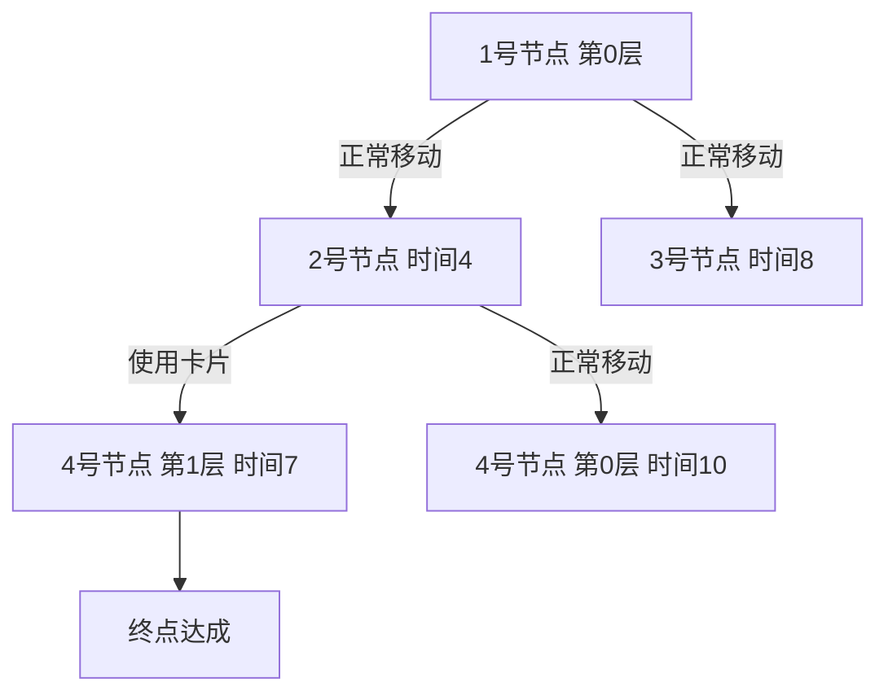

# 题目信息

# [BJWC2012] 冻结

## 题目背景

“我要成为魔法少女！”

“那么，以灵魂为代价，你希望得到什么？”

“我要将有关魔法和奇迹的一切，封印于卡片之中„„”

在这个愿望被实现以后的世界里，人们享受着魔法卡片（SpellCard，又名符卡）带来的便捷。

现在，不需要立下契约也可以使用魔法了！你还不来试一试？

比如，我们在魔法百科全书（Encyclopedia of Spells）里用“freeze”作为关键字来查询，会有很多有趣的结果。

例如，我们熟知的 Cirno，她的冰冻魔法当然会有对应的 SpellCard 了。当然，更加令人惊讶的是，居然有冻结时间的魔法，Cirno 的冻青蛙比起这些来真是小巫见大巫了。

这说明之前的世界中有很多魔法少女曾许下控制时间的愿望，比如 Akemi Homura、Sakuya Izayoi、……

当然，在本题中我们并不是要来研究历史的，而是研究魔法的应用。

## 题目描述

我们考虑最简单的旅行问题吧： 现在这个大陆上有 $N$ 个城市，$M$ 条双向的道路。城市编号为 $1$ ~ $N$，我们在 $1$ 号城市，需要到 $N$ 号城市，怎样才能最快地到达呢？

这不就是最短路问题吗？我们都知道可以用 Dijkstra、Bellman-Ford、Floyd-Warshall等算法来解决。

现在，我们一共有 $K$ 张可以使时间变慢 50%的 SpellCard，也就是说，在通过某条路径时，我们可以选择使用一张卡片，这样，我们通过这一条道路的时间 就可以减少到原先的一半。需要注意的是：

1. 在一条道路上最多只能使用一张 SpellCard。
2. 使用一张SpellCard 只在一条道路上起作用。
3. 你不必使用完所有的 SpellCard。

给定以上的信息，你的任务是：求出在可以使用这不超过 $K$ 张时间减速的 SpellCard 之情形下，从城市 $1$ 到城市 $N$ 最少需要多长时间。

## 说明/提示

#### 样例 1 解释

在不使用 SpellCard 时，最短路为 $1 \to 2 \to 4$，总时间为 10。现在我们可以使用 1 次 SpellCard，那么我们将通过 $2 \to 4$ 这条道路的时间减半，此时总时间为7。

#### 数据规模与约定

对于 $100\%$ 的数据，保证：

- $1 \leq K \leq N \leq 50$，$M \leq 10^3$。
- $1 \leq A_i,B_i \leq N$，$2 \leq Time_i \leq 2 \times 10^3$。
- 为保证答案为整数，保证所有的 $Time_i$ 均为偶数。
- 所有数据中的无向图保证无自环、重边，且是连通的。

## 样例 #1

### 输入

```
4 4 1 
1 2 4 
4 2 6 
1 3 8 
3 4 8 
```

### 输出

```
7```

# AI分析结果


# 💡 Kay的C++算法解析：[BJWC2012]冻结 深入学习指南 💡

## 1. 题目解读与核心算法识别

✨ **本题主要考察**：`分层图最短路` (图论最短路变种)

🗣️ **初步分析**：
> 解决"冻结"这道题的关键在于理解并运用**分层图最短路**技术。想象你有K+1个平行世界（层），每个世界都有一份相同的城市地图。当你使用一张SpellCard时，就像打开一扇传送门进入下一个世界，在那条路上时间减半。在本题中，分层图用于高效处理K次道路时间减半的操作。

- 核心思路：通过复制K+1层图，层内保持原边权，层间边权减半，将卡片使用次数转化为空间维度
- 难点：状态表示（节点+卡片使用次数）、状态转移（使用/不使用卡片）、空间优化
- 可视化设计：像素网格中不同颜色层表示不同卡片使用次数，实线箭头表示正常移动（层内），虚线箭头表示使用卡片（层间），高亮当前节点和更新状态

## 2. 精选优质题解参考

**题解一（Isprime）**
* **点评**：思路清晰，图解分层图构建（节点映射公式：`新节点=原节点+层数*N`），代码规范（Dijkstra堆优化），变量命名合理（head/dis等）。算法时间复杂度O((N*K)log(N*K))完全可行，边界处理严谨（dis初始化INF），可直接用于竞赛。

**题解二（D_14134）**
* **点评**：解释分层图核心思想深入（拆点表示状态），代码可读性好（vector存图+SPFA），提供相似题目（飞行路线/改造路）。SPFA在本题小数据规模下可行，实践时注意稠密图可能稍慢于Dijkstra。

**题解三（communist）**
* **点评**：独特提供DP解法（二维状态数组），对比分层图优势（空间优化）。代码结构清晰（双解法实现），状态转移推导完整（分使用/不使用卡片情况）。DP方法省去显式建图空间，更易理解状态变化。

## 3. 核心难点辨析与解题策略

1. **状态表示困难**
   * **分析**：如何同时记录位置和卡片使用次数？分层图通过节点映射（u+k*N），DP通过二维数组dp[u][k]
   * 💡 **学习笔记**：状态设计是优化问题的核心，将操作次数转化为空间维度

2. **状态转移推导**
   * **分析**：分使用/不使用卡片两种情况：
     - 不使用：dp[v][k] = min(dp[v][k], dp[u][k] + w)
     - 使用：dp[v][k+1] = min(dp[v][k+1], dp[u][k] + w/2)
   * 💡 **学习笔记**：转移方程体现"无后效性"原则，当前状态仅依赖前驱状态

3. **空间与效率平衡**
   * **分析**：分层图需O(N*K)节点，DP需O(N*K)空间但免去建图开销
   * 💡 **学习笔记**：小规模数据（N,K≤50）两种方法均可，大规模数据优先DP

### ✨ 解题技巧总结
- **状态分解**：将"位置+操作次数"组合为二维状态
- **分层思想**：特殊操作转化为维度跳跃（层间移动）
- **边界处理**：起点状态初始化（dis[1][0]=0），终点状态取min
- **算法选择**：优先Dijkstra堆优化（稳定），SPFA适合随机图

## 4. C++核心代码实现赏析

**本题通用核心实现参考**
```cpp
#include <iostream>
#include <queue>
#include <cstring>
using namespace std;
const int MAXN = 3000, MAXM = 100000; // N,K<=50 → 节点数≤2550

struct Edge { int to, next, w; } edge[MAXM];
int head[MAXN], dis[MAXN], cnt, n, m, K;
bool vis[MAXN];

void add(int u, int v, int w) {
    edge[++cnt] = {v, head[u], w};
    head[u] = cnt;
}

void dijkstra() {
    memset(dis, 0x3f, sizeof(dis));
    priority_queue<pair<int, int>> pq; // (-dis, node)
    dis[1] = 0; pq.push({0, 1});
    
    while (!pq.empty()) {
        int u = pq.top().second; pq.pop();
        if (vis[u]) continue;
        vis[u] = true;
        for (int i = head[u]; i; i = edge[i].next) {
            int v = edge[i].to, w = edge[i].w;
            if (dis[v] > dis[u] + w) {
                dis[v] = dis[u] + w;
                pq.push({-dis[v], v});
            }
        }
    }
}

int main() {
    cin >> n >> m >> K;
    // 建图：层内边(正常权) + 层间边(半权)
    while (m--) {
        int u, v, w; cin >> u >> v >> w;
        for (int k = 0; k <= K; k++) {
            int u_k = u + k*n, v_k = v + k*n;
            add(u_k, v_k, w); add(v_k, u_k, w);
            if (k < K) { // 层间连接
                add(u_k, v + (k+1)*n, w/2);
                add(v_k, u + (k+1)*n, w/2);
            }
        }
    }
    dijkstra();
    int ans = 0x3f3f3f3f;
    for (int k = 0; k <= K; k++)
        ans = min(ans, dis[n + k*n]);
    cout << ans << endl;
}
```

**题解一（Isprime）片段赏析**
```cpp
for (int j = 0; j <= K; j++) {
    add(j*n + u, j*n + v, w);  // 层内正常边
    add(j*n + v, j*n + u, w);
}
for (int j = 0; j < K; j++) {
    add(j*n + u, (j+1)*n + v, w/2);  // 层间半权边
    add(j*n + v, (j+1)*n + u, w/2);
}
```
* **亮点**：简洁直观的层内/层间建图逻辑
* **代码解读**：第一循环建同层双向边，第二循环建跨层减半边。节点映射公式`j*n+u`实现多维状态压缩
* 💡 **学习笔记**：分层图本质是状态空间的维度扩展

**题解三（communist）DP实现**
```cpp
// 核心转移逻辑 (SPFA中)
if (dis[v][k] > dis[u][k] + w) {  // 不使用卡片
    dis[v][k] = dis[u][k] + w;
    q.push({v, k});
}
if (k < K && dis[v][k+1] > dis[u][k] + w/2) {  // 使用卡片
    dis[v][k+1] = dis[u][k] + w/2;
    q.push({v, k+1});
}
```
* **亮点**：避免显式建多层图，空间效率更优
* **代码解读**：二维状态数组`dis[u][k]`直接存储位置+卡片状态，转移分两种情况
* 💡 **学习笔记**：DP思想将分层图隐式化，是空间优化的有效手段

## 5. 算法可视化：像素动画演示

**主题**：像素探险家在分层城市中使用时间冻结魔法

**设计思路**：
- **8位像素风格**：FC红白机色调，每层不同底色（0层绿/1层蓝/2层紫）
- **动态元素**：
  - 节点：像素方块（带编号），显示当前最短时间
  - 实线箭头：层内移动（正常边权）
  - 虚线箭头：层间跳跃（使用卡片，半权）
  - 高亮闪烁：当前访问节点和更新状态
- **音效设计**：
  - 移动：电子"滴"声
  - 使用卡片：冻结"叮"声
  - 到达终点：胜利旋律

**关键帧流程**：


**技术实现**：
1. Canvas绘制50x50网格，节点固定位置
2. 动画循环：
   - 步进模式：暂停等待用户输入
   - 自动模式：计时器推进（速度可调）
3. 状态同步：显示当前层数/已用卡片数

## 6. 拓展练习与相似问题思考

**通用技巧迁移**：
分层图适用于各类"操作次数限制"的最短路问题：
1. 边权归零（飞行路线）
2. 边权减半（本题）
3. 反向通行（道路改建）

**推荐练习**：
1. **P4568 [JLOI2011]飞行路线**  
   🗣️ 分层图经典应用，K次免费边，巩固层间边权为0的场景
   
2. **P2939 [USACO09FEB]改造路**  
   🗣️ 双倍经验，相同分层逻辑，练习大图处理技巧

3. **P1948 [USACO08JAN]Telephone Lines**  
   🗣️ 变形挑战，需结合二分答案+分层图，提升思维灵活性

## 7. 学习心得与经验分享

**作者洞见**：
> "分层图的关键在于将操作次数转化为空间维度" —— Isprime  
> "DP实现省去显式建图，调试时打印状态数组超有用" —— communist  
> "想象成闯关游戏，每用一次卡片就进入新世界" —— D_14134

**调试技巧**：
1. 小数据测试（如样例4节点）
2. 打印状态转移表（dp[i][k]值）
3. 边界检查（K=0/最大K情况）

---

本次算法解析就到这里！分层图技术是处理操作限制类最短路问题的利器，记住核心是"状态维度扩展"。多练习相似题目，你也能成为最短路大师！🚀  

> "看似复杂的算法，拆解后都是基础思想的组合" —— Kay  
> 保持好奇，继续探索，下次见！ ✨

---
处理用时：261.41秒