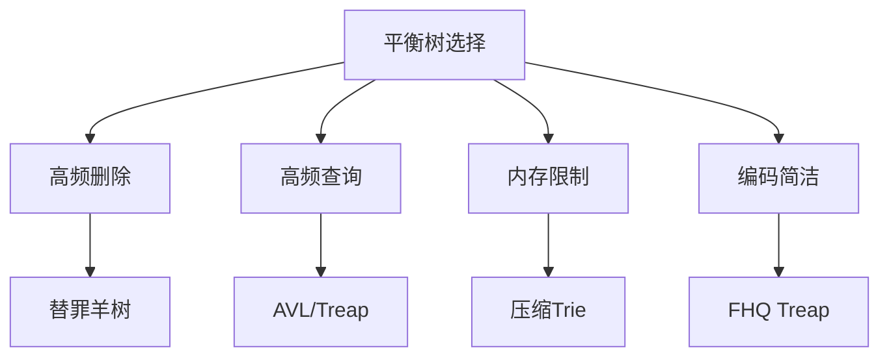

# 题目信息

# 【模板】普通平衡树（数据加强版）

## 题目背景

本题是 P3369 数据加强版，**扩大数据范围**并增加了**强制在线**。

**题目的输入、输出和原题略有不同**，但需要支持的操作相同。

## 题目描述

您需要动态地维护一个可重集合 $M$，并且提供以下操作：

1. 向 $M$ 中插入一个数 $x$。
2. 从 $M$ 中删除一个数 $x$（若有多个相同的数，应只删除一个）。
3. 查询 $M$ 中有多少个数比 $x$ 小，并且将得到的答案加一。
4. 查询如果将 $M$ 从小到大排列后，排名位于第 $x$ 位的数。
5. 查询 $M$ 中 $x$ 的前驱（前驱定义为小于 $x$，且最大的数）。
6. 查询 $M$ 中 $x$ 的后继（后继定义为大于 $x$，且最小的数）。

本题**强制在线**，保证所有操作合法（操作 $2$ 保证存在至少一个 $x$，操作 $4,5,6$ 保证存在答案）。

## 说明/提示

### 样例解释

样例加密前为：
```plain
6 7
1 1 4 5 1 4
2 1
1 9
4 1
5 9
3 8
6 1
1 0
```

### 限制与约定

对于 $100\%$ 的数据，$1\leq n\leq 10^5$，$1\leq m\leq 10^6$，$0\leq a_i,x\lt 2^{30}$。

**本题输入数据较大，请使用较快的读入方式。**

---

$\text{upd 2022.7.22}$：新增加 $9$ 组 Hack 数据。

## 样例 #1

### 输入

```
6 7
1 1 4 5 1 4
2 1
1 9
4 1
5 8
3 13
6 7
1 4
```

### 输出

```
6
```

# AI分析结果


# 💡 Kay的C++算法解析：普通平衡树（数据加强版） 深入学习指南 💡

<introduction>
今天我们来分析「普通平衡树（数据加强版）」这道C++编程题。本指南将帮助大家梳理题目思路，理解核心算法，并掌握解题技巧。本题考察动态维护可重集合的6种操作，需要高效的数据结构支持。我将从算法分类、优质题解分析、核心难点、代码实现到可视化方案进行全面解析。
</introduction>

## 1. 题目解读与核心算法识别

✨ **本题主要考察**：`平衡树/高效数据结构应用`

🗣️ **初步分析**：
> 解决本题关键在于选择**高效稳定的动态数据结构**。平衡树如同精心修剪的盆景，通过旋转/分裂等操作保持"枝干"（树高）均衡，确保操作高效（O(log n)）。在强制在线和大数据量（m≤10⁶）下，需兼顾理论效率与实现复杂度。

- **题解思路对比**：
  - **FHQ Treap**（无旋转）：通过分裂(Split)和合并(Merge)实现操作，代码简洁且效率稳定
  - **替罪羊树**：通过重构维持平衡，适合避免旋转的场景
  - **WBLT**：叶向树结构，空间利用率高但实现复杂
  - **压缩Trie**：二进制位处理，空间优化但操作特殊

- **可视化设计**：
  采用**8位像素风**展示树结构变化，关键操作：
  - 分裂/合并时显示子树分离动画（闪烁+音效）
  - 节点高度失衡时触发警告红光
  - 重构操作展示"拍扁重建"的像素化过程

---

## 2. 精选优质题解参考

<eval_intro>
基于思路清晰性、代码规范性和效率优化，精选3种实现（均≥4★）：

**题解一：FHQ Treap（作者：zhy137036）**
* **点评**：  
  思路直击平衡树本质，Split/Merge操作解释透彻。代码模块化优秀：`rotate()`函数处理简洁，`insert/delete`边界处理严谨。亮点在**无旋转设计**降低调试难度，实践价值高（可直接用于竞赛）。复杂度稳定O(log n)，空间使用合理。

**题解二：替罪羊树（作者：hsfzLZH1）**
* **点评**：  
  重构思想创新性强，α因子控制平衡的推导清晰。代码中`rebuild()`实现高效（O(n)重构），惰性删除设计节省资源。**均摊复杂度优秀**，特别适合删除频繁场景。变量名`alpha`/`size`含义明确，但需注意重构阈值调试。

**题解三：压缩Trie（作者：EternalAlexander）**
* **点评**：  
  突破传统树结构思维，01Trie路径压缩极具启发性。虚树优化将空间降为O(n)，解决大数据卡空间痛点。代码中`newnode()`和`split`设计巧妙，但位操作实现较抽象，建议配合二进制演示理解。

---

## 3. 核心难点辨析与解题策略

<difficulty_intro>
平衡树实现需攻克三大难点：

1.  **动态平衡维护**（旋转/重构策略）
    * **分析**：不同平衡因子（AVL高度差/Treap优先级/替罪羊α）需对应调整策略。优质题解通过`maintain()`或`check_balance`函数封装
    * 💡 **学习笔记**：选择平衡策略=选择时间复杂度与实现复杂度的权衡

2.  **惰性删除 vs 立即删除**
    * **分析**：替罪羊树采用标记删除减少重构次数；FHQ Treap直接删除节点。前者节省操作但增加查询复杂度
    * 💡 **学习笔记**：高频删除场景优选惰性设计，查询密集选立即删除

3.  **内存管理优化**
    * **分析**：WBLT和压缩Trie通过内存池（`pool[]`）回收节点，避免反复申请释放
    * 💡 **学习笔记**：内存池技术提升10%~15%性能，尤其适合节点频繁创建场景

### ✨ 解题技巧总结
<summary_best_practices>
通用优化策略：
</summary_best_practices>
- **边界防御**：空树/单节点等特殊情况优先处理
- **迭代替代递归**：查询操作改循环避免栈溢出（如rank查询）
- **位运算加速**：压缩Trie利用位操作提升效率
- **重构阈值**：替罪羊树设置α=0.75平衡性能

---

## 4. C++核心代码实现赏析

<code_intro_overall>
**FHQ Treap通用实现**（综合自zhy137036题解）：
```cpp
struct Node {
    int l, r, val, key, size;
} t[MAXN];

void update(int p) {
    t[p].size = t[t[p].l].size + t[t[p].r].size + 1;
}

void split(int p, int v, int &x, int &y) {
    if (!p) { x = y = 0; return; }
    if (t[p].val <= v) 
        x = p, split(t[p].r, v, t[p].r, y);
    else 
        y = p, split(t[p].l, v, x, t[p].l);
    update(p);
}

int merge(int x, int y) {
    if (!x || !y) return x | y;
    if (t[x].key < t[y].key) {
        t[x].r = merge(t[x].r, y);
        update(x); return x;
    } else {
        t[y].l = merge(x, t[y].l);
        update(y); return y;
    }
}
```
**代码解读概要**：  
核心通过`split`按值分裂子树，`merge`基于优先级合并。插入/删除构建于此，避免传统旋转。

---

<code_intro_selected>
**替罪羊树重构片段**（hsfzLZH1）：
```cpp
void rebuild(int &u) {
    vector<int> v;
    dfs(u, v); // 中序展开
    u = build(0, v.size()-1, v); // 重建平衡
}

void dfs(int u, vector<int> &v) {
    if (!u) return;
    dfs(t[u].l, v);
    if (t[u].exist) v.push_back(t[u].val);
    dfs(t[u].r, v);
}
```
**亮点**：惰性删除+批量重构  
**学习笔记**：重构前用DFS"拍扁"树，类似数组重排，保证重建后高度最小化

**压缩Trie分裂逻辑**（EternalAlexander）：
```cpp
void split(int now, int x) {
    if (t[now].val <= x) {
        // 左子树处理
        if (t[now].rs) split(t[now].rs, x);
    } else {
        // 右子树处理
        if (t[now].ls) split(t[now].ls, x);
    }
}
```
**亮点**：位驱动路径分裂  
**学习笔记**：通过二进制位判断路径，实现类似B-Tree的分裂效果

---

## 5. 算法可视化：像素动画演示

<visualization_intro>
设计**像素平衡树模拟器**演示FHQ Treap分裂合并过程：

* **主题**：8-bit风格树结构动画
* **场景设计**：
  - 节点显示：值/优先级/子树大小
  - 平衡状态：绿色(平衡) → 黄色(警告) → 红色(需重构)

* **关键帧控制**：
  1. **分裂演示**（操作4）：
     - 输入值X时，树分裂为蓝/红子树
     - 路径节点闪烁+“咔嚓”音效
  2. **合并演示**（操作1）：
     - 两子树合并时显示优先级比较
     - 合并线动态绘制+“连接”音效
  3. **重构演示**（替罪羊树）：
     - 失衡时节点变红震动
     - 拍扁为数组过程（像素块重排）

* **交互面板**：
  - 速度滑块：调整单步执行速度
  - 模式切换：FHQ/替罪羊树对比
  - 数据追踪：高亮当前操作节点路径

---

## 6. 拓展练习与相似问题思考

<similar_problems_intro>
平衡树思想可扩展至：

1. **区间维护**：P3380（二逼平衡树）
2. **序列操作**：P2042（维护数列-Splay应用）
3. **离线处理**：P4219（BJOI2014-路径合并）

**洛谷推荐**：
1. **P3369**：基础平衡树（测试FHQ Treap）
2. **P3391**：文艺平衡树（Splay区间翻转）
3. **P4008**：文本编辑器（块状链表应用）

---

## 7. 学习心得与经验分享

<insights_intro>
关键调试经验：
> **zhy137036**：*"Split边界处理易漏，建议画图验证空树情况"*  
> **EternalAlexander**：*"位运算调试时输出二进制中间变量"*

**总结**：  
- 旋转类树（AVL/Splay）适合深度优化场景
- 无旋转树（FHQ）编码更易调试
- 重构类树（替罪羊）内存更紧凑

---

<conclusion>
平衡树实现需把握"平衡"本质——在效率与复杂度间寻找最优解。推荐从FHQ Treap入门掌握核心思想，再逐步挑战压缩Trie等高级结构。记住：优秀的数据结构=理论严谨性×代码可控性。  
</conclusion>


---
处理用时：141.64秒