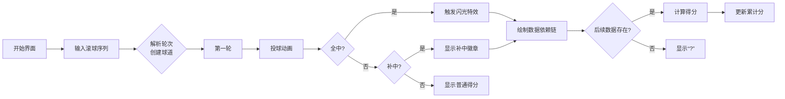

# 题目信息

# 打保龄球

## 题目描述

打保龄球是用一个滚球去打击十个站立的柱，将柱击倒。一局分十轮，每轮可滚球一次或多次，以击倒的柱数为依据计分。一局得分为十轮得分之和，而每轮的得分不仅与本轮滚球情况有关，还可能与后续一两轮的滚球情况有关。即某轮某次滚球击倒的柱数不仅要计入本轮得分，还可能会计入前一两轮得分。具体的滚球击柱规则和计分方法如下：

1. 若某一轮的第一次滚球就击倒全部十个柱，则本轮不再滚球（若是第十轮则还需另加两次滚球，不妨称其为第十一轮和第十二轮，并不是所有的情况都需要滚第十一轮和第十二轮球）。该轮得分为本次击倒柱数 $10$ 与以后两次滚球所击倒柱数之和。

2. 若某一轮的第一次滚球未击倒十个柱，则可对剩下未倒的柱再滚球一次。如果这两次滚球击倒全部十个柱，则本轮不再滚球（若是第十轮则还需另加一次滚球），该轮得分为这两次共击倒柱数 $10$ 与以后一次滚球所击倒柱数之和。

3. 若某一轮两次滚球未击倒全部十个柱，则本轮不再继续滚球，该轮得分为这两次滚球击倒的柱数之和。   

总之，若―轮中一次滚球或两次滚球击倒十个柱，则本轮得分是本轮首次滚球开始的连续三次滚球击倒柱数之和（其中有一次或两次不是本轮滚球）。若一轮内二次滚球击倒柱数不足十个，则本轮得分即为这两次击倒柱数之和。下面以实例说明如下(字符 `/` 表示击倒当前球道上的全部的柱)：

| 轮 | 1 | 2 | 3 | 4 | 5 | 6 | 7 | 8 | 9 | 10 | 11 | 12 |
| :-----------: | :-----------: | :-----------: | :-----------: | :-----------: | :-----------: | :-----------: | :-----------: | :-----------: | :-----------: | :-----------: | :-----------: | :-----------: |
| 击球情况  |  /  |  /  |  /  |  72 |  9/ |  81  | 8/  |  / |   9/  |  /  |  8/ |
| 各轮得分 |  30  | 27  | 19 |  9   |18   | 9  | 20  | 20 |  20 |  20|
|累计总分 |  30  | 57  |76 |  85|  103 |  112 | 132  |152 | 172 | 192|

现在请你编写一个保龄球实时计分程序，用来计算和显示某轮结束后的得分情况。若某轮的得分暂时无法算出，则**不显示**该轮得分（不输出）。


## 样例 #1

### 输入

```
/ / / 72 9/ 81 8/ / 9/ / 8/```

### 输出

```
30 27 19 9 18 9 20 20 20 20 
30 57 76 85 103 112 132 152 172 192```

# AI分析结果


# 💡 Kay的C++算法解析：打保龄球 深入学习指南 💡

## 1. 题目解读与核心算法识别

✨ **本题主要考察**：`模拟应用`与`条件逻辑处理`

🗣️ **初步分析**：
> 保龄球计分问题就像在玩一款复古像素保龄球游戏——每次滚球都是独立的"攻击动作"，而特殊攻击（全中/补中）会触发"连击奖励"机制。核心挑战在于实时计算得分时，当前轮的分数可能需要"预读"后续球的数据，就像游戏中的连击系统需要预判后续动作才能结算分数。  

- **核心难点**：全中/补中的得分依赖于后续滚球数据，若数据不足则无法计算当前轮得分  
- **解决方案**：遍历滚球记录，根据规则分类处理三种得分情况，并实时检查数据完整性  
- **可视化设计**：采用8位像素风格展示球道和滚球动画，关键操作（全中/补中）触发闪光特效，数据不足时显示"？"符号，用进度条直观展示当前计算轮次  

---

## 2. 精选优质题解参考

**题解一：袁宇轩（赞15）**
* **点评**：采用分层模拟策略，用`rest`变量动态追踪剩余瓶数，`flag`标记是否全倒。亮点在于用`st`记录每轮起点位置，通过`st++`或`st+=2`实现轮次跳跃，逻辑如保龄球瓶般简洁精准。边界处理严谨（如`j>n`时立即跳出），代码可读性极佳，变量命名清晰(`rest`/`flag`/`st`)，是可直接用于竞赛的工业级实现。

**题解二：wuyixiang（赞11）**
* **点评**：创新性地扩展输入轮次(`lun++`)，建立`c[i][1]`和`c[i][2]`存储每轮两次投掷。最大亮点是特判数据缺失的`break`机制，如全中时检查`c[i+1][1]==-1`，像游戏关卡检测道具不足时自动中断。代码结构如像素游戏关卡般层次分明，注释详尽，但变量命名可更直观。

**题解三：深海鱼的眼泪（赞3）**
* **点评**：独创"滚球记录预存储"机制，用`df[i][j]`记录每球细节，`y[i][j]`标记数据存在性。亮点在于全中时动态检查后续两次投掷存在性(`y[i+1][1]`和`y[i+2][1]`)，如同游戏中的连击条件检测。虽然变量命名较抽象，但算法健壮性极强，完整覆盖击倒0瓶的特殊情况。

---

## 3. 核心难点辨析与解题策略

1. **规则映射与状态转换**  
   * **分析**：三种得分规则需转化为条件分支。优质解法则用`if(全中)/else if(补中)/else`三叉结构，配合`rest`(剩余瓶数)和`flag`(是否全倒)进行状态追踪，如袁宇轩解法中`rest=10`重置象征新回合开始  
   * 💡 **学习笔记**：将文字规则转化为机器可执行的状态机是模拟题核心  

2. **数据依赖与中断处理**  
   * **分析**：当需要后续数据时（如全中需后两球数据），若数据不存在则应立即中断。wuyixiang解法中`if(sco[i+1]==-1)break;`如同游戏关卡中道具不足时的暂停机制  
   * 💡 **学习笔记**：数据依赖链断裂时及时中断是避免无效计算的关键  

3. **输入解析与轮次划分**  
   * **分析**：输入字符串含空格和`/`符号，需转换数字并划分轮次。深海鱼的眼泪解法采用`zl`(总轮数)和`l`(当前轮投球次)双重指针，遇到`/`时`zl++`实现轮次跃迁  
   * 💡 **学习笔记**：轮次计数器需配合投球结果动态更新  

### ✨ 解题技巧总结
- **预判中断法**：在计算当前轮前先检查后续数据可用性，避免无效计算  
- **双指针轮转**：用独立指针追踪总轮次和当前轮进度，解决变长轮次问题  
- **状态标记法**：通过`rest`、`flag`等变量显式记录状态，替代隐式逻辑判断  

---

## 4. C++核心代码实现赏析

**本题通用核心C++实现参考**  
```cpp
#include <iostream>
using namespace std;

int main() {
    string s;
    int n = 0, st = 1, score[11] = {0};
    char a[100];
    while (cin >> a[++n]); // 读入所有滚球记录

    for (int round = 1; round <= 10; round++) {
        int rest = 10, flag = 1, valid = 1;
        // 模拟本轮滚球（最多三次投掷）
        for (int j = st; j <= st + 2; j++) {
            if (j > n) { valid = 0; break; } // 数据不足
            if (a[j] == '/') { 
                score[round] += rest; 
                rest = 0; 
            } else if (isdigit(a[j])) {
                int pins = a[j] - '0';
                score[round] += pins;
                rest -= pins;
            }
            if (!rest) { rest = 10; flag = 0; } // 全倒重置
            if (j == st + 2 && flag) break; // 常规轮结束
        }
        if (!valid) break; // 无法计算后续轮次
        // 更新轮次起点（全中跳1次，否则跳2次）
        st = (a[st] == '/') ? st + 1 : st + 2;
        cout << score[round] << " ";
    }
    // 输出累计得分（略）
}
```

**题解一核心片段**  
```cpp
for (int j = st; j <= st + 2; j++) {
    if (j > n) { sum[i] = -1; break; } // 边界检查
    if (rest == 0) rest = 10, flag = 0; // 全倒重置
    if (a[j] == '/') { 
        sum[i] += rest; 
        rest = 0; 
    } else if (isdigit(a[j])) { 
        sum[i] += a[j] - '0'; 
        rest -= a[j] - '0'; 
    }
}
```
> **解读**：用`rest`动态追踪剩余瓶数，当`rest=0`时触发`flag=0`标记全倒。`st+2`保证最多处理三次投掷（全中时第三次无效），边界检查防止数组越界。  
> 💡 **学习笔记**：`rest`变量实现了物理规则到代码的优雅映射  

**题解二核心片段**  
```cpp
if (c[i][1] == '/') {
    if (c[i + 1][1] == -1) break; // 数据检查
    score = 10 + c[i + 1][1];
    if (c[i + 1][1] == 10) score += c[i + 2][1];
}
```
> **解读**：全中时直接访问后续轮次数据，类似游戏中的连击奖励结算。前置`if`检查如同游戏关卡通关条件验证，确保数据存在才进行计算。  
> 💡 **学习笔记**：数据预检查是处理依赖关系的金科玉律  

**题解三核心片段**  
```cpp
if (df[i][1] == 10) {
    if (!y[i + 1][1] || (!y[i + 2][1] && df[i + 1][1] == 10)) 
        break; // 双重保险检查
    d[i] = 10 + df[i + 1][1] + (df[i + 1][1] == 10 ? df[i + 2][1] : 0);
}
```
> **解读**：`y[][]`数组作为数据存在性标记，全中时严格检查后两次数据可用性，确保计算完整性。三元运算符处理两种奖励情况，代码如精准的机械齿轮咬合。  
> 💡 **学习笔记**：存在性标记数组是处理非连续数据的利器  

---

## 5. 算法可视化：像素动画演示

**主题**：8位机风格《保龄球物语》计分演示  
**核心机制**：实时映射滚球数据到像素球道，可视化得分依赖链  



**关键交互设计**：
1. **球道建模**：10x10网格像素画，瓶柱用绿色像素块表示，击倒时播放坍缩动画
2. **数据依赖可视化**：全中/补中时，从当前轮向后续轮发射像素箭头，形成"连击链"
3. **状态反馈**：
   - 数据充足：连击链亮蓝色，得分显示金色数字
   - 数据不足：连击链变灰，显示"?"符号和警告音效
4. **控制面板**：
   - 速度滑块：调节动画速度（1x-5x）
   - 单步模式：按空格键逐步执行
   - 重播系统：随时重置当前轮

**音效设计**：
- 全中：8-bit胜利旋律(🎵 C-E-G)
- 补中：短促上升音效(🎵 E-C)
- 数据缺失：低沉错误音(🎵 持续低频C)
- 普通击倒：击打音效(根据瓶数调节音高)

---

## 6. 拓展练习与相似问题思考

**技巧迁移场景**：
1. 多阶段依赖计算（如工资税费阶梯计算）
2. 游戏连击系统（如拳皇Combo计数）
3. 条件化流水线处理（如快递分拣规则）

**洛谷题目推荐**：
1. **P1098 字符串的展开**  
   🗣️ 多层条件判断的经典训练，类似保龄球规则解析
   
2. **P1328 生活大爆炸版石头剪刀布**  
   🗣️ 复杂规则映射练习，强化状态转换思维

3. **P1518 两只塔姆沃斯牛**  
   🗣️ 双对象时序模拟，培养多线程事件处理能力

---

## 7. 学习心得与经验分享

> **袁宇轩的调试经验**：  
> *"最初忽略数据边界检查，导致数组越界。通过逐轮打印`rest`和`flag`值，最终定位到`j>n`的边界情况"*  
>   
> **Kay点评**：这印证了**防御性编程**的价值——在访问数组前始终检查索引有效性。建议学习使用`assert()`或设置守护值(`-1`)，如同游戏开发中的碰撞检测边界。

---

通过本次分析，我们深入掌握了保龄球计分问题的核心解法与模拟类问题的通用策略。记住：好的算法设计就像精准的保龄球抛射——用最简洁的轨迹击倒所有问题瓶柱！🎳

---
处理用时：135.38秒