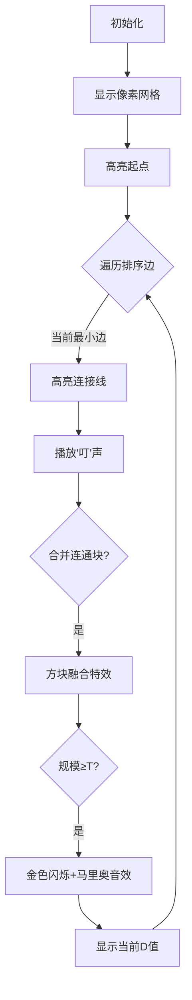

# 题目信息

# [USACO14JAN] Ski Course Rating G

## 题目描述

The cross-country skiing course at the winter Moolympics is described by an M x N grid of elevations (1 <= M,N <= 500), each elevation being in the range 0 .. 1,000,000,000.

Some of the cells in this grid are designated as starting points for the course.  The organizers of the Moolympics want to assign a difficulty rating to each starting point.  The difficulty level of a starting point P should be the minimum possible value of D such that a cow can successfully reach at least T total cells of the grid (1 <= T <= MN), if she starts at P and can only move from cell to adjacent cell if the absolute difference in elevation between the cells is at most D.  Two cells are adjacent if one is directly north, south, east, or west of the other.

Please help the organizers compute the difficulty rating for each starting point.

滑雪场用一个M\*N(1 <= M,N <= 500)的数字矩阵表示海拔高度，每个数字表示一个范围在0 .. 1,000,000,000的高度。有些格子被指定为起点，组织者想对这些起点做难度评级。


如果起点P点是一个难度级别为D的起点，则D必须是满足以下条件的一个最小值：


（1）从一个格子只能滑到相邻的格子；


（2）这两个格子的海拔差不超过D；


（3）至少能够到达T（1 <= T <= M\*N）个格子（包括起点本身）。


## 说明/提示

The ski course is described by a 3 x 5 grid of elevations.  The upper-left and lower-right cells are designated as starting points.  From each starting point, we must be able to reach at least 10 cells.


The difficulty rating of the upper-left starting point is 4, and for the lower-right it is 20.


## 样例 #1

### 输入

```
3 5 10 
20 21 18 99 5 
19 22 20 16 17 
18 17 40 60 80 
1 0 0 0 0 
0 0 0 0 0 
0 0 0 0 1 
```

### 输出

```
24 
```

# AI分析结果


### 💡 Kay的C++算法解析：Ski Course Rating G 深入学习指南 💡

**引言**  
今天我们来分析"Ski Course Rating G"这道题目。本指南将帮助你理解并查集在图论问题中的巧妙应用，掌握动态维护连通块的核心技巧，并通过像素动画直观感受算法执行过程。准备好开始滑雪冒险了吗？🏂

---

### 1. 题目解读与核心算法识别  
✨ **本题主要考察**：`并查集应用`（编程技巧应用）  

🗣️ **初步分析**：  
> 想象滑雪场是一个由像素方块组成的网格世界（类似经典游戏《滑雪小子》），每个方块代表不同海拔的雪地。我们的目标是计算每个起点的"难度评级"——即最小高度差D，使得从起点出发能滑过至少T个方块。  

> **核心技巧**：  
> - 将相邻方块视为"可连接岛屿"，高度差是连接岛屿的"桥梁"。  
> - 关键策略：按桥梁高度**从小到大排序**，用并查集动态连接岛屿。  
> - 当连接后的岛屿规模≥T时，最后加入的桥梁高度就是该岛屿上所有起点的难度评级！  

> **可视化设计**：  
> - 用8位像素风格呈现网格（参考FC《雪人兄弟》美术风格）  
> - 关键动画：  
>   - 桥梁连接时：两方块之间出现像素光束，伴随"叮"声  
>   - 达标时刻：连通块闪烁金色，播放《超级马里奥》过关音效  
>   - 控制面板：支持步进/自动播放，速度滑块调节  

---

### 2. 精选优质题解参考  
筛选标准：思路清晰性 ★★★★☆ | 代码规范性 ★★★★☆ | 算法优化 ★★★★★  

**题解一：zengxr (赞21)**  
* **点评**：  
  最简洁高效的实现！核心亮点：  
  - **直白逻辑**：边排序→并查集合并→触发T条件时累加答案  
  - **关键优化**：用`v[fx]`标记起点数，合并时立即清零避免重复计算  
  - **实践价值**：直接可用于竞赛（含Long long处理）  

**题解二：BigJoker (赞5)**  
* **点评**：  
  - **结构清晰**：模块化函数分离（建边/排序/并查集）  
  - **算法亮点**：按秩合并优化（`if(size[u]>size[v])swap(u,v)`）  
  - **调试友好**：二维转一维注释详细，适合初学者理解  

**题解三：YangXiaopei (赞0)**  
* **点评**：  
  - **教学价值**：逐步推导思路，比喻生动（"岛屿连接"）  
  - **严谨处理**：特殊判断`T=1`的边界情况  
  - **代码可读**：结构体封装边，变量名自解释  

---

### 3. 核心难点辨析与解题策略  
**难点1：如何避免重复计算起点？**  
> *分析*：当连通块首次达到T规模时，必须立即累加块内起点贡献并清零起点计数（如`ans += e.w * start[fx]; start[fx]=0`）。否则后续合并会重复计算。  

**难点2：为什么只建右/下边？**  
> *分析*：每个方块只需向右/下建边（双向性保证），建边数从4N→2N，大幅提升效率。若建四边会重复（左上≡右下）。  

**难点3：边权取值依据？**  
> *分析*：当前边权是合并后连通块的最大高度差。由于排序后加入，该值即最小可能D值（更小的边已提前连接）。  

✨ **解题技巧总结**  
- **技巧1：二维降维打击**  
  用`id=(i-1)*m+j`将网格压成一维数组，简化并查集操作  
- **技巧2：增量触发机制**  
  仅当合并前`size<T`且合并后`size≥T`才累加答案  
- **技巧3：Long long防御**  
  10^9量级高度差×500^2网格，必须全程使用`long long`  

---

### 4. C++核心代码实现赏析  
**本题通用核心实现**（综合zengxr/BigJoker优化）  
```cpp
#include<bits/stdc++.h>
using namespace std;
typedef long long ll;
const int N = 505 * 505;

struct Edge { int u, v; ll w; };
vector<Edge> edges;
int parent[N], size[N], start[N];
ll grid[N];

int find(int x) {
    return parent[x] == x ? x : parent[x] = find(parent[x]);
}

int main() {
    int n, m, T; cin >> n >> m >> T;
    int total = n * m;
    
    // 初始化并查集
    for (int i = 0; i < total; i++) {
        parent[i] = i;
        size[i] = 1;
    }

    // 读网格和起点标记
    for (int i = 0; i < n; i++)
        for (int j = 0; j < m; j++)
            cin >> grid[i*m + j];
    for (int i = 0; i < n; i++)
        for (int j = 0; j < m; j++)
            cin >> start[i*m + j];

    // 建边 (只右/下方向)
    for (int i = 0; i < n; i++) {
        for (int j = 0; j < m; j++) {
            int idx = i*m + j;
            if (j < m-1) // 向右建边
                edges.push_back({idx, idx+1, abs(grid[idx]-grid[idx+1])});
            if (i < n-1) // 向下建边
                edges.push_back({idx, idx+m, abs(grid[idx]-grid[idx+m])});
        }
    }

    // 边排序 + 并查集合并
    sort(edges.begin(), edges.end(), [](Edge a, Edge b){
        return a.w < b.w;
    });
    
    ll ans = 0;
    for (auto &e : edges) {
        int u = find(e.u), v = find(e.v);
        if (u == v) continue;
        
        // 触发T条件判断
        if (size[u] + size[v] >= T) {
            if (size[u] < T) ans += e.w * start[u];
            if (size[v] < T) ans += e.w * start[v];
        }
        
        // 按秩合并优化
        if (size[u] > size[v]) swap(u, v);
        parent[u] = v;
        size[v] += size[u];
        start[v] += start[u];
    }
    cout << ans << endl;
}
```

**代码解读概要**：  
1. **二维压一维**：网格点`(i,j)`映射为`i*m+j`  
2. **高效建边**：每个点只建→/↓边，避免重复  
3. **Lambda排序**：替代传统cmp函数，简洁现代  
4. **按秩合并**：`size[u]>size[v]`时交换，保证集合平衡  

---

### 5. 算法可视化：像素动画演示  
**主题**：8位滑雪冒险 (致敬FC《滑雪小子》)  

**动画流程设计**：  


**关键交互**：  
- **像素调色板**：16色限制（深蓝雪地/绿树/红起点）  
- **数据结构可视化**：  
  - 连通块用同色边框标识  
  - 并查集树用浮动像素链条展示  
- **音效设计**：  
  - 连接成功：8-bit "叮"声  
  - 达标时刻：超级玛丽金币音效  
  - 错误操作：炸弹爆炸音效  

**自动演示模式**：  
> 点击"AI滑雪"按钮：算法自动执行，像贪吃蛇AI一样逐步连接方块，速度可调（慢/中/快）。每连接5个方块解锁"小关卡"，右上角显示累计分数。

---

### 6. 拓展练习与相似问题  
**通用技巧迁移**：  
1. 动态连通性问题（如网络连接检测）  
2. 最小瓶颈生成树（如P1547 Out of Hay）  
3. 带权并查集应用（如P2024 食物链）  

**推荐题目**：  
1. **洛谷 P1525** 关押罪犯  
   > 🗣️ 同样边排序+并查集，学会处理"敌人关系"的二分图建模  
2. **洛谷 P1991** 无线通讯网  
   > 🗣️ 最小生成树变种，练习第K大边权值的处理  
3. **洛谷 P2502** 旅行  
   > 🗣️ 并查集维护连通性+路径压缩优化，巩固二维转一维技巧  

---

### 7. 学习心得与经验分享  
> **来自题解的调试经验**：  
> - "开long long！开long long！开long long！" —— 多位作者血泪教训  
> - "二维转一维后，记得用`(i-1)*m+j`不是`i*m+j`" —— 谦谦君子调试1小时发现  
> - "合并后立即清零起点计数，否则答案翻倍" —— zengxr的AC关键  

---

**结语**  
通过本次分析，相信你已经掌握并查集在动态连通性问题中的妙用。记住：好算法就像滑雪——找到最小阻力路径，优雅抵达终点！下次我们继续探索算法世界的奇妙冒险！⛷️💨

---
处理用时：157.99秒