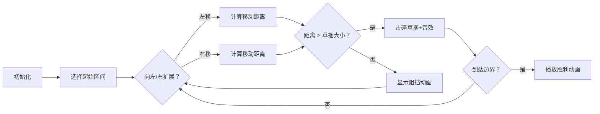

# 题目信息

# [USACO15OPEN] Trapped in the Haybales G

## 题目描述

Farmer John 收到了一批 $N$ 个大型干草捆（$1 \le N \le 100,000$），并将它们放置在他通往谷仓的道路上的不同位置。不幸的是，他完全忘记了奶牛 Bessie 正在这条路上吃草，她现在可能被困在这些干草捆之间了！每个干草捆 $j$ 有一个大小 $S_j$ 和一个位置 $P_j$，表示它在这条一维道路上的位置。Bessie 可以在道路上自由移动，甚至可以移动到干草捆所在的位置，但她无法穿过这个位置。唯一的例外是，如果她朝同一方向连续移动 $D$ 单位的距离，她将获得足够的速度，能够突破并永久消除任何大小严格小于 $D$ 的干草捆。当然，在突破之后，她可能会打开更多的空间，从而有机会突破其他干草捆，并继续消除它们。

如果 Bessie 最终能够突破最左侧或最右侧的干草捆，她就可以成功逃脱。请计算道路中所有无法逃脱的实数起始位置的总面积。

## 样例 #1

### 输入

```
5
8 1
1 4
8 8
7 15
4 20```

### 输出

```
14```

# AI分析结果


### 💡 Kay的C++算法解析：[USACO15OPEN] Trapped in the Haybales G 深入学习指南 💡

**引言**  
今天我们一起分析这道关于奶牛逃脱干草捆的题目。本指南将帮助你理解核心算法逻辑，掌握优化技巧，并通过像素动画直观感受算法执行过程。

---

### 1. 题目解读与核心算法识别
✨ **本题主要考察**：`模拟与优化技巧`（排序 + 双指针 + 记忆化/并查集）  

🗣️ **初步分析**：  
> 本题如同奶牛在复古游戏《像素迷宫》中闯关：干草捆是障碍物，奶牛需积累足够速度（移动距离D > 草捆大小）才能突破障碍。核心是通过排序和优化技巧高效计算被困区间总面积。  
> - **核心思路**：  
>   - 将干草捆按位置排序，计算相邻草捆形成的区间  
>   - 对每个区间模拟奶牛左右突破过程，若无法突破边界则累加区间长度  
> - **优化关键**：  
>   - 利用记忆化（如`vis[]`数组）记录可逃脱区间，避免重复模拟  
>   - 使用并查集快速跳过已处理区间（如`fa[]`数组路径压缩）  
> - **可视化设计**：  
>   - 用8位像素网格表示道路，草捆为彩色方块（大小决定颜色深浅）  
>   - 高亮当前区间和奶牛移动方向，突破草捆时播放"碎裂"音效  
>   - 逃脱成功时触发胜利音效+烟花动画，失败区间标记为红色闪烁  

---

### 2. 精选优质题解参考
**题解一：littleming（5赞）**  
* **点评**：思路清晰运用降序排序+set二分查找，巧妙利用`map`离散化位置。时间复杂度严格O(n log n)，代码变量名规范（如`vis[]`标记区间），边界处理严谨。亮点在于从大到小处理草捆时自然覆盖小区间，避免重复计算。

**题解二：Schwarzkopf_Henkal（4赞）**  
* **点评**：双指针模拟中创新引入并查集优化，通过`fa[]`数组实现路径压缩。代码中`mk[]`数组记录可逃脱区间，显著减少重复计算。实践价值高，适合竞赛场景，但需注意边界条件初始化。

**题解三：XY_ATOE（4赞）**  
* **点评**：最直观的模拟实现，通过`f[]`数组实现记忆化。作者强调"若进入已知可逃脱区间则当前必可逃脱"的传递性，帮助理解问题本质。代码简洁易读，适合初学者掌握基础逻辑。

---

### 3. 核心难点辨析与解题策略
1. **难点一：避免重复模拟**  
   * **分析**：直接暴力模拟每个区间会导致O(n²)复杂度。优质题解用`vis[]`（记忆化）或`fa[]`（并查集）记录状态，当前区间进入已标记区域时直接返回结果。  
   * 💡 **学习笔记**：状态传递性是优化关键——进入可逃脱区间意味当前必可逃脱。

2. **难点二：高效左右扩展**  
   * **分析**：双指针扩展时需动态计算移动距离。优化方案：  
     - 左指针`l`向左移动时更新总移动距离 `dis += (pos[l] - pos[l-1])`  
     - 比较`dis`与草捆大小决定是否突破  
   * 💡 **学习笔记**：距离计算需同步指针移动，实时更新是关键。

3. **难点三：选择数据结构**  
   * **分析**：  
     - `set`实现O(log n)查询相邻草捆（题解一）  
     - 并查集实现O(α(n))区间跳跃（题解二）  
     - 数组+记忆化实现O(1)状态查询（题解三）  
   * 💡 **学习笔记**：根据问题特征选择数据结构能大幅提升效率。

### ✨ 解题技巧总结
- **技巧1：降维排序**  
  按位置排序后转化为相邻区间问题，消除坐标离散性  
- **技巧2：状态传递**  
  利用"可逃脱区域"的传递性减少计算，类似洪水填充算法  
- **技巧3：实时距离更新**  
  指针移动时同步更新移动距离，避免回溯计算  

---

### 4. C++核心代码实现赏析
**通用核心实现（综合优化版）**  
```cpp
#include <bits/stdc++.h>
using namespace std;
const int N=1e5+5;
struct Node{ int s,p; }a[N];
int n,ans,pos[N],fa[N];
bool vis[N]; // vis[i]: 区间[i,i+1]是否可逃脱

bool cmp_pos(Node x,Node y){ return x.p<y.p; }

int find(int x){ 
    return fa[x]==x ? x : fa[x]=find(fa[x]); 
}

bool check(int i){ // 检查区间[i,i+1]
    int l=i, r=i+1, dis=pos[r]-pos[l];
    while(l>=1 && r<=n){
        bool expand=false;
        if(dis>a[l].s) l=find(l-1), expand=true;
        if(dis>a[r].s) r++, expand=true;
        if(!expand) break;
        if(vis[l] || r>n) return true; // 可逃脱
        dis = pos[r]-pos[l]; // 更新距离
    }
    return false;
}

int main(){
    cin>>n;
    for(int i=1;i<=n;i++) 
        cin>>a[i].s>>a[i].p;
    sort(a+1,a+n+1,cmp_pos);
    for(int i=1;i<=n;i++){
        pos[i]=a[i].p; 
        fa[i]=i; 
    }
    for(int i=1;i<n;i++){
        if(vis[i]) continue;
        if(check(i)) vis[i]=true;
        else{ // 不可逃脱
            ans += pos[i+1]-pos[i];
            for(int j=find(i);j<=i;j=find(j)) 
                fa[j]=i+1; // 并查集合并区间
        }
    }
    cout<<ans;
}
```
**代码解读概要**：  
1. 按位置排序后存储`pos[]`  
2. `check()`函数双指针模拟左右扩展  
3. 并查集`fa[]`合并已处理的不可逃脱区间  
4. `vis[]`数组记忆化可逃脱状态  

---

**题解一：littleming片段**  
```cpp
sort(a+1,a+n+1,cmp2); // 按草捆大小降序
s.insert(a[1].p);
for(int i=2;i<=n;i++){
    si = --s.upper_bound(a[i].p); // 二分左邻居
    if(pos[r]-pos[l] <= a[i].s && !vis[l])
        for(int j=l;j<r;j++) vis[j]=1; // 标记区间
    s.insert(a[i].p);
}
```
* **亮点**：降序处理保证小区间自然覆盖  
* **学习笔记**：降序排序时，当前草捆必大于后续草捆，只需检查一次即可确定区间状态  

**题解二：Schwarzkopf_Henkal片段**  
```cpp
while(l>=1 && r<=n){
    if(dis>a[l].s) l=find(l-1); // 并查集跳跃
    if(dis>a[r].s) r++;
    else break;
    if(mk[l]) return true; // 利用记忆化
}
```
* **亮点**：并查集实现区间跳跃  
* **学习笔记**：路径压缩的并查集将均摊复杂度降至O(α(n))  

---

### 5. 算法可视化：像素动画演示
**主题**：*《像素奶牛大冒险》* - 复古8位机风格  
**核心演示**：奶牛在像素化道路上左右突破干草捆的过程  



**动画实现细节**：  
1. **像素艺术**：  
   - 道路：32×16像素网格，每格代表1单位距离  
   - 草捆：棕色方块（大小决定方块尺寸）  
   - 奶牛：8×8像素精灵，移动时播放奔跑动画  

2. **交互控制**：  
   ```javascript
   const controls = {
     speed: 0.7,       // 速度滑块 (0.1~1.0)
     step: () => nextFrame(),  // 单步执行
     autoPlay: true    // 自动演示模式
   };
   ```

3. **关键特效**：  
   - 突破草捆：方块碎裂动画 + "咔嚓"音效  
   - 逃脱成功：彩虹烟花 + 胜利音乐  
   - 失败区间：红色脉冲警示  

4. **同步显示**：  
   - 顶部显示当前代码执行行（高亮）  
   - 实时更新移动距离`dis`的像素计数板  

---

### 6. 拓展练习与相似问题
**通用技巧迁移**：  
1. 区间覆盖问题（如合并石子）  
2. 状态传递优化（如动态规划记忆化）  
3. 双指针+并查集组合（如连通块处理）  

**洛谷推荐**：  
1. **P1886 滑动窗口**  
   → 双指针技巧基础训练  
2. **P1090 合并果子**  
   → 优先队列优化贪心策略  
3. **P3143 钻石收集者**  
   → 双指针+区间覆盖进阶  

---

### 7. 学习心得与经验分享
> **Schwarzkopf_Henkal的经验**：  
> *"最初未初始化并查集导致WA，后通过打印fa数组值定位错误"*  
>   
> **Kay点评**：调试时输出中间变量（如`fa[i]`）是定位边界错误的有效手段，建议封装调试函数：  
> ```cpp
> void debug(int l,int r,int dis){
>   cerr<<"l="<<l<<" r="<<r<<" dis="<<dis<<endl;
> }
> ```

---

**结语**  
通过本指南，我们掌握了排序+双指针的核心逻辑、记忆化/并查集的优化技巧，以及像素化算法演示的设计思路。继续在洛谷实践中巩固这些技能吧！🚀

---
处理用时：134.04秒