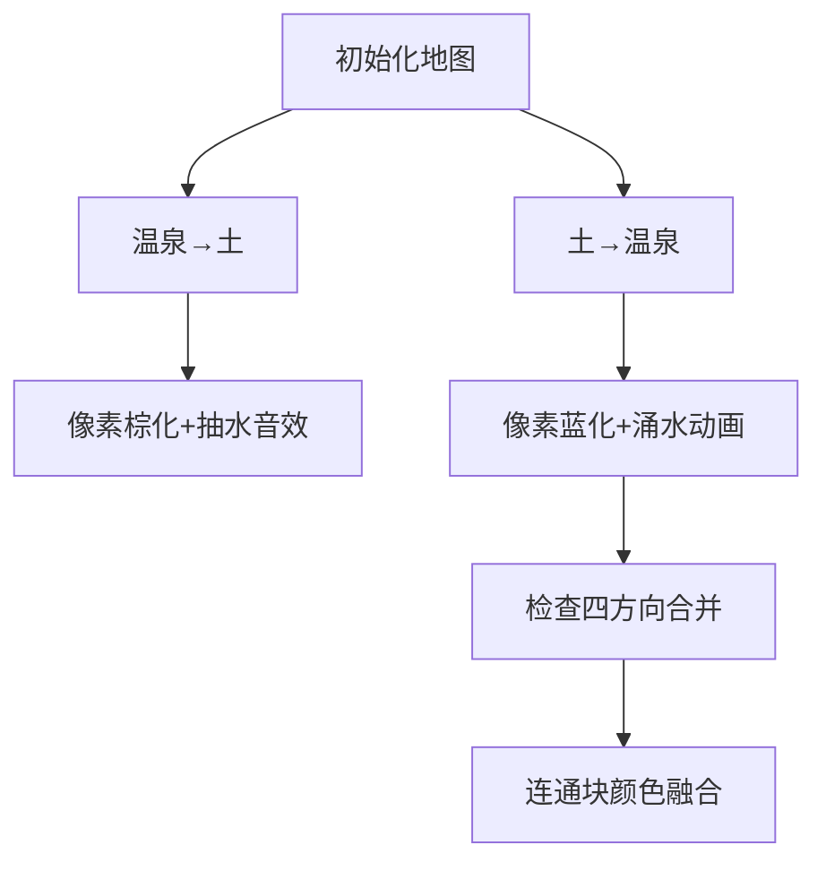

# 题目信息

# 小D的地下温泉

## 题目背景

小D最喜欢泡温泉了。小D找某奸商租下了一块$N$行$M$列的地，左上角为$(1,1)$，右下角为$(N,M)$。小D本以为这块地里全是温泉，结果这块地极不稳定，曾经发生过一些地形变动，所以其中一些地方全是土。


## 题目描述

一开始他会告诉你当前这块地的情况，但是小D有一些假操作，希望你操作给他看：

1. 由小D指定$w$个位置，他希望知道其中哪个位置下水泡温泉的范围最大。泡温泉的范围定义为指定位置通过向上下左右四个方向能到达的位置的个数。若询问的位置为土，则范围为0。如果如果有多个位置均为最大，输出给出顺序较前的那个。位置编号为$1,2,...,w$。

2. 由小D指定$w$个位置，他会使用膜法按顺序翻转这$w$个地方的地形。即若原位置是土，则该位置变为温泉；若原位置是温泉，则该位置变为土。因为小D不希望活动范围减少得太快，所以他在将温泉变为土时不会将一个区域分割。


## 说明/提示

对于30%的数据，$N,M\le 100,\sum w\le 100$

对于70%的数据，$N,M\le 1000$

对于100%的数据，$1\le N\times M,Q\le 10^{6},\sum w\le 10^{6},w\geq 1$

数据在windows下制作


## 样例 #1

### 输入

```
5 5
.*...
.****
*....
*****
.....
3
1 2 1 1 1 3
2 1 3 1
1 2 1 1 1 3```

### 输出

```
2
1
```

# AI分析结果


### 💡 Kay的C++算法解析：小D的地下温泉 深入学习指南 💡

**引言**  
今天我们一起分析"小D的地下温泉"这道二维网格连通性问题。本指南将帮助大家掌握动态维护连通块的核心技巧，通过并查集和新建节点策略高效处理地形翻转操作。

---

### 1. 题目解读与核心算法识别  
✨ **本题主要考察**：`并查集应用` + `动态开点技巧`  

🗣️ **初步分析**：  
> 本题核心是动态维护温泉连通块大小。想象温泉是相连的湖泊，土是陆地：  
> - **温泉变土**：抽干小水坑（连通块大小-1），不分裂湖泊  
> - **土变温泉**：挖新水坑（新建节点），若与相邻湖泊相连则合并  
>  
> **关键技巧**：翻转时新建节点避免破坏原并查集结构。可视化将用像素网格（温泉蓝/土棕），动态展示合并过程：  
> - 温泉变土时像素块棕化+抽水音效  
> - 土变温泉时像素块蓝化+涌水动画  
> - 自动演示模式会像"推箱子"游戏逐步执行操作  

---

### 2. 精选优质题解参考  
**题解一：作者_J_C_**  
* **点评**：思路清晰解释了新建节点的必要性（避免历史状态干扰），代码中`newone`数组记录实际节点编号的设计简洁高效。边界处理严谨，例如用`PTOI`宏处理二维坐标降维，合并时严格判断相邻位置有效性。亮点在于用动态开点控制并查集规模，时间复杂度稳定。  

**题解二：作者Musity**  
* **点评**：提供从50分到AC的演进过程，极具教学价值。用`vector`动态分配内存避免固定数组，`newnode()`函数封装节点创建逻辑清晰。特别强调特殊测试（如全土情况），实践调试经验丰富。亮点在于用游戏化思维设计代码结构，如"关卡式"状态更新。  

---

### 3. 核心难点辨析与解题策略  
1. **难点：并查集删除节点的破坏性**  
   * **分析**：直接删除节点会导致并查集父子关系断裂（如50分代码）。优质解法采用"标记退役"：温泉变土时仅减小连通块大小，保留原节点；土变温泉时分配新节点。  
   * 💡 **学习笔记**：并查集删除的本质是状态隔离而非物理删除。  

2. **难点：土变温泉的多连通块合并**  
   * **分析**：新建节点后需检查四方向（上下左右），用`find`定位实际根节点再合并。注意合并顺序不影响结果，但按秩合并可优化性能。  
   * 💡 **学习笔记**：方向检查需同时验证坐标有效性和地形类型。  

3. **难点：查询的最早最大值定位**  
   * **分析**：边读查询点边比较，注意全为土时默认返回首个位置。关键变量`max_size`和`first_rank`实时更新。  
   * 💡 **学习笔记**：在线处理查询避免存储中间状态。  

#### ✨ 解题技巧总结  
- **动态开点**：为每次土变温泉分配新节点（`new_id = next_id++`）  
- **降维打击**：二维坐标转一维索引（`index = x*col + y`）  
- **增量维护**：翻转时即时更新避免全量重算  
- **防御性编程**：检查相邻位置先验坐标有效性  

---

### 4. C++核心代码实现赏析  
**通用核心实现参考**  
```cpp
#include <iostream>
#include <vector>
using namespace std;
const int MAXN = 2000005; // 原始点+新开点

int fa[MAXN], sz[MAXN];     // 并查集
char grid[MAXN];            // 网格状态
int curr_id[MAXN];          // 当前节点ID
int next_id;                // 下一个可用ID

// 坐标转换（行x列, 1-indexed）
inline int getIdx(int x, int y, int m) {
    return (x-1)*m + y;
}

void initDSU(int n, int m) {
    for (int i = 1; i <= n*m; i++) {
        fa[i] = i;
        sz[i] = (grid[i] == '.' ? 1 : 0);
        curr_id[i] = i;
    }
    next_id = n*m + 1;
}

int find(int x) {
    return fa[x] == x ? x : fa[x] = find(fa[x]);
}

void merge(int x, int y) {
    x = find(x), y = find(y);
    if (x == y) return;
    if (sz[x] < sz[y]) swap(x, y);
    sz[x] += sz[y];
    fa[y] = x;
}
```

**题解一核心片段（作者_J_C_）**  
```cpp
// 土变温泉处理
newone[pos] = iEnd++; // 分配新ID
sz[newone[pos]] = 1;
// 四方向合并
if (x>0 && grid[左位置]=='.') 
    merge(newone[pos], newone[左位置]);
```
> **代码解读**：  
> - `newone[pos] = iEnd++` 为当前点分配新节点，完全隔离历史状态  
> - 仅合并相邻温泉点（`grid[...]=='.'`），通过`newone`数组获取最新节点ID  
> - 合并后新点自动融入连通块，大小累加  

**题解二核心片段（作者Musity）**  
```cpp
void change(int x, int y) {
    if (!grid[pos]) { // 新建温泉
        f[x][y] = newnode(); // 创建独立节点
        for (int k=0; k<4; k++) {
            int nx = x + dx[k], ny = y + dy[k];
            if (valid(nx,ny) && grid[nx][ny])
                merge(f[nx][ny], f[x][y]);
        }
    } else { // 温泉变土
        sz[find(f[x][y])]--; // 仅减小大小
    }
}
```
> **代码解读**：  
> - `newnode()`封装节点创建（计数器+初始化）  
> - 方向向量`dx/dy`简化相邻点访问  
> - 温泉变土仅修改连通块大小，不改变拓扑结构  

---

### 5. 算法可视化：像素动画演示  
**主题**：8-bit温泉探险  

**核心演示流程**：  


**关键交互设计**：  
1. **网格渲染**：Canvas绘制N×M像素网格（温泉天蓝/土棕）  
2. **翻转动画**：  
   - 温泉变土：蓝色→棕色渐变，播放"水滴"音效（Web Audio API）  
   - 土变温泉：棕色→蓝色脉冲扩散，伴随"咕咚"声  
3. **合并效果**：相邻连通块颜色混合（如蓝+绿→青），显示合并后大小  
4. **控制面板**：  
   - 步进控制：单步/自动（调速滑块）  
   - 高亮模式：显示当前连通块边界  
   - 音效开关：背景音乐（8-bit循环BGM）  

**学习价值**：通过像素动画直观理解动态开点如何避免状态污染，感受连通块合并的物理过程。

---

### 6. 拓展练习与相似问题思考  
**通用技巧迁移**：  
- 并查集动态开点 → 处理状态回溯问题  
- 二维坐标降维 → 优化网格存储  
- 增量维护 → 实时响应数据变化  

**洛谷推荐**：  
1. **P2147 [SDOI2008]洞穴勘测**  
   → 练习动态维护连通性（无删除但需支持链路断开）  
2. **P1197 [JSOI2008]星球大战**  
   → 逆序并查集经典应用（删除点转添加点）  
3. **P1506 拯救oibh总部**  
   → 二维连通块基础（洪水填充）  

---

### 7. 学习心得与经验分享  
> **作者Musity经验**：  
> "比赛时因忽略全土情况WA，调试后发现需初始化`ans=1`"  
>  
> **Kay点评**：  
> 边界测试至关重要！建议：  
> - 小数据验证：单点/全土/全温泉  
> - 防御性编码：变量初始化为安全值  
> - 输出中间状态：调试时打印连通块变化  

---

**结语**  
通过并查集的动态开点技巧，我们优雅解决了温泉连通块维护问题。记住：优秀算法 = 正确思路 + 严谨边界处理 + 高效实现。下次遇到动态维护问题，试试"新建节点"这把万能钥匙吧！🚀

---
处理用时：221.58秒