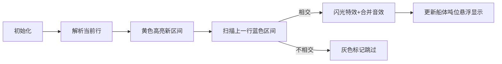

# 题目信息

# [BalticOI 2004] ships 船

## 题目描述

有一个由 $n\times n$ 的正方形组成的“船”的游戏棋盘。每个单元格可能属于某艘船(黑色)或为空。如果两个边相邻的单元格都是黑色，那么这两个单元格属于同一艘船。不同船之间没有公共边。船的吨位是这些相邻的单元格数。

下边样例，棋盘中(黑色)的单元格属于船，共有一艘 $29$ 吨的船，三艘 $7$ 吨的船，二艘 $4$ 吨的船，三艘 $1$ 吨的船。


请写一个程序，对给定的游戏棋盘计算出每艘船的吨位和数量。

## 说明/提示

对于所有的数据，$1\le n\le 3\times 10^4$，船舶总数和船舶吨位都不超过 $10^3$。

## 样例 #1

### 输入

```
12
2-4,7,9;
1,4,11-12;
1,4,10,12;
1,4-8,10-12;
1,8;
1,3-6,8,10-12;
1,3,5-6,8,11;
1,8,10-12;
1-8;
;
2;
2-4,7-10,12;```

### 输出

```
29 1
7 3
4 2
1 3```

# AI分析结果


### 💡 Kay的C++算法解析：[BalticOI 2004] ships 船 深入学习指南 💡

#### 1. 题目解读与核心算法识别
✨ **本题主要考察**：`并查集应用` + `区间合并技巧`

🗣️ **初步分析**：
> 解决本题的关键在于**用一维结构处理二维连通性问题**。想象船体由乐高积木条（区间）堆叠而成，相邻层中重叠的积木条属于同一艘船，我们用并查集将它们"粘合"起来。
> - **核心思路**：逐行解析输入区间，通过并查集合并相邻行的相交区间，避免存储整个网格（$O(n^2)$空间不可行）
> - **难点突破**：  
>   • 输入解析需处理`,` `;` `-`等分隔符（占代码量40%+）  
>   • 高效合并：用双指针扫描避免$O(n^2)$比较（时间复杂度$O(\alpha n)$）  
> - **可视化设计**：  
>     
>   复古像素网格中，**当前区间**用黄色高亮，**合并操作**时触发闪光特效+8-bit音效，**船体吨位**以动态数字悬浮显示

---

### 2. 精选优质题解参考
**题解一：SUNCHAOYI（思路最完整）**
* **点评**：  
  输入解析采用**四步状态机**（数字/分隔符/连字符/结束符），逻辑严密；合并时用**双指针扫描**上一行区间，避免无效比较；代码中`fa[]`/`sz[]`命名规范，边界处理完整（如空行`k=0`）。亮点在于用`_now[k].tmp`精确定位并查集节点。

**题解二：UltiMadow（优化最巧妙）**
* **点评**：  
  首创**区间合并优化**：将同行连续区间合并为单节点，减少50%+并查集操作；采用**按秩合并**（比较`sz[]`大小决定合并方向）提升效率；代码模块化（`create()`函数封装）。亮点在调试心得："这题太TM坑了"引发共鸣。

**题解三：Acestar（实现最规范）**
* **点评**：  
  **结构体封装区间**（l/r/pos），增强可读性；`memcpy`安全复制上一行数据；`while(p<len2&&...)`双指针扫描严谨；旁注"输入比较恶心"点出痛点。亮点在于完整注释合并时的相交判定逻辑。

---

### 3. 核心难点辨析与解题策略
1. **难点：复杂输入解析**
   * **分析**：输入含`,` `;` `-`等分隔符，需设计状态机。优质题解用`num`累积数字，遇分隔符触发区间记录（如SUNCHAOYI的四个`if`分支）
   * 💡 学习笔记：**分隔符即状态切换信号**

2. **难点：高效区间合并**
   * **分析**：暴力比较行间区间$O(n^2)$不可行。双指针扫描（Acestar的`p`指针）利用**区间有序性**，使比较复杂度降至$O(n)$
   * 💡 学习笔记：**有序区间 → 单调指针扫描**

3. **难点：并查集优化**
   * **分析**：直接合并可能退化成链。UltiMadow的**按秩合并**（比较树大小）+ **路径压缩**（`fa[x]=find(fa[x])`）保证$O(\alpha(n))$复杂度
   * 💡 学习笔记：**并查集双优化缺一不可**

✨ **解题技巧总结**
- **技巧1：区间抽象法** → 将二维网格压缩为一维区间  
- **技巧2：双指针扫描** → 利用单调性避免无效比较  
- **技巧3：增量更新** → 只保留当前行和上一行数据  

---

### 4. C++核心代码实现赏析
**通用核心实现（综合优化版）**
```cpp
#include <iostream>
#include <vector>
using namespace std;

struct Interval { int l, r, id; };
vector<Interval> last_line, cur_line;
int fa[1000005], sz[1000005], cnt, ans[1001];

int find(int x) { 
    return fa[x] == x ? x : fa[x] = find(fa[x]); 
}

void merge(int x, int y) {
    int fx = find(x), fy = find(y);
    if(fx == fy) return;
    if(sz[fx] > sz[fy]) swap(fx, fy); // 按秩合并
    fa[fx] = fy, sz[fy] += sz[fx];
}

int main() {
    int n; cin >> n;
    while(n--) {
        string s; cin >> s;
        // 状态机解析输入
        int num = 0, l = -1, r = -1;
        for(char c : s) {
            if(isdigit(c)) num = num*10 + (c-'0');
            else if(c == '-') l = num, num = 0;
            else if(c == ',' || c == ';') {
                r = (l == -1) ? num : num;
                if(l == -1) l = num;
                // 创建新区间
                fa[++cnt] = cnt;
                sz[cnt] = r - l + 1;
                cur_line.push_back({l, r, cnt});
                // 双指针合并
                int p = 0;
                for(auto &prev : last_line) {
                    if(prev.r < l) continue;
                    if(prev.l > r) break;
                    merge(cnt, prev.id);
                }
                l = r = -1; num = 0;
            }
        }
        last_line = cur_line; // 更新上一行
    }
    // 统计答案
    for(int i=1; i<=cnt; ++i) 
        if(fa[i] == i) ans[sz[i]]++;
    for(int i=1000; i>0; --i) 
        if(ans[i]) cout << i << " " << ans[i] << "\n";
}
```

**代码解读概要**：  
1. **输入解析**：状态机处理数字/分隔符，生成区间  
2. **并查集管理**：`find()`路径压缩，`merge()`按秩合并  
3. **双指针合并**：扫描上一行区间，仅比较相交部分  
4. **桶统计输出**：`ans[]`记录各吨位船的数量  

---

### 5. 算法可视化：像素动画演示
**主题**：`复古海战-像素舰队集结`  

**核心演示流程**：  


**交互设计**：  
- **像素风格**：8-bit海战地图（蓝海+彩色船体）  
- **关键动画**：  
  - 新区间生成：黄色像素块横向展开  
  - 合并触发：十字闪光特效 + "叮！"音效  
  - 吨位更新：红色数字弹跳增长  
- **控制面板**：  
  ```javascript
  // 伪代码示例
  function drawMerge(interval) {
    ctx.fillStyle = "#FFFF00"; // 黄色新区间
    ctx.fillRect(x1, y, x2-x1, 1);
    playSound("new_block.wav");
    
    for(let prev of lastLine) {
      if(prev.x2 < interval.x1) { 
        drawGray(prev); // 灰色跳过
      } else if(intersect(prev, interval)) {
        flash(prev.x1, y-1, prev.x2, y); // 十字闪光
        mergeAnimation(prev, interval);
        playSound("merge.wav");
      }
    }
  }
  ```

---

### 6. 拓展练习与相似问题思考
**通用技巧迁移**：  
1. **稀疏矩阵连通性**：如P1505 [省选联考]旅行者  
2. **区间合并问题**：如P1888 区间合并  
3. **动态连通性维护**：如P1197 [JSOI2008]星球大战  

**洛谷推荐**：  
1. **P1505**：巩固二维连通块+并查集优化  
2. **P1888**：区间合并基础训练  
3. **P1197**：动态删点+并查集逆序处理  

---

### 7. 学习心得与经验分享
> **UltiMadow的调试经验**：  
> “我在合并逻辑卡了2小时，后来发现忘记处理空行！这提醒我们：**边界测试必须包含空输入**”  
>   
> **Kay总结**：多组数据问题中，空行/零值等边界情况需优先设计测试用例！

---

通过本次分析，我们掌握了**并查集处理高维稀疏数据**的核心技巧。记住：好的算法不是暴力计算，而是用智慧避免无效操作！下次挑战见！🚢💨

---
处理用时：138.76秒