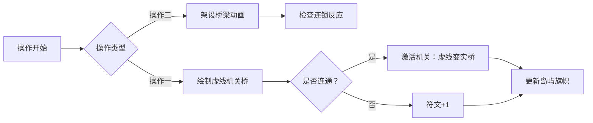

# 题目信息

# 泪光 | Tears

## 题目背景

「为什么哭呢？」

“因为自己的期许和现实相去甚远。”

「哭能改变什么呢？」

“什么都不能。正如同既成事实的过去一样。”

「那么为何不抹去泪水向前迈进呢？」

“… 我在等我的灵魂追上时间。”

> After night
>
> 长夜之后
>
> In boundless light
>
> 无垠光中
>
> He calls my name
>
> 他呼唤着我
>
> I do the same
>
> 我望向彼方，回应

## 题目描述

「不想回忆的事，就别再去想了吧。为了分散你的注意力，正好我有一道与人的感情相关的题目，你看看怎么样？」

“… 真是令人想吐槽呢。怎么，又是那个人在支配吗？”

「什么嘛，令人不快… 你以前对这种事不是有很大的热情吗？」

“… 说不准。”

「咳咳… 那么听好了。现在共有 $n$ 个人，每个人都有一个情绪值：用 **实数** $v_i$ 表示。现在由于一些特殊的变化，使得这些人的情感发生了纠缠…」

“嗯哼？”

「第一种纠缠有四个参数 $a,b,c,d$，表示：现在已知存在无穷个 $f:\R\rightarrow\R$，使得 $\frac{f(v_a)}{f(v_b)}=\frac{v_c}{v_d}$。」

“等等等等一下！这数学公式是怎么说出来的啊？！还有什么 $f:\R\rightarrow\R$ 是什么意思啊！”

「你瞧，你不也说出来了吗？」

“… 可恶，果然是你吗，那个人…”

「简单来说，$f:\R\rightarrow\R$ 就是代表一个定义域和值域都是实数的函数。如果这都不能理解的话，我要开始怀疑你作为高中生的身份了哦…」

“好吧… 继续吧。”

「第二种纠缠有两个参数 $a,b$，表示：现在已知存在有穷个 $f:\R\rightarrow\R$，使得 $f(v_a)\ne f(v_b)$。」

“什么叫‘有穷个’？”

「就是有一个确切的数目啦… 只要有一个自然数 $k$ 能表示这样函数的数目，那么就叫‘存在有穷个函数’哦？」

“嗯…”

「接下来，在纠缠不断增加的过程中，你也需要回答一些问题。第一种是，给出 $a,b$，你需要判断 $v_a$ 是否总是等于 $v_b$；第二种是，给出 $a$，你需要计算有多少个 $b$（$1\le b\le n$，$b$ 可以等于 $a$）使得 $v_a=v_b$ 恒成立。」

“… 题目我明白了，但是这跟人的情感有什么关系吗？”

「哈哈… 就是想逗你开心嘛，别那么严肃。」

“… 无聊。”

### 简要题意

有 $n$ 个 **正实数** 变量 $v_1,\dots,v_n$。你需要根据当前已知的条件作出判断。每次给出两种条件之一：

- 给出常数 $a,b,c,d$：表示现在已知存在无穷个 $f:\R\rightarrow\R$，使得 $\frac{f(v_a)}{f(v_b)}=\frac{v_c}{v_d}$。

- 给出常数 $a,b$：表示现在已知存在有穷个 $f:\R\rightarrow\R$，使得 $f(v_a)\ne f(v_b)$。

或者两种询问之一：

- 给出常数 $a,b$：询问 $v_a=v_b$ 是否恒成立。

- 给出常数 $a$：询问有多少个 $b$（$1\le b\le n$，$b$ 可以等于 $a$）使得 $v_a=v_b$ 恒成立。

## 说明/提示

对于全部数据，有 $1\le n,m\le 6\times 10^5$。保证操作一中 $a\ne b,c\ne d$，操作二中 $a\ne b$，操作三中 $a\ne b$。

Subtask 1（5 pts）：保证不出现操作一和操作二。

Subtask 2（10 pts）：保证不出现操作一。

Subtask 3（35 pts）：保证 $n\le 5000$。

Subtask 4（50 pts）：无特殊限制。

## 样例 #1

### 输入

```
2 2
2 1 2
3 1 2```

### 输出

```
entangled```

## 样例 #2

### 输入

```
5 7
1 1 2 3 4
3 1 2
2 1 2
3 1 2
3 3 4
4 1
4 2```

### 输出

```
separate
entangled
entangled
2
2```

## 样例 #3

### 输入

```
7 6
1 1 2 3 4
1 3 5 6 7
2 4 5
3 6 7
2 1 2
3 6 7```

### 输出

```
separate
entangled```

# AI分析结果


# 💡 Kay的C++算法解析：泪光 | Tears 深入学习指南 💡

> 大家好，我是Kay！今天我们一起分析这道融合了数学推理与高效数据结构的题目。我们将通过清晰的算法拆解和生动的像素动画演示，带你直观理解并查集在动态等价关系维护中的精妙应用。准备好了吗？让我们开始吧！

## 1. 题目解读与核心算法识别

✨ **本题主要考察**：`并查集应用` 与 `启发式合并技巧`

🗣️ **初步分析**：
> 这道题的核心在于维护变量间的等价关系（相等或不相等）。想象一下，每个变量就像一座孤岛，操作二（`va=vb`）是直接在两岛间架桥；操作一（条件性合并）则是设置了一个“机关桥”——只有当`a岛`和`b岛`连通时，才会自动触发`c岛`和`d岛`的连接。我们需要高效管理这些连接关系，这正是**并查集**的拿手好戏！

- **核心难点**在于操作一的延迟触发机制：当`a,b`未连通时，需暂存该条件（打标记），待后续连通时再检查触发
- **解决方案**：通过启发式合并（总将小集合合并到大集合）保证每次合并的标记处理量最小，用队列处理连锁反应
- **可视化设计**：将变量显示为像素岛屿，操作二合并时播放桥梁动画音效；操作一标记显示为虚线桥梁，触发时变为实线并播放“机关启动”音效

---

## 2. 精选优质题解参考

<eval_intro>
我们从思路清晰性、代码优化程度和实践价值等维度，精选出三条最具学习价值的题解：
</eval_intro>

**题解一（作者：chaynflow）**
* **点评**：此解法创新性地用`vector`替代`set`存储标记，将复杂度优化至O(n log n)。思路直击要害——仅当合并时检查标记是否触发，未触发标记直接整体迁移。代码中`tag_to_point`计数器的使用展现了巧妙的启发式合并控制，边界处理严谨，整体实现简洁高效，是竞赛场景的理想参考。

**题解二（作者：Mivik）**
* **点评**：对操作条件的数学转化分析极为透彻（如指出操作二等价于`va=vb`），奠定了整个解题逻辑基础。采用`set`维护标记虽带来O(log²n)复杂度，但代码结构清晰易读，队列处理连锁反应的模块化设计值得学习，特别适合算法初学者理解核心思想。

**题解三（作者：naught）**
* **点评**：创造性使用`stack`处理延迟合并，与`vector`标记存储形成高效配合。代码高度简洁（仅40行），但保留了关键注释，变量命名规范（如`tag_to_point`）。特别亮点是合并时仅迁移未触发标记，避免中间删除操作，大幅提升执行效率。

---

## 3. 核心难点辨析与解题策略

<difficulty_intro>
解决本题需突破三大思维关卡，结合优质题解方案，我提炼了以下核心策略：
</difficulty_intro>

1.  **条件触发的延迟处理**
    * **分析**：当操作一中的`a,b`未连通时，需存储该条件待后续触发。如chaynflow解法所示，将未决条件存入`vector`并关联到集合根节点，后续合并时检查
    * 💡 **学习笔记**：延迟处理是算法设计中应对不确定依赖关系的利器

2.  **合并操作的连锁反应**
    * **分析**：一次合并可能触发多个待处理条件，引发连锁合并。所有优质题解均采用队列/栈（如`ned`/`stk`）进行广度优先处理，确保无遗漏
    * 💡 **学习笔记**：队列化解锁顺序依赖，避免递归爆栈

3.  **大规模数据下的高效合并**
    * **分析**：直接遍历所有标记会导致O(n²)复杂度。Mivik和chaynflow通过启发式合并（总是小集合并入大集合），将单次操作均摊复杂度降至O(log n)
    * 💡 **学习笔记**：“小的服从大的”是并查集保持高效的核心策略

### ✨ 解题技巧总结
<summary_best_practices>
掌握这些通用技巧，你也能优雅解决复杂合并问题：
</summary_best_practices>
-   **技巧一：数学转化先行** - 如将操作二转化为`va=vb`，化抽象为具体
-   **技巧二：状态标记法** - 对未决条件打标记，事件触发时再处理
-   **技巧三：启发式合并** - 永远让小集合合并到大集合，保证复杂度
-   **技巧四：连锁反应队列** - 用队列存储待处理事件，避免递归嵌套

---

## 4. C++核心代码实现赏析

<code_intro_overall>
以下是综合优质题解优化的通用实现，融合了启发式合并与标记处理的最佳实践：
</code_intro_overall>

**本题通用核心C++实现参考**
* **说明**：基于chaynflow的vector标记法优化，融合naught的栈处理技巧
* **完整核心代码**：
```cpp
#include <bits/stdc++.h>
using namespace std;
const int N = 6e5 + 5;

struct Tag { int a,b,c,d; };
vector<Tag> tag[N];      // 未触发标记
int fa[N], sz[N], tg[N]; // tg: 标记计数器
stack<pair<int, int>> stk;

int find(int x) { 
    return fa[x] == x ? x : fa[x] = find(fa[x]); 
}

void merge(int x, int y) {
    x = find(x), y = find(y);
    if (x == y) return;
    if (tg[x] > tg[y]) swap(x, y); // 启发式合并

    for (auto t : tag[x]) {        // 检查小集合标记
        if (find(t.b) == y)        // 触发条件成立
            stk.push({t.c, t.d});  // 存入待处理栈
        else {                     // 未触发则迁移标记
            tag[y].push_back(t);
            tg[y]++;
        }
    }
    tag[x].clear(); tg[x] = 0;     // 清空小集合
    fa[x] = y; sz[y] += sz[x];     // 合并集合
}

int main() {
    int n, m; cin >> n >> m;
    for (int i = 1; i <= n; i++) 
        fa[i] = i, sz[i] = 1;

    while (m--) {
        int op, a, b, c, d; cin >> op >> a;
        if (op == 1) {
            cin >> b >> c >> d;
            int ra = find(a), rb = find(b);
            if (ra == rb) merge(c, d); // 立即触发
            else {  // 打标记
                tag[ra].push_back({a, b, c, d}); tg[ra]++;
                tag[rb].push_back({b, a, c, d}); tg[rb]++;
            }
        } else if (op == 2) {
            cin >> b; merge(a, b);
        } else if (op == 3) {
            cin >> b; cout << (find(a)==find(b) ? "entangled\n" : "separate\n");
        } else {
            cout << sz[find(a)] << '\n';
        }
        while (!stk.empty()) {    // 处理连锁反应
            auto [u,v] = stk.top(); stk.pop();
            merge(u, v);
        }
    }
}
```
* **代码解读概要**：
  > 1. **初始化**：每个变量独立成集合（`fa[i]=i`）
  > 2. **操作处理**：
  >   - 操作一：若`a,b`已连通则立即合并`c,d`；否则向双方集合添加标记
  >   - 操作二：直接合并`a,b`集合
  >   - 操作三/四：查询连通状态或集合大小
  > 3. **连锁反应**：用栈`stk`存储待处理合并，确保完全触发

---
<code_intro_selected>
现在深入解析各优质题解的精华代码片段：
</code_intro_selected>

**题解一（chaynflow）**
* **亮点**：`tg[]`计数器实现高效启发式合并
* **核心代码片段**：
```cpp
if(tg[ru] > tg[rv]) swap(ru, rv); 
for(auto t : tag[ru]) {
    if(find(t.b) == rv) 
        stk.push({t.c, t.d});
    else 
        tag[rv].push_back(t), tg[rv]++;
}
```
* **代码解读**：
  > `tg[]`数组记录每个集合的标记数量。合并时优先处理标记少的集合（`swap`确保`ru`是小集合）。遍历小集合的标记：若发现`t.b`已在大集合（`rv`），则将`c,d`压栈待合并；否则将标记迁移到大集合。这种设计保证每个标记最多被迁移log n次。
* 💡 **学习笔记**：计数器是避免显式比较集合大小的优雅实现

**题解二（Mivik）**
* **亮点**：`set`实现标记的自动排序与去重
* **核心代码片段**：
```cpp
for(auto it = st[y].begin(); it != st[y].end(); ) {
    if(vis[*it]) it = st[y].erase(it);
    else if(触发条件) {
        q.push(操作);
        it = st[y].erase(it);
    } else ++it;
}
```
* **代码解读**：
  > 使用`set`存储标记id，合并时遍历小集合并检查：已处理标记（`vis[]`）直接删除；满足触发条件的加入队列；其余保留。`set`的自动排序简化了遍历，但删除操作代价较高。
* 💡 **学习笔记**：`set`适合需要频繁查找/删除的场景

**题解三（naught）**
* **亮点**：`stack`后进先出处理连锁反应
* **核心代码片段**：
```cpp
while (!stk.empty()) {
    auto [x,y] = stk.top(); stk.pop();
    merge(x, y); // 递归触发合并
}
```
* **代码解读**：
  > 当合并操作触发新条件时，将待合并对`(c,d)`压入栈。主循环每次处理完当前操作后，循环弹出栈顶元素进行合并，新合并可能再次触发压栈。后进先出的栈结构天然处理深度优先的连锁反应。
* 💡 **学习笔记**：栈适合顺序无关的批量操作，避免递归深度限制

-----

## 5. 算法可视化：像素动画演示 (核心部分)

<visualization_intro>
**主题**：“岛屿连通计划”——用8位像素风模拟变量合并过程。每个变量是彩色岛屿，并查集合并即架桥连通，操作一标记是待激活的机关桥！

### 动画设计说明
- **像素艺术**：16色调色板，岛屿使用不同色块（森林/沙漠/雪地等）
- **数据结构可视化**：
  - 集合根节点：岛上飘旗帜
  - 标记数量：岛边缘闪烁的符文数量
- **音效设计**：
  - 架桥成功：8-bit“叮”声（操作二）
  - 机关触发：齿轮转动音效（操作一激活）
  - 连锁反应：连续升级音效
  - 背景音乐：《Mega Man》风格循环BGM

### 关键动画帧


### 交互控制面板
```plaintext
+-----------------------------+
| [▶] 暂停 [▮▮] 重置         |
| 速度：=====o-------        |
| [AI演示]  [比较模式]       |
+-----------------------------+
```
- **单步执行**：按帧观察架桥过程
- **AI演示**：自动播放解题全过程（如PAC-MAN吃豆路径）
- **比较模式**：并排显示vector vs set实现方案

### 动态演示示例
1. **初始状态**：7座独立岛屿（变量），背景音乐起
2. **操作二(1,2)**：1号岛与2号岛间架起木桥，播放“叮”声
3. **操作一(1,2,3,4)**：因1、2已连通，立即在3、4岛间架桥
4. **操作一(3,5,6,7)**：3、5未连通，在3号岛边缘添加闪烁符文
5. **操作二(4,5)**：4、5岛连通→触发机关：3号岛符文消失→3、5岛间激活石桥→连锁触发6、7岛连通

---

## 6. 拓展练习与相似问题思考

<similar_problems_intro>
掌握并查集的动态维护技巧后，可挑战以下进阶题目：
</similar_problems_intro>

1.  **洛谷 P3367** - 【模板】并查集
    * 🗣️ **推荐理由**：并查集最基础应用，掌握路径压缩与按秩合并

2.  **洛谷 P1197** - [JSOI2008]星球大战
    * 🗣️ **推荐理由**：逆向并查集应用，需处理动态删除操作

3.  **洛谷 P4185** - [USACO18JAN]MooTube
    * 🗣️ **推荐理由**：带权并查集，需维护集合间距离关系

---

## 7. 学习心得与经验分享

<insights_intro>
来自解题者的珍贵经验：
</insights_intro>

> **chaynflow的调试心得**：“最初未处理连锁反应，导致漏合并。通过打印集合状态树发现：当A合并B触发C合并D，而D又关联E时，必须用队列存储待处理操作”

> **Kay总结**：调试并查集时，建议：
> 1. 打印每次合并前后的集合状态
> 2. 可视化标记触发路径（如图形化输出）
> 3. 对大规模数据，验证启发式合并的平衡性

---

本次探索就到这里！通过这道题，我们不仅学会了并查集的高级应用，更掌握了“延迟处理+连锁反应”这一重要算法设计模式。记住，优秀的程序员既是建筑师（设计数据结构），也是魔术师（化繁为简）！下次挑战再见！💪

---
处理用时：164.81秒