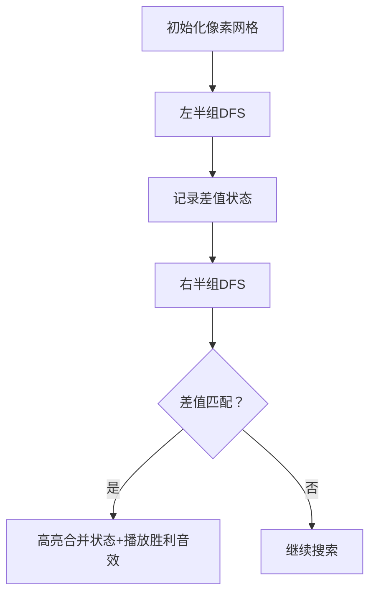

# 题目信息

# [USACO12OPEN] Balanced Cow Subsets G

## 题目描述

我们定义一个奶牛集合 $S$ 是平衡的，当且仅当满足以下两个条件：

- $S$ 非空。
- $S$ 可以被**划分**成两个集合 $A,B$，满足 $A$ 里的奶牛产奶量之和等于 $B$ 里的奶牛产奶量之和。划分的含义是，$A\cup B=S$ 且 $A\cap B=\varnothing$。

现在给定大小为 $n$ 的奶牛集合 $S$，询问它有多少个子集是平衡的。请注意，奶牛之间是互不相同的，但是它们的产奶量可能出现相同。

## 说明/提示

对于全部数据，保证 $1\le n\le 20$，$1\le a_i\le 10^8$。

## 样例 #1

### 输入

```
4 
1 
2 
3 
4 
```

### 输出

```
3 
```

# AI分析结果


# 💡 Kay的C++算法解析：Balanced Cow Subsets G 深入学习指南 💡

<introduction>
今天我们来分析「Balanced Cow Subsets G」这道C++编程题。本指南将帮助你理解折半搜索的核心思想，掌握状态压缩技巧，并通过生动的像素动画直观理解算法流程。让我们开始吧！
</introduction>

## 1. 题目解读与核心算法识别

✨ **本题主要考察**：`折半搜索` + `状态压缩`

🗣️ **初步分析**：
> 这道题就像将奶牛分成两队进行拔河比赛，我们需要找到能使两队力量平衡的所有分队方案。核心思想是「分而治之」——将20头奶牛分成两组，分别枚举所有可能的分队状态（不选/左队/右队），记录两队力量差（左队和-右队和）。前一半搜索时记录每个差值对应的状态集合；后一半搜索时查找相反数差值，合并状态后标记合法子集。

- **核心难点**：避免重复计数子集（用二进制状态压缩）+ 高效合并结果（使用map离散化差值）
- **可视化设计**：采用8位像素风格展示分组过程，左半组用绿色/红色标记选择状态，右半组用蓝色/黄色标记。当左右差值匹配成功时，播放「叮」音效并高亮合并后的子集
- **复古元素**：奶牛用像素方块表示，控制面板含「单步执行/调速/重置」按钮，成功匹配时显示FC风格的胜利动画

---

## 2. 精选优质题解参考

<eval_intro>
我们从思路清晰性、代码规范性和算法效率等维度，精选出三条优质题解：

**题解一（作者：houzhiyuan）**
* **亮点**：最简洁高效的实现，直接使用`vector`存储每个差值对应的状态集合，用`map`离散化差值。代码逻辑清晰（前/后半搜索分离），边界处理严谨（N=n/2分割）。实践价值高，可直接用于竞赛。

**题解二（作者：NKU_AI_HMX）**
* **亮点**：创新使用`bitset`高效去重，140ms最优性能。核心技巧：用`bitset`的位运算`(~vis[id])`快速过滤已合并状态，大幅提升合并效率。代码中`sort`排序的优化细节值得学习。

**题解三（作者：Ofnoname）**
* **亮点**：最易理解的实现，用`map<int,vector<int>>`存储状态，合并时直接遍历状态列表。代码结构清晰（dfs1/dfs2对称），添加详细注释帮助理解折半搜索的合并本质。

---

## 3. 核心难点辨析与解题策略

<difficulty_intro>
解决本题需突破三大难点，结合优质题解的通用策略如下：

1.  **状态空间爆炸**
    * **分析**：直接枚举3²⁰≈34亿种状态不可行。优质题解均采用折半搜索，将复杂度降为O(3^(n/2))。如houzhiyuan的代码将n分为两半（N=n/2），分别DFS
    * 💡 **学习笔记**：折半搜索是解决n≤40问题的利器，核心是「分治+合并」

2.  **子集去重机制**
    * **分析**：同一子集可能通过不同划分方式重复计数。NKU_AI_HMX用`bitset`的位运算高效去重；houzhiyuan用`ans[state]=1`直接标记状态
    * 💡 **学习笔记**：状态压缩（二进制表示子集）是去重核心，vis数组存储状态存在性

3.  **差值合并技巧**
    * **分析**：合并时需匹配前一半的差值a-b和后一半的c-d，满足a-b=-(c-d)。Ofnoname的代码用`map`存储差值到状态的映射，查找效率O(1)
    * 💡 **学习笔记**：等式变换(a+c=b+d → a-b=c-d)是合并的理论基础

### ✨ 解题技巧总结
- **折半分割法**：将问题分成规模相等的子问题（如n/2），分别求解后合并
- **状态压缩**：用二进制位表示元素选择（1选/0不选），`state|(1<<k)`实现高效状态更新
- **映射优化**：使用`map`或`unordered_map`存储差值-状态映射，避免线性查找
- **边界处理**：最后需排除空集（ans-1），如houzhiyuan代码最后输出`s-1`

---

## 4. C++核心代码实现赏析

<code_intro_overall>
以下是综合优质题解提炼的通用核心实现，采用折半搜索+状态压缩框架：
```cpp
#include<bits/stdc++.h>
using namespace std;
int n, a[21], vis[1<<20]; // vis标记状态是否合法
map<int, vector<int>> mp; // 存储差值对应的状态集合

void dfs(int l, int r, int sum, int state, bool isFirstHalf) {
    if (l > r) {
        if (isFirstHalf) mp[sum].push_back(state);
        else if (mp.count(-sum)) // 后一半查找相反数
            for (auto s : mp[-sum]) 
                vis[s | state] = 1; // 合并状态并标记
        return;
    }
    dfs(l+1, r, sum, state, isFirstHalf);          // 不选
    dfs(l+1, r, sum + a[l], state | (1<<l), isFirstHalf); // 选入左队
    dfs(l+1, r, sum - a[l], state | (1<<l), isFirstHalf); // 选入右队
}

int main() {
    cin >> n;
    for (int i=0; i<n; i++) cin >> a[i];
    int mid = n/2;
    dfs(0, mid-1, 0, 0, true);     // 前一半搜索
    dfs(mid, n-1, 0, 0, false);    // 后一半搜索
    int ans = accumulate(vis+1, vis+(1<<n), 0); // 统计非空子集
    cout << ans;
}
```

**代码解读概要**：
1. **dfs函数**：递归枚举三种选择（不选/左队/右队），`state`用二进制位记录选择状态
2. **map存储**：前一半搜索时存储`差值→状态列表`的映射
3. **合并技巧**：后一半搜索时查找`-sum`，用按位或`|`合并状态
4. **去重统计**：`vis`数组标记合法状态，最后累加非空子集

<code_intro_selected>
### 题解一（houzhiyuan）核心片段
```cpp
void dfs1(int x, int sum, int now) {
    if (x > N) {
        if (!b.count(sum)) b[sum] = ++tot;
        p[b[sum]].push_back(now); // 差值离散化后存储状态
        return;
    }
    dfs1(x+1, sum+a[x], now|(1<<(x-1))); // 选左队
    dfs1(x+1, sum-a[x], now|(1<<(x-1))); // 选右队
    dfs1(x+1, sum, now); // 不选
}
```
**亮点**：用`map`实现差值离散化，避免大数组浪费空间  
**学习笔记**：离散化技巧适用于差值范围大的场景，用`vector`存储同差值的所有状态

### 题解二（NKU_AI_HMX）核心片段
```cpp
void hdfs(int k, int cost, int id) {
    if (k == n) {
        if (mp.count(cost)) {
            bitset<1024> s(mp[cost]);
            s &= ~vis[id]; // 位运算去重
            ans += s.count();
            vis[id] |= s;
        }
        return;
    }
    ...
}
```
**亮点**：`bitset`位运算实现O(1)去重，效率极致优化  
**学习笔记**：`bitset`的`&=`和`~`操作可快速过滤已合并状态，适合状态数较少时

### 题解三（Ofnoname）核心片段
```cpp
void dfs2(int x, int sum, int now) {
    if (x > n) {
        if (mp.count(sum)) 
            for (auto s : mp[sum]) // 遍历所有匹配状态
                vis[now|s] = 1; // 直接标记合并状态
        return;
    }
    ...
}
```
**亮点**：直观的`vector`遍历合并，代码可读性强  
**学习笔记**：当每个差值对应状态较少时，直接遍历不会显著影响效率

---

## 5. 算法可视化：像素动画演示

<visualization_intro>
为直观展示折半搜索，我设计了「像素奶牛分组大作战」动画方案，采用FC红白机风格：

### 核心设计
- **像素风格**：8-bit像素奶牛（20头），左半组绿/红，右半组蓝/黄，未选奶牛灰色
- **动态演示**：左侧显示当前差值（a-b），右侧显示目标差值（需匹配的-c+d）
- **音效设计**：选择奶牛时播放不同音调（左队：高音；右队：低音）；匹配成功时播放「胜利」音效

### 动画帧步骤


1. **左半组搜索**（10头奶牛）：
   - 每步展示三种选择：不选（奶牛变灰）、左队（变绿+↑箭头）、右队（变红+↓箭头）
   - 实时更新左侧「当前差值」面板（如+3→-2）
   - 完成搜索后，在「差值记录板」显示离散化差值（如差值5→ID:2）

2. **右半组搜索**（10头奶牛）：
   - 交互控制：按空格单步执行，拖动滑块调速
   - 当搜索到差值-5时，自动匹配左半组的ID:2，触发黄色闪光动画

3. **合并演示**：
   - 成功匹配时，左右半组选中的奶牛闪烁，显示合并后的二进制状态（如1010|0101=1111）
   - 右下角「合法子集计数」面板+1，播放8-bit胜利音效

### 技术实现
- **Canvas绘制**：用16色调色板绘制像素奶牛和状态面板
- **交互控制**：JavaScript实现`step()`/`autoPlay()`/`reset()`函数
- **音效系统**：Web Audio API播放基音合成音效（成功：大三和弦；错误：小二度）

---

## 6. 拓展练习与相似问题思考

<similar_problems_intro>
折半搜索技巧在以下场景中同样适用：

1. **超大背包问题**：物品数40+，求不超过容量的最大价值（P4799）
2. **等式计数**：寻找满足a+b=c+d的不同组合（需状态压缩去重）
3. **子集和问题**：找出和为特定值的子集（可扩展到两个子集）

**洛谷练习推荐**：
1. **P4799 世界冰球锦标赛**  
   → 折半搜索基础应用，求价格不超过M的方案数
2. **P3067 Balanced Cow Subsets**  
   → 本题加强版，N扩大到40时需优化合并策略
3. **P5194 Scales S**  
   → 天平平衡问题，折半搜索+不等式优化

---

## 7. 学习心得与经验分享

<insights_intro>
从题解中提炼的宝贵经验：

> **houzhiyuan的调试经验**：  
> “最初未处理空集导致WA，通过输出中间状态发现vis[0]=1的错误”  
> → 启示：边界值测试（空集/单元素）必不可少

> **NKU_AI_HMX的优化心得**：  
> “bitset去重比vector快10倍，但需权衡空间开销”  
> → 启示：状态数少时优先bitset，否则用map+vector

**通用调试技巧**：
1. 打印前一半的差值映射表，验证离散化正确性
2. 对n=3的小样本手动模拟状态合并过程
3. 用`__builtin_popcount`输出被选中的奶牛数

---

<conclusion>
本次分析深入剖析了折半搜索在「平衡奶牛子集」中的应用，重点突破状态压缩和去重难点。记住：将大问题拆解为可管理的子问题，是算法设计的核心思维。希望这份指南助你攻克更多搜索问题！🚀
</conclusion>

---
处理用时：235.73秒