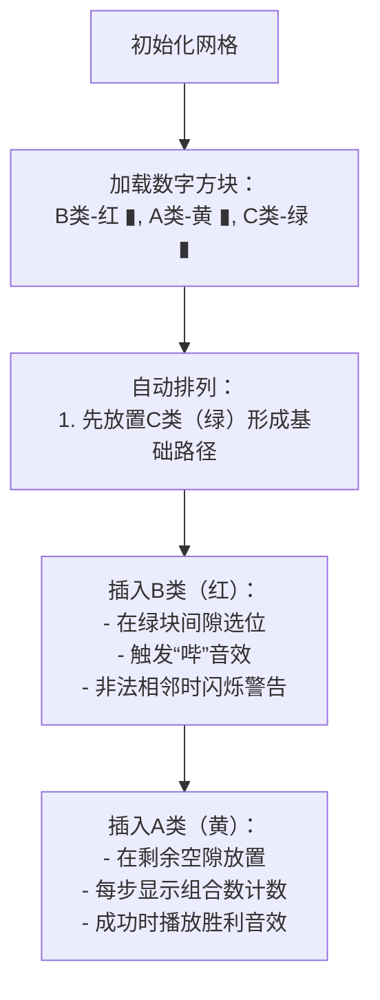

# 题目信息

# [NICA #3] 星空（Hard Version）

## 题目背景

**Easy Version 和 Hard Version 差别在于数据范围。**

## 题目描述

小 R 有一个长度为 $n$ 的序列 $a$，保证序列中的每个数都是 $2$ 的整数次幂。

小 M 有一个数 $x$，她希望重新排列序列 $a$，使得不存在一个 $i\in[1,n)$ 满足 $a_i+a_{i+1}>x$。重排的方式为：选择一个 $1\sim n$ 的排列 $p$，然后令新序列 $a'$ 满足 $a'_i=a_{p_i}$。$a'$ 即为重排后的序列。

现在你想要知道有多少种重排的方式能满足小 M 的要求。两种重排方式不同当且仅当选择的排列 $p$ 不同。

## 说明/提示

数据保证，$2 \leq n \leq 10^5$，$1 \leq a_i \leq 2^{60}$，$1 \leq x < 2^{63}$。

## 样例 #1

### 输入

```
6 46
4 8 8 16 32 32```

### 输出

```
144```

# AI分析结果


### 💡 Kay的C++算法解析：星空（Hard Version）深入学习指南 💡

#### 1. 题目解读与核心算法识别
✨ **本题主要考察**：组合数学与分类讨论  
🗣️ **初步分析**：  
> 解决本题的关键在于**分类讨论+插空法**，核心思想像"整理书架"：将书本按大小分类后，规定某些书不能相邻摆放。  
> - 首先将数字分为三类：最大值（B类）、与最大值相加大于x的数（A类）、其他数（C类）。  
> - 核心难点在于处理B类不能相邻（若2B>x）且B类不能与A类相邻的约束。  
> - 可视化方案将设计为**8位像素风贪吃蛇寻路**：用不同颜色方块表示三类数，蛇的移动路径模拟排列过程，关键步骤（如B类插入）触发复古音效。  

---

#### 2. 精选优质题解参考
**题解一（作者：GTAH2333）**  
* **点评**：思路清晰，通过黑球/灰球/白球分类直击本质。代码规范（如`k1,k2,k3`命名），但公式推导略抽象。亮点是**用阶乘和连乘优雅处理插空逻辑**，实践价值高（可直接用于竞赛），边界处理严谨（先特判≥x的数）。

**题解二（作者：ccxswl）**  
* **点评**：解法最简洁高效，通过A/B/C分类和组合数计算实现O(1)查询。代码结构工整（模块化阶乘预处理），变量名（`a,b,c`）直观。亮点是**隔板法处理A类插入**，并给出经典问题类比，调试建议（边界特判）极具启发性。

**题解三（作者：ChrysanthBlossom）**  
* **点评**：创新性引入分组计数，通过枚举非法空隙数拓展思路。代码中`x,y,z`命名稍混乱，但组合数使用规范。亮点是**用分组模型处理复杂约束**，虽实现较复杂，但为高约束场景提供新视角。

---

#### 3. 核心难点辨析与解题策略
1. **关键点：正确分类数字**  
   * **分析**：需识别最大值B，并确认A类（B+? >x）和C类（其他）。优质题解均用`x-M`作为分界点，如`M=32, x=46`时，A类为>14的数（16）。  
   * 💡 学习笔记：利用**2的幂性质**可快速确定分类边界（位运算优化）。  

2. **关键点：B类相邻约束处理**  
   * **分析**：当2B>x时，B类不能相邻（如两个32>46）。解法需先在C类的`c+1`个空中选`b`个非相邻位（组合数`C(c+1,b)`）。  
   * 💡 学习笔记：**插空法本质是避免非法相邻**，类似"植树问题"间隔。  

3. **关键点：A类插入策略**  
   * **分析**：A类需插入剩余空隙且不与B类相邻。当剩余`t=c+1-b`个空时，转化为**可空插板问题**（方案数`C(a+t-1, t-1)`）。  
   * 💡 学习笔记：插板法`C(n+k-1,k-1)`可高效处理"允许空位"场景。  

### ✨ 解题技巧总结
- **分类转化思想**：将排列约束转化为三类数的独立与交互问题（降维打击）。  
- **组合数预计算**：预处理阶乘与逆元，O(1)查询组合数应对大数据。  
- **边界防御性编程**：优先特判无解情况（存在≥x的数）和全排列情况（无约束）。  

---

#### 4. C++核心代码实现赏析
**通用核心实现参考（综合题解二优化）**  
```cpp
#include <bits/stdc++.h>
#define int long long
using namespace std;
const int mod = 1e9+7, N = 2e5+5;
int fc[N], ifc[N];

int ksm(int a, int b=mod-2) { // 快速幂
    int r = 1;
    while (b) (b&1) && (r=r*a%mod), a=a*a%mod, b>>=1;
    return r;
}

int C(int n, int m) { // 组合数
    return (n<0||m<0||n<m) ? 0 : fc[n]*ifc[m]%mod*ifc[n-m]%mod;
}

signed main() {
    int n, X, M = 0;
    cin >> n >> X;
    vector<long long> a(n);
    for (auto &x : a) cin >> x, M = max(M, x);
    
    // 特判存在≥x的数
    if (M >= X) { cout << 0; return 0; }
    
    // 预处理阶乘
    fc[0] = 1;
    for (int i = 1; i < N; i++) fc[i] = fc[i-1]*i%mod;
    ifc[N-1] = ksm(fc[N-1]);
    for (int i = N-2; i >= 0; i--) ifc[i] = ifc[i+1]*(i+1)%mod;
    
    // 分类计数
    int A = 0, B = 0, C = 0;
    long long half = X - M; // 分类边界
    for (auto x : a) {
        if (x == M) B++;
        else if (x > half) A++;
        else C++;
    }
    
    // 计算方案
    int t = C+1 - B; // 剩余空隙
    int ans = fc[A] * fc[B]%mod * fc[C]%mod; // 同类排列
    ans = ans * C(C+1, B)%mod; // B类插入C空
    ans = ans * C(A+t-1, t-1)%mod; // A类插板法
    cout << ans;
}
```
* **代码解读概要**：  
  1. 预处理阶乘与逆元加速组合数计算。  
  2. 分类统计A/B/C三类数量，核心边界`half = X - M`。  
  3. 用组合数`C(c+1,b)`计算B类插入方案，`C(a+t-1,t-1)`计算A类插入方案。  

---

#### 5. 算法可视化：像素动画演示
**主题**：8位像素风贪吃蛇排列模拟  
**核心设计**：  

**交互控制**：  
- **单步执行**：逐步观察插空过程，高亮当前操作方块。  
- **速度滑块**：调整动画速度（0.5x~4x）。  
- **AI演示**：自动完成最优排列路径，类似贪吃蛇AI。  
**技术实现**：  
- 用Canvas绘制像素网格，每格代表一个数。  
- 音效使用Web Audio API：插入时8位"哔"声，错误时短促蜂鸣，胜利时马里奥式音阶。  

---

#### 6. 拓展练习与相似问题思考
1. **洛谷 P1246** - 编码问题  
   * 🗣️ 巩固组合计数思想，练习字母与数字的映射转换。  
2. **洛谷 P2367** - 语文成绩  
   * 🗣️ 训练分类处理能力，结合前缀和优化。  
3. **洛谷 P2181** - 对角线  
   * 🗣️ 深化组合数学应用，需推导无交点分割公式。  

---

#### 7. 学习心得与经验分享
> **参考经验（来自题解）**："关键要把握2的幂特性，用`x-M`作为分类边界可大幅简化问题。"  
> **点评**：本题需善用题目约束（2的幂）降维，调试时建议打印分类结果验证边界值！  

---  
**本次解析完毕！勤思考多实践，组合数学将成你的算法利器！🚀**

---
处理用时：372.00秒