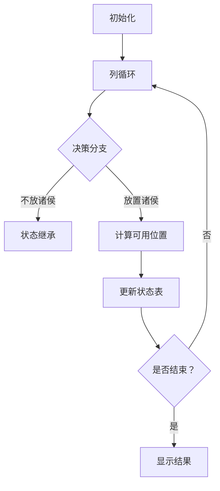

# 题目信息

# 诸侯安置

## 题目描述

很久以前，有一个强大的帝国，它的国土成正方形状，如图所示。

这个国家有若干诸侯。由于这些诸侯都曾立下赫赫战功，国王准备给他们每人一块封地（正方形中的一格）。但是，这些诸侯又非常好战，当两个诸侯位于同一行或同一列时，他们就会开战。如下图为 $n＝3$ 时的国土，阴影部分表示诸侯所处的位置。前两幅图中的诸侯可以互相攻击，第三幅则不可以。


国王自然不愿意看到他的诸侯们互相开战，致使国家动荡不安。  因此，他希望通过合理的安排诸侯所处的位置，使他们两两之间都不能攻击。

现在，给出正方形的边长 $n$，以及需要封地的诸侯数量 $k$，要求你求出所有可能的安置方案数。（满足 $n\le100$，$k\le2n^2-2n+1$）

由于方案数可能很多，你只需要输出方案数除以 $504$ 的余数即可。


## 说明/提示

注意：镜面和旋转的情况属于不同的方案。

## 样例 #1

### 输入

```
2 2

```

### 输出

```
4```

# AI分析结果


### 💡 Kay的C++算法解析：诸侯安置 深入学习指南 💡

#### 1. 题目解读与核心算法识别
✨ **本题主要考察**：动态规划（DP）与问题转化技巧  
🗣️ **初步分析**：  
> 诸侯安置问题本质是棋盘放置类问题的变种。想象一下，就像在复古俄罗斯方块游戏中摆放方块，每个方块（诸侯）不能在同一行或列重叠（防止攻击）。  
> - 核心解法是将菱形网格转化为2n-1列的线性序列（每列长度：1,1,3,3,...,2n-1），再用DP求解
> - 状态定义 `f[i][j]` 表示前i列放置j个诸侯的方案数，转移方程：`f[i][j] = f[i-1][j] + f[i-1][j-1]*(列长度-j+1)`
> - 可视化设计：采用8位像素风格，左侧展示网格（诸侯用闪烁像素块表示），右侧显示状态表。关键帧高亮当前处理的列和状态转移过程，伴随"叮"音效标记放置操作

---

#### 2. 精选优质题解参考
**题解一（Mizuhara）**  
* **点评**：思路最简洁清晰，直接给出O(n²)的DP解法。状态转移逻辑直白（当前列放/不放诸侯），代码规范（变量名`lon[i]`明确表示列长度）。亮点在于空间优化和边界处理（`k>2n-1`时返回0），竞赛实践价值高。

**题解二（2016jzy）**  
* **点评**：图形转化说明直观（展示菱形平铺过程），虽使用三重循环（O(n³)），但更易理解。变量命名可改进（如`hs`），但代码结构完整，特判处理严谨（`k=0`时返回1），适合初学者学习转化思想。

**题解三（一只书虫仔）**  
* **点评**：问题类比精准（类似P1350车的放置），代码规范性强（用`long long`防溢出）。DP实现与主流解法一致，边界处理完整，学习笔记部分帮助理解状态转移逻辑。

---

#### 3. 核心难点辨析与解题策略
1. **图形转化建模**  
   * **分析**：如何将菱形网格转化为2n-1列？优质题解通过平移得到序列[1,1,3,3,...,2n-1]，使DP成为可能
   * 💡 **学习笔记**：不规则图形转线性序列是棋盘问题的通用技巧

2. **状态转移设计**  
   * **分析**：关键在理解`(列长度-j+1)`：前j-1个诸侯已占j-1行，当前列可用行数需减去这些冲突位置
   * 💡 **学习笔记**：DP转移需精确建模约束条件（行列冲突）

3. **边界初始化**  
   * **分析**：`f[i][0]=1`（不放诸侯的方案数），`k=0`时方案数为1，`k>2n-1`时无解
   * 💡 **学习笔记**：边界处理是DP正确性的基石

✨ **解题技巧总结**  
- **图形转化法**：将复杂几何结构转化为线性序列  
- **分层决策思想**：逐列决策（放/不放），分解问题规模  
- **冲突量化**：精确计算剩余可用位置（`len[i]-(j-1)`)  

---

#### 4. C++核心代码实现赏析
**通用核心实现**（综合优质题解优化）  
```cpp
#include <iostream>
using namespace std;
const int P = 504;
int dp[210][210], len[210]; // dp[i][j]: 前i列放j个诸侯的方案数

int main() {
    int n, k; cin >> n >> k;
    if (k > 2*n-1) { cout << 0; return 0; }  // 无解特判
    
    // 初始化列长度：1,1,3,3,...,2n-1
    for (int i = 1; i < n; ++i) 
        len[2*i-1] = len[2*i] = 2*i - 1;
    len[2*n-1] = 2*n - 1;

    // DP初始化：任何列数放0个方案数为1
    for (int i = 0; i <= 2*n-1; ++i) dp[i][0] = 1;

    // 核心DP转移
    for (int i = 1; i <= 2*n-1; ++i)
    for (int j = 1; j <= k; ++j) 
        dp[i][j] = (dp[i-1][j] + dp[i-1][j-1] * (len[i] - j + 1)) % P;
    
    cout << dp[2*n-1][k];
}
```
**代码解读概要**：  
1. 列长度数组`len`存储转化后的网格结构  
2. 双重循环实现DP：外层遍历列，内层遍历诸侯数  
3. 转移方程融合两种决策：不放置（继承前一列）或放置（乘剩余可用位置）  

**题解片段赏析**  
**Mizuhara解法核心**  
```cpp
f[i][k] = f[i-1][k] + f[i-1][k-1]*(lon[i]-k+1);
f[i][k] %= p;  // 取模防溢出
```
> **解读**：  
> - `lon[i]-k+1` 是当前列可用位置数（减去了前k-1个诸侯占用的行）  
> - 如同玩扫雷时标记已占区域，避免冲突  
> 💡 **学习笔记**：DP状态转移需满足无后效性  

**2016jzy解法亮点**  
```cpp
if (i % 2 != 0) hs += 2;  // 动态计算列长度
f[i][j] += f[z][j-1] * (hs - j + 1) % 504;
```
> **解读**：  
> - `hs`动态计算列长度（每奇数列+2）  
> - 三重循环直观展示状态累加过程  
> 💡 **学习笔记**：不同状态定义影响转移复杂度  

---

#### 5. 算法可视化：像素动画演示
**主题**：8位像素风《诸侯征途》DP模拟器  
**核心演示**：动态规划在转化后网格上的逐步决策  



**动画设计细节**：  
1. **像素网格**：左侧展示菱形转化后的2n-1列，每列用不同高度像素柱表示（颜色区分长度）  
2. **状态面板**：右侧实时显示`dp[i][j]`值表格，当前单元格高亮闪烁  
3. **关键交互**：  
   - 步进模式：按列推进，显示`dp[i][j] = dp[i-1][j] + dp[i-1][j-1]*(len[i]-j+1)`  
   - 音效设计：放置诸侯时"叮"声，状态更新时"哒"声，完成时胜利音效  
4. **游戏化元素**：  
   - 每列作为一关，通关后点亮像素星星  
   - 速度滑块控制AI自动演示（类似贪吃蛇AI）  
   - 错误放置时播放短促警告音  

---

#### 6. 拓展练习与相似问题思考
**通用技巧迁移**：  
棋盘放置问题的核心——约束转化（行列冲突）和状态压缩，适用于：  
1. 车/皇后放置问题（如八皇后变形）  
2. 网格路径规划（带障碍物）  
3. 图形覆盖问题（多米诺骨牌覆盖）  

**洛谷练习推荐**：  
1. **P1350 车的放置**  
   🗣️ 推荐理由：同样需处理行列约束，巩固棋盘转化技巧  
2. **P1896 互不侵犯**  
   🗣️ 推荐理由：状态压缩DP经典题，提升位运算应用能力  
3. **P1219 八皇后**  
   🗣️ 推荐理由：回溯与DFS基础，理解约束传递本质  

---

#### 7. 学习心得与经验分享
> **经验摘录（Mizuhara）**：  
> “通过平移将菱形转化为线性序列是解题关键，这种转化思想可扩展到其他不规则图形问题。”  
>   
> **Kay点评**：  
> 图形转化是棋盘类问题的通用突破点，类似拼图时旋转碎片寻找适配角度。调试时建议模拟n=2的小规模案例验证状态转移  

---
> 掌握诸侯安置的核心在于：**转化建模能力**与**DP状态设计**。尝试用像素动画工具可视化自己的DP代码，能大幅提升理解深度！下次我们继续探索动态规划的奇妙世界~ 🎮🚀

---
处理用时：219.68秒