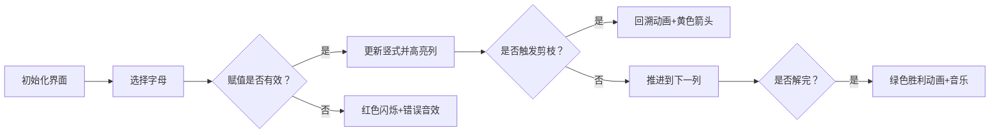

# 题目信息

# [NOIP 2004 提高组] 虫食算

## 题目描述

所谓虫食算，就是原先的算式中有一部分被虫子啃掉了，需要我们根据剩下的数字来判定被啃掉的数字。来看一个简单的例子：

$$\begin{aligned}
 \verb!43#9865#045! \\
+\qquad \verb!8468#6633! \\[-1em]\underline{\kern{8em}} \\
 \verb!44445509678! \\
\end{aligned}$$

其中 `#` 号代表被虫子啃掉的数字。根据算式，我们很容易判断：第一行的两个数字分别是 $5$ 和 $3$，第二行的数字是 $5$。

现在，我们对问题做两个限制：

首先，我们只考虑加法的虫食算。这里的加法是 $n$ 进制加法，算式中三个数都有 $n$ 位，允许有前导的 $0$。

其次，虫子把所有的数都啃光了，我们只知道哪些数字是相同的，我们将相同的数字用相同的字母表示，不同的数字用不同的字母表示。如果这个算式是 $n$ 进制的，我们就取英文字母表的前 $n$ 个大写字母来表示这个算式中的 $0$ 到 $n - 1$ 这 $n$ 个不同的数字：但是这 $n$ 个字母并不一定顺序地代表 $0$ 到 $n-1$。输入数据保证 $n$ 个字母分别至少出现一次。

$$\begin{aligned}
 \verb!BADC! \\
+\quad \verb!CBDA! \\[-1em]\underline{\kern{4em}} \\
 \verb!DCCC! \\
\end{aligned}$$

上面的算式是一个4进制的算式。很显然，我们只要让 $\verb!ABCD!$ 分别代表 $0123$，便可以让这个式子成立了。你的任务是，对于给定的 $n$ 进制加法算式，求出 $n$ 个不同的字母分别代表的数字，使得该加法算式成立。输入数据保证有且仅有一组解。


## 说明/提示

#### 数据规模与约定

- 对于 $30\%$ 的数据，保证 $n \le 10$；
- 对于 $50\%$ 的数据，保证 $n \le 15$；
- 对于 $100\%$ 的数据，保证 $1 \leq n \leq 26$。

## 样例 #1

### 输入

```
5
ABCED
BDACE
EBBAA
```

### 输出

```
1 0 3 4 2
```

# AI分析结果


### 💡 Kay的C++算法解析：虫食算 深入学习指南 💡

**引言**  
今天我们一起分析NOIP 2004提高组"虫食算"。这道题要求解决字母替换数字的n进制加法谜题，我们将通过搜索剪枝技巧高效解题。

---

## 1. 题目解读与核心算法识别

✨ **本题主要考察**：`DFS剪枝优化` 与 `约束满足问题`  

🗣️ **初步分析**：  
> 虫食算如同破解密码锁：每个字母代表0~n-1的独特数字，需满足n进制加法规则。核心解法是DFS枚举字母赋值，但直接枚举O(n!)会超时，需要**剪枝优化**。  

- **核心难点**：  
  1. 搜索空间巨大（26!≈4e26）  
  2. 需处理n进制进位机制  
  3. 保证字母数字映射唯一性  

- **剪枝策略**：  
  - **当前列剪枝**：当三个字母已知时，检查是否满足`(A+B)%n=C`或`(A+B+1)%n=C`  
  - **最高位剪枝**：首位相加不能≥n（防止进位导致位数增加）  
  - **搜索顺序优化**：从低位向高位搜索（右→左）  

- **可视化设计**：  
  采用8位像素风格计算器界面，动态展示：  
    
  1. 红色闪烁框指示当前赋值字母  
  2. 绿色/红色高亮显示满足/冲突的列  
  3. 黄色箭头表示进位传递  
  4. 控制面板含单步执行/自动播放（调速滑块）  
  5. 音效：赋值（叮）、冲突（哔）、成功（胜利旋律）

---

## 2. 精选优质题解参考

**题解一：zzlzk（思路最清晰）**  
* **亮点**：  
  - 双剪枝策略（当前列+最高位）逻辑严谨  
  - 引入`Next数组`优化搜索顺序（低位→高位）  
  - 代码变量命名规范（`num[]`，`used[]`）  
  - 完整注释+手绘示意图辅助理解  

**题解二：feecle6418（教学价值高）**  
* **亮点**：  
  - 对比两种搜索顺序（字母序→算式序）的性能差异  
  - 提供50→100分的优化路径，适合初学者  
  - 强调"动手模拟竖式"的调试方法  

**题解三：Tgotp（效率最优）**  
* **亮点**：  
  - "知二求一"策略（已知两字母可推导第三个）  
  - 实时全局剪枝（`pd()`检查所有列）  
  - 44ms超快实现（竞赛级优化）  

---

## 3. 核心难点辨析与解题策略

1. **搜索顺序的选择**  
   * **分析**：  
     按字母表顺序搜索（A→Z）可能导致高位先赋值，但低位冲突时需大规模回溯。优质题解均采用**从右向左（低位→高位）** 顺序，因进位传递使约束更早生效。  
   * 💡 **学习笔记**：搜索顺序决定剪枝效率，优先处理约束更强的位置。

2. **剪枝的及时性**  
   * **分析**：  
     - zzlzk在每次递归前用`CanPrune()`检查  
     - Tgotp用`pd()`实时验证所有已知列  
     - 共同点：当发现`(A+B) mod n ≠ C`且`(A+B+1) mod n ≠ C`时立即回溯  
   * 💡 **学习笔记**：剪枝函数应轻量且高频调用。

3. **进位传递的实现**  
   * **分析**：  
     - zzlzk在最终`Judge()`统一计算进位  
     - Tgotp用`k[]`数组实时记录进位状态  
     - 关键：进位值只能是0或1（n≥2时）  
   * 💡 **学习笔记**：进位是列间唯一关联，需显式存储。

### ✨ 解题技巧总结
- **约束优先**：优先搜索低位/高频出现的字母  
- **即时验证**：每赋值一个字母就检查相关列  
- **降序枚举**：数字从大到小尝试（n-1→0）加速找到解  
- **防御性编程**：用`num[]=-1`标记未赋值字母  

---

## 4. C++核心代码实现赏析

**通用核心实现（综合优化版）**：
```cpp
#include <iostream>
#include <cstring>
using namespace std;
const int N = 27;
int n, num[N], k[N]; // num:字母对应值, k:进位
char s1[N], s2[N], s3[N];
int A[N], B[N], C[N], Next[N], cnt;
bool used[N];

// 剪枝：检查当前列是否可能
bool prune(int col) {
    if (num[A[col]] != -1 && num[B[col]] != -1) {
        if (col == 0 && num[A[0]] + num[B[0]] >= n) 
            return true; // 最高位剪枝
        if (num[C[col]] != -1) {
            int sum = num[A[col]] + num[B[col]] + k[col];
            if (sum % n != num[C[col]] && (sum+1) % n != num[C[col]]) 
                return true; // 当前列剪枝
        }
    }
    return false;
}

void dfs(int col) {
    if (col == n) { 
        /* 验证并输出 */ 
        return; 
    }
    if (prune(col)) return;

    int idx = Next[col]; // 当前处理字母
    for (int i = n-1; i >= 0; i--) {
        if (!used[i]) {
            used[i] = true;
            num[idx] = i;
            dfs(col + 1);
            used[i] = false;
            num[idx] = -1;
        }
    }
}

int main() {
    cin >> n >> s1 >> s2 >> s3;
    // 初始化字母索引（略）
    // 确定Next[]搜索顺序（从右向左）
    dfs(0);
}
```

---

**题解一：zzlzk 片段赏析**  
* **亮点**：双剪枝策略 + Next数组优化  
* **核心代码**：
  ```cpp
  bool CanPrune() {
      if (num[a[0]] + num[b[0]] >= n) return true; // 最高位剪枝
      for (int i = n-1; i >= 0; i--) {
          if (/* 三个字母已知且不满足等式 */) return true;
      }
      return false;
  }
  void GetNext(int x) { // 建立搜索顺序
      if (!used[x]) Next[cnt++] = x;
  }
  ```
* **解读**：  
  > `CanPrune()`像安检员，在每次递归前快速排查非法状态。`GetNext()`从右向左（i=n-1→0）收集字母，确保先搜索低位字母。  
  💡 **学习笔记**：剪枝函数应O(1)~O(n)复杂度，避免成为性能瓶颈。

**题解三：Tgotp 片段赏析**  
* **亮点**："知二求一"策略 + 实时全局验证  
* **核心代码**：
  ```cpp
  bool pd(int i) {
      while (i--) {
          if (/* 三个字母已知且不满足 */) return true;
      }
      return false;
  }
  void dfs(int temp) {
      if (pd(temp)) return; // 实时全局剪枝
      /* 知二求一赋值逻辑 */
  }
  ```
* **解读**：  
  > `pd()`像监控摄像头，遍历所有列检查冲突。当已知两个字母时，直接计算第三个值（需检查数字重复），大幅减少递归层数。  
  💡 **学习笔记**：局部推导+全局验证=高效剪枝组合拳。

---

## 5. 算法可视化：像素动画演示

**主题**：复古计算器解密  
**核心演示**：DFS搜索过程 + 剪枝触发  

**动画设计**：  


**实现细节**：  
1. **像素风格**：  
   - 8位FC红白机配色（4色调色板）  
   - 字母：16x16像素方块  
   - 竖式背景：网格砖块纹理  

2. **关键动画**：  
   - **赋值**：字母方块下落数字+“叮”声  
   - **进位**：黄色光点从左向右流动  
   - **剪枝**：冲突列红色闪烁3次+“哔”声  
   - **回溯**：当前列字母变灰并清空  

3. **交互控制**：  
   - 单步执行：空格键逐字母探索  
   - 自动模式：AI演示（速度可调）  
   - 调试面板：显示当前搜索深度/剪枝次数  

4. **音效设计**：  
   - 背景音乐：8位芯片风格循环  
   - 成功音效：《超级玛丽》过关旋律  
   - 错误音效：短促"哔"声（FC游戏错误音）  

---

## 6. 拓展练习与相似问题思考

**通用技巧迁移**：  
1. **数独问题**：同样需满足行列约束的赋值问题  
2. **八皇后问题**：对角线剪枝 vs 虫食算进位剪枝  
3. **图着色问题**：相邻约束 → 字母数字唯一约束  

**洛谷推荐**：  
1. **P1786 数独**  
   🗣️ *巩固DFS+约束传播，虫食算的"平面版"*  
2. **P1219 八皇后**  
   🗣️ *学习对角线剪枝，理解空间约束*  
3. **P1074 靶形数独**  
   🗣️ *进阶约束满足+最优性剪枝*  

---

## 7. 学习心得与经验分享

**来自 zzlzk 的调试经验**：  
> “我在剪枝函数卡了很久，后来画竖式示意图才发现漏了进位+1的情况”  

**Kay的总结**：  
> 虫食算教会我们：  
> 1. **可视化调试**：动手画图＞空想逻辑  
> 2. **剪枝优先级**：当前列约束＞进位约束＞全局约束  
> 3. **搜索顺序**：从强约束位置突破（如低位/高频字母）  

---

**结语**  
通过DFS剪枝，我们破解了虫食算的密码！记住：好算法=正确性+剪枝优化+实时验证。下次挑战数独时，你会做得更好！💪

---
处理用时：174.70秒