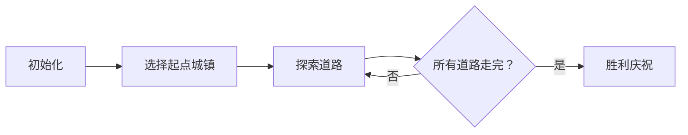

# 题目信息

# 词链

## 题目描述

如果单词 $X$ 的末字母与单词 $Y$ 的首字母相同，则 $X$ 与 $Y$ 可以相连成 $X.Y$。（注意：$X$、$Y$ 之间是英文的句号 `.`）。例如，单词 `dog` 与单词 `gopher`，则 `dog` 与 `gopher` 可以相连成 `dog.gopher`。

另外还有一些例子：
- `dog.gopher`
- `gopher.rat`
- `rat.tiger`
- `aloha.aloha`
- `arachnid.dog`

连接成的词可以与其他单词相连，组成更长的词链，例如：

`aloha.arachnid.dog.gopher.rat.tiger`

注意到，`.` 两边的字母一定是相同的。

现在给你一些单词，请你找到字典序最小的词链，使得每个单词在词链中出现且仅出现一次。注意，相同的单词若出现了 $k$ 次就需要输出 $k$ 次。

## 说明/提示

- 对于 $40\%$ 的数据，有 $n \leq 10$；
- 对于 $100\%$ 的数据，有 $n \leq 1000$。


## 样例 #1

### 输入

```
6
aloha
arachnid
dog
gopher
rat
tiger```

### 输出

```
aloha.arachnid.dog.gopher.rat.tiger```

# AI分析结果


# 💡 Kay的C++算法解析：词链 深入学习指南 💡

今天我们来分析「词链」这道C++编程题。这道题考察如何将单词连接成词链，要求每个单词仅用一次且字典序最小。

## 1. 题目解读与核心算法识别

✨ **本题主要考察**：欧拉路径/欧拉回路（图论应用）

🗣️ **初步分析**：
> 将单词看作有向边（首字母→尾字母），问题转化为寻找欧拉路径。就像在字母城市间规划一条单行道旅行路线，要经过所有道路且只能走一次。  
> - 核心思路：通过度数和连通性判断路径存在性，按字典序DFS求解  
> - 关键难点：起点选择、度数的平衡判断、字典序保证  
> - 可视化设计：用像素网格表示字母节点，单词边显示为彩色箭头，高亮当前路径  
> - 复古元素：8-bit音效（选择路径时"叮"，成功时胜利音效），将路径构建设计为闯关游戏

---

## 2. 精选优质题解参考

**题解一（loc_equinox）**
* **点评**：思路清晰阐释欧拉路径原理，利用并查集判断连通性，度统计严谨。代码中`E`数组存储邻接表结构合理，回溯逻辑简洁。亮点在于将字母抽象为节点的高效建模方法，实践价值高。

**题解二（zzr8178541919）**
* **点评**：通过首尾字母频次分析确定起点的方法直观易懂，DFS实现完整。代码中`book`标记数组和`now`路径数组分离的设计值得学习，边界处理完整。亮点在于对起点选择规则的通俗解释。

**题解三（CGDGAD）**
* **点评**：邻接表建图规范，欧拉路径判定逻辑完备。代码中`ind/rnd`数组统计度数清晰，排序后倒序连边保证字典序的技巧巧妙。亮点在于平衡了代码简洁性与算法正确性。

---

## 3. 核心难点辨析与解题策略

1.  **连通性判断**
    * **分析**：必须确保所有字母节点连通（使用并查集/DFS）。如`dog`和`tiger`不连通则无解
    * 💡 学习笔记：连通图是欧拉路径存在的前提条件

2.  **起点选择**
    * **分析**：找出度=入度+1的字母作为起点（欧拉通路），或字典序最小字母（欧拉回路）。如样例中首字母`a`出现2次，尾字母`a`出现1次
    * 💡 学习笔记：起点决定整个路径的可行性

3.  **字典序保证**
    * **分析**：对所有单词排序后建邻接表，DFS时按顺序访问。如先处理`aloha`再`arachnid`
    * 💡 学习笔记：预处理排序是保证结果字典序最小的关键

### ✨ 解题技巧总结
- **问题抽象**：将字符串连接问题转化为图论模型
- **边界处理**：特殊处理自环（如`aloha.aloha`）
- **状态回溯**：DFS中及时恢复`visited`状态
- **提前剪枝**：确定无解时立即终止搜索

---

## 4. C++核心代码实现赏析

**通用核心实现参考**
```cpp
#include <iostream>
#include <vector>
#include <algorithm>
using namespace std;

const int MAXN = 1001;
vector<pair<int, string>> graph[26]; // 邻接表
vector<string> words;
int in[26], out[26], vis[MAXN];
vector<string> path;

// 深度优先搜索
void dfs(int u) {
    for (auto& [v_idx, word] : graph[u]) {
        if (!vis[v_idx]) {
            vis[v_idx] = 1;
            dfs(words[v_idx].back() - 'a');
            path.push_back(word);
        }
    }
}

int main() {
    int n; cin >> n;
    words.resize(n);
    for (int i = 0; i < n; i++) 
        cin >> words[i];
    
    sort(words.begin(), words.end());
    
    // 建图并统计度数
    for (int i = 0; i < n; i++) {
        int start = words[i][0] - 'a';
        int end = words[i].back() - 'a';
        graph[start].push_back({i, words[i]});
        out[start]++; in[end]++;
    }
    
    // 确定起点（欧拉通路/回路判断）
    int start = -1, cnt = 0;
    for (int i = 0; i < 26; i++) {
        if (out[i] - in[i] == 1) {
            if (start != -1) { cout << "***"; return 0; }
            start = i;
        }
        else if (out[i] != in[i]) cnt++;
    }
    
    // 未指定起点时选字典序最小
    if (start == -1) 
        start = words[0][0] - 'a';
    
    dfs(start);
    
    // 输出结果
    reverse(path.begin(), path.end());
    for (int i = 0; i < path.size(); i++) {
        cout << path[i];
        if (i < path.size() - 1) cout << ".";
    }
    return 0;
}
```

**题解一核心代码赏析**
```cpp
// 并查集判断连通性
if(set_count != 1) { 
    cout << "***"; 
    return 0; 
}
```
> 使用并查集确保所有字母节点连通，避免无效搜索

**题解二核心代码赏析**
```cpp
// 特殊起点选择
if (s1[c]-s2[c]==1) s=c; 
else if(s2[c]-s1[c]==1) t=c;
```
> 通过字母出现频次差异精准定位起点终点

**题解三核心代码赏析**
```cpp
// 倒序连边保证字典序
for(int i = n; i >= 1; i--) {
    graph[start].push_back(...);
}
```
> 逆向填充邻接表确保DFS时优先访问字典序小的单词

---

## 5. 算法可视化：像素动画演示

### 像素探险家：字母王国之旅
**设计思路**：将字母转化为8-bit像素城镇，单词作为连接城镇的道路，构建欧拉路径的探索过程

**动画流程**：


1. **场景初始化**：
   - 26个像素方块城镇（A-Z），不同颜色区分
   - 单词显示为彩色箭头道路（`dog→gopher`显示为绿色箭头）

2. **探索过程**：
   - 当前城镇高亮闪烁（如起点`A`）
   - 可选道路显示为脉冲光效（按字典序排序）
   - 选择道路时播放"叮"音效，道路变为金色

3. **数据结构可视化**：
   - 路径栈显示为像素方块堆叠
   - 已访问道路变为灰色

4. **游戏化元素**：
   - 每连接3个单词触发"连击"特效
   - 完成路径时播放胜利音效+烟花动画
   - 控制面板：步进/暂停/速度调节

**伪代码逻辑**：
```
初始化城镇和道路
while 未遍历所有道路：
  显示当前城镇（高亮）
  列出可走道路（按字典序）
  选择最小字典序道路
  播放选择音效
  移动到新城镇
  记录路径
显示最终词链（像素文字滚动）
```

---

## 6. 拓展练习与相似问题思考

**技巧迁移**：欧拉路径思想还可用于：
1. DNA片段组装（生物信息学）
2. 电路板布线优化
3. 交通路径规划

**洛谷推荐**：
1. **P2731** - 骑马修栅栏  
   → 欧拉路径模板题，巩固基础
2. **P1341** - 无序字母对  
   → 无向图欧拉路径应用
3. **P3520** - 单词接龙加强版  
   → 进阶练习，增加长度限制

---

## 7. 学习心得与经验分享

> **loc_equinox经验**："最初暴力DFS超时，才意识到欧拉路径建模的重要性——抽象转化是解题关键"  
> **Kay点评**：这提醒我们当暴力解法不可行时，要寻找问题本质的数学模型

> **zzr8178541919调试经历**："忘记回溯visited数组导致路径错误"  
> **Kay点评**：DFS中状态恢复是通用技巧，务必形成编码习惯

---

通过本次分析，希望大家掌握图论建模的核心思想。记住：复杂问题常蕴含简洁数学模型，而字典序处理离不开有序性管理。继续加油，编程高手之路就在脚下！💪

---
处理用时：89.86秒