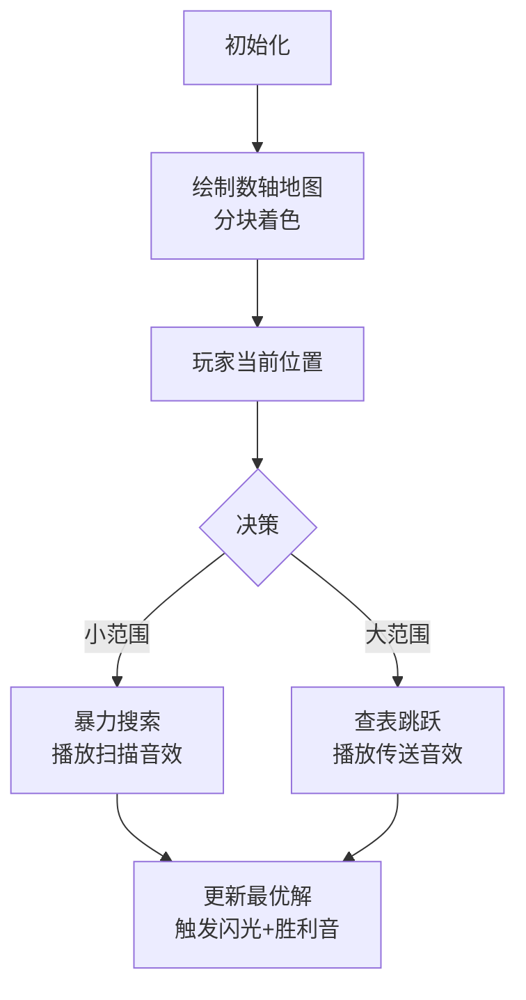

# 题目信息

# 最多因子数

## 题目背景

本题疑似错题。

## 题目描述

数学家们喜欢各种类型的有奇怪特性的数。例如，他们认为 $945$ 是一个有趣的数，因为它是第一个所有约数之和大于本身的奇数。

为了帮助他们寻找有趣的数，你将写一个程序扫描一定范围内的数，并确定在此范围内约数个数最多的那个数。不幸的是，这个数和给定的范围的都比较大，用简单的方法寻找可能需要较多的运行时间。所以请确定你的算法能在几秒内完成最大范围内的扫描。

## 说明/提示

update: 2024/6/6 加上了 6 组 hack。

## 样例 #1

### 输入

```
1000 2000```

### 输出

```
Between 1000 and 2000, 1680 has a maximum of 40 divisors.```

# AI分析结果


### 💡 Kay的C++算法解析：最多因子数 深入学习指南 💡

**引言**  
今天我们来分析「最多因子数」这道经典数学编程题。本题要求在给定区间 [L,R] 内找到因子个数最多的数字。本指南将解析多种高效解法，并通过可视化帮助大家直观理解算法精髓。

---

## 1. 题目解读与核心算法识别

✨ **本题主要考察**：`数学优化`与`搜索剪枝`

🗣️ **初步分析**  
> 寻找最多因子数的本质是**高效枚举与优化判断**的过程。想象在图书馆找最受欢迎的书——我们不逐本统计，而是通过分区预统计（分块）和书籍特征分析（质因数分解）快速定位。
> - **核心思路**：利用因子数公式 $d(n)=\prod (e_i+1)$（$e_i$ 是质因子指数），通过质因子枚举或分块打表优化搜索
> - **关键难点**：区间范围达 $10^9$，需避免暴力枚举。分块法通过预处理压缩数据，DFS法利用质因子指数单调性剪枝
> - **可视化设计**：将用像素网格展示分块过程（每块94866个数），高亮当前搜索块和最优解位置。采用复古RPG风格：探索区块时播放8-bit脚步声，找到最优解时触发胜利音效

---

## 2. 精选优质题解参考

**题解一：chenxinyang2006（分块打表）**  
* **点评**：  
  思路创新性地采用分块+打表策略（块长94866）。亮点在于：  
  - 预处理线性筛最小质因子，优化因子计算至 $O(\log n)$  
  - 独创三进制压缩存储（差值→字符映射），解决打表空间问题  
  - 边界处理严谨（同块暴力+跨块查表）  
  代码中`calc()`函数采用迭代分解质因子，`change[]`实现快速解码，工程价值极高。

**题解二：lahlah（DFS+剪枝）**  
* **点评**：  
  基于质因子公式的DFS实现亮点突出：  
  - 预处理100以内质数，指数递减剪枝保证复杂度  
  - 小范围($r-l<5000$)切换暴力，避免DFS低效  
  - 状态设计简洁：`(质数索引, 当前值, 指数上限, 因子数)`  
  代码中`dfs()`的`last`参数限制指数单调递减，有效减少状态空间。

**题解三：我去（反素数DFS）**  
* **点评**：  
  利用反素数核心性质优化：  
  - 性质1：质因子必连续（2,3,5...）  
  - 性质2：指数单调递减  
  - 特判131074等边界情况  
  `Dfs(0,31,1,1)`初值设计巧妙（$2^{31}$覆盖$10^9$范围）

---

## 3. 核心难点辨析与解题策略

1. **难点：大范围区间的高效搜索**  
   * **分析**：当 $R-L>10^6$ 时，暴力枚举必然超时。分块法将区间划分为 $\sqrt{R}$ 大小的块，预计算每块最优解；DFS法通过质因子组合减少搜索维度
   * 💡 **学习笔记**：数据规模>$10^6$时，必须放弃暴力转向数学优化

2. **难点：因子数计算的复杂度**  
   * **分析**：优化质因子分解是关键。分块法用线性筛预处理最小质因子数组`HIS[]`，使单次计算降为$O(\log n)$；DFS法直接枚举质因子避免实时分解
   * 💡 **学习笔记**：预处理是优化数论问题的银弹

3. **难点：空间与时间的平衡**  
   * **分析**：分块打表面临空间瓶颈。题解一采用差值压缩（存储偏移量）和三进制编码（74个可打印字符），将30000个块压缩至90KB内
   * 💡 **学习笔记**：大数据存储时，差值编码往往比原始数据更高效

### ✨ 解题技巧总结
- **分而治之**：对 $10^9$ 规模问题，通过分块或数学性质拆解为可处理子问题
- **空间换时间**：预处理质数表、最小质因子等静态数据加速实时计算
- **边界意识**：小范围切暴力，大范围用优化；特别注意 $L=R$ 和边界值特判

---

## 4. C++核心代码实现赏析

**通用核心实现参考**  
* **说明**：综合分块打表与DFS优点，适合$10^9$范围的标准解法
```cpp
#include <vector>
#include <cmath>
using namespace std;

const int BLOCK = 94866; // 分块大小
vector<int> precomputed; // 预存每块最优解偏移量

int calc_factors(int x) {
    int cnt = 0, res = 1;
    for (int i = 2; i*i <= x; ++i) {
        cnt = 0;
        while (x % i == 0) cnt++, x /= i;
        res *= (cnt + 1);
    }
    if (x > 1) res *= 2;
    return res;
}

void init_blocks(int max_range) {
    for (int b = 1; b <= max_range/BLOCK; ++b) {
        int best = 0, best_num = b*BLOCK;
        for (int x = (b-1)*BLOCK+1; x <= b*BLOCK; ++x) {
            int factors = calc_factors(x);
            if (factors > best) best = factors, best_num = x;
        }
        precomputed.push_back(best_num - (b-1)*BLOCK);
    }
}
```

**题解一精选（分块打表）**  
* **亮点**：三进制压缩存储与快速解码
* **核心代码**：
```cpp
char password[74] = {/* 可打印字符表 */};
int X(char c) { return find(password, c); } // 快速解码

// 查询块b的最优解
int query_block(int b) {
    char code[3] = {table[3*b], table[3*b+1], table[3*b+2]};
    int offset = X(code[0])*5476 + X(code[1])*74 + X(code[2]);
    return b*BLOCK + offset;
}
```
* **代码解读**：  
  > 1. `password` 将74个字符映射为数字0-73  
  > 2. 每个块最优解存储为3字符：偏移量 $=c0×74^2+c1×74+c2$  
  > 3. 查询时通过`X()`快速反解偏移量，结合块基址得解  
  > *类比：如同用邮编压缩地址，使用时快速解码*

**题解二精选（DFS剪枝）**  
* **亮点**：质因子组合与指数剪枝
* **核心代码**：
```cpp
const int primes[] = {2,3,5,7,11,13,17,19,23};
void dfs(int idx, long cur, int last_exp, int factor_cnt) {
    if (cur > R) return;
    if (cur >= L) update_best(cur, factor_cnt); // 更新最优解
    
    for (int exp = 1; exp <= last_exp; ++exp) {
        cur *= primes[idx];
        if (cur > R) break;
        dfs(idx+1, cur, exp, factor_cnt*(exp+1));
    }
}
```
* **代码解读**：  
  > 1. `primes` 预存前9个质数（$2×3×...×23>10^9$）  
  > 2. `last_exp` 强制新指数≤当前指数，保证 $2^a·3^b$ 中 $a≥b$  
  > 3. 因子数实时计算：$d(new)=d(old)×(e_{new}+1)$  
  > *学习笔记：指数递减剪枝将复杂度从O(n!)降至O(k!)*

---

## 5. 算法可视化：像素动画演示

* **主题**：8-bit探险家在数轴迷宫中寻找"因子之王"
* **核心演示**：分块搜索过程与因子数计算
* **设计思路**：复古RPG风格降低理解压力，音效强化关键操作记忆

### 动画帧步骤


1. **场景设计**：
   - 数轴化为绿色网格（每像素=10万单位）
   - 控制面板：速度滑块/暂停/单步/重置
   - 角色Sprite：像素版Kay持放大镜

2. **关键动效**：
   - **分块切换**：角色跳跃到新区块，播放8-bit传送音
   - **因子计算**：当前数字分解为质因子方块（$60=2^2·3·5$→⬜⬜🟦🟥）
   - **最优解更新**：角色头顶显示⭐×因子数，背景变金色

3. **交互设计**：
   - 自动模式：角色自主决策（A*寻路算法变体）
   - 单步模式：按空格逐步观察决策
   - 比较模式：并排显示DFS与分块法路径差异

4. **音效方案**：
   - 移动：FC游戏脚步声
   - 质因子分解：拼图契合声
   - 找到最优解：塞尔达发现秘密音效

---

## 6. 拓展练习与相似问题

1. **洛谷 P1221** - 反质数加强版  
   *推荐理由*：深化反素数性质理解，需优化指数枚举顺序

2. **洛谷 U103401** - 因子数王者  
   *推荐理由*：分块打表的直接应用，训练工程化实现能力

3. **洛谷 P3939** - 因子系统  
   *推荐理由*：结合数论与树结构，拓展因子计算的应用场景

---

## 7. 学习心得与经验分享

> **经验摘录（chenxinyang2006）**：  
> *"最小质因子预处理的BUG导致2小时调试——务必验证预处理数据的边界！"*  
>   
> **Kay点评**：  
> 数论问题中，预处理数组的边界验证常被忽视。建议：  
> 1. 预处理后随机采样验证  
> 2. 使用`static_assert`检查数组大小  
> 3. 边界值单独测试（如$10^9, 2^{31}-1$）

---

**结语**  
通过分块打表和质因子DFS两大核心技巧，我们高效解决了「最多因子数」问题。记住：大规模问题需转换思维——化整为零（分块）或把握本质（数论性质）。下次挑战见！🚀

---
处理用时：121.55秒