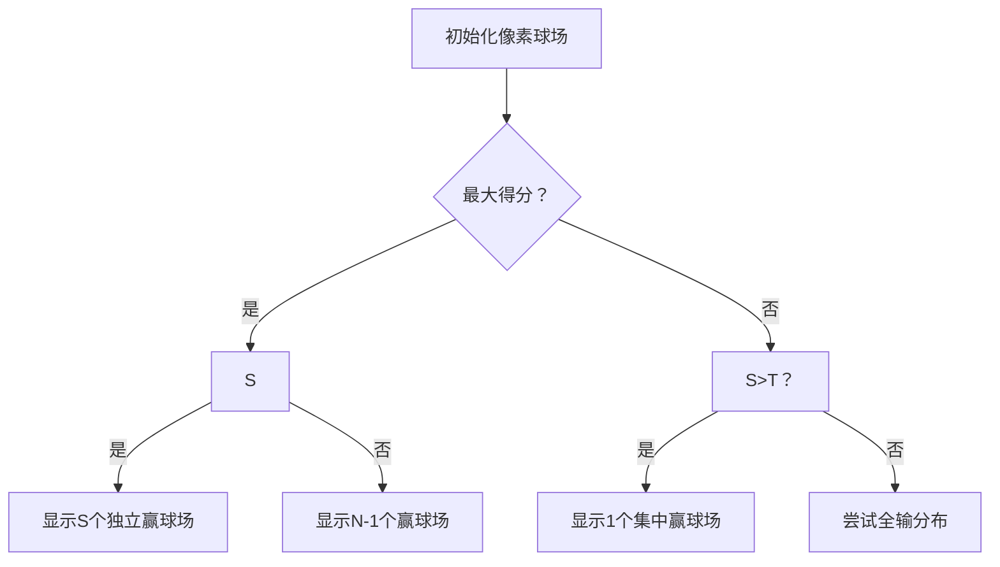

# 题目信息

# 足球

## 题目描述

我们当中有很多热爱中国足球的同学，我们都知道中超（中国足球超级联赛）的规则：

一场比赛中，若获胜（即你的得分严格大于对手得分）则获得 $3$ 的积分，若打平（即你的得分等于对手得分）则获得 $1$ 分，若失败（即你的得分严格小于对手得分）获得 $0$ 积分。

这个问题很简单，假设 $N$ 轮比赛中你一共攻入 $S$ 个球，丢掉 $T$ 个球，那么你可能获得的最大得分和最小得分是多少？

## 样例 #1

### 输入

```
1 1 1
1 1 2```

### 输出

```
1 1
3 2
```

# AI分析结果


# 💡 Kay的C++算法解析：足球 深入学习指南 💡

**大家好！我是Kay，今天我们一起分析「足球」这道有趣的C++贪心题。本指南将帮你理解如何通过进球/丢球分布策略计算最大最小得分，并用像素动画直观展示策略执行过程。**

## 1. 题目解读与核心算法识别

✨ **本题主要考察**：`贪心策略`与`分类讨论`  

🗣️ **初步分析**：
> 这道题就像在安排足球比赛策略：我们要用有限的进球(S)和丢球(T)在N场比赛中最大化或最小化积分。核心思想是**通过集中分配资源控制胜负平场次**：
> - **最大化得分**：尽量多赢球（每场1-0），将丢球集中在一场减少损失
> - **最小化得分**：尽量多输球（每场0-1），或将进球集中在一场减少胜场
>
> **关键难点在于处理边界条件**：当S=0/T=0/N=1时需特殊处理。例如T=0时"输球"实际是平局，N=1时需独立判断胜负平。
>
> **可视化设计思路**：我们将用像素足球场展示资源分配策略：
> - 每个比赛用独立像素方块表示，进球/丢球用蓝/橙色像素点动态填充
> - 最大得分场景：先展示蓝色进球分散到多个方块（赢球），橙色丢球集中在一个方块（输球）
> - 最小得分场景：展示橙色丢球分散（输球），蓝色进球集中（单场胜利）
> - 关键交互：控制面板支持单步执行/调速，音效标记胜负平事件（胜利音效↑ 失败音效↓）

---

## 2. 精选优质题解参考

**题解一 (作者：艮鳖肉)**
* **点评**：该题解思路清晰完整，将最大/最小得分分为S<n和S≥n两种情况讨论，逻辑推导严谨。代码中规范的变量命名（mx/mn）和边界处理（!t判断）体现良好习惯。亮点在于明确区分了T=0的特殊情况，实践价值高。

**题解二 (作者：quantum11)**
* **点评**：采用极简的三元表达式实现核心逻辑，展现高效编码能力。虽然对初学者理解稍有门槛，但算法本质把握准确（如min(n,s-t)处理全胜条件）。亮点在于用一行代码完成双结果输出，是竞赛中高效实现的典范。

**题解三 (作者：George1123)**
* **点评**：通过独立solve函数增强可读性，详细注释帮助理解。亮点在于单独处理N=1的边界情况，并明确标注调试经验（WA20次），提醒学习者注意特殊测试用例。

---

## 3. 核心难点辨析与解题策略

1.  **边界条件处理（N=1/S=0/T=0）**
    * **分析**：当N=1时直接比较S/T；S=0时无法获胜需调整策略；T=0时"输球"实为平局。优质题解均用独立分支处理这些情况
    * 💡 **学习笔记**：特殊值处理是分类讨论题的核心得分点

2.  **最大得分的资源分配策略**
    * **分析**：分S<n和S≥n两种情况。前者用S场1-0获胜，其余场次平局+1场0-T；后者优先安排n-1场1-0，最后根据剩余进球决定胜负
    * 💡 **学习笔记**：贪心的本质是"分散胜利，集中失败"

3.  **最小得分的矛盾平衡**
    * **分析**：当S≤T时可尝试全输（0-1），但需满足T-S≥n；否则需比较"赢1场+其余输/平"与"全平局"的得分
    * 💡 **学习笔记**：最小化得分时要注意"胜利带来的3分可能高于多场平局"

### ✨ 解题技巧总结
- **技巧1：问题分解** - 将复杂场景拆解为S<n/S≥n, S>T/S≤T等互斥分支
- **技巧2：极端化分配** - 最大化时分散进球集中丢球，最小化时反之
- **技巧3：边界预判** - 优先处理N=1/S=0/T=0等特殊情况

---

## 4. C++核心代码实现赏析

**本题通用核心C++实现参考**
```cpp
#include <iostream>
using namespace std;

int main() {
    long long s, t, n;
    while (cin >> s >> t >> n) {
        // 最大得分计算
        long long max_score;
        if (s < n) {
            max_score = 3 * s + (n - s - 1);
            if (t == 0) max_score++; // T=0时最后"输球"实为平局
        } else {
            max_score = 3 * (n - 1);
            long long remain = s - (n - 1);
            if (remain > t) max_score += 3;
            else if (remain == t) max_score += 1;
        }

        // 最小得分计算
        long long min_score;
        if (s > t) {
            min_score = 3 + max(0LL, n - 1 - t);
        } else {
            long long option1 = 3 + max(0LL, n - 1 - t);
            long long option2 = max(0LL, n - (t - s));
            min_score = min(option1, option2);
        }
        cout << max_score << " " << min_score << endl;
    }
    return 0;
}
```
* **代码解读概要**：通过双分支结构分别处理最大/最小得分。关键在remain=s-(n-1)计算剩余进球，以及option1/option2对比两种最小化策略。

---

**题解一核心代码片段**  
```cpp
if (s < n) {
    mx += s * 3;        // 赢s场
    mx += n - s - 1;    // 其余场次平局
    if (!t) mx++;       // 无丢球时修正
} else {
    mx += (n - 1) * 3;  // 先赢n-1场
    if (s - (n - 1) > t) mx += 3; // 最后场赢
    else if (s - (n - 1) == t) mx++; // 最后场平
}
```
* **亮点**：逻辑直白，边界处理完整
* **代码解读**：> 将s<n的情况直接映射为s胜+1负+(n-s-1)平，!t判断处理无丢球特例。s≥n时先确保n-1胜，剩余资源决定终场胜负
* 💡 **学习笔记**：分支结构应优先处理更简单的条件(s<n)

**题解二核心代码片段**  
```cpp
printf("%lld %lld\n", 
    s<n ? 3*s+n-s-1+!t : 3*max(n-1,min(n,s-t)) + (s-t==n-1),
    s>t ? 3+max(0ll,n-t-1) : min(3+max(0ll,n-t-1), max(n-t+s,0ll)));
```
* **亮点**：单行实现双结果计算，高效简洁
* **代码解读**：> 三元运算符嵌套实现四种场景：s<n时3*s+(n-s-1)+!t补正；s≥n时用max(n-1,min(n,s-t))处理全胜条件。最小得分同理
* 💡 **学习笔记**：熟练使用条件表达式可大幅压缩代码

**题解三核心代码片段**  
```cpp
if (n == 1) {  // 特判单场比赛
    if (s > t) puts("3 3");
    else if (s == t) puts("1 1");
    else puts("0 0");
    continue;
}
```
* **亮点**：独立处理N=1的边界情况
* **代码解读**：> 当仅1场比赛时直接比较S/T决定胜负平，避免复杂计算。continue确保后续逻辑跳过此特例
* 💡 **学习笔记**：边界条件应优先处理避免干扰主逻辑

---

## 5. 算法可视化：像素动画演示

**主题**：像素足球经理 - 资源分配策略模拟  
**核心演示**：动态展示S个进球/T个丢球在N场比赛中的最优分布  

### 设计框架


### 关键动画步骤
1. **场景初始化**：
   - 16色像素风格：绿茵场背景，N个灰色矩形代表比赛
   - 控制面板：速度滑块/单步/暂停/重置按钮
   - 8-bit音效系统初始化

2. **最大得分演示**：
   ```python
   # 伪代码逻辑
   if s < n:
       显示s个蓝色进球分散到s个方块 → 播放胜利音效↑
       显示橙色丢球集中到1个方块 → 播放失败音效↓
       其余方块显示0-0 → 播放平局音效
       if t==0: 最后方块变黄色（平局） # 特殊处理
   else:
       前n-1方块各显示1蓝色进球 → 连续胜利音效
       最后方块：
           if 剩余进球 > t: 显示多个蓝色球 → 胜利音效↑
           elif ==: 显示1蓝+1橙 → 平局音效
           else: 显示多个橙色球 → 失败音效↓
   ```

3. **最小得分演示**：
   ```python
   if s > t:
       1个方块集中显示所有蓝色球 → 胜利音效↑
       t个方块各显示1橙色球 → 失败音效↓
       其余方块显示0-0 → 平局音效
   else:
       同时渲染两种策略：
       方案A：集中进球胜利+其余输/平
       方案B：尝试全输（方块显示0-1）
       比较得分后高亮最优方案
   ```

4. **交互特效**：
   - 关键操作触发像素粒子特效
   - 当前操作代码行在侧边栏同步高亮
   - 比分牌实时更新积分变化

---

## 6. 拓展练习与相似问题思考

### 相似思维模式问题
1. **资源最优分配**：给定有限资源在多任务中的分布策略
2. **边界敏感问题**：需要特殊处理极小值/极大值场景
3. **双目标优化**：同时求最大/最小值的对称逻辑

### 推荐练习（洛谷）
1. **P1223 排队接水** - 贪心策略入门，学习最短等待时间分配
2. **P1325 雷达安装** - 区间覆盖问题，训练边界处理能力
3. **P1803 凌乱的yyy** - 双目标优化（最多参赛+最少放弃）

---

## 7. 学习心得与经验分享

> **来自George1123的经验**：  
> "我在解决这个问题时WA了20次，主要因为没考虑N=1和S=0/T=0的情况。这让我意识到：**测试边界值比实现主逻辑更重要**"

> **Kay的总结**：  
> 调试此类问题的黄金法则是：  
> 1. 优先处理N=1/S=0/T=0的边界情况  
> 2. 用小数据手工验证（如N=2,S=1,T=1）  
> 3. 输出中间变量检查资源分配结果  

---

**通过本次分析，相信大家已掌握足球积分的贪心策略精髓！记住：好的算法就像足球战术，既要有整体布局，也要注意细节处理。下次解题时，别忘了先画图模拟资源分配哦！** ⚽

---
处理用时：167.08秒