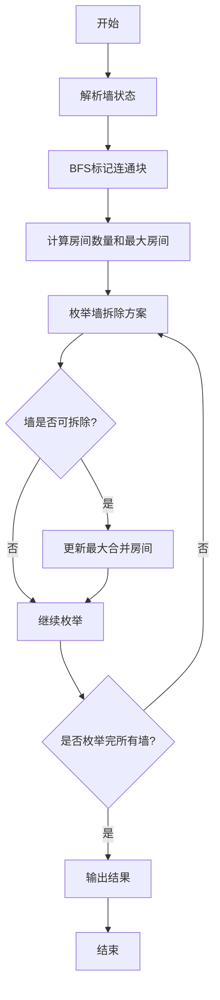

# 题目信息

# [USACO2.1] 城堡 The Castle

## 题目背景

我们憨厚的 USACO 主人公农夫约翰（Farmer John）以无法想象的运气,在他生日那天收到了一份特别的礼物：一张“幸运爱尔兰”（一种彩票）。结果这张彩票让他获得了这次比赛唯一的奖品——坐落于爱尔兰郊外的一座梦幻般的城堡！

## 题目描述

喜欢吹嘘的农夫约翰立刻回到有着吹嘘传统的威斯康辛老家开始吹嘘了, 农夫约翰想要告诉他的奶牛们关于他城堡的一切。他需要做一些吹嘘前的准备工作：比如说知道城堡有多少个房间，每个房间有多大。  

另外，农夫约翰想要把一面单独的墙（指两个单位间的墙）拆掉以形成一个更大的房间。 你的工作就是帮农夫约翰做以上的准备，算出房间数与房间的大小。

城堡的平面图被划分成 $n \times m$ 个正方形的单位，一个这样的单位可以有 $0 \sim 4 $ 面墙环绕。城堡周围一定有外墙环绕以遮风挡雨。（就是说平面图的四周一定是墙。）

请仔细研究下面这个有注解的城堡平面图：

```plain
     1   2   3   4   5   6   7
   #############################
 1 #   |   #   |   #   |   |   #
   #####---#####---#---#####---#
 2 #   #   |   #   #   #   #   #
   #---#####---#####---#####---#
 3 #   |   |   #   #   #   #   #
   #---#########---#####---#---#
 4 # ->#   |   |   |   |   #   #
   #############################
```

- $\verb!#!$ 表示墙壁；
- $\verb!|!$ 和 $\verb!-!$ 表示没有墙壁；
- $\verb!->!$ 指向了一面墙，移除了这面墙我们就有一间最大的新房间。

友情提示，这个城堡的平面图是 $4 \times 7$ 个单位的。一个“房间”的是平面图中一个由 `#`、`-`、`|` 围成的格子（就是图里面的那一个个的格子）。比如说这个样例就有 $5$ 个房间。（大小分别为 $9,7,3,1,8$ 个单位（排名不分先后））

移去箭头所指的那面墙，可以使 $2$ 个房间合为一个新房间，且比移去其他墙所形成的房间都大。

城堡保证至少有 $2$ 个房间，而且一定有一面墙可以被移走。


## 说明/提示

【数据范围】  
对于 $100\%$ 的数据，$1\le n,m \le 50$。

USACO 2.1

翻译来自NOCOW


## 样例 #1

### 输入

```
7 4
11 6 11 6 3 10 6
7 9 6 13 5 15 5
1 10 12 7 13 7 5
13 11 10 8 10 12 13```

### 输出

```
5
9
16
4 1 E```

# AI分析结果


### 题目分析
本题要求计算城堡的房间数量、最大房间大小、拆除一面墙后可获得的最大房间大小及拆除墙的位置。关键点在于：
1. **房间识别**：使用BFS/DFS识别连通块（房间）
2. **墙状态解析**：通过位运算解析每个单元的四面墙状态
3. **墙拆除策略**：优先考虑西侧和南侧的墙，北墙优先级高于东墙

### 算法分类与核心思想
- **算法分类**：图论（连通块分析）+ 枚举优化
- **核心思想**：
  - **连通块分析**：BFS遍历识别房间并计算房间大小
  - **位运算技巧**：用位掩码解析墙状态（1:西, 2:北, 4:东, 8:南）
  - **贪心策略**：按西→南→北优先级枚举墙拆除方案

### 解题思路
1. **输入解析**：读入矩阵并解析每个单元的墙状态
2. **连通块标记**：BFS遍历标记连通块并记录房间大小
3. **墙拆除枚举**：
   - 按列优先（西→东）、行逆序（南→北）枚举
   - 对每个单元优先检查北墙，其次东墙
   - 合并不同连通块时更新最大房间大小
4. **结果输出**：房间数、最大房间、拆除墙后最大房间及墙位置

### 复杂度分析
- **时间复杂度**：O(nm) 
  - BFS遍历：O(nm)
  - 墙枚举：O(nm)
- **空间复杂度**：O(nm)（存储墙状态、连通块标记等）

### 关键变量与数据结构
| 变量/结构       | 类型          | 作用                          |
|----------------|---------------|-------------------------------|
| `wall`         | `int[][][4]`  | 墙状态（西/北/东/南）          |
| `block_id`     | `int[][]`     | 单元所属连通块ID              |
| `block_size`   | `int[]`       | 连通块大小                    |
| `visited`      | `bool[][]`    | BFS访问标记                   |
| `max_combine`  | `int`         | 拆除墙后最大房间大小          |
| `wall_x/y/dir` | `int/char`    | 最佳拆除墙位置和方向          |

### 代码实现
```cpp
#include <iostream>
#include <queue>
#include <vector>
#include <algorithm>
using namespace std;

const int MAX = 55;
int dx[4] = {0, -1, 0, 1};  // 西、北、东、南
int dy[4] = {-1, 0, 1, 0};

int main() {
    int n, m;
    cin >> m >> n;
    
    // 初始化数据结构
    vector<vector<vector<int>>> wall(n+1, vector<vector<int>>(m+1, vector<int>(4, 0)));
    vector<vector<int>> block_id(n+1, vector<int>(m+1, 0));
    vector<int> block_size(n*m+1, 0);
    vector<vector<bool>> visited(n+1, vector<bool>(m+1, false));
    
    // 1. 解析墙状态
    for (int i = 1; i <= n; i++) {
        for (int j = 1; j <= m; j++) {
            int x;
            cin >> x;
            wall[i][j][0] = (x & 1) ? 1 : 0;   // 西
            wall[i][j][1] = (x & 2) ? 1 : 0;   // 北
            wall[i][j][2] = (x & 4) ? 1 : 0;   // 东
            wall[i][j][3] = (x & 8) ? 1 : 0;   // 南
        }
    }
    
    // 2. BFS标记连通块
    int room_count = 0;
    int max_room = 0;
    for (int i = 1; i <= n; i++) {
        for (int j = 1; j <= m; j++) {
            if (!visited[i][j]) {
                room_count++;
                int cnt = 0;
                queue<pair<int, int>> q;
                q.push({i, j});
                visited[i][j] = true;
                
                while (!q.empty()) {
                    auto [x, y] = q.front();
                    q.pop();
                    block_id[x][y] = room_count;
                    cnt++;
                    
                    for (int d = 0; d < 4; d++) {
                        int nx = x + dx[d], ny = y + dy[d];
                        if (nx < 1 || nx > n || ny < 1 || ny > m) continue;
                        if (!visited[nx][ny] && !wall[x][y][d]) {
                            visited[nx][ny] = true;
                            q.push({nx, ny});
                        }
                    }
                }
                block_size[room_count] = cnt;
                max_room = max(max_room, cnt);
            }
        }
    }
    
    // 3. 枚举墙拆除方案
    int max_combine = 0;
    int wall_x = 0, wall_y = 0;
    char wall_dir = ' ';
    
    for (int j = 1; j <= m; j++) {
        for (int i = n; i >= 1; i--) {
            // 先检查北墙
            if (i > 1 && wall[i][j][1]) {  // 北墙存在
                int b1 = block_id[i][j];
                int b2 = block_id[i-1][j];
                if (b1 != b2) {
                    int total = block_size[b1] + block_size[b2];
                    if (total > max_combine) {
                        max_combine = total;
                        wall_x = i;
                        wall_y = j;
                        wall_dir = 'N';
                    }
                }
            }
            // 再检查东墙
            if (j < m && wall[i][j][2]) {  // 东墙存在
                int b1 = block_id[i][j];
                int b2 = block_id[i][j+1];
                if (b1 != b2) {
                    int total = block_size[b1] + block_size[b2];
                    if (total > max_combine) {
                        max_combine = total;
                        wall_x = i;
                        wall_y = j;
                        wall_dir = 'E';
                    }
                }
            }
        }
    }
    
    // 4. 输出结果
    cout << room_count << "\n" << max_room << "\n" << max_combine << "\n";
    cout << wall_x << " " << wall_y << " " << wall_dir << endl;
    return 0;
}
```

### 可视化算法分析


### 关键点说明
1. **位运算解析**：通过按位与操作快速提取墙状态
2. **BFS优化**：避免递归栈溢出，适合大尺寸地图
3. **枚举策略**：
   - 列优先保证西侧优先
   - 行逆序保证南侧优先
   - 北墙优先于东墙的检查顺序

### 学习总结
- **位运算应用**：二进制状态压缩技巧
- **连通块分析**：BFS/DFS在网格问题中的应用
- **贪心策略**：多条件优先级处理技巧
- **注意事项**：
  - 行列索引方向（数学坐标系与屏幕坐标系区别）
  - 边界条件处理（墙拆除时的边界检查）

> 通过本题的系统分析，可掌握图论问题的通用解法框架，以及位运算在状态压缩中的高效应用。建议尝试洛谷P1141（连通块问题）和P1162（填海造陆问题）进行巩固练习。

---
处理用时：211.85秒