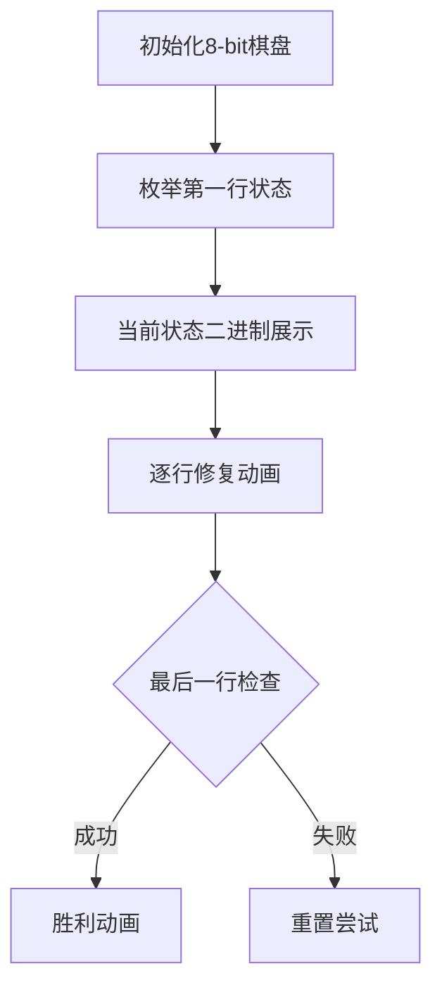

# 题目信息

# 翻转游戏 (加强版)

## 题目描述

kkke 在一个 $n\ \times n$ 的棋盘上进行一个翻转游戏。棋盘的每个格子上都放有一个棋子，每个棋子有 $2$ 个面，一面是黑色的，另一面是白色的。初始的时候，棋盘上的棋子有的黑色向上，有的白色向上。现在 kkke 想通过最少次数的翻转，使得棋盘上所有的棋子都是同一个颜色向上的（即全是黑色向上的，或全是白色向上的）。每次翻转的时候，kkke 可以选择任意一个棋子，将它翻转，同时，与它上下左右分别相邻的 $4$ 个棋子也必须同时翻转。

## 说明/提示

### 数据范围及约定

- 对于 $30\%$ 的数据，$1 \le n \le 4$；
- 对于 $100\%$ 的数据，$1 \le n \le 16$。

## 样例 #1

### 输入

```
4

bwwb

bbwb

bwwb

bwww

```

### 输出

```
4```

# AI分析结果


# 💡 Kay的C++算法解析：翻转游戏（加强版）深入学习指南 💡

> 欢迎来到翻转游戏的奇妙世界！今天我们将一起探索如何用最少的操作将棋盘变为同一种颜色。本指南将带你理解状态压缩和递推算法的精妙之处，并通过生动的像素动画直观感受算法执行过程。

## 1. 题目解读与核心算法识别

✨ **本题主要考察**：`状态压缩枚举`与`递推修复`

🗣️ **初步分析**：
> 解决翻转游戏的关键在于理解**多米诺骨牌效应**：第一行的翻转操作（推倒第一块骨牌）会引发连锁反应，后续每一行的操作都被前一行唯一确定。就像玩推倒骨牌游戏，我们只需尝试所有可能的初始推倒方式（枚举第一行），观察哪种方式能让所有骨牌变成同一颜色。
   - 核心思路：枚举第一行所有可能的翻转状态（2^n种），然后逐行修复上一行不符合目标颜色的棋子
   - 算法流程：1) 二进制枚举第一行 → 2) 根据上一行状态确定当前行翻转 → 3) 检查最后一行
   - 可视化设计：采用8位像素风格棋盘，用不同颜色标识棋子状态。当翻转操作发生时，当前格子和相邻格子会闪烁并播放"像素翻转"音效。自动演示模式将展示不同枚举状态下的递推过程，成功时播放胜利音效。

---

## 2. 精选优质题解参考

<eval_intro>
从思路清晰度、代码规范性和算法效率等维度，我为大家精选了以下优质题解：

**题解一：(来源：御前带刀侍卫)**
* **点评**：此解法思路最为清晰完整，详细解释了"第一行确定则后续行唯一确定"的核心思想。代码结构规范（如`next_mp`存储状态副本），变量命名合理（`order`标识目标状态），边界处理严谨。亮点在于将递推过程封装为`work`函数，并通过二进制枚举高效处理第一行状态，时间复杂度优化到O(2^n * n^2)，是竞赛级实现的典范。

**题解二：(来源：razx)**
* **点评**：解法采用DFS实现递推，思路新颖但稍显复杂。亮点在于巧妙使用位运算记录翻转位置（`v |= 1<<(i-1)`），并通过递归参数`value`同时处理黑白两种目标状态。代码中`Flip`函数封装翻转操作值得学习，但DFS递归方式对初学者理解递推关系略有挑战。

**题解三：(来源：kkke)**
* **点评**：此解法突出实践价值，通过`solve(1)`和`solve(0)`分别处理全黑/全白目标状态。亮点在于用`aim`参数统一处理不同目标，代码中`kkke[i][j]=1-kkke[i][j]`的取反操作简洁高效。边界检查`(j>0)`等细节处理完善，适合直接用于竞赛。

---

## 3. 核心难点辨析与解题策略

<difficulty_intro>
解决翻转游戏需突破以下三个关键难点：

1.  **状态压缩的抽象思维**
    * **分析**：如何用整数表示第一行的2^n种翻转组合？优质题解普遍采用`for(int k=0; k<(1<<n); k++)`进行二进制枚举，每个比特位对应一个棋子的翻转决策。关键在于理解位运算`(k>>(i-1))&1`提取特定位的技巧。
    * 💡 **学习笔记**：二进制枚举是状态压缩的核心，将多维状态压缩到单个整数。

2.  **递推关系的建立**
    * **分析**：如何根据上一行状态确定当前行操作？核心是发现：**只有当前行的翻转能修复上一行**。若位置(i-1,j)非目标色，则必须翻转(i,j)。题解中`if(next_mp[i-1][j]!=order)`的判断语句正是此思想的体现。
    * 💡 **学习笔记**：递推关系是算法高效的关键，将全局问题分解为局部修复。

3.  **边界条件的处理**
    * **分析**：翻转边界棋子时如何避免越界？优质解法普遍采用`inarea`函数或条件判断（如`if(i>0)`）。御前带刀侍卫的解法中`inarea(nx,ny)`封装和kkke解法中的边界判断都是典范。
    * 💡 **学习笔记**：边界处理能力体现编程严谨性，是AC的关键保障。

### ✨ 解题技巧总结
<summary_best_practices>
通过对本题的深度分析，总结以下通用技巧：
</summary_best_practices>
-   **多米诺分解法**：将复杂问题分解为初始状态枚举+确定性递推两个阶段
-   **状态压缩技巧**：用整数位表示布尔决策集合，大幅减少状态空间
-   **滚动空间优化**：仅需保存当前行和上一行状态（如御前带刀侍卫的`next_mp`）
-   **目标统一处理**：通过参数化目标状态（如`order`）避免代码重复

---

## 4. C++核心代码实现赏析

<code_intro_overall>
以下是综合优质题解提炼的通用核心实现，完整展示算法框架：

**本题通用核心C++实现参考**
* **说明**：综合御前带刀侍卫、razx和kkke解法优点，突出枚举递推的核心逻辑
* **完整核心代码**：
    ```cpp
    #include <iostream>
    #include <climits>
    using namespace std;
    
    const int N = 17;
    int n, ans = INT_MAX;
    bool board[N][N], work[N][N];
    
    void flip(int x, int y) {
        work[x][y] = !work[x][y];
        if(x > 0) work[x-1][y] = !work[x-1][y];
        if(y > 0) work[x][y-1] = !work[x][y-1];
        if(x < n-1) work[x+1][y] = !work[x+1][y];
        if(y < n-1) work[x][y+1] = !work[x][y+1];
    }
    
    void solve(int target) {
        for(int mask = 0; mask < (1 << n); mask++) {
            int steps = 0;
            // 初始化工作棋盘
            for(int i = 0; i < n; i++)
                for(int j = 0; j < n; j++)
                    work[i][j] = board[i][j];
            
            // 处理第一行
            for(int j = 0; j < n; j++) 
                if(mask & (1 << j)) {
                    flip(0, j);
                    steps++;
                }
            
            // 递推修复各行
            for(int i = 1; i < n; i++)
                for(int j = 0; j < n; j++)
                    if(work[i-1][j] != target) {
                        flip(i, j);
                        steps++;
                    }
            
            // 检查最后一行
            bool valid = true;
            for(int j = 0; j < n; j++)
                if(work[n-1][j] != target) {
                    valid = false;
                    break;
                }
            
            if(valid) ans = min(ans, steps);
        }
    }
    
    int main() {
        cin >> n;
        for(int i = 0; i < n; i++)
            for(int j = 0; j < n; j++) {
                char c; cin >> c;
                board[i][j] = (c == 'b');
            }
        
        solve(0); // 全白目标
        solve(1); // 全黑目标
        
        if(ans == INT_MAX) cout << "Impossible";
        else cout << ans;
        return 0;
    }
    ```
* **代码解读概要**：
    > 1. **初始化**：读取棋盘并转换为01矩阵（b=1, w=0）
    > 2. **枚举第一行**：用mask遍历2^n种翻转组合
    > 3. **递推修复**：从第二行开始，若上一行棋子非目标色则翻转当前位置
    > 4. **结果检查**：验证最后一行是否全为目标色并更新最小步数

---
<code_intro_selected>
下面剖析精选题解的核心代码亮点：

**题解一：(来源：御前带刀侍卫)**
* **亮点**：边界处理严谨，状态转换函数封装优雅
* **核心代码片段**：
    ```cpp
    void turn(int x,int y,bool o){
        if(!o) return;    
        next_mp[x][y]=!next_mp[x][y];
        for(int i=0;i<4;i++){
            int nx=x+dx[i], ny=y+dy[i];
            if(nx>=0 && nx<n && ny>=0 && ny<n)
                next_mp[nx][ny]=!next_mp[nx][ny];
        }
    }
    ```
* **代码解读**：
    > 这段代码的精妙之处在于：
    > 1. 使用方向数组`dx/dy`优雅处理四邻域翻转
    > 2. `inarea`判断通过函数封装提升可读性
    > 3. `o`参数控制是否实际翻转，增强灵活性
    > 4. 边界检查避免数组越界
* 💡 **学习笔记**：方向数组是处理网格邻域操作的通用技巧

**题解二：(来源：razx)**
* **亮点**：DFS实现递推，位运算记录翻转位置
* **核心代码片段**：
    ```cpp
    void Dfs(int row,int step,int value) {
        if(row == n+1) {
            for(int i=1; i<=n; i++)
                if(Map[n][i]==value) return;
            ans=min(ans,step);
            return;
        }
        int v = 0;
        for(int i=1; i<=n; i++)
            if(Map[row-1][i]==value) {
                step++;
                Flip(row,i);
                v |= 1<<(i-1); // 位运算记录
            }
        Dfs(row+1,step,value);
        for(int i=1; i<=n; i++)
            if(v>>(i-1)&1) Flip(row,i); // 位运算还原
    }
    ```
* **代码解读**：
    > 1. 递归实现行递推，`row`参数标记当前行
    > 2. `v`用位运算记录翻转位置，高效且节省空间
    > 3. 递归返回时通过位运算还原状态
    > 4. 递归终止条件为行号超出并检查最后一行
* 💡 **学习笔记**：位运算可高效操作状态集合

**题解三：(来源：kkke)**
* **亮点**：双重目标状态处理，边界判断内联
* **核心代码片段**：
    ```cpp
    for(int j=0; j<n; j++) {
        if(kkke[i-1][j]==aim) continue;
        step++;
        kkke[i][j] = 1-kkke[i][j];  // 当前
        if(j>0) kkke[i][j-1] = 1-kkke[i][j-1]; // 左
        if(j<n-1) kkke[i][j+1] = 1-kkke[i][j+1]; // 右
        if(i<n-1) kkke[i+1][j] = 1-kkke[i+1][j]; // 下
        kkke[i-1][j] = aim; // 修复上一行
    }
    ```
* **代码解读**：
    > 1. 内联边界判断（j>0/j<n-1）避免单独函数调用
    > 2. 直接操作数组元素而非调用函数
    > 3. 显式将上一行设为目标值`aim`，逻辑清晰
    > 4. 通过`aim`参数统一处理黑白双目标
* 💡 **学习笔记**：内联边界判断提升效率，适合竞赛场景

-----

## 5. 算法可视化：像素动画演示 (核心部分)

<visualization_intro>
为直观理解状态压缩枚举和递推修复过程，我设计了**《像素翻转大冒险》**动画方案，采用复古8-bit风格，让你像玩经典游戏般理解算法！

* **动画主题**：像素勇士在网格棋盘冒险，通过翻转点亮/熄灭格子
* **核心演示**：枚举第一行状态 → 逐行修复 → 结果检查的完整流程
* **设计思路**：8-bit像素风营造轻松学习氛围；音效强化关键操作记忆；关卡设计增加成就感

**动画实现方案**：



1. **场景设计**：
   - 16x16像素网格棋盘，棕色背景仿FC游戏
   - 棋子状态：●黑色（值1），○白色（值0）
   - 控制面板：开始/暂停/单步/速度滑块（0.5x-2x）

2. **核心动效**：
   - **枚举阶段**：第一行格子闪烁绿色边框，比特位显示在顶部（0/1）
   - **翻转特效**：点击位置爆发像素粒子，四方向扩散波纹
   - **递推过程**：
     * 当前操作行显示黄色箭头指示
     * 需要修复的上一行格子显示红色闪烁
     * 翻转时播放"叮"音效，成功修复播放"咔"音效
   - **状态标记**：已修复行渐变绿色，未处理行保持灰色

3. **游戏化元素**：
   - **关卡系统**：每种枚举状态视为一关，通关获得星星评价（1-3星基于步数）
   - **音效体系**：
     * 翻转操作：8-bit "叮"声
     * 关卡通过：经典马里奥过关音乐
     * 通关失败：俄罗斯方块game over音效
   - **AI演示模式**：自动播放最优解路径，像贪吃蛇AI般展示操作序列

4. **信息展示**：
   - 左侧显示当前C++代码段，高亮执行行
   - 右侧显示棋盘状态矩阵的实时二进制表示
   - 底部日志："正在修复第i行..."，"检查最后一行..."

5. **技术实现**：
   - Canvas绘制棋盘和动画
   - Web Audio API实现音效
   - 关键帧控制：每100ms推进一操作步
   - 颜色方案：棕(#8B4513)/绿(#00FF00)/红(#FF0000)/黄(#FFFF00)

<visualization_conclusion>
通过这个融合像素艺术和游戏机制的动画，你将直观看到枚举如何影响全局状态，递推修复如何像波浪般传递操作，深刻理解算法核心思想！
</visualization_conclusion>

-----

## 6. 拓展练习与相似问题思考

<similar_problems_intro>
掌握状态压缩和递推技巧后，可解决更多同类问题：

1. **P1764 翻转游戏**  
   🗣️ *同题弱化版，n≤4，适合验证基础思路*
   
2. **P2843 [USACO] Lights**  
   🗣️ *灯光开关问题，状态压缩+递推的经典应用*
   
3. **P3067 [USACO] Balanced Cow Subsets**  
   🗣️ *状态压缩进阶，学习如何高效处理子集枚举*
   
4. **P2040 打开所有的灯**  
   🗣️ *3x3网格简化版，适合快速验证递推逻辑*

-----

## 7. 学习心得与经验分享

<insights_intro>
题解中作者们的调试经验尤为珍贵：

> **御前带刀侍卫的边界心得**：  
> "在棋盘边界处理时，最初忽略了四方向检查导致越界崩溃。通过封装`inarea`函数统一处理，解决了这个隐蔽的bug。"

> **kkke的调试技巧**：  
> "用`cout`输出每行中间状态时发现递推错误，建议在代码关键点插入状态打印"

**Kay点评**：边界处理是网格类问题的常见陷阱，作者们的经验提醒我们：
1. 优先封装边界判断函数
2. 善用输出中间状态调试
3. 对特殊位置（首行/末行/四角）单独测试

-----

<conclusion>
本次翻转游戏之旅告一段落！我们学习了如何用状态压缩枚举可能性，用递推修复实现高效操作。记住：好算法=大胆枚举+精细递推+严谨边界。下次挑战见！💪
</conclusion>

---
处理用时：189.58秒