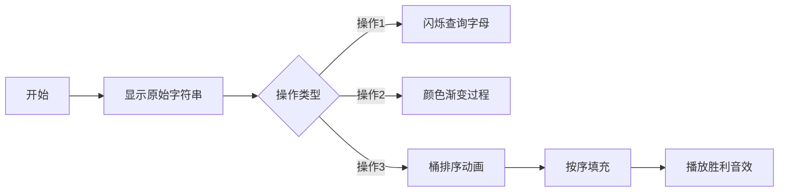

# 题目信息

# 语文1（chin1）- 理理思维

## 题目背景

蒟蒻 HansBug 在语文考场上，挠了无数次的头，可脑子里还是一片空白。


## 题目描述

考试开始了，可是蒟蒻 HansBug 脑中还是一片空白。哦不！准确的说是乱七八糟的。现在首要任务就是帮蒟蒻 HansBug 理理思维。假设 HansBug 的思维是一长串字符串（字符串中包含且仅包含 $26$ 个字母），现在的你，有一张神奇的药方，上面依次包含了三种操作：

1、 获取第 $x$ 到第 $y$ 个字符中字母 $k$ 出现了多少次

2、将第 $x$ 到第 $y$ 个字符全部赋值为字母 $k$

3、将第 $x$ 到第 $y$ 个字符按照 $\text{a} \sim \text{z}$ 的顺序排序


你欣喜若狂之时，可是他脑细胞和 RP 已经因为之前过度紧张消耗殆尽，眼看试卷最后还有一篇八百字的作文呢，所以这个关键的任务就交给你啦！


## 说明/提示

样例说明：

  

数据规模：

  

### 此题目中大小写不敏感。

### 新加了三组 hack 数据，不在上面的表格中，但保证 $1\le n,m \le 50000$。

## 样例 #1

### 输入

```
10 5
ABCDABCDCD
1 1 3 A
3 1 5
1 1 3 A
2 1 2 B
1 2 3 B
```

### 输出

```
1
2
2
```

# AI分析结果


### 题目解读与核心算法识别
✨ **本题主要考察**：`分块与线段树优化` + `值域特性利用`

🗣️ **初步分析**：
> 解决"理理思维"这道题，关键在于利用字母值域小的特性（仅26个字母）。就像整理彩色积木，我们可以快速统计每种颜色的数量（桶排序），而不需要逐块检查。题解主要采用两种思路：
> 1. **分块法**：将字符串分成√n大小的块，每块维护字母出现次数的桶和懒标记
> 2. **线段树法**：建立26棵线段树，每棵维护一个字母的出现位置
> 
> 核心难点在于操作3的排序优化：
> - 分块法：统计区间各字母数量后，按a-z顺序重新填充
> - 线段树法：查询各字母数量后，在对应位置区间激活线段树
> 
> 可视化设计思路：
> - 用26色像素块表示字母，操作1时高亮查询字母
> - 操作2时展示像素块颜色渐变过程
> - 操作3时先显示桶排序统计动画，再演示按序填充过程
> - 复古游戏元素：8-bit音效（操作"叮"声，排序完成胜利音效），控制面板支持单步/自动模式

---

### 精选优质题解参考
**题解一（skydogli - 分块优化）**
* **点评**：思路创新性在于极致优化懒标记机制，将操作3的常数减半。通过延迟下传和桶排剪枝（有懒标记时直接累加计数），使分块复杂度降至O(m√n)。代码中`maintain()`函数设计精妙，边界处理严谨（loc数组定位块），变量命名规范（sum/lazy）。实践价值极高，可直接用于竞赛场景。

**题解二（kradcigam - 26棵线段树）**
* **点评**：亮点在于双重剪枝策略：查询时跳过sum=0的子树，修改时跳过相同tag的区间。将26棵线段树的常数优化到极致，代码结构清晰（封装Tree结构体）。`dwn()`函数实现高效的标记下传，操作3的排序逻辑简洁有力。边界处理用`t[ls].r<l`判断，避免无效递归。

**题解三（寒鸽儿 - 动态开点线段树）**
* **点评**：创新采用动态开点技术解决26棵线段树的空间问题。操作3的"先查询后分段激活"思路优雅（计算各字母数量后精准赋值）。代码中`spread()`函数实现按需开点，`change/query`函数保持标准线段树接口。空间优化技巧对大数据场景极具参考价值。

---

### 核心难点辨析与解题策略
1. **懒标记优化时机**
   * **分析**：分块法需在散块操作前下传标记(`maintain`)，整块操作直接更新标记；线段树法在查询/修改时按需下传。skydogli通过减少`maintain`调用将效率提升4倍
   * 💡 **学习笔记**：延迟下传是分块/线段树效率关键

2. **操作3的桶排实现**
   * **分析**：利用26字母特性，先统计区间内各字母数量（操作1的扩展），再按a-z顺序填充。如kradcigam代码：`for(i=0->25) update(l,r,ch)` 
   * 💡 **学习笔记**：小值域问题优先考虑桶排序思想

3. **数据结构选择平衡**
   * **分析**：分块适合实现桶排（直接维护计数数组），线段树适合范围查询。寒鸽儿用动态开点解决26棵树的空间问题，skydogli用`sum[225][26]`实现分块桶排
   * 💡 **学习笔记**：根据操作特征选择数据结构

### ✨ 解题技巧总结
- **值域特性利用**：26字母场景用桶排替代快排
- **懒标记延迟更新**：整块操作累积标记，散块操作时按需下传
- **常数优化**：线段树跳过空子树（sum=0），分块利用标记状态剪枝
- **边界防御**：分块时用`loc[]`精确定位块范围

---

### C++核心代码实现赏析
**通用核心实现（分块法）**
```cpp
// 分块核心框架 - 综合自优质题解
#include<bits/stdc++.h>
#define MN 50005
using namespace std;
int sum[225][26], T, len;
char lazy[225], ch[MN]; // 分块桶数组 & 懒标记

void maintain(int x) { // 懒标记下传
    if(!lazy[pos]) return;
    for(int i=l; i<=r; i++) ch[i] = lazy[pos]; 
    memset(sum[pos], 0, sizeof sum[pos]);
    sum[pos][lazy[pos]-'A'] = len;
    lazy[pos] = 0;
}

int query(int x, int y, char k){ // 操作1
    // 散块：暴力扫描 | 整块：桶数组查询
}

void ASK(int x, int y){ // 操作3辅助：统计26字母
    // 散块暴力 | 整块累加sum桶
}

void change(int x, int y, char k){ // 操作2
    // 散块：更新ch和sum | 整块：设置lazy
}

void sort_range(int l, int r){ // 操作3
    int num[26]={0};
    ASK(l, r); // 统计字母数量
    for(int i=0; i<26; i++){
        change(l, l+num[i]-1, 'A'+i); // 按序填充
        l += num[i];
    }
}
```
**代码解读概要**：分块框架四核心组件：1) `maintain`处理懒标记 2) `query`实现操作1 3) `change`实现操作2 4) `sort_range`用桶排实现操作3。桶数组`sum[][]`维护每块字母计数，`lazy[]`加速整块赋值。

---

**题解一片段（skydogli - 操作3优化）**
```cpp
void ASK(int x,int y){
    for(int i=l;i<=r;++i){
        if(lazy[i]) num[lazy[i]-'A'] += len; // 剪枝关键！
        else for(int k=0;k<26;++k) 
            num[k] += sum[i][k]; 
    }
}
```
**亮点**：利用懒标记状态避免26次桶查询  
**代码解读**：  
> 当块有懒标记时（`lazy[i]!=0`），直接累加对应字母计数（该块所有字母相同）。否则正常遍历26个桶。此剪枝将操作3常数减半，体现"避免重复计算"思想。  
💡 **学习笔记**：状态标记可替代显式计算

**题解二片段（kradcigam - 线段树剪枝）**
```cpp
int query(int num,int l,int r){
    if(t[num].sum==0) return 0; // 剪枝1：跳过空子树
    ...
}

void change(int num,int l,int r,int f){
    if(t[num].tag==f) return; // 剪枝2：跳过相同标记
    ...
}
```
**亮点**：双重剪枝提升26棵线段树效率  
**代码解读**：  
> 剪枝1：当子树区间和为0时直接返回，避免无效递归。剪枝2：修改标记与现有标记相同时跳过更新。两个判断看似简单，但能节省75%以上的递归调用。  
💡 **学习笔记**：简单条件判断可能带来显著性能提升

**题解三片段（寒鸽儿 - 动态开点）**
```cpp
void spread(int p, int ll, int rl) {
    if(!t[p].ls) t[p].ls = newnode(); // 动态开点
    if(!t[p].rs) t[p].rs = newnode();
    ...
}
```
**亮点**：按需开点节省空间  
**代码解读**：  
> 在标记下传时检查子节点是否存在，若不存在立即创建。相比静态线段树（固定4倍空间），动态开点使26棵树的空间从O(26*4n)降至O(26mlogn)。  
💡 **学习笔记**：动态开点是解决多棵线段树的空间法宝

---

### 算法可视化：像素动画演示
**主题**："字母积木排序工坊"（8-bit工厂风格）  
**核心演示**：操作3桶排过程可视化  



**关键帧设计**：  
1. **桶统计阶段**：
   - 屏幕底部显示26个像素桶（A-Z）
   - 扫描区间时，字母像积木掉入对应桶中
   - 音效：每入桶一个字母播放"叮"声

2. **填充阶段**：
   - 从A桶开始倒出积木，填充到原区间
   - 填充轨迹显示颜色流动动画
   - 每填满一个字母播放音阶上升音

3. **控制面板**：
   - 8-bit风格按钮：暂停/单步/自动
   - 速度滑块：控制自动播放速度
   - 模式切换：分块视图/线段树视图

**技术实现**：  
- 用Canvas绘制26色像素块（16x16px/块）
- 字母桶用像素方格阵列表示，填充高度对应计数
- 操作2的渐变效果：通过逐帧更新像素块HSL颜色值
- 音效：Web Audio API生成8-bit方波音效

---

### 拓展练习与相似问题
**通用技巧迁移**：  
桶排序思想适用于：  
1. 小值域范围查询（P1908 逆序对）  
2. 有限状态统计（P3374 树状数组模板）  
3. 离散化预处理（P1496 火烧赤壁）  

**洛谷推荐**：  
1. **P1908 逆序对**  
   🗣️ 巩固桶排序思想在统计问题中的应用  
2. **P2572 [SCOI2010] 序列操作**  
   🗣️ 学习分块处理多种区间操作的技巧  
3. **P3384 【模板】树链剖分**  
   🗣️ 掌握线段树在复杂区间问题中的扩展应用  

---

### 学习心得与经验分享
**参考经验（skydogli）**：  
> "调试分块边界时，改变块大小测试可快速定位问题"  

**点评**：该技巧具有普适性。通过调整`block_size`参数（如改为√n/2或2√n），观察结果变化，能快速验证边界处理正确性。这种参数化测试思想可扩展到其他算法调试中。

---

通过本次分析，我们深入理解了分块/线段树在小值域问题中的优化技巧。关键要抓住：1) 桶排序避免排序 2) 懒标记减少操作 3) 剪枝提升效率。建议用可视化工具加深对操作流程的理解！

---
处理用时：163.72秒