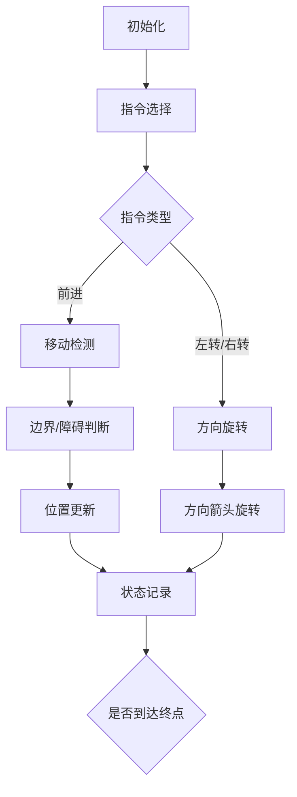

# 题目信息

# [USACO17JAN] Cow Navigation G

## 题目描述

Bessie 又一次被困在了 Farmer John 的谷仓的错误一侧，由于她的视力很差，她需要你的帮助来穿过谷仓。

谷仓由一个 $N \times N$ 的方格网格描述（$2 \leq N \leq 20$），其中一些格子是空的，另一些则包含无法通过的干草堆。Bessie 从左下角（格子 1,1）开始，想要移动到右上角（格子 $N,N$）。你可以通过告诉她一系列指令来引导她，每条指令可以是“前进”、“向左转 90 度”或“向右转 90 度”。你需要给出最短的指令序列，以引导她到达目的地。如果你指示 Bessie 移动到网格外（即撞到谷仓墙壁）或进入干草堆，她将不会移动，并跳过你序列中的下一条指令。

不幸的是，Bessie 不知道她最初是面朝上（朝向格子 1,2）还是面朝右（朝向格子 2,1）。你需要给出一个最短的指令序列，无论她最初面朝哪个方向，都能引导她到达目标。一旦她到达目标，她将忽略后续的指令。

## 样例 #1

### 输入

```
3
EHE
EEE
EEE```

### 输出

```
9```

# AI分析结果


# 💡 Kay的C++算法解析：Cow Navigation G 深入学习指南 💡

**引言**  
今天我们来分析USACO的经典题目Cow Navigation G。这道题考察在双重初始方向不确定情况下，设计最短指令序列引导奶牛到达终点的能力。本指南将带你深入理解六维BFS的核心思想与实现技巧，并通过像素动画直观展示算法运行过程。

---

## 1. 题目解读与核心算法识别

✨ **本题主要考察**：`搜索(BFS)` + `状态空间建模`

🗣️ **初步分析**：
> 解决本题的关键在于**六维状态空间建模**。想象两个探险家（初始方向不同）在像素迷宫中同步行动，我们需要记录每个人的位置和朝向组合状态。BFS就像同时派出无数侦察兵探索所有可能的行动路径。

- **核心思路**：将两头奶牛的坐标(x1,y1)、(x2,y2)和方向(d1,d2)组成六维状态，通过三种指令（前进/左转/右转）进行状态转移
- **核心难点**：状态转移时需处理边界约束（已到终点的牛不再移动）和障碍判断（遇到障碍不移动）
- **可视化设计**：采用双色像素奶牛（红/蓝）在网格移动，方向箭头实时旋转。关键步骤高亮当前指令（前进红色闪光，转向黄色箭头），状态更新时播放8-bit音效

---

## 2. 精选优质题解参考

**题解一：曹老师 (5赞)**
* **点评**：此解法采用经典六维数组存储状态距离，思路清晰完整。亮点在于：
  - 边界处理严谨（已到终点不再移动）
  - 方向映射直观（1:↑,2:→,3:↓,4:←）
  - 代码包含详细临界条件注释
  - 作者调试经验："临界条件好麻烦"提醒我们需重点测试边界情况

**题解二：Lastwhisper1212 (3赞)**
* **点评**：结构体封装七维状态提升可读性。亮点在于：
  - 方向运算优雅（(d+3)%4左转，(d+1)%4右转）
  - 终点状态判断简洁（x==0&&y==n-1）
  - 模块化check函数增强代码复用性
  - BFS终止条件优化（双牛到达终点即退出）

---

## 3. 核心难点辨析与解题策略

1.  **状态空间设计**
    * **分析**：六维状态需平衡完备性与空间效率。优质题解使用`f[x1][y1][x2][y2][d1][d2]`存储最小步数，关键是通过坐标和方向唯一确定系统状态
    * 💡 **学习笔记**：多维状态设计是复杂路径问题的核心建模技巧

2.  **方向映射与转向逻辑**
    * **分析**：方向表示需统一（推荐0-3对应NESW）。左转即`d=(d+3)%4`，右转`d=(d+1)%4`，避免if-else链
    * 💡 **学习笔记**：模运算实现方向旋转是空间方向处理的黄金法则

3.  **状态转移的临界处理**
    * **分析**：三个易错点：已到终点应锁定位置；移动遇障碍需回退位置；转向不改变位置。题解通过位置修正判断解决
    * 💡 **学习笔记**：移动指令需先检查终点状态再判断障碍

### ✨ 解题技巧总结
- **技巧A：状态压缩**：当N较小时直接开数组，否则考虑哈希压缩状态
- **技巧B：方向向量化**：用dr[]={-1,0,1,0}, dc[]={0,1,0,-1}简化移动计算
- **技巧C：终点优先判断**：移动前先检查是否已达终点
- **技巧D：结构体封装**：多维度状态用struct包装提升可读性

---

## 4. C++核心代码实现赏析

**通用核心实现参考**
```cpp
#include <iostream>
#include <queue>
#include <cstring>
using namespace std;

const int N=21, INF=0x3f3f3f3f;
int n, dis[N][N][N][N][4][4]; // 六维状态数组
int dr[4]={-1,0,1,0}, dc[4]={0,1,0,-1}; // 方向向量
struct State { int x1,y1,d1,x2,y2,d2; };

bool valid(int x,int y,vector<string>& grid){
    return x>=0 && x<n && y>=0 && y<n && grid[x][y]=='E';
}

void bfs(vector<string>& grid){
    memset(dis,0x3f,sizeof(dis));
    queue<State> q;
    // 初始状态：左下角，双牛方向分别为北(0)和东(1)
    q.push({n-1,0,0,n-1,0,1});
    dis[n-1][0][0][n-1][0][1]=0;

    while(!q.empty()){
        auto [x1,y1,d1,x2,y2,d2]=q.front(); q.pop();
        int step=dis[x1][y1][d1][x2][y2][d2];
        
        // 终止条件检测
        if(x1==0&&y1==n-1 && x2==0&&y2==n-1){
            cout<<step; return;
        }
        
        // 指令1：前进
        int nx1=x1, ny1=y1, nx2=x2, ny2=y2;
        if(!(x1==0&&y1==n-1)) nx1=x1+dr[d1], ny1=y1+dc[d1];
        if(!(x2==0&&y2==n-1)) nx2=x2+dr[d2], ny2=y2+dc[d2];
        if(!valid(nx1,ny1,grid)) nx1=x1, ny1=y1;
        if(!valid(nx2,ny2,grid)) nx2=x2, ny2=y2;
        updateState(nx1,ny1,d1,nx2,ny2,d2,step+1,q); // 状态更新函数

        // 指令2：左转
        updateState(x1,y1,(d1+3)%4,x2,y2,(d2+3)%4,step+1,q);
        
        // 指令3：右转
        updateState(x1,y1,(d1+1)%4,x2,y2,(d2+1)%4,step+1,q);
    }
}
```

**题解一：曹老师（方向映射1-4）**
```cpp
// 前进指令处理片段
nx1=head.x1+dx[head.d1]; 
ny1=head.y1+dy[head.d1];
if(!judge(nx1,ny1)||!map[nx1][ny1]) // 遇障碍回退
    nx1=head.x1, ny1=head.y1;
if(head.x1==1&&head.y1==n) // 已到终点锁定
    nx1=1, ny1=n;
```

**题解二：Lastwhisper1212（方向0-3）**
```cpp
// 转向指令处理
que.push(location(loc.x1,loc.y1,(loc.d1+3)%4, // 左转
                  loc.x2,loc.y2,(loc.d2+3)%4,loc.step+1));

// 移动后的障碍检测
if(!check(x1,y1)||(loc.x1==0&&loc.y1==n-1))
    x1=loc.x1, y1=loc.y1;
```

---

## 5. 算法可视化：像素动画演示

**设计主题**  
《双牛迷宫大冒险》8-bit像素风格模拟，红蓝双牛在网格迷宫同步执行指令

**核心演示流程**  


**动画关键帧**  
1. **场景初始化**：16x16像素网格，棕色障碍(H)，绿色通道(E)，红蓝双牛在左下角
2. **指令执行**：
   - 前进：奶牛向当前方向移动1格，碰壁时播放"砰"音效并闪烁红光
   - 转向：奶牛上方显示旋转箭头（左转逆时针/右转顺时针）
3. **状态同步**：侧边栏显示六维状态值实时更新
4. **胜利条件**：双牛到达右上角时放烟花，播放胜利音效

**交互控制**  
- 速度滑块：调节指令执行速度(0.5x~5x)
- 单步模式：Space键单步执行
- 视角切换：Tab键切换双牛视角

---

## 6. 拓展练习与相似问题思考

**通用技巧迁移**  
六维BFS适用于：
1. 双实体协同路径规划
2. 带方向约束的路径搜索
3. 状态依赖的决策问题

**洛谷练习推荐**  
1. **P1126 机器人搬重物**  
   🗣️ 单机器人带方向移动，掌握方向向量和转向操作
2. **P1379 八数码难题**  
   🗣️ 状态空间搜索经典题，学习状态压缩技巧
3. **P4011 孤岛营救问题**  
   🗣️ 多维状态（位置+钥匙状态）BFS，强化状态设计能力

---

## 7. 学习心得与经验分享

**来自曹老师的经验**  
_"临界条件好麻烦（调了好几个小时）"_

**Kay的总结**  
边界处理是BFS的核心难点，务必注意：
1. 已到终点的角色应停止移动
2. 移动前先检查目标位置有效性
3. 转向不改变位置属性
建议通过小规模地图（如2x2）优先测试边界情况

---

**结语**  
通过六维BFS，我们解决了双牛导航问题。关键是多维状态设计和临界处理。现在尝试完成推荐的拓展练习，巩固BFS应用能力吧！下次我们将探索更复杂的协同路径规划问题，继续加油！🚀

---
处理用时：113.92秒