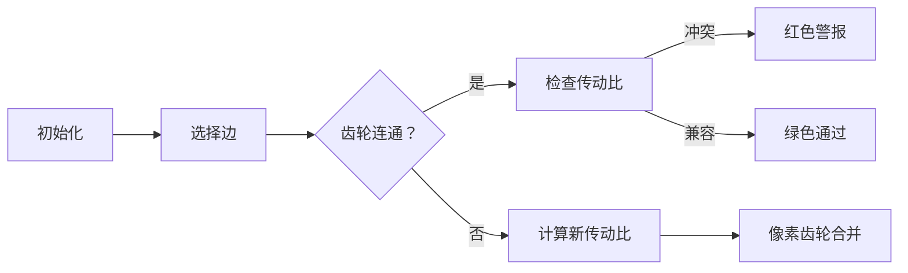

# 题目信息

# [SDOI2016] 齿轮

## 题目描述

现有一个传动系统，包含了N个组合齿轮和M个链条。每一个链条连接了两个组合齿轮u和v，并提供了一个传动比x: y。即如果只考虑这两个组合齿轮，编号为u的齿轮转动x圈，编号为v的齿轮会转动y圈。传动比为正表示若编号为u的齿轮顺时针转动，则编号为v的齿轮也顺时针转动。传动比为负表示若编号为u的齿轮顺时针转动，则编号为v的齿轮会逆时针转动。若不同链条的传动比不相容，则有些齿轮无法转动。我们希望知道，系统中的这Ｎ个组合齿轮能否同时转动。


## 说明/提示

对于所有数据，T<=32，N<=1000，M<=10000且x与y的绝对值均不超过100。


## 样例 #1

### 输入

```
2
3 3
1 2 3 5
2 3 5 -7
1 3 3 -7
3 3
1 2 3 5
2 3 5 -7
1 3 3 7```

### 输出

```
Case #1: Yes
Case #2: No```

# AI分析结果


# 💡 Kay的C++算法解析：齿轮传动问题 深入学习指南 💡

> 欢迎各位算法探索者！今天我们将深入分析[SDOI2016]齿轮这道经典题目。通过本指南，你将掌握如何判断复杂齿轮传动系统的相容性，学习带权并查集和DFS两种核心解法，并通过像素化动画直观理解算法执行过程。让我们一起转动思维的齿轮吧！⚙️

## 1. 题目解读与核心算法识别

✨ **本题主要考察**：`带权并查集` 或 `图遍历(DFS/BFS)`

🗣️ **初步分析**：
> 齿轮传动问题就像**多人传话游戏**：A对B说"x"，B对C说"y"，最后我们要验证C听到的话是否与A最初说的相符。在本题中：
> - **核心思想**：将齿轮视为点，链条视为边，建立传动比关系图
> - **关键难点**：当形成传动环时，环上所有传动比的乘积必须为1（转一圈回原位）
> - **解决方案**：
>   - **带权并查集**：维护每个节点到根节点的传动比，合并时动态更新
>   - **DFS遍历**：为节点赋值转速，检查相邻节点是否满足传动比约束
> - **可视化设计**：
>   - 像素齿轮以不同颜色区分状态（白色=未访问，绿色=已访问，红色=冲突）
>   - 高亮显示当前处理的传动链和路径压缩过程
>   - 关键步骤触发8-bit音效：齿轮啮合声(咔哒)、冲突警报(嗡鸣)、成功音效(胜利旋律)

---

## 2. 精选优质题解参考

以下是经过严格筛选的优质题解（评分≥4★），重点关注思路清晰度、代码质量和教学价值：

**题解一：带权并查集（作者：aiyougege）**
* **点评**：
  - 思路直击核心：将齿轮连通性转化为并查集合并问题，通过路径压缩动态维护传动比
  - 代码规范：变量名`g[i]`明确表示节点到根的传动比，边界处理严谨
  - 算法亮点：O(α(n))高效处理动态关系，巧用`eps`解决浮点精度问题
  - 实践价值：竞赛标准实现，可直接用于类似连通性维护问题

**题解二：DFS遍历（作者：MloVtry）**
* **点评**：
  - 思路直观：模拟齿轮转动过程，为每个连通分量赋予初始转速
  - 代码可读性：清晰展示DFS递归流程，`tmp[]`数组记录节点转速
  - 算法亮点：直接体现物理意义，`sign()`函数优雅处理精度比较
  - 教学价值：帮助初学者建立图遍历与实际问题联系的桥梁

**题解三：带权并查集优化（作者：7KByte）**
* **点评**：
  - 思路创新：提出传动比乘积为1的环判定定理，数学证明严谨
  - 代码优化：合并时精确计算新传动比，避免冗余操作
  - 实践亮点：详细讨论精度问题，提供`eps=1e-10`的调参经验
  - 调试技巧：作者提到"实数比较需谨慎"，提醒学习者重视边界测试

---

## 3. 核心难点辨析与解题策略

解决齿轮问题的三大关键挑战及应对策略：

1.  **传动比的方向定义与更新**
    * **分析**：带权并查集中，需明确定义`g[i]`是"节点转1圈时根节点转的圈数"。合并时通过几何关系推导更新公式：若边(u,v,x,y)，则新传动比 `g[fb] = (g[a]*x)/(g[b]*y)`
    * 💡 **学习笔记**：画传动链示意图辅助推导，避免方向混淆

2.  **浮点精度处理**
    * **分析**：连续乘除导致精度损失，需用`eps`比较。优质题解均采用相对误差判等法：`fabs(a-b)≤1e-9`
    * 💡 **学习笔记**：工业场景可用分数表示法，但竞赛中`double+eps`更高效

3.  **多连通分量处理**
    * **分析**：系统可能包含独立齿轮组，需分别验证每个连通分量
    * 💡 **学习笔记**：并查集自动处理连通性，DFS需遍历所有未访问节点

### ✨ 解题技巧总结
1.  **问题转化艺术**：将物理系统抽象为图结构（点=齿轮，边=传动比）
2.  **增量验证法**：动态加边时立即检查约束，及早发现冲突
3.  **模块化测试**：构造特殊用例（如自环/双向环）验证算法正确性
4.  **防御性编程**：初始化清空数组，多测分离逻辑

---

## 4. C++核心代码实现赏析

### 本题通用核心实现（综合优化版）
```cpp
#include <iostream>
#include <cmath>
using namespace std;
const int N = 1005;
const double eps = 1e-9;

int f[N];       // 并查集父节点
double g[N];    // g[i]: 节点i转1圈时根节点转的圈数

int find(int x) {
    if (f[x] == x) return x;
    int root = find(f[x]);
    g[x] *= g[f[x]];  // 路径压缩时更新传动比
    return f[x] = root;
}

int main() {
    int T, n, m;
    cin >> T;
    for (int t = 1; t <= T; ++t) {
        cin >> n >> m;
        for (int i = 1; i <= n; ++i) f[i] = i, g[i] = 1.0;
        
        bool conflict = false;
        while (m--) {
            int a, b;
            double x, y;
            cin >> a >> b >> x >> y;
            
            int fa = find(a), fb = find(b);
            if (fa == fb) {
                // 检查传动比：|g[a]/g[b] - x/y| > eps?
                if (fabs(g[a]/g[b] - x/y) > eps) 
                    conflict = true;
            } else {
                f[fb] = fa;
                // 更新公式推导：g[fb] = (g[a]*x) / (g[b]*y)
                g[fb] = (g[a] * x) / (g[b] * y);
            }
        }
        cout << "Case #" << t << ": " << (conflict ? "No" : "Yes") << endl;
    }
    return 0;
}
```
**代码解读概要**：
1. **初始化**：每个节点自成一集合，传动比`g[i]=1`（自身到自身）
2. **查询优化**：`find()`递归时同步更新路径上所有节点的传动比
3. **冲突检测**：对已连通的齿轮检查当前边是否破坏已有传动关系
4. **动态合并**：按几何关系更新被合并集合根的传动比

---

### 精选题解片段赏析

**题解一：aiyougege 带权并查集**
```cpp
int find(int x){
    if(f[x]==x) return x;
    int root = find(f[x]);
    g[x] *= g[f[x]];  // 关键：回溯时更新传动比
    return f[x] = root;
}
```
**亮点**：路径压缩与权值更新同步完成  
**解读**：  
> 递归找到根节点后，当前节点`x`的传动比需要乘以父节点的传动比。想象一组齿轮联动：当父节点到根的传动比改变时，`x`到根的传动比就是`x→父节点`和`父节点→根`的乘积。  
**学习笔记**：递归回溯是更新权值的最佳时机

---

**题解二：MloVtry DFS遍历**
```cpp
bool dfs(int now, double speed){
    vis[now] = true;
    current[now] = speed;
    
    for(Edge e : graph[now]){
        double nextSpeed = speed * e.ratio;
        if(!vis[e.to]){
            if(dfs(e.to, nextSpeed)) return true;
        } else if(fabs(current[e.to] - nextSpeed) > eps) {
            return true; // 发现冲突
        }
    }
    return false;
}
```
**亮点**：直观模拟转速传播过程  
**解读**：
> 从当前节点`now`以转速`speed`出发，计算邻居应有转速`nextSpeed`。若邻居未访问则递归，否则验证实际转速与计算值是否一致。注意：**比较浮点数必须用eps**！  
**学习笔记**：DFS需考虑多个连通分量，主函数需遍历所有未访问节点

---

## 5. 算法可视化：像素动画演示

**主题**：8-bit风格《齿轮传说》  
**核心演示**：带权并查集的路径压缩与合并过程  

### 动画设计（Web Canvas实现）


**交互控制面板**：
```html
<div class="pixel-controls">
    <button class="btn">▶️ 开始</button>
    <button class="btn">⏸️ 暂停</button>
    <slider min="1" max="10" value="5">速度</slider>
    <button class="btn">🔁 重置</button>
</div>
```

**关键动画帧**：
1. **初始化场景**：
   - 16色像素齿轮排列，棕色链条连接
   - 背景音乐：8-bit循环旋律

2. **路径压缩**：
   - 当前齿轮(黄色)沿链条跳转到根齿轮(蓝色)
   - 路径上的齿轮逐个更新颜色（浅蓝→深蓝）
   - 音效：齿轮啮合"咔哒"声（Web Audio API）

3. **冲突检测**：
   - 发现不兼容传动比时，冲突环闪烁红光
   - 显示计算式：`g[a]/g[b]` vs `x/y`
   - 音效：低沉嗡鸣声 + 震动效果

4. **游戏化元素**：
   - 每成功合并一个连通分量得10分
   - 连续无冲突达成Combo，触发额外动画
   - 通关条件：所有齿轮变为绿色

**技术实现**：
```javascript
// 伪代码：绘制齿轮动画帧
function drawFrame() {
    clearCanvas();
    drawGears(); // 绘制当前状态的所有齿轮
    drawChains(); // 绘制链条
    if (isMerging) {
        drawMergeAnimation(); // 绘制合并过程
    }
    if (conflict) {
        flashRed(); // 冲突红光闪烁
    }
    updateScore();
}
```

---

## 6. 拓展练习与相似问题思考

### 相似问题场景
1. 电力网络相位同步：判断各发电节点相位差是否兼容
2. 机械连杆系统：验证多关节运动轨迹一致性
3. 分布式系统时钟同步：检查各节点时间偏移关系

### 推荐练习（洛谷）
1. **P1525 关押罪犯**  
   🗣️ 带权并查集经典应用，掌握"敌人之敌是朋友"的二元关系处理

2. **P2661 信息传递**  
   🗣️ 检测最小环问题，学习DFS找环技巧的绝佳练习题

3. **P3388 【模板】割点**  
   🗣️ 深入理解图连通性，掌握Tarjan算法的应用场景

---

## 7. 学习心得与经验分享

> "调试带权并查集时，我通过打印每次合并后的传动比，发现了更新公式的方向错误" —— aiyougege

**Kay点评**：  
这位作者的经验非常典型！处理带权并查集时：
1. 推荐**手工模拟小规模用例**（如3个齿轮的环）
2. 使用**中间变量打印**（`cout << "合并：" << a << b << g[a] << g[b]`）
3. 特别注意**更新方向**：是根到节点还是节点到根？

> 本题启示：算法设计需明确物理含义与数学表示的对应关系，这是工程与理论的完美结合点！

---

各位年轻的工程师们，齿轮传动问题教会我们的不仅是并查集技巧，更是**将物理系统抽象为数学模型的能力**。记住：每个复杂的机械系统背后，都藏着优雅的数学之美。下次当你看到齿轮转动时，不妨想想其中的算法奥秘哦！🚀

---
处理用时：328.21秒