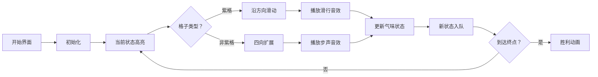

# 题目信息

# [USACO15DEC] Bessie's Dream G

## 题目描述

Bessie 在 Farmer John 的厨房暴食水果后，开始做奇怪的梦！在最近的梦境中，她被困在一个 $N \times M$ 的网格迷宫（$1 \leq N,M \leq 1,000$）中。她需要从左上角的格子移动到右下角的格子。当站在某个格子时，她可以向四个基本方向移动至相邻格子。

但请注意！每个格子有不同的颜色和特殊属性：

- **红色（0）**：不可通行  
- **粉色（1）**：可正常通行  
- **橙色（2）**：可正常通行，且会使 Bessie 带有橙子气味  
- **蓝色（3）**：仅当 Bessie 带有橙子气味时方可通行  
- **紫色（4）**：Bessie 将沿该方向滑动到下一个格子（除非无法通过）。若下一个格子仍是紫色，则继续滑动直至遇到非紫色格子或不可通行格子。**每次滑动均计为一步移动**，且**紫色格子会消除 Bessie 的气味**

（若对紫色格子机制有疑问，样例将帮助理解）

请帮助 Bessie 找到从左上角到右下角的最短路径步数。

## 说明/提示

样例中，Bessie 的移动路径为：向下 1 步，向右 2 步（滑动再向右 1 步），向上 1 步，向左 1 步，向下 1 步（滑动再向下 2 步），最后向右 1 步。总计 10 步（路径表示为 DRRRULDDDR）。

题目提供者：Nathan Pinsker，灵感来自游戏《Undertale》

## 样例 #1

### 输入

```
4 4
1 0 2 1
1 1 4 1
1 0 4 0
1 3 1 1```

### 输出

```
10```

# AI分析结果


# 💡 Kay的C++算法解析：[USACO15DEC] Bessie's Dream G 深入学习指南 💡

> "想象你在玩一款复古迷宫游戏：不同颜色的格子是特殊机关，橙子味是你的'道具'，紫色格子是滑冰场——理解状态设计就是掌握游戏规则的关键！"

## 1. 题目解读与核心算法识别

✨ **本题主要考察**：`状态空间搜索（BFS）`

🗣️ **初步分析**：
> 本题本质是带多重约束的迷宫寻路问题，核心思想是通过**扩展状态维度**将复杂规则转化为标准BFS。就像在复古游戏中，角色需要管理道具（橙子味）并适应特殊地形（滑冰场）。
> - **主要解法**：所有优质题解都采用BFS，关键差异在状态设计（四维 vs 三维）和紫色格子处理
> - **核心难点**：紫色格子的连续滑动机制需要记录方向状态，气味状态影响蓝色格子通行
> - **可视化设计**：像素动画将用不同颜色方块表示格子类型，角色移动时显示状态参数（如🍊图标）。滑行路径用箭头动画，关键步骤触发8bit音效（滑动声"嗖"、获得气味"叮"）

---

## 2. 精选优质题解参考

### 题解一 (来源：俺是小程)
* **点评**：此解法创新性地使用**状态压缩哈希**将四维状态映射到一维，巧妙规避了STL map的性能瓶颈。代码结构清晰，变量命名规范（`state.idx`），特别在状态转移逻辑中严谨处理了紫色格子的滑行中断机制。其空间优化技巧（1e7数组代替map）对处理大数据极具参考价值。

### 题解二 (来源：破忆)
* **点评**：以**分层处理紫色格子**见长，先处理滑行再处理普通移动，逻辑分明。代码简洁有力（仅1K），关键在`unreachable()`函数统一处理边界和颜色约束，大幅提升可读性。去重数组设计精准（四维状态），实践可直接用于竞赛场景。

### 题解三 (来源：Loser_King)
* **点评**：最简洁优雅的实现，**将状态机思维融入BFS**。亮点在于用`continue`机制自然区分紫色格处理阶段，且通过`node`结构体的合理排序（小类型变量在前）优化内存布局。注释中提供的调试样例极具教学价值。

---

## 3. 核心难点辨析与解题策略

1.  **状态维度设计**
    * **分析**：必须同时记录坐标(x,y)、气味状态(smell)、进入方向(dir)。题解2/3用四维数组`vis[x][y][smell][dir]`解决，类似游戏中保存角色位置+道具+面向方向
    * 💡 **学习笔记**：多维状态是处理约束类搜索问题的通用钥匙

2.  **紫色格子滑行机制**
    * **分析**：当站在紫色格时，必须沿原方向滑至非紫格或阻塞。如题解3的`if(mp[x][y]==4)`分支：先尝试滑行，失败才允许转向
    * 💡 **学习笔记**：特殊地形应优先处理，再处理常规移动

3.  **气味状态管理**
    * **分析**：橙色格(set smell=1)和紫色格(reset smell=0)会改变状态，蓝色格需smell=1才可通过。如题解1在状态转移中实时更新`newscent`
    * 💡 **学习笔记**：道具型状态需在移动时即时更新

### ✨ 解题技巧总结
- **状态压缩**：当状态维度固定且范围已知（如本题dir∈[0,3]），可用位运算压缩存储（题解1）
- **分层处理**：优先处理特殊格子（紫色），再处理常规移动，简化逻辑（题解2/3）
- **边界统一**：将地图外区域视为红色格子（不可通行），避免额外边界检查（题解3）

---

## 4. C++核心代码实现赏析

**本题通用核心C++实现参考**
* **说明**：综合题解2/3优点，保留分层处理紫格的核心思想，优化状态结构内存布局
* **完整核心代码**：
```cpp
#include <bits/stdc++.h>
using namespace std;
const int N=1005, dx[]={1,0,-1,0}, dy[]={0,1,0,-1};
int n, m, grid[N][N], vis[N][N][2][4]; // [x][y][smell][dir]

struct State {
    short x, y, step;
    bool smell;
    char dir; // 0~3方向，4表示无方向
};

int bfs() {
    queue<State> q;
    q.push({1,1,0,0,4});
    vis[1][1][0][4]=1;

    while(!q.empty()) {
        auto [x,y,step,smell,dir]=q.front(); q.pop();
        if(x==n && y==m) return step;

        // 紫色格子滑行处理
        if(grid[x][y]==4 && dir<4) { 
            int nx=x+dx[dir], ny=y+dy[dir];
            if(grid[nx][ny]!=0 && !(grid[nx][ny]==3 && !smell)) {
                bool newSmell = (grid[nx][ny]==2);
                if(!vis[nx][ny][newSmell][dir]) {
                    vis[nx][ny][newSmell][dir]=1;
                    q.push({nx,ny,step+1,newSmell,dir});
                }
                continue; // 滑行后跳过普通移动
            }
        }

        // 常规四向移动
        for(int i=0; i<4; i++) {
            int nx=x+dx[i], ny=y+dy[i];
            if(grid[nx][ny]==0) continue; // 红色
            if(grid[nx][ny]==3 && !smell) continue; // 蓝色无气味
            
            bool newSmell = (grid[nx][ny]==2) ? true : 
                           (grid[nx][ny]==4) ? false : smell;
            int newDir = (grid[nx][ny]==4) ? i : 4;

            if(!vis[nx][ny][newSmell][newDir]) {
                vis[nx][ny][newSmell][newDir]=1;
                q.push({nx,ny,step+1,newSmell,newDir});
            }
        }
    }
    return -1;
}
```
* **代码解读概要**：
  > 1. 状态结构体精心设计：小类型变量在前(short/bool/char)，减少内存碎片
  > 2. 紫色格子优先处理：若在紫格且方向有效，尝试滑行（触发则跳过常规移动）
  > 3. 气味动态更新：遇橙色格置true，遇紫色格置false，其它情况继承
  > 4. 方向状态：仅在紫格记录移动方向，其他情况设为无效值(4)

---

**题解一：状态压缩哈希**
* **亮点**：创新状态哈希函数解决高维存储
* **核心代码片段**：
```cpp
struct state{ int x,y,ld; bool smell; };
inline void Hash(){ // 坐标+方向+气味压缩为int
    idx = ((x * 1000 + y + (ld+1)*1000000)<<1)|smell;
}
```
* **代码解读**：
  > 将四维状态映射到一维：`x*1000+y`处理坐标，(ld+1)*1e6处理方向（+1避免负值），左移1位后按位或存储气味。这种映射保证唯一性且可逆。
* 💡 **学习笔记**：状态压缩是优化内存的利器，特别适合状态维度固定的场景

**题解二：分层处理紫格**
* **亮点**：逻辑分块清晰，紫格处理优先
* **核心代码片段**：
```cpp
if(grid[x][y]==4){
    // 尝试滑行...
    if(滑行成功) { q.push(滑行状态); continue; } 
} // 滑行失败才执行下面常规移动
```
* **代码解读**：
  > 遇到紫格时立即处理滑行：若滑行成功（非红/蓝格），将新状态入队并用`continue`跳过后续常规移动；否则自然进入四向移动逻辑。
* 💡 **学习笔记**：通过`continue`实现处理优先级，避免冗余状态

**题解三：精简状态转移**
* **亮点**：利用结构体绑定减少中间变量
* **核心代码片段**：
```cpp
auto [x,y,step,smell,dir]=q.front(); // C++17结构化绑定
// ...
q.push({nx,ny,step+1,newSmell,newDir}); // 直接构造新状态
```
* **代码解读**：
  > 使用C++17结构化绑定自动解构状态字段，移动时直接构造新状态入队。这种风格减少中间变量，提升可读性。
* 💡 **学习笔记**：善用现代C++特性简化代码逻辑

-----

## 5. 算法可视化：像素动画演示

**主题**：`8-bit迷宫冒险：气味大作战！`  
**核心演示**：BFS在多重约束网格中的状态扩散过程  

### 设计思路
> 采用FC游戏《吃豆人》画风，用像素方块色差区分格子类型：  
> - 粉=路，红=墙，橙=橘子，蓝=水坑，紫=冰面  
> - Bessie显示为奶牛像素精灵，携带气味时头顶显示🍊图标  
> - 状态参数实时显示：坐标(x,y) + 气味图标 + 方向箭头  

### 关键动画帧


### 交互控制面板
```html
<div class='retro-panel'>
  <button>▶️ 播放</button>
  <button>⏸️ 暂停</button>
  <button>⏩ 步进</button>
  <input type="range" min="1" max="10">速度
</div>
```

### 动态演示规则
1. **网格渲染**：Canvas绘制16x16像素块，紫色冰面添加斜线纹理
2. **状态更新**：
   - 当前格子闪烁黄色边框
   - 队列状态显示为右侧像素滚动条
   - 滑行路径绘制蓝色轨迹线
3. **音效触发**：
   - 移动："哔"（8-bit短音）
   - 获得气味："叮"（升调）
   - 滑行："嗖——"（滑音）
   - 胜利：《超级玛丽》过关旋律
4. **游戏化元素**：
   - 每扩展100个状态解锁新奶牛皮肤
   - 最短路径打破记录时触发烟花动画

> 通过`requestAnimationFrame`实现逐帧渲染，状态转移逻辑与动画解耦确保可移植性

-----

## 6. 拓展练习与相似问题思考

### 通用技巧迁移
状态空间搜索可用于解决：
1. 带多重约束的路径问题（如本题气味+方向）
2. 角色携带道具/状态的迷宫游戏（如推箱子）
3. 多目标协同移动问题（如华容道）

### 推荐练习 (洛谷)
1. **P1126 机器人搬重物**  
   🗣️ 方向状态+网格移动，练习方向控制
   
2. **P1443 马的遍历**  
   🗣️ 基础BFS应用，理解状态扩散

3. **P1141 01迷宫**  
   🗣️ 连通块类问题，学习状态记忆化

-----

## 7. 学习心得与经验分享

> **来自破忆的调试经验**："最初没处理好紫色格中断逻辑，导致WA了十几次。最终通过添加`flag`变量标记滑行状态才解决。"
>
> **Kay总结**：这提醒我们处理状态机分支时，**明确状态转移的优先级**至关重要。在复杂BFS中，可以：
> 1. 用临时变量存储中间状态
> 2. 对特殊情况进行前置处理
> 3. 善用`continue`跳过无效分支

---

> "算法如游戏，状态即规则。通过今天的像素迷宫之旅，相信你已经掌握了状态空间搜索的精髓！下次遇到类似问题时，不妨回想Bessie的橙子冒险——多维状态是你的通关秘钥。"

---
处理用时：144.10秒