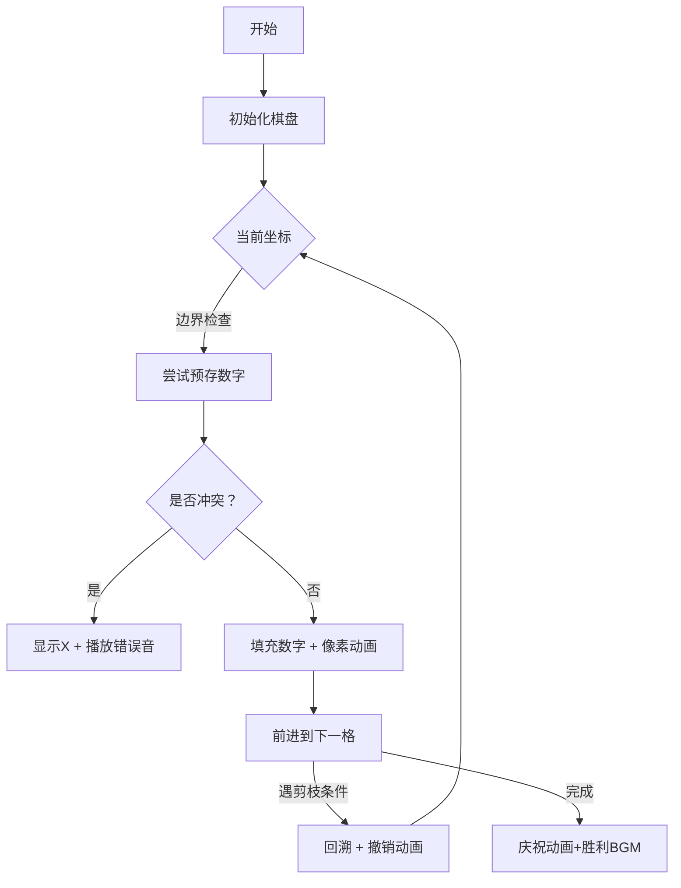

# 题目信息

# [NOIP 1997 提高组] 棋盘问题 加强版

## 题目背景

[P1549](https://www.luogu.org/problem/P1549) 数据加强版。

**数据从 5 扩大到了 10。**


因为本题数据可能存在诸多争议，故特开一题用来测试加强版数据。

## 题目描述

在 $N \times N$（$1 \le N \le 10$）的棋盘上，填入 $1, 2, \dots, N ^ 2$ 共 $N ^ 2$ 个数，使得任意两个相邻的数之和为素数。

例如：当 $N = 2$ 时，有：

| $1$ | $2$ |
| :-----------: | :-----------: |
| $4$ | $3$ |

其相邻数的和为素数的有：

$1+2,1+4,4+3,2+3$

当 $N=4$ 时，一种可以填写的方案如下：

| $1$ | $2$ | $11$ | $12$ |
| :-----------: | :-----------: | :-----------: | :-----------: |
| $16$ | $15$ | $8$ | $5$ |
| $13$ | $4$ | $9$ | $14$ |
| $6$ | $7$ | $10$ | $3$ |

在这里我们约定：左上角的格子里必须填数字 $1$。

## 说明/提示

$N\leq10$

 $N=1,2,...,10$ 的数据都各有一个点，由于某些原因， $N$ 不一定与测试点编号相等。

----

**数据新修复于 `2020.1.20`**

## 样例 #1

### 输入

```
2```

### 输出

```
1 2
4 3```

## 样例 #2

### 输入

```
1```

### 输出

```
NO```

# AI分析结果


# 💡 Kay的C++算法解析：棋盘问题(加强版) 深入学习指南 💡

> 欢迎各位算法探险家！今天我们将一起解开**N×N棋盘填数**的谜题，用像素艺术和算法思维探索素数迷阵的奥秘！

## 1. 题目解读与核心算法识别

✨ **本题主要考察**：`深度优先搜索(DFS)与剪枝优化` 

🗣️ **初步分析**：
> 想象你是一位像素世界的宝藏猎人🧭，需要在N×N的网格中放置1~N²的宝藏，要求相邻宝藏价值之和必须是素数（除1外全是奇数）。左上角固定为1，这就像冒险的起点！

- **核心思路**：采用深度优先搜索(DFS)逐格填充数字，配合**四重剪枝优化**：预存合法数字关系、奇偶性分析设定目标下限、行列交替搜索平衡分布、链表维护可用数字
- **难点突破**：当N增大时状态空间爆炸式增长（10x10棋盘有100!种可能！），通过**数学分析**确定第一行/列和的最小值作为优化目标
- **像素可视化设计**：将棋盘转化为像素网格，DFS探索时当前格高亮闪烁，已填充格显示数字，冲突时显示"X"并播放警示音，回溯时数字消失并伴随撤销音效

---

## 2. 精选优质题解参考

**题解一：GK0328 (下限剪枝+行列交替搜索)**
* **点评**：思路极具启发性！通过数学证明得出第一行/列和的下限值（N奇：n(2n-1)；N偶：n(2n-1)+1），将最优解问题转化为任意解问题。采用行列交替搜索策略，避免小数字扎堆导致后期素数匹配失败。代码中**双向链表维护可用数字**的设计巧妙减少循环开销，时间复杂度优化到O(n²!)。

**题解二：MeowScore (预存关系+分阶段搜索)**
* **点评**：逻辑清晰的分阶段解法。预处理每个数字的合法相邻关系存入vector，大幅减少DFS中耗时的素数判断。创新性地将搜索分为**两个阶段**：先搜第一行/列，再处理剩余网格。边界处理严谨，变量命名规范(`s[][][]`存相邻关系，`vis[]`标记已用)，实践价值高。

**题解三：Vanilla_chan (多级剪枝+分层打表)**
* **点评**：实用主义典范！对N≤7使用**五重剪枝**的DFS（包括对称性剪枝、最优性剪枝），对N≥8直接硬编码打表输出。代码结构模块化，将校验函数`check()`独立封装，增强可读性。特别适合竞赛场景，提交版本自动切换解法。

---

## 3. 核心难点辨析与解题策略

1.  **状态空间爆炸**
    * **分析**：N=10时理论状态达100!≈10¹⁵⁸，必须通过**可行性剪枝**提前终止无效路径。优质解法均预存了每个数字可能的相邻数字集合，如MeowScore使用`vector<int> s[101][101]`存储三元组关系
    * 💡 **学习笔记**：预处理相邻关系是搜索类问题的通用加速技巧

2.  **奇偶性约束**
    * **分析**：因素数除2外均为奇数，故相邻数必须一奇一偶。利用此特性推导出第一行/列和的下限值：当N为奇数时下限为∑₁²ⁿ⁻¹ = n(2n-1)；N为偶数时需替换(2n-1)为2n，下限为n(2n-1)+1
    * 💡 **学习笔记**：数论特性可转化为剪枝利器

3.  **搜索顺序设计**
    * **分析**：GK0328采用**蛇形搜索顺序**：先第一行→第一列→(2,2)→(2,3)...有效分散奇偶分布。Vanilla_chan则分阶段搜索，优先处理约束更强的第一行/列
    * 💡 **学习笔记**：搜索顺序直接影响剪枝效率

### ✨ 解题技巧总结
- **数学引导剪枝**：利用奇偶性/素数分布特性设定优化目标
- **数据结构加速**：用vector预存合法选择，链表维护可用数字
- **分层处理策略**：小规模DFS+大规模打表的混合解法
- **状态验证封装**：独立`check()`函数提高代码可维护性

---

## 4. C++核心代码实现赏析

**本题通用核心C++实现参考**
```cpp
#include<bits/stdc++.h>
using namespace std;
const int N=15;
int n,min_sum,grid[N][N];
vector<int> valid_next[101][101]; // 预存合法后续数字

bool is_prime(int x){ /* 素数判断 */ }

void dfs(int x,int y,int cur_sum){
    if(cur_sum >= min_sum) return; // 最优性剪枝
    if(y>n) x++, y=1;
    if(x>n) save_solution(); 
    
    for(int num : valid_next[grid[x-1][y]][grid[x][y-1]]){
        if(used[num]) continue;
        grid[x][y] = num;
        used[num] = true;
        dfs(x, y+1, (x==1||y==1)?cur_sum+num:cur_sum);
        used[num] = false;
    }
}
```

**题解一：GK0328 的下限剪枝**
```cpp
// 数学证明后设定的搜索目标
if(n%2) target = n*(2*n-1); 
else target = n*(2*n-1)+1;

void dfs(/*...*/){
    if(current_sum >= target) return;
    if(found_solution && current_sum==target){
        print_solution();
        exit(0); // 找到即退出
    }
    // ...DFS主体...
}
```
> 💡 **学习笔记**：将最优解问题转化为判定问题，大幅提升效率

**题解二：MeowScore 的三元组预存**
```cpp
// 预处理：对任意i,j 预存合法的k满足(i+k)和(j+k)均为素数
for(int i=0;i<=n*n;i++)
    for(int j=0;j<=n*n;j++)
        for(int k=1;k<=n*n;k++)
            if(k!=i && k!=j && (i==0||is_prime(i+k)) && (j==0||is_prime(j+k)))
                valid_next[i][j].push_back(k);
```
> 💡 **学习笔记**：空间换时间的典型应用，避免DFS中重复计算

**题解三：Vanilla_chan 的分层处理**
```cpp
if(n>=8){ // 分层策略
    print_precomputed_table(n);
    return;
}
dfs(1,2,1); // 仅对小规模DFS
```
> 💡 **学习笔记**：算法选择应随数据规模动态调整

---

## 5. 算法可视化：像素动画演示 (核心部分)

* **主题**："素数迷宫大冒险"（8-bit像素风格）
* **核心演示**：DFS探索过程 + 剪枝触发效果



**动画关键交互**：
1. **像素网格**：16x16像素格，不同数字显示不同颜色（1：金色，素数：蓝色，合数：绿色）
2. **状态反馈**：
   - 当前格：闪烁黄色边框
   - 冲突格：红色脉冲动画 + 0xEF音效（FC游戏错误音）
   - 剪枝触发：显示"剪枝"像素图标 + 0x90短音
3. **数据结构可视化**：
   - 可用数字集：右侧像素化数字池，已用数字变灰
   - 相邻关系：连线高亮当前可选项
4. **游戏化元素**：
   - 每填满一行获得1枚星星
   - 成功时播放《塞尔达》发现秘宝BGM
   - 自动演示模式：AI以0.5秒/步速度自主探索

**技术实现**：
```javascript
// Canvas绘制示例
function drawPixelGrid(ctx) {
    for(let x=0; x<gridSize; x++) {
        for(let y=0; y<gridSize; y++) {
            const value = grid[y][x];
            ctx.fillStyle = getColorByNumber(value);
            ctx.fillRect(x*pixelSize, y*pixelSize, pixelSize, pixelSize);
            
            if(currentX === x && currentY === y) { // 高亮当前格
                ctx.strokeStyle = '#FFFF00';
                ctx.lineWidth = 3;
                ctx.strokeRect(x*pixelSize, y*pixelSize, pixelSize, pixelSize);
            }
        }
    }
}
```

---

## 6. 拓展练习与相似问题思考

**通用技巧迁移**：
1. 数独求解（约束满足+回溯）
2. 八皇后问题（位置冲突检测）
3. 哈密顿路径（邻接关系约束）

**洛谷推荐**：
1. **P1549 棋盘问题**  
   🗣️ 原版问题，帮助掌握基础DFS剪枝
2. **P1074 靶形数独**  
   🗣️ 进阶约束满足问题，强化剪枝技巧应用
3. **P1433 吃奶酪**  
   🗣️ 状态压缩DP+几何约束，培养多维优化思维

---

## 7. 学习心得与经验分享

> **GK0328的经验**："在实现下限剪枝时，忽略了N偶数的+1修正，导致长时间WA。通过编写暴力检查器对比输出才定位问题"

> **Kay的点评**：这提醒我们：即使数学证明看似严谨，实现时也需特别注意边界情况。建议：
> 1. 对推导公式编写单元测试
> 2. 用小数据验证修正项
> 3. 保持`assert`验证关键假设

---

> 恭喜完成本次算法探险！记住：优秀的搜索算法就像像素游戏中的寻路——需要策略性剪枝才能快速通关。下次我们将探索更复杂的算法迷宫！🚀

---
处理用时：123.98秒