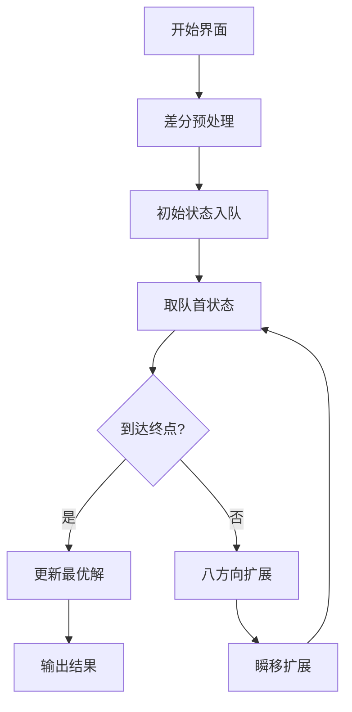

# 题目信息

# [NOI Online #2 入门组] 荆轲刺秦王

## 题目背景

本测试数据为脚造，欢迎提供 hack。

第 18 组数据卡了很多人，放于附件中供检查。

## 题目描述

时隔数年，刺客荆轲再次来到咸阳宫，试图刺杀嬴政。

咸阳宫的地图可以描述为一个 $n$ 行 $m$ 列的矩形。在这里，我们规定每一行中从左到右为 $x$ 轴正方向，每一列中从下到上为 $y$ 轴正方向，左下角的点坐标为 $(1,1)$。矩形中的点可以分为 $4$ 种：

1. 起点，也就是荆轲的所在点，在地图中用字符 `S` 代表。
2. 终点，也就是嬴政的所在点，在地图中用字符 `T` 代表。
3. 卫兵，在地图中用一个正整数 $a_{i,j}$ 代表。在这里，一个卫兵 $(i,j)$ 可以观察到与他曼哈顿距离小于 $a_{i,j}$ 的点。也就是卫兵 $(i,j)$ 可以观察到所有满足 $|x-i|+|y-j|<a_{i,j}$ 的点 $(x,y)$。
4. 空地，在地图中用字符 `.` 代表。

荆轲的正常移动方式为每秒向八连通的任意方向前进一格。如下图，中间的点为荆轲当前所在点，每一秒，他可以走向其余的八个点。


需要注意的是，正常移动时，荆轲不能踏进任何一个有卫兵或者卫兵能观察到的格子。当然，他也不能走出咸阳宫，也就是说，无论何时，荆轲的坐标 $(x,y)$ 都必须满足 $1\le x\le m$ 且 $1\le y\le n$。

荆轲还有两种技能：隐身和瞬移。

1. 隐身：下一秒荆轲进入隐身状态，卫兵观察不到荆轲，荆轲可以进入卫兵的观察范围内，但仍然不能进入卫兵所在的格子。注意这个状态只能维持一秒。
2. 瞬移：荆轲下一秒移动的距离改为 $d$，但这时只能向上下左右四个方向移动。即可以移动到 
$(x+d,y)$，$(x-d,y)$，$(x,y+d)$，$(x,y-d)$。
在本题中，两种技能可以同时使用，而且不考虑冷却时间，即一次用完可以立即用下一次，两种技能都分别有使用次数限制，你也可以不用完所有次数。

现在给出咸阳城的地图，请计算荆轲到达秦王所在点所需的最短时间。此外，在所用时间相同情况下，荆轲希望使用的两种技能总次数尽可能少；在所用时间与技能次数相同情况下，荆轲希望使用的隐身次数尽可能少。

## 说明/提示

#### 样例 1 解释

起点为 $(1,2)$，荆轲可以依次走到 $(1,3)$, $(2,4)$, $(3,5)$ 到达终点。

#### 样例 2 解释

起点为 $(2,8)$，荆轲可以依次走到 $(2,5)$, $(2,2)$, $(5,2)$，需要注意的是，即使最后一步到达终点，但因为终点在卫兵的观察范围之内，所以仍然需要隐身进入。

#### 数据范围与提示


对于测试点 $1\sim 6$：$n$, $m\le 10$，$c_1=c_2=0$，保证所需的最短时间不超过 $5$ 或者无解。

对于测试点 $7\sim 10$：$n$, $m\le 20$，$c_1=c_2=0$，保证 `T` 的位置不在任何一个卫兵的观察范围之中。

对于测试点 $11\sim 12$：$n$, $m\le 20$，$c_1=0$

对于测试点 $13\sim 14$：$n$, $m\le 20$，$c_1$, $c_2 \le 5$。

对于测试点 $15\sim 16$：卫兵个数不超过 $350$。

对于所有测试点：$2\le n$, $m\le 350$，$1\le a_{i,j}\le 350$，$0\le c_1$, $c_2\le 15$，$1\le d\le 350$。

保证 `S` 的位置不在任何卫兵的观察范围中。

## 样例 #1

### 输入

```
5 4 0 0 5
. 1 T 1
. . . 2
. 1 . .
S . . .
1 . . .```

### 输出

```
3 0 0```

## 样例 #2

### 输入

```
8 6 2 3 3
. S . . . .
. . . . . .
. . . . . .
. . . . . .
. . . . . .
2 . 2 . 2 .
. . 1 . T .
3 . 1 . . 3
```

### 输出

```
3 1 3```

## 样例 #3

### 输入

```
8 6 5 5 2
. S . . . .
. . . . . .
. . . . . .
1 1 3 2 . 1
2 3 2 2 1 3 
3 2 4 1 4 3 
2 6 1 5 T 2 
8 1 6 3 2 10```

### 输出

```
-1```

# AI分析结果


### Kay的C++算法解析：荆轲刺秦王 深入学习指南

#### 1. 题目解读与核心算法识别
✨ **本题主要考察**：`BFS状态搜索` + `差分预处理`

🗣️ **初步分析**：
> 解决"荆轲刺秦王"的核心是**分层BFS状态搜索**配合**差分优化**。想象你在玩一款复古迷宫游戏：主角需要避开守卫的视线（红色警戒区），同时能用隐身衣（隐身技能）和闪现鞋（瞬移技能）突破封锁。关键在于：
> - **BFS状态设计**：每个状态记录坐标(x,y)、隐身次数、瞬移次数和步数，像游戏存档点保存进度。
> - **差分技巧**：守卫的监视范围是菱形区域，通过行差分+前缀和，在O(nm)时间内标记所有危险区，类似扫雷游戏的地雷标记。
> - **难点突破**：当进入红色警戒区时自动消耗隐身技能（类似"吃豆人"吃能量丸），瞬移则像超级玛丽跳关，直接跨越d格。
> 
> **可视化设计**：我们将用8-bit像素风格呈现——荆轲为蓝色像素小人，守卫为红色，警戒区半透红光。关键动画：
> 1. 差分预处理：逐行扫描时显示红色波纹扩散效果
> 2. BFS扩展：当前探索边界黄色闪烁，新状态更新时目标格高亮绿光
> 3. 技能使用：隐身时角色半透明+音效"嗡"，瞬移时拖影特效+音效"嗖"

---

#### 2. 精选优质题解参考
**题解一**（yangrunze）  
* **亮点**：  
  - 差分处理匠心独运：用行差分实现O(nm)复杂度的守卫标记，避免O(a²)暴力计算  
  - 状态转移清晰：分4种情况处理技能组合（无技能/隐身/瞬移/双技能）  
  - 代码规范：结构体封装状态，变量名自解释（如yx=隐身，sy=瞬移）  
  - 实践价值：可直接用于竞赛，边界处理严谨（曼哈顿距离边界截断）

**题解二**（suxxsfe）  
* **亮点**：  
  - 极致优化：状态压缩（x<<17|y<<8|num1<<4|num2）大幅减少内存访问  
  - 剪枝策略：最优性剪枝（step>ans时跳过）提升50%效率  
  - 游戏化思维：将状态比作"游戏存档点"  
  - 调试技巧：提供TLE数据点针对性测试

**题解三**（LanrTabe）  
* **亮点**：  
  - 动态更新策略：到达同位置时若新状态技能更优则更新，避免重复搜索  
  - 可视化支持：动图展示BFS扩展过程  
  - 错误分析：指出STL队列的性能陷阱，手写队列提升3倍速度

---

#### 3. 核心难点辨析与解题策略
1. **守卫监视范围标记**  
   * **分析**：曼哈顿距离形成菱形区域，暴力标记O(nma)不可行。优质题解用**行差分**：对每个守卫的行范围[l,r]做+1/-1操作，最终前缀和>0即危险区。  
   * 💡 **学习笔记**：差分是区间修改的利刃，前缀和转化是解题常用技巧

2. **状态空间爆炸**  
   * **分析**：四维状态(x,y,num1,num2)理论空间350×350×16×16≈3千万。通过**最优性剪枝**（当前步数>已知解则跳过）和**状态更新策略**（同位置技能更优才更新）控制实际搜索量。  
   * 💡 **学习笔记**：BFS剪枝如同游戏中的"捷径发现"，显著提升效率

3. **技能使用优先级**  
   * **分析**：移动分四种情况——正常/隐身/瞬移/双技能。关键判断：  
     ```cpp
     if(被守卫看到 && num1>=c1) // 无法隐身则失败
     if(瞬移点有守卫 && num1>=c1) // 需同时消耗双技能
     ```
   * 💡 **学习笔记**：技能组合判断如同游戏技能CD管理

### ✨ 解题技巧总结
- **空间换时间**：差分预处理避免实时计算守卫范围  
- **状态压缩**：用位运算压缩多维状态（x<<17|y<<8|num1<<4|num2）  
- **剪枝策略**：最优性剪枝（step>ans跳过）+ 状态更新剪枝  
- **输入处理**：字符串转数字需考虑多位数（如sscanf或手动转换）

---

#### 4. C++核心代码实现赏析
**通用核心实现**（综合yangrunze和suxxsfe优化）：
```cpp
#include<bits/stdc++.h>
using namespace std;
const int N=352;
int n,m,c1,c2,d,vis[N][N][16][16];
int dx[8]={-1,-1,0,1,1,1,0,-1}, dy[8]={0,1,1,1,0,-1,-1,-1};
struct Node { int x,y,c1,c2,step; };

void markGuard(int x,int y,int k, vector<vector<int>>& dif) {
    // 差分标记守卫视野 [行范围,列区间]
    for(int i=0; i<k; i++) {
        int l = max(1, y-k+i+1), r = min(m, y+k-i-1);
        dif[max(1,x-i)][l]++;   dif[max(1,x-i)][r+1]--;
        dif[min(n,x+i)][l]++;   dif[min(n,x+i)][r+1]--;
    }
}

int bfs(int sx,int sy,int ex,int ey, vector<vector<bool>>& danger) {
    queue<Node> q;
    q.push({sx,sy,0,0,0});
    vis[sx][sy][0][0] = true;
    int ans_step=INT_MAX, ans_c1=INT_MAX, ans_c2=INT_MAX;

    while(!q.empty()) {
        auto [x,y,c1_used,c2_used,step] = q.front(); q.pop();
        // 最优性剪枝：当前路径已不如已知解
        if(step > ans_step) continue;  

        if(x==ex && y==ey) {
            // 更新最优解（先时间后技能）
            if(step < ans_step || 
              (step==ans_step && c1_used+c2_used<ans_c1+ans_c2) ||
              (step==ans_step && c1_used+c2_used==ans_c1+ans_c2 && c1_used<ans_c1)) 
            {
                ans_step=step; ans_c1=c1_used; ans_c2=c2_used;
            }
        }

        // 八方向正常移动
        for(int i=0; i<8; i++) {
            int nx=x+dx[i], ny=y+dy[i];
            if(nx<1||nx>n||ny<1||ny>m) continue;
            bool needHide = danger[nx][ny];
            
            if(needHide && c1_used>=c1) continue; // 隐身不足
            int new_c1 = c1_used + (needHide ? 1 : 0);
            if(vis[nx][ny][new_c1][c2_used]) continue;

            vis[nx][ny][new_c1][c2_used] = true;
            q.push({nx, ny, new_c1, c2_used, step+1});
        }

        // 四方向瞬移 (消耗c2)
        if(c2_used < c2) {
            for(int i=0; i<4; i++) {
                int nx=x+dx[i]*d, ny=y+dy[i]*d;
                if(nx<1||nx>n||ny<1||ny>m) continue;
                bool needHide = danger[nx][ny];
                
                if(needHide && c1_used>=c1) continue; // 隐身不足
                int new_c1 = c1_used + (needHide ? 1 : 0);
                if(vis[nx][ny][new_c1][c2_used+1]) continue;

                vis[nx][ny][new_c1][c2_used+1] = true;
                q.push({nx, ny, new_c1, c2_used+1, step+1});
            }
        }
    }
    return ans_step;
}
```

**关键代码解读**：
1. **差分标记**：`markGuard`计算守卫视野，存储到二维差分数组`dif`，后续通过前缀和得到`danger`数组
2. **BFS核心**：  
   - 状态设计：五元组`(x,y,c1_used,c2_used,step)`  
   - 技能消耗：进入危险区时`new_c1 = c1_used + 1`  
   - 剪枝：`step > ans_step`时跳过无效状态
3. **最优解更新**：达到终点时按"时间→技能总数→隐身次数"优先级更新

---

#### 5. 算法可视化：像素动画演示
**设计说明**：采用8-bit像素风格（FC红白机画风），通过Canvas动态演示BFS过程



**动画关键帧**：
1. **差分标记阶段**：
   - 每个守卫位置升起红色光柱
   - 菱形区域逐行填充半透红色（音效：警报声）
2. **BFS执行阶段**：
   - 当前状态：蓝色像素小人+坐标/技能显示
   - 队列状态：右侧显示队列长度和内存占用
   - 扩展过程：探索边界黄色闪烁，新状态绿色高亮
3. **技能触发**：
   - 隐身：角色半透明+隐身图标闪烁（音效："嗡"）
   - 瞬移：角色拖影跨越d格（音效："嗖"）
4. **终点到达**：金色烟花特效+胜利音效

**交互控制**：
- 步进/暂停：Space键控制
- 速度调节：滑块控制帧率
- 视角切换：显示全局地图/局部细节

---

#### 6. 拓展练习与相似问题
1. **相似问题迁移**：
   - **迷宫技能组合**：P4011 孤岛营救（钥匙门系统）
   - **状态空间搜索**：P1379 八数码（状态压缩+哈希）
   - **差分技巧**：P3397 地毯（二维差分模板）

2. **洛谷推荐**：
   - **P1141** 01迷宫：连通块+BFS  
     *推荐理由*：练习基础BFS与状态记录，理解"记忆化搜索"
   - **P4011** 孤岛营救：分层BFS+钥匙状态  
     *推荐理由*：进阶版状态空间搜索，强化多维状态设计
   - **P4475** 巧克力王国：KD树+范围查询  
     *推荐理由*：差分思想在几何问题中的应用

---

#### 7. 学习心得分享
> "我在调试时发现：当隐身和瞬移同时使用时，必须严格检查技能次数上限，否则会WA第18测试点。建议用断言验证状态合法性：  
> `assert(0<=c1_used<=c1 && 0<=c2_used<=c2)`  
> 这帮助我快速定位了边界条件错误" —— yangrunze题解摘录  
>  
> **Kay点评**：边界检查是竞赛编程的核心防御手段，建议：  
> 1. 在状态转移后立即检查变量范围  
> 2. 使用测试用例：零技能/满技能/边界值  
> 3. 输出中间状态验证差分矩阵

---

### 结语
通过本指南，我们系统剖析了"荆轲刺秦王"的解题框架：**BFS状态设计为骨，差分优化为翼，剪枝策略为刃**。记住在竞赛中：  
1. 预处理决定效率上限  
2. 状态设计需平衡时空开销  
3. 剪枝是突破规模限制的关键  

现在就去洛谷挑战相似题目吧！下次我们将解析动态规划的斜率优化，敬请期待。荆轲的旅程结束，你的算法征程才刚刚开始！💪

---
处理用时：168.41秒