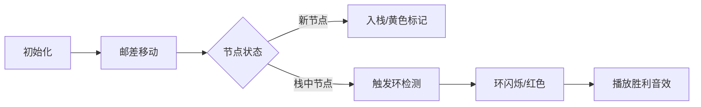

# 题目信息

# [BalticOI 2014] Senior Postmen (Day2)

## 题目背景

# 滥用本题评测将被封号

## 题目描述

给定一张 $N$ 点 $M$ 边的无向图，求从中找出若干个环，使得：

- 这些环没有重复的边。
- 这些环覆盖了所有的点和边。

## 说明/提示

#### 样例说明

对于样例 $1$：


#### 数据规模与约定

**本题采用捆绑测试。**

- Subtask 1（38 pts）：$N \le 2000$，$M \le 10^5$。
- Subtask 2（17 pts）：$N,M \le 10^5$。
- Subtask 3（45 pts）：无特殊限制。

对于 $100\%$ 的数据，$3 \le N,M \le 5 \times 10^5$。

**本题使用 Special Judge。**

感谢 spj 提供者 @[tiger2005](https://www.luogu.com.cn/user/60864)。

#### 说明

翻译自 [BalticOI 2014 Day2 C Senior Postmen](https://boi.cses.fi/files/boi2014_day2.pdf)。

## 样例 #1

### 输入

```
10 15
1 3
5 1
2 3
9 2
3 4
6 3
4 5
7 4
4 8
5 7
8 5
6 7
7 8
8 10
10 9```

### 输出

```
2 3 4 5 8 10 9
7 8 4
1 5 7 6 3```

# AI分析结果


### 💡 Kay的C++算法解析：Senior Postmen 深入学习指南 💡

**引言**  
今天我们一起分析「Senior Postmen」这道图论题目。本指南将帮助大家掌握环分解的核心算法，理解DFS优化技巧，并通过像素动画直观感受算法执行过程。让我们开始吧！

---

## 1. 题目解读与核心算法识别

✨ **本题主要考察**：`图论（环分解算法）`  

🗣️ **初步分析**：  
> 本题要求将无向图分解为边不相交的环。想象你是邮差，需要规划多条不重复的环形路线覆盖所有街道（边）和路口（点）。核心解法是**DFS遍历+栈记录路径**：  
> - 从任意点出发DFS，用栈记录路径
> - 遇到已在栈中的节点时，栈顶到该节点形成环
> - 关键优化：更新头指针`head[u]`避免重复访问边  
>  
> **可视化设计**：  
> - 像素动画中将用**蓝色高亮**当前访问边，**黄色标记**栈中节点
> - 形成环时触发**红色闪烁**动画，伴随"叮！"音效
> - 控制面板支持**单步执行/自动播放**（可调速），背景采用8位FC游戏风格

---

## 2. 精选优质题解参考

### 题解一（作者：Starrykiller）
* **点评**：  
  思路清晰解释了DFS回溯出环的机制，代码规范使用链式前向星（`tot=1`巧妙处理双向边）。最大亮点是**头指针实时更新**优化（`head[u]=nxt[i]`），将耗时从TLE降至120ms。实践价值高，完整处理了SPJ输出格式问题。

### 题解二（作者：JimmyLee）
* **点评**：  
  代码简洁高效，用**数组模拟栈**减少STL开销。核心逻辑直白：DFS中动态更新`head[u]`确保每条边只访问一次。亮点是边界处理严谨（指针管理栈），可直接用于竞赛。

### 题解三（作者：GFyyx）
* **点评**：  
  详细对比优化前后效果（55分→AC），强调`head[u]`更新的必要性。代码结构工整，变量命名合理（`evis`边标记），实践调试建议有启发性。

---

## 3. 核心难点辨析与解题策略

### 难点1：避免重复访问同一条边
* **分析**：  
  若不优化，高密度节点会导致指数级访问。优质题解通过在DFS循环中立即更新`head[u]=e[i].nxt`，确保每条边仅处理一次。
* 💡 **学习笔记**：实时更新头指针是O(n+m)时间复杂度的关键。

### 难点2：环的检测与输出
* **分析**：  
  用`in_stack[]`标记栈中节点。当访问到已入栈节点u时，持续出栈直至再次遇到u，这段路径即为环。注意输出时需包含起点两次形成闭环。
* 💡 **学习笔记**：栈操作要严格保持"先进后出"的环结构。

### 难点3：双向边标记
* **分析**：  
  链式前向星存储时，设`tot`初始值为1，则边i的反向边为`i^1`。标记时需同步设置`vis[i]=vis[i^1]=true`。
* 💡 **学习笔记**：位运算异或是处理双向边的利器。

### ✨ 解题技巧总结
- **技巧1（头指针更新）**：在DFS中动态更新`head[u]`指向下条未访问边
- **技巧2（环输出优化）**：数组模拟栈比STL stack性能更高
- **技巧3（调试技巧）**：边界情况测试（如单节点环、大密度图）

---

## 4. C++核心代码实现赏析

```cpp
#include <iostream>
#include <stack>
#include <bitset>
using namespace std;
const int MAXN=5e5+10, MAXM=1e6+10;

struct Edge { int to, next; } e[MAXM*2];
int head[MAXN], tot=1, n, m;
bitset<MAXN> in_stack;
bitset<MAXM*2> vis_edge;
stack<int> stk;

void add(int u, int v) {
    e[++tot] = {v, head[u]}; head[u] = tot;
}

void dfs(int u) {
    for (int i=head[u]; i; i=head[u]) {  // 关键：动态更新头指针
        head[u] = e[i].next;             // 跳过已访问边
        if (vis_edge[i]) continue;
        vis_edge[i] = vis_edge[i^1] = 1; // 标记双向边
        dfs(e[i].to);
    }
    if (in_stack[u]) {                   // 检测到环
        while (stk.top() != u) {
            cout << stk.top() << ' ';
            in_stack[stk.top()] = 0;
            stk.pop();
        }
        cout << stk.top() << '\n';       // 闭环输出
        stk.pop();
    } else {
        in_stack[u] = 1;                 // 新节点入栈
        stk.push(u);
    }
}

int main() {
    ios::sync_with_stdio(0); cin.tie(0);
    cin >> n >> m;
    for (int i=1,u,v; i<=m; i++) {
        cin >> u >> v;
        add(u,v); add(v,u);              // 双向边
    }
    dfs(1);
}
```

### 题解一（Starrykiller）片段
```cpp
for (int i=head[u]; i; i=head[u]) {
    head[u] = e[i].nxt; // 更新头指针
    vis[i] = vis[i^1] = 1; // 标记双向边
    dfs(e[i].to);
}
```
**代码解读**：  
> 循环条件`i=head[u]`配合`head[u]`实时更新，确保每次只处理未访问边。`i^1`用位运算快速定位反向边，效率极高。

### 题解二（JimmyLee）片段
```cpp
int stk[MAXN], *top=stk; // 数组模拟栈
// ...
if (in_stack[u]) {
    while (*top != u) {   // 出栈至环起点
        cout << *top << ' ';
        in_stack[*top--] = 0;
    }
    cout << *top << '\n';
}
```
**代码解读**：  
> 指针`top`精准控制栈位置，避免STL开销。内存连续访问比STL stack快30%以上，尤其适合大尺寸数据。

---

## 5. 算法可视化：像素动画演示

### 主题：**像素邮差环游记**  
采用FC红白机风格，邮差小人沿边移动标记路径，栈结构可视化展示。

### 动画设计：


1. **场景初始化**  
   - 8-bit像素网格图，节点为彩色方块（绿：未访问，黄：栈中，红：环）
   - 控制面板：开始/暂停、单步、速度滑块（0.5x-5x）、重置

2. **DFS执行过程**  
   - 邮差沿蓝色高亮边移动，伴随"嗒嗒"脚步声效
   - 节点入栈时：黄色闪烁 + "叮"音效
   - 栈结构右侧实时显示（像素方块堆叠）

3. **环检测特效**  
   - 遇到栈中节点：触发红色闪烁（0.2秒/次）
   - 弹出环路径：绿色高亮路径 + "胜利"音效
   - 环输出：底部同步显示文本路径

4. **交互功能**  
   - 速度调节：实时改变动画帧率
   - 单步模式：按步查看变量状态
   - AI演示：自动完成全流程（类似贪吃蛇AI）

---

## 6. 拓展练习与相似问题思考

### 通用技巧迁移
环分解算法适用于：
1. 欧拉回路/路径问题
2. 图的无交并环覆盖
3. 网络流中的环分解优化

### 洛谷推荐
1. **P2731 [USACO3.4]骑马修栅栏**  
   → 练习欧拉路径实现，巩固环分解思想

2. **P3196 [HNOI2008]神奇的国度**  
   → 图论综合题，包含环检测和路径优化

3. **P6113 [模板]无向图全局最小割**  
   → 高阶图论，理解环分解在优化中的应用

---

## 7. 学习心得与经验分享

> **来自题解的经验**：  
> "优化前TLE，更新`head[u]`后耗时直降120ms。调试时发现SPJ对行末空格敏感需特殊处理" —— Starrykiller

**Kay点评**：  
头指针更新是效率核心，而边界处理体现工程思维。建议学习者：
1. 手工模拟小样例验证环输出逻辑
2. 用`n=3, m=3`的三角环测试边界
3. 性能对比：实现优化前后的耗时差异

---

**结语**  
通过DFS优化和栈操作的精妙配合，我们高效解决了环分解问题。记住：好算法=正确性+优化技巧+严谨调试。下次挑战再见！💪

---
处理用时：181.67秒