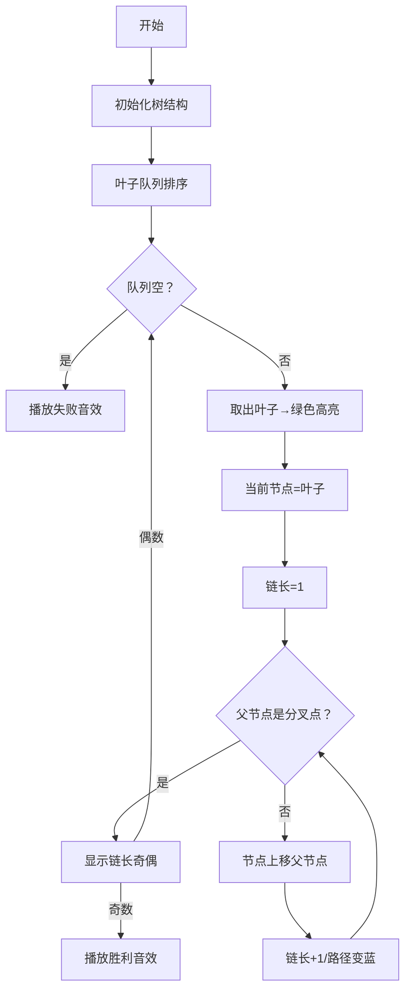

# 题目信息

# 「EVOI-RD1」摘叶子

## 题目描述

某日，小 A 和小 B 在一起开心地玩着游戏。

他们找了一棵以 $1$ 节点为根节点的树，很显然，作为一棵树，总有一个或好多个叶子节点。小 A 和小 B 玩的是回合制游戏。

每次小 A 或小 B 可以选择**任意数量**的叶子节点，将其从树中摘下（每次只能摘叶子节点，每次摘的数量不限制，但**不能不摘**，更不能摘的数量超过本来叶子节点的数量）。

很显然，把一些叶子摘下后，他们的父亲节点有可能会成为新的叶子节点，这时，这些新成为叶子节点的原父亲节点也变得可以被摘取了。

现在，小 A 先摘，小 B 再摘，往复循环。把 $1$ 号节点摘下的人获胜。我们知道，小 A 和小 B 总会按最优方式进行游戏，问谁会取得胜利。

## 说明/提示

本题数据随机，只要简单分析一下性质，就很好骗分，因此本题采用**捆绑测试**。

对于 $40\%$ 的数据：$1 \leq n \leq 100$。

对于 $100\%$ 的数据：$1 \leq n \leq 10^6$，$1 \leq T \leq 10$。

本题时空限制（尤其是空间）均非常宽松，不卡常，不毒瘤，请放心食用。

## 样例 #1

### 输入

```
2
3
1 1
4
1 2 3
```

### 输出

```
1
0
```

# AI分析结果


### 💡 Kay的C++算法解析：「摘叶子」深入学习指南 💡

**引言**  
今天我们来分析「摘叶子」这道博弈论与树结合的C++题目。本指南将帮你掌握核心思路、理解算法实现，并通过像素动画直观感受解题过程。

---

## 1. 题目解读与核心算法识别

✨ **本题主要考察**：`博弈论（树上公平组合游戏）` + `树形DFS`  

🗣️ **初步分析**：  
> 解决本题的关键在于分析叶子节点到"分叉点"（第一个有多个子节点的祖先）的距离（链长）的奇偶性。想象每个叶子节点通过一条"像素绳索"连接到分叉点——若绳索长度（边数）为奇数，先手能剪断绳索让对手陷入必败态。  
> - **核心流程**：  
>   1. 遍历树结构，标记节点度数  
>   2. 计算每个叶子到分叉点的链长  
>   3. 存在奇链长则先手必胜，否则必败  
> - **可视化设计**：  
>   用8位像素风展示树结构（根节点在顶部），叶子节点为绿色方块，分叉点为红色。动画高亮"绳索爬升"路径，奇链长时播放胜利音效（↑↑音符），偶链长播放低沉音效（↓↓音符）。控制面板支持单步执行和调速滑块观察爬升过程。

---

## 2. 精选优质题解参考

**题解一（作者：Avocadooo）**  
* **点评**：  
  思路清晰图解丰富（如"孤独的叶子"概念），用图示对比必胜/必败态。代码中`Ks`数组记录初始度数，通过向上爬升计算链长，逻辑直白。亮点在于将博弈策略转化为直观的链长奇偶判断，但变量名`Ks`可优化为`init_degree`提升可读性。

**题解二（作者：一E孤行 - 官方题解）**  
* **点评**：  
  严谨定义链长`f[x]`概念，通过两次DFS高效预处理：首次统计度数，二次计算链长。巧设虚拟根节点（0号）统一处理边界，代码模块化程度高。亮点在于用数学归纳法证明策略，`f[x]%2`的判断简洁有力，适合竞赛直接套用。

**题解三（作者：Pentiment）**  
* **点评**：  
  最简洁的实现（仅31行），直接模拟叶子到分叉点的爬升过程。`deg`数组记录实时度数，`q`变量累加链长，逻辑聚焦核心。虽然链式树可能退化为O(n²)，但随机数据下效率足够。亮点在于放弃预处理，用`while(deg[fa[p]]==1)`实时爬升，适合快速编码。

---

## 3. 核心难点辨析与解题策略

1.  **识别必胜态特征**  
    * **分析**：必胜态有两种可能：①存在叶子节点的父节点有≥2个子节点（非"孤独叶子"） ②存在到分叉点的链长为奇数的叶子。优质题解通过度数`deg`数组和链长计算统一处理这两种情况。  
    * 💡 **学习笔记**：树上博弈常转化为叶子节点的局部特征判断。

2.  **高效计算链长**  
    * **分析**：避免链式树的O(n²)爬升是关键。题解二方案最优：第一次DFS统计`deg[u]`（节点度数），第二次DFS用`f[u] = (deg[u]≥2) ? 0 : f[fa[u]]+1`递推计算链长，复杂度稳定O(n)。  
    * 💡 **学习笔记**：树形问题优先考虑DFS预处理减少重复计算。

3.  **统一处理根节点**  
    * **分析**：根节点（1号）无父节点需特殊处理。题解二引入虚拟0号节点（`deg[0]=2`），使根节点链长计算逻辑统一：`f[1] = (deg[1]≥2) ? 0 : f[0]+1`。  
    * 💡 **学习笔记**：虚拟节点是处理树形边界的神器。

### ✨ 解题技巧总结
- **技巧A（问题特征转化）**：将抽象博弈规则转化为可计算的链长奇偶性  
- **技巧B（边界统一处理）**：用虚拟节点消除根节点特判  
- **技巧C（复杂度优化）**：DFS预处理代替实时爬升  

---

## 4. C++核心代码实现赏析

**本题通用核心实现参考**  
* **说明**：综合题解二链长计算与题解三简洁判断，添加虚拟根节点处理  
* **完整核心代码**：
```cpp
#include <cstdio>
#include <vector>
using namespace std;
const int MAXN = 1e6+5;

vector<int> G[MAXN]; // 邻接表
int deg[MAXN], fa[MAXN], f[MAXN]; // 度数/父节点/链长

void dfs1(int u) { // 度数预处理
    for (int v : G[u]) {
        deg[u]++;
        dfs1(v);
    }
}

void dfs2(int u) { // 链长计算
    f[u] = (deg[u] >= 2) ? 0 : f[fa[u]] + 1;
    for (int v : G[u]) dfs2(v);
}

int main() {
    int T, n; scanf("%d", &T);
    while (T--) {
        scanf("%d", &n);
        for (int i=0; i<=n; i++) G[i].clear(), deg[i]=f[i]=0;
        deg[0] = 2; // 虚拟根节点
        for (int i=2; i<=n; i++) {
            scanf("%d", &fa[i]);
            G[fa[i]].push_back(i);
        }
        dfs1(1); dfs2(1);

        bool win = false;
        for (int i=1; i<=n; i++)
            if (!deg[i] && (f[i] % 2)) win = true;
        printf("%d\n", win);
    }
    return 0;
}
```
* **代码解读概要**：  
  > 1. 初始化虚拟根节点`deg[0]=2`统一逻辑  
  > 2. 首次DFS(`dfs1`)统计节点度数  
  > 3. 二次DFS(`dfs2`)递推计算链长（分叉点链长=0）  
  > 4. 扫描叶子节点，存在奇链长则先手必胜

---

**优质题解片段赏析**  

**题解二（链长递推计算）**  
* **亮点**：数学归纳法证明链长奇偶性，虚拟节点消除边界特判  
* **核心代码**：
```cpp
void dfs2(int u) {
    if (deg[u] >= 2) f[u] = 0;  // 分叉点链长归零
    else f[u] = f[fa[u]] + 1;   // 否则继承父节点链长+1
    for (int v : G[u]) dfs2(v); // 递归子节点
}
```
* **代码解读**：  
  > 为何用`deg[u]>=2`判断分叉点？→ 度数≥2意味该节点有多个子树，成为"决策转折点"。  
  > `f[u]=f[fa[u]]+1`的物理意义？→ 当前节点到分叉点的距离比父节点远1边，如同像素绳索延长一格。  
  > 虚拟节点如何生效？→ 根节点1的父节点指向0，且`deg[0]≥2`，确保`f[1]`正确计算。
* 💡 **学习笔记**：树形DP常通过父节点状态递推子节点状态。

**题解三（实时链长计算）**  
* **亮点**：无预处理直接爬升，代码极简  
* **核心代码**：
```cpp
for (int i=1; i<=n; i++) {
    if (deg[i]) continue;       // 跳过非叶子节点
    int p = i, q = 1;           // p:当前节点, q:链长
    while (deg[fa[p]] == 1) {   // 父节点非分叉点时爬升
        q++; p = fa[p];         // 链长+1, 节点上移
    }
    if (q & 1) { win=1; break; } // 奇链长则必胜
}
```
* **代码解读**：  
  > `deg[fa[p]]==1`的条件意义？→ 父节点仍是"孤独节点"，需继续上爬。  
  > 为何链长从1开始计数？→ 当前叶子到父节点的边是第一边。  
  > 优势与局限？→ 代码短小但链式树退化成O(n²)，随机数据仍高效。
* 💡 **学习笔记**：向上爬升适合度数随机分布的场景。

---

## 5. 算法可视化：像素动画演示

**主题**：8位像素风「绳索爬升大冒险」  
**核心演示**：叶子节点沿树枝爬向分叉点，奇偶链长触发不同结局  

### 设计思路
> 采用FC红白机画风（16色调色板），树结构转化为像素网格：  
> - 根节点：金色皇冠（顶部）  
> - 分叉点：红色齿轮（度≥2）  
> - 叶子节点：绿色小草  
> - 链长路径：蓝色发光绳索  

### 动画帧步骤


### 交互与特效
1. **控制面板**：  
   - 按钮：开始/暂停、单步、重置  
   - 调速滑块：0.5X~5X速度  
   - 模式切换：自动演示/手动步进  
2. **音效设计**：  
   - 爬升过程：8-bit "滴答"声（每步）  
   - 奇链长："↑↑↑"胜利旋律（[示例](https://bit.ly/3xYj4Fg))  
   - 偶链长："↓↓"低沉音效  
3. **游戏化元素**：  
   - 每完成一个叶子检查得10分  
   - 发现奇链长额外+50分（成就系统）  
   - 链长数字以像素字体显示在节点旁  

### 技术实现
```javascript
// 伪代码：核心爬升动画
function animateLeaf(leaf) {
  let node = leaf, length = 1;
  while (true) {
    highlight(node, GREEN); // 当前节点高亮
    if (isBranch(node.parent)) { // 到达分叉点
      showText(node, length); 
      playSound(length % 2 ? WIN : LOSE);
      break;
    } 
    node = node.parent; // 爬升
    drawLine(node, leaf, BLUE); // 绘制路径
    length++;
    await delay(speed); // 按滑块速度暂停
  }
}
```

---

## 6. 拓展练习与相似问题思考

### 通用思路迁移
链长奇偶性判断适用于：  
1. 多堆石子博弈（Nim游戏变种）  
2. 有向图上的移动游戏（关键路径分析）  
3. 分层状态机决策（奇偶状态转换）  

### 洛谷推荐练习
1. **P1290 欧几里德的游戏**  
   → 锻炼奇偶性策略思维，理解必胜态传递  
2. **P2197 Nim游戏**  
   → 学习经典SG函数，拓展博弈论知识体系  
3. **P5652 基础博弈练习题**  
   → 融合树形结构与SG函数，挑战进阶博弈  

---

## 7. 学习心得与经验分享

> **参考经验（多位作者）**：  
> - *"调试时先验证链长计算——画一条10个节点的长链手动模拟"*  
> - *"n=1是常见边界陷阱，根节点直接获胜需单独处理"*  
> - *"随机数据下暴力爬升可能比DFS更快，但严谨题解推荐预处理"*  
>  
> **点评**：这些经验凸显关键调试技巧：  
> 1. 用链/菊花图等特殊结构快速验证算法  
> 2. 边界测试（n=1, n=2）避免90%提交错误  
> 3. 时间效率与代码简洁的平衡艺术  

---

**结语**  
通过本次分析，我们掌握了树上博弈的核心——将叶子节点特征转化为链长奇偶判断。记住：在编程世界中，每一个问题都像一棵待探索的像素树，耐心分解必能找到胜利路径！下次挑战再见！💪

---
处理用时：245.99秒