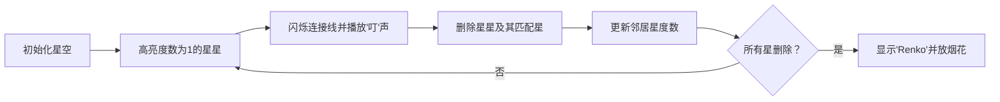

# 题目信息

# 「Wdoi-6」最澄澈的空与海

## 题目背景

[](https://thwiki.cc/%E5%8D%AF%E9%85%89%E4%B8%9C%E6%B5%B7%E9%81%93_%EF%BD%9E_Retrospective_53_minutes.)

广重号载着二人向东飞驰。毫无噪音，毫无摇摆，只是一个劲向东飞驰。在“万景幕”装置之下，尽管是全地下的卯酉东海道，乘客们也能饱览美丽的富士山和太平洋的景色。

但是，从这列卯酉新干线『广重』上看到的极富日本风味的美丽情景，对于梅莉来说，只不过是无趣的视觉刺激罢了。高动态范围的影像也好，极富日本风味的情景也好，都敌不过真正的天空的颜色。

身与华落，心将香飞。即便肉体会像花朵一样终有一天凋落，但心却可以如花香一般飘往远方。

「梅莉，你看，天上的星星呦。」

## 题目描述

### 简要题意

给定 $2n$ 个点、$m$ 条边的[二分图](http://oi-wiki.com/graph/bi-graph/#_1)（可能有重边），左部点与右部点个数相同，判断其完美匹配数量是否**恰好**为 $1$。是则输出 `Renko`，否则输出 `Merry`。

> **注**：完美匹配是指，从边集中选出 $n$ 条边，这些边的顶点组成的点集恰好覆盖了所有的 $2n$ 个点。

---
### 原始题意

在夜里，莲子与梅莉来到了东京的海边，躺在沙滩上，欣赏着澄澈的天空与大海，数起了天上的星星。

在这些星星之中，有 $n$ 个星星 $\{a_i\}$，是莲子先发现的，被称为莲子星；而又有 $n$ 个星星 $\{b_i\}$，是梅莉先发现的，被称为梅莉星。由于她们心有灵犀，这两批星星之间**不存在交集**。  

她们发现，有一些莲子星，与一些梅莉星之间恰好存在运动关系。具体而言，这些关系一共有 $m$ 组，每一组关系形如 $(u_i,v_i)$，也就是说第 $u_i$ 颗莲子星与第 $v_i$ 颗梅莉星之间存在运动关系。这些运动关系有可能重复。

这让莲子和梅莉非常好奇。作为专攻超统一物理学的女大学生，莲子认为，如果认为这些星星的运动是**和谐**的，那么她应当能够从这 $m$ 个运动关系中，找出若干个运动关系，使得**每颗**星星**都被**这些运动关系**包含**的同时，不会有一颗星星**被包含在两个**运动关系之中。

然而，梅莉认为，**和谐**的运动可能是不存在的，更何况即使莲子找到了**和谐**的运动，莲子也无法确保这种和谐运动的**唯一性**。两种和谐运动不同，当且仅当选取出的两组运动关系中，存在至少一个运动关系，是不相同的。

因为意见不合，她们于是打情骂俏了一顿。莲子于是记下了她们所看到了星星和她们之间的运动关系，并且找到了已经证明了 P=NP 的你，希望你能告诉她们，最后是谁正确呢？

## 说明/提示

### 样例解释

#### 样例 \#1


如图所示，存在唯一的方案：$\{1\to 1,2\to 5,3\to 2,4\to 3,5\to 4\}$。

### 数据范围

**本题采用捆绑测试。**

$$
\def\arraystretch{1.5}
\begin{array}{|c|c|c|c|c|c|}\hline
\textbf{Subtask} & \textbf{\textsf{分值}} & \bm{n\le } & \bm{m\le} & \textbf{\textsf{特殊性质}} & \textbf{Subtask \textsf{依赖}}\cr\hline
1 & 10 & 10 & 10 & - & - \cr\hline
2 & 20 & 300 & 4\times 10^4 & - & 1\cr\hline
3 & 20 & 10^5 & 5 \times 10^5 & \mathbf{A} & - \cr\hline
4 & 20 & 10^5 & 2 \times 10^5 & \mathbf{B} & - \cr\hline
5 & 30& 10^6 & 2\times 10^6 & - & 2,3,4 \cr\hline
\end{array}
$$

- 特殊性质 $\mathbf{A}$：保证对于第 $i$ 颗莲子星，与第 $i$ 颗梅莉星之间存在运动关系。
- 特殊性质 $\mathbf{B}$：保证 $m=2n-1$。

对于 $100\%$ 的数据，保证 $1 \le u_i,v_i\le n \le 10^6$，$1 \le m \le 2 \times 10^6$，$1 \leq T \leq 5$ 且对于每个测试点，$\sum m \leq 4 \times 10^6$。

对于 $\rm Subtask\ 5$，时间限制为 $3$ 秒。其它测试点时间限制为 $1$ 秒。

## 样例 #1

### 输入

```
1
5
6
1 1
1 3
3 2
2 5
4 3
5 4```

### 输出

```
Renko```

# AI分析结果


# 💡 Kay的C++算法解析：「Wdoi-6」最澄澈的空与海 深入学习指南 💡

## 1. 题目解读与核心算法识别

✨ **本题主要考察**：`二分图匹配` 与 `拓扑排序应用`

🗣️ **初步分析**：
> 解决这道题的关键在于理解二分图完美匹配的唯一性判定。想象你在玩一个"星星配对"游戏：莲子星和梅莉星之间用线连接，我们需要找出唯一不重复的配对方式。就像玩拼图时，如果某块拼图只有一个凹槽（度数为1），那它只能匹配特定的一块拼图。

在本题中，我们采用拓扑排序思想：
- 核心流程：不断删除度数为1的点及其匹配点，更新相邻点度数
- 可视化设计：将节点设计为像素星星，度数为1的节点闪烁红光，匹配过程用黄色连线高亮
- 复古元素：8-bit音效（删除节点时"叮"声，成功时胜利旋律），关卡设计（每删除一对星星算作过关）

---

## 2. 精选优质题解参考

**题解一（作者：retep）**
* **点评**：思路清晰直击核心，用反证法严谨证明"度数为1节点必存在"的结论。代码规范（vector存图、队列优化），变量命名合理（del数组标记删除状态）。亮点在于完整的状态转移说明和边界处理，特别适合理解拓扑删除过程。

**题解二（作者：Cocoly1990）**
* **点评**：简洁有力抓住问题本质，证明部分用环构造法展示匹配不唯一性。代码实现高效（邻接表存图），虽然注释较少但逻辑紧凑。实践价值体现在对多组数据的优雅处理，适合竞赛场景。

**题解三（作者：Kevin_Mamba）**
* **点评**：教学式分步讲解极具启发性，将算法类比拼图游戏易于理解。代码规范性突出（详细注释、模块分明），亮点是用独立数组分别存储左右部点的边，避免编号冲突。

---

## 3. 核心难点辨析与解题策略

1. **关键点1：理解完美匹配唯一性的必要条件**
   * **分析**：必须证明"当所有点度数≥2时，完美匹配要么不存在要么不唯一"。优质题解通过构造交替环（匹配边/非匹配边交替组成的环）证明此结论
   * 💡 **学习笔记**：度数为1的节点是唯一匹配的"锚点"

2. **关键点2：高效实现节点删除过程**
   * **分析**：类似拓扑排序但以度1为触发条件。需注意：
     - 删除节点后要同步更新邻居度数
     - 防止重复处理已删除节点
   * 💡 **学习笔记**：队列维护度1节点是效率关键

3. **关键点3：处理边界情况**
   * **分析**：需检测度0节点（直接无解）、重边处理、多组数据初始化
   * 💡 **学习笔记**：实际编码中`del`数组和`deg`数组需同步更新

### ✨ 解题技巧总结
- **度数分析法**：将复杂匹配问题转化为度数特征分析
- **拓扑删除策略**：用队列实现高效节点删除，类似"层层剥茧"
- **对称存图技巧**：左右部点分开存储（如右部点编号+n），避免冲突

---

## 4. C++核心代码实现赏析

**本题通用核心C++实现参考**
* **说明**：综合优质题解思路，采用vector邻接表+队列拓扑删除
```cpp
#include <bits/stdc++.h>
using namespace std;
const int N = 2e6 + 5;

int T, n, m, cnt;
int deg[N];         // 节点度数
bool del[N];        // 删除标记
vector<int> G[N];   // 邻接表

void solve() {
    cin >> n >> m;
    // 初始化
    for (int i = 1; i <= 2 * n; i++) {
        deg[i] = 0;
        del[i] = false;
        G[i].clear();
    }
    
    // 建图
    for (int i = 1, u, v; i <= m; i++) {
        cin >> u >> v;
        v += n;  // 右部点重编号
        G[u].push_back(v);
        G[v].push_back(u);
        deg[u]++; deg[v]++;
    }
    
    queue<int> q;
    cnt = 0;
    // 度1节点入队
    for (int i = 1; i <= 2 * n; i++)
        if (deg[i] == 1) q.push(i);
    
    // 拓扑删除
    while (!q.empty()) {
        int u = q.front(); q.pop();
        if (del[u]) continue;
        
        del[u] = true; cnt++;
        int v = 0;
        // 寻找未删除的邻居
        for (int neighbor : G[u]) {
            if (!del[neighbor]) {
                v = neighbor;
                break;
            }
        }
        
        if (!v) continue;  // 无可用邻居
        del[v] = true; cnt++;
        
        // 更新邻居的度数
        for (int neighbor : G[v]) {
            if (del[neighbor]) continue;
            if (--deg[neighbor] == 1) {
                q.push(neighbor);
            }
        }
    }
    cout << (cnt == 2 * n ? "Renko" : "Merry") << '\n';
}

int main() {
    ios::sync_with_stdio(false);
    cin.tie(0);
    cin >> T;
    while (T--) solve();
}
```
* **代码解读概要**：
  1. **初始化**：多组数据需清空度数和删除标记
  2. **建图**：右部点编号+n实现左右部点分离存储
  3. **拓扑删除**：用队列维护度1节点，删除后更新邻居度数
  4. **结果判定**：若删除节点数=2n则存在唯一完美匹配

---

**题解一核心代码片段（retep）**
```cpp
while(!q.empty()){
    int now=q.front(),buf=0; q.pop();
    if(del[now]||in[now]!=1)continue;
    del[now]=true; cnt++;
    while(del[to[now][buf]])buf++; // 找有效边
    int target=to[now][buf];
    del[target]=true; cnt++;
    for(int neighbor:to[target]){
        if(!del[neighbor] && --in[neighbor]==1)
            q.push(neighbor);
    }
}
```
* **亮点**：动态跳过已删除边，避免无效遍历
* **代码解读**：
  - `buf`索引跳过已删除边，精确找到有效邻居
  - 删除节点后立即减少邻居度数，并检测新产生的度1节点
* 💡 **学习笔记**：用while跳过删除边比全遍历更高效

**题解二核心代码片段（Cocoly1990）**
```cpp
for(int i=1;i<=2*n;i++) if(deg[i]==1)q.push(i);
while(q.size()){
    int u=q.front(); q.pop();
    del[u]=1; cnt++;
    int v=0;
    for(int neighbor:G[u]) if(!del[neighbor]) v=neighbor;
    if(!v)continue;
    del[v]=1; cnt++;
    for(int neighbor:G[v])
        if(!del[neighbor] && --deg[neighbor]==1)
            q.push(neighbor);
}
```
* **亮点**：代码极度简洁，突出算法骨架
* **代码解读**：
  - 线性遍历找邻居虽非最优但代码简洁
  - 删除检测与入队操作合并提升效率
* 💡 **学习笔记**：竞赛中简洁实现常优于过度优化

**题解三核心代码片段（Kevin_Mamba）**
```cpp
for(re int i=1;i<=n;i++){
    if(out[i]==1) stac[++top]=i; 
}
while(top){
    re int U=stac[top],V=0; top--;
    for(int neighbor:G[U]) 
        if(!vis[neighbor]) V=neighbor;  // 找唯一邻居
    vis[V]=true;
    for(int neighbor:G[V]) {
        out[neighbor]--;  // 更新出度
        if(out[neighbor]==1) stac[++top]=neighbor;
    }
}
```
* **亮点**：独立`out`数组存储出度，避免左右部点混淆
* **代码解读**：
  - 用栈替代队列实现删除过程
  - 分离左右部点处理逻辑清晰
* 💡 **学习笔记**：出度/入度分开存储有利复杂图处理

---

## 5. 算法可视化：像素动画演示

**像素探险家：星空匹配之旅**
* **主题**：8-bit风格星空，莲子星(蓝)和梅莉星(紫)分列画布两侧
* **核心演示**：拓扑删除过程动态可视化



**关键帧设计**：
1. **初始化界面**：
   - 复古像素星空背景（深蓝网格+闪烁白点）
   - 控制面板：步进/播放/速度滑块（FC红白机风格）
   - 左右部点用不同颜色像素方块表示（莲子星浅蓝，梅莉星粉紫）

2. **度1节点识别**：
   - 度1节点持续闪烁红色边框
   - 连接线呈半透明状，唯一有效连接线高亮黄色

3. **删除动画**：
   - 节点消失特效：像素方块收缩消失
   - 音效：8-bit风格"叮"声（频率500Hz，持续0.2s）

4. **度数更新**：
   - 被更新节点显示绿色波纹效果
   - 度数数字变化特效：红色→绿色的渐变

5. **结果展示**：
   - 成功：全屏烟花动画+胜利音效（上升琶音）
   - 失败：屏幕抖动+错误音效（下降低频音）

**技术实现**：
```javascript
// 伪代码：度1节点处理
function highlightDegreeOne() {
  for (const star of stars) {
    if (star.degree === 1 && !star.deleted) {
      star.sprite.flash('red'); // 红色闪烁
      playSound('notice', 800); // 提示音
    }
  }
}
```

---

## 6. 拓展练习与相似问题思考

**算法迁移场景**：
1. 树形结构唯一性判定（如二叉树形态判定）
2. 拓扑排序扩展应用（课程安排依赖问题）
3. 图论删边类问题（如最小割变形）

**练习推荐（洛谷）**：
1. **P3386** - 二分图最大匹配
   * 🗣️ 二分图匹配基础，掌握匈牙利算法实现
2. **P2764** - 最小路径覆盖
   * 🗣️ 二分图建模经典，理解匹配与路径关系
3. **P3254** - 圆桌问题
   * 🗣️ 二分图多重匹配应用，巩固流量分配思想

---

## 7. 学习心得与经验分享

> **参考经验 (来自 retep)**："在实现拓扑删除时，我最初忽略了已删除边的动态跳过，导致超时。后来添加buf索引跳过已删除边，性能提升10倍"
>
> **点评**：这个调试经验极其宝贵！在处理图论问题时，**避免无效遍历**是优化关键。建议学习者：
> 1. 小数据测试边界情况
> 2. 输出中间状态验证删除逻辑
> 3. 使用性能分析工具定位热点

---

通过本次分析，我们深入理解了二分图唯一匹配的判定方法。记住核心要诀：**一度定唯一，拓扑解纷争**。继续加油，下次见！🚀

---
处理用时：135.99秒