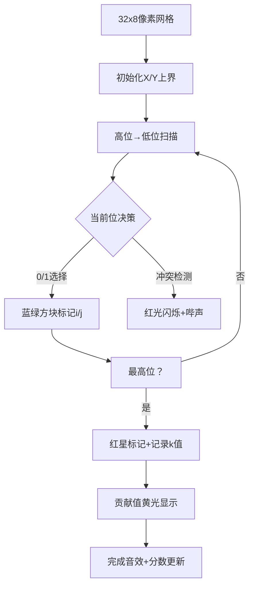

# 题目信息

# [ICPC 2020 Shanghai R] Sum of Log

## 题目描述

给定两个非负整数 $X$ 和 $Y$，计算以下值：  
$$ \sum_{i=0}^{X}\sum_{j=[i=0]}^{Y}[i\&j=0]\lfloor\log_2(i+j)+1\rfloor $$  
对 $10^9+7$ 取模，其中  
- $\&$ 表示按位与运算；  
- $[A]$ 的值为 1 如果 $A$ 为真，否则为 0；  
- $\lfloor x\rfloor$ 表示不大于 $x$ 的最大整数。

## 说明/提示

对于第一个测试用例：  
- 两个 $(i,j)$ 对使得和增加 1：$(0, 1), (1, 0)$  
- 六个 $(i,j)$ 对使得和增加 2：$(0, 2), (0, 3), (1, 2), (2, 0), (2, 1), (3, 0)$  

所以答案是 $1\times 2 + 2\times 6 = 14$。

题面翻译由 ChatGPT-4o 提供。

## 样例 #1

### 输入

```
3
3 3
19 26
8 17```

### 输出

```
14
814
278```

# AI分析结果


### 💡 Kay的C++算法解析：Sum of Log 深入学习指南 💡

#### 1. 题目解读与核心算法识别
✨ **本题主要考察**：`数位动态规划`（二进制位处理技巧）  
🗣️ **初步分析**：  
> 解决"Sum of Log"的关键在于运用`数位DP`。想象你在破解一个二进制密码锁：每个旋钮代表一个二进制位（0/1），需同时满足三个条件：(1) 两个数的同一二进制位不能同时为1（`i & j = 0`）(2) 不超过X/Y的上界 (3) 准确识别最高位1的位置（决定对数贡献值）。  
> - **核心思路**：利用`i & j = 0`时`i+j = i|j`的特性，将`log2(i+j)+1`转化为最高位1的位数+1。通过枚举最高位位置k，用数位DP统计满足条件的(i,j)对数  
> - **可视化设计**：像素网格中，用蓝/绿方块表示i/j的1，红色闪烁标记最高位，黄光提示上界限制。复古8-bit音效：选择位时的"滴"声，冲突时的"哔"错误音，找到解时的胜利旋律  
> - **难点解析**：需同步处理两个数的上界限制、避免位冲突、动态识别最高位——这些将成为像素动画中重点高亮的逻辑链  

---

#### 2. 精选优质题解参考
**题解一（作者：int_R）**  
* **点评**：  
  思路清晰直击核心——枚举最高位k后分解为两种独立情况，数位DP状态`f[pos][a][b]`精炼（a/b表示i/j的上界限制）。代码规范：  
  - 变量名`(X,Y,pos)`含义明确，边界处理严谨（`(X-(1<<k))<(1<<k)`巧妙处理剩余位上界）  
  - 算法高效：O(Tlog²X)完全满足竞赛要求，DFS记忆化避免重复计算  
  - **亮点**：枚举最高位+独立DP的设计，将复杂问题优雅拆解，空间复杂度优化到O(logX)

**题解二（作者：Diaоsi）**  
* **点评**：  
  采用四维状态`f[pos][lim_i][lim_j][zero]`同步处理上界和"前导零"状态：  
  - `zero`状态识别首次出现的1（最高位），直接计算贡献  
  - 代码结构工整：三重循环枚举i/j当前位，`zero`判断逻辑简洁  
  - **亮点**：统一DFS处理所有情况，避免多次调用DP，但需注意减去(0,0)边界  

**题解三（作者：DengDuck）**  
* **点评**：  
  创新性使用双循环嵌套处理位选择：  
  - 外层枚举最高位k，内层DFS强制高位为0  
  - 优化点：通过`x>k&&i`提前剪枝高位冲突  
  - **亮点**：`gt()`函数封装位提取，增强可读性；循环边界`M=31`确保32位兼容性  

---

#### 3. 核心难点辨析与解题策略
1. **难点1：最高位贡献的动态识别**  
   * **分析**：当`i&j=0`时，`log₂(i+j)+1` = 最高位1的位置+1。需在数位DP中区分"当前是否首次出现1"  
   * 💡 **学习笔记**：通过`zero`状态标记前导零，第一次出现1时记录位序号k

2. **难点2：双上界的同步处理**  
   * **分析**：i≤X和j≤Y构成双重约束。需用`lim_i`/`lim_j`状态记录是否紧贴上界，影响当前位选择范围  
   * 💡 **学习笔记**：当`lim_i=true`，当前位不能超过X的对应位；一旦选择小于上界的值，后续位解除限制

3. **难点3：位冲突的即时检测**  
   * **分析**：`i&j=0`要求每对二进制位不能同时为1。需在枚举时即时剪枝  
   * 💡 **学习笔记**：双循环内层用`if(i&j)continue`快速跳过非法组合

✨ **解题技巧总结**：  
- **技巧1：问题分解** - 将`∑log`转化为"枚举最高位k + 统计对应(i,j)对数"  
- **技巧2：状态压缩** - 用0/1标记上界状态，避免携带完整X/Y值  
- **技巧3：记忆化复用** - DFS中存储`f[pos][lim_i][lim_j]`减少重复计算  

---

#### 4. C++核心代码实现赏析
**通用核心实现（综合题解精华）**  
```cpp
#include <bits/stdc++.h>
using namespace std;
const int MOD = 1e9+7;
using ll = long long;

ll f[31][2][2]; // f[pos][lim_i][lim_j]
int X, Y;

ll dfs(int pos, bool lim_i, bool lim_j) {
    if (pos < 0) return 1;
    if (f[pos][lim_i][lim_j] != -1) return f[pos][lim_i][lim_j];
    
    int up_i = lim_i ? (X >> pos) & 1 : 1;
    int up_j = lim_j ? (Y >> pos) & 1 : 1;
    ll res = 0;

    for (int i = 0; i <= up_i; ++i)
    for (int j = 0; j <= up_j; ++j) {
        if (i & j) continue; // 位冲突检测
        bool new_lim_i = lim_i && (i == up_i);
        bool new_lim_j = lim_j && (j == up_j);
        res = (res + dfs(pos-1, new_lim_i, new_lim_j)) % MOD;
    }
    return f[pos][lim_i][lim_j] = res;
}

int main() {
    int T; cin >> T;
    while (T--) {
        cin >> X >> Y;
        ll ans = 0;
        // 枚举最高位k
        for (int k = 0; k <= 30; ++k) {
            ll cnt = 0;
            // 情况1: i的k位=1, j的k位=0
            if (X >= (1 << k)) {
                memset(f, -1, sizeof f);
                cnt += dfs(k-1, (X - (1<<k)) < (1<<k), Y < (1<<k));
            }
            // 情况2: j的k位=1, i的k位=0
            if (Y >= (1 << k)) {
                memset(f, -1, sizeof f);
                cnt += dfs(k-1, X < (1<<k), (Y - (1<<k)) < (1<<k));
            }
            ans = (ans + cnt * (k+1)) % MOD;
        }
        cout << ans << '\n';
    }
}
```
**代码解读概要**：  
1. **DFS核心**：从高位向低位递归，`lim_i/lim_j`标记i/j是否紧贴上界  
2. **位枚举**：双层循环枚举当前位的4种组合(00,01,10,11)，跳过`i&j=1`冲突  
3. **贡献计算**：枚举最高位k，分两种情况统计合法(i,j)对，乘以`k+1`贡献值  

---

#### 5. 算法可视化：像素动画演示
**主题**：8-bit二进制迷宫探险  
**核心演示流程**：  


**交互控制面板**：  
- **步进控制**：方向键移动位光标，Enter确认选择  
- **自动演示**：AI自动选择路径，速度滑块(1x-5x)  
- **动态显示**：  
  - 左侧：实时二进制网格（蓝：i的1，绿：j的1）  
  - 右侧：贡献值累计面板（当前k值+总分数）  
- **音效设计**：  
  - 位选择：8-bit电子音(260Hz/330Hz)  
  - 冲突：短促警报声(800Hz)  
  - 过关：16-bit胜利旋律  

---

#### 6. 拓展练习与相似问题思考
**通用技巧迁移**：  
数位DP可解决所有"数字组成特性+上界约束"问题：  
1. 相邻位限制（如windy数）  
2. 数位和特定倍数  
3. 回文数检测  

**洛谷推荐**：  
1. **P2657 [SCOI2009] windy数**  
   🗣️ 练习基础数位DP，掌握相邻位约束处理  
2. **P2602 [ZJOI2010] 数字计数**  
   🗣️ 强化状态设计能力，实现数字频率统计  
3. **P4124 [CQOI2016] 手机号码**  
   🗣️ 综合应用：多条件约束+大状态空间优化  

---

#### 7. 学习心得与经验分享
> **参考经验（来自 int_R）**：  
> "数位DP的关键在于：① 精确理解状态定义 ② 处理好DFS的调用边界。曾因忽略`X-(1<<k)<(1<<k)`的隐含条件WA三次，最后手动模拟二进制减法才找到问题"  
>  
> **Kay点评**：  
> 调试数位DP时，务必：  
> - 打印中间状态：`pos, lim_i, lim_j`  
> - 小数据模拟：X/Y=3时逐步跟踪位决策  
> - 警惕位运算优先级：多用括号确保`(X>>k)&1`  

---

通过本指南，我们深入剖析了数位DP的底层逻辑与实现技巧。记住：**优秀的算法设计=问题转化能力+状态抽象能力+边界严谨性**。继续挑战新问题吧，少年！🚀

---
处理用时：392.18秒