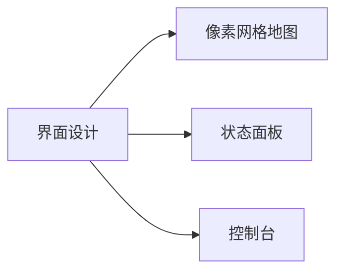

# 题目信息

# [NOIP 2009 提高组] 最优贸易

## 题目背景

本题原题数据极弱，Subtask 0 中的测试点为原题测试点，Subtask 1 中的测试点为 Hack 数据。

## 题目描述

$C$ 国有 $n$ 个大城市和 $m$ 条道路，每条道路连接这 $n$ 个城市中的某两个城市。任意两个城市之间最多只有一条道路直接相连。这 $m$ 条道路中有一部分为单向通行的道路，一部分为双向通行的道路，双向通行的道路在统计条数时也计为 $1$ 条。

$C$ 国幅员辽阔，各地的资源分布情况各不相同，这就导致了同一种商品在不同城市的价格不一定相同。但是，同一种商品在同一个城市的买入价和卖出价始终是相同的。

商人阿龙来到 $C$ 国旅游。当他得知同一种商品在不同城市的价格可能会不同这一信息之后，便决定在旅游的同时，利用商品在不同城市中的差价赚回一点旅费。设 $C$ 国 $n$ 个城市的标号从 $1\sim n$，阿龙决定从 $1$ 号城市出发，并最终在 $n$ 号城市结束自己的旅行。在旅游的过程中，任何城市可以重复经过多次，但不要求经过所有 $n$ 个城市。阿龙通过这样的贸易方式赚取旅费：他会选择一个经过的城市买入他最喜欢的商品――水晶球，并在之后经过的另一个城市卖出这个水晶球，用赚取的差价当做旅费。由于阿龙主要是来 $C$ 国旅游，他决定这个贸易只进行最多一次，当然，在赚不到差价的情况下他就无需进行贸易。

假设 $C$ 国有 $5$ 个大城市，城市的编号和道路连接情况如下图，单向箭头表示这条道路为单向通行，双向箭头表示这条道路为双向通行。


假设 $1\sim n$ 号城市的水晶球价格分别为 $4,3,5,6,1$。

阿龙可以选择如下一条线路：$1\to2\to3\to5$，并在 $2$ 号城市以 $3$ 的价格买入水晶球，在 $3$ 号城市以 $5$ 的价格卖出水晶球，赚取的旅费数为 $2$。

阿龙也可以选择如下一条线路：$1\to4\to5\to4\to5$，并在第 $1$ 次到达 $5$ 号城市时以 $1$ 的价格买入水晶球，在第 $2$ 次到达 $4$ 号城市时以 $6$ 的价格卖出水晶球，赚取的旅费数为 $5$。

现在给出 $n$ 个城市的水晶球价格，$m$ 条道路的信息（每条道路所连接的两个城市的编号以及该条道路的通行情况）。请你告诉阿龙，他最多能赚取多少旅费。

## 说明/提示

【数据范围】

输入数据保证 $1$ 号城市可以到达 $n$ 号城市。

对于 $10\%$ 的数据，$1\leq n\leq 6$。

对于 $30\%$ 的数据，$1\leq n\leq 100$。

对于 $50\%$ 的数据，不存在一条旅游路线，可以从一个城市出发，再回到这个城市。

对于 $100\%$ 的数据，$1\leq n\leq 100000$，$1\leq m\leq 500000$，$1\leq  x,y\leq  n$，$1\leq  z\leq  2$，$1\leq $ 各城市的编号 $\leq  n$。

水晶球价格 $\leq 100$。

NOIP 2009 提高组 第三题

## 样例 #1

### 输入

```
5 5 
4 3 5 6 1 
1 2 1 
1 4 1 
2 3 2 
3 5 1 
4 5 2 ```

### 输出

```
5```

# AI分析结果


# 💡 Kay的C++算法解析：最优贸易 深入学习指南 💡

> **Kay的提示**：同学们，今天我们一起探索「最优贸易」问题！这道题考察**分层图思想**的应用，核心在于将买卖状态转化为图的不同层次。我将用清晰的语言和生动的比喻帮助你理解，还会设计一个**复古像素游戏动画**来直观展示算法过程！准备好开始冒险了吗？🚀

## 1. 题目解读与核心算法识别

✨ **本题主要考察**：`分层图应用`（编程技巧应用）

🗣️ **初步分析**：
> 想象你是一位水晶球商人，要在城市间旅行时完成**一次买卖**赚取差价。分层图就像把你的旅程复制成**三层平行世界**：
> - **第一层**：还未购买水晶球的你（初始状态）
> - **第二层**：已购买但未卖出的你（背负水晶球）
> - **第三层**：已完成买卖的你（轻松无负担）
> 
> 通过在不同层间建立**价格转换通道**（买入时扣钱，卖出时加钱），我们把商业决策转化为图上的路径问题。核心难点在于：
> - 如何设计三层图之间的转移关系
> - 如何处理双向道路的特殊情况
> - 为什么用最长路而非最短路求解
> 
> **可视化设计思路**：在像素动画中，我们将用三种颜色区分层次（蓝/黄/绿），当角色跨越层级时触发闪光和音效，并用浮动数字显示资金变化。复古UI会显示当前层数和资金，控制面板支持单步执行观察状态跃迁。

---

## 2. 精选优质题解参考

**题解一：fy1234567ok（分层图+SPFA）**  
* **点评**：这份题解用40行代码完美实现分层图思想，逻辑清晰如闯关地图：  
  - **思路**：三层图结构设计巧妙（基础层/买入层/卖出层），通过`t(x,i)=x+i*n`优雅处理节点映射  
  - **代码**：变量名`t(x,i)`直白易懂，SPFA实现简洁规范，关键行注释到位  
  - **亮点**：用负边权实现最长路转化（`d[v] < d[x] + len`判断），避免写复杂的最长路算法  
  - **实践**：代码可直接用于竞赛，处理了`INT_MIN`初始化与双向边（z=2）的特殊情况

**题解二：HPXXZYY（双端SPFA法）**  
* **点评**：提供创新性双路径解法，像同时派出两支探险队：  
  - **思路**：正向SPFA找路径最小进价，反向SPFA找路径最大售价，差值即利润  
  - **代码**：独立封装`spfa()`和`spfa1()`，`dis`与`dis1`数组命名清晰，避免状态混淆  
  - **亮点**：建反图技巧实现高效回溯（`g2`存储反边），时间复杂度优于分层图  
  - **实践**：对大规模数据更鲁棒，`ans = max(dis1[i]-dis[i])`的最终计算简洁有力

**题解三：ctzm（Tarjan缩点+DAG上DP）**  
* **点评**：稳定线性解法代表，适合喜欢拓扑思维的同学：  
  - **思路**：用Tarjan将环缩点为超级节点，在DAG上DP传递最优买卖价格  
  - **代码**：完整实现缩点、建新图、拓扑排序三步骤，`miw`/`maw`变量名体现数据特性  
  - **亮点**：缩点后每个SCC记录价格范围（`miw[scc]=min(price)`），大幅减少状态数  
  - **注意**：需额外处理可达性（从终点反向DFS），适合学术理解但实现较分层图复杂

---

## 3. 核心难点辨析与解题策略

### 难点1：状态机建模（如何表示买卖状态？）
**分析**：必须明确三个状态：未购、已购未售、已售。分层图通过物理隔离状态（不同层）避免混乱，而双SPFA用分离的正反路径隐式表达状态。

💡 **学习笔记**：状态转换是图论难题的通用解法，类似《超级马里奥》中吃了蘑菇变大/开花的形态变化！

### 难点2：负权边处理（为什么用SPFA？）
**分析**：买入操作产生负边权（资金减少），Dijkstra无法处理。SPFA虽最坏复杂度高，但本题数据中表现良好。注意初始化`d=INT_MIN`配合`<`判断实现最长路。

💡 **学习笔记**：SPFA如同灵活的快递员，能处理负权（欠债）和正权（赚钱），但可能被极端数据卡住。

### 难点3：双向道路处理（z=2时）
**分析**：当z=2时需添加双向边，但注意：
- 分层图中需给三层同时加边
- 双SPFA需同时维护正反图
- Tarjan中双向边自然形成强连通分量

### ✨ 解题技巧总结
- **状态分解法**：将复杂决策拆解为独立状态层（如买卖状态）
- **反图回溯法**：当需要终点回推时（如判断可达性），建反图搜索
- **负权转化法**：用`d=INT_MIN`和`<`判断变最长路为"最短路"
- **缩点降维法**：用Tarjan将环压缩为超级节点，简化DAG结构

---

## 4. C++核心代码实现赏析

### 通用核心实现（融合分层图思路）
```cpp
#include<bits/stdc++.h>
using namespace std;
const int MAXN = 1e5+5, MAXM = 5e5+5;

vector<pair<int,int>> G[MAXN*3]; // 三层图存储
int dis[MAXN*3], inq[MAXN*3], n, m;

void spfa(int s) {
    memset(dis, 0x80, sizeof(dis)); // 初始化为极小值
    queue<int> q;
    dis[s] = 0; inq[s] = 1; q.push(s);
    while(!q.empty()) {
        int u = q.front(); q.pop(); inq[u] = 0;
        for(auto [v, w] : G[u]) {
            if(dis[v] < dis[u] + w) { // 最长路判断
                dis[v] = dis[u] + w;
                if(!inq[v]) q.push(v), inq[v] = 1;
            }
        }
    }
}

int main() {
    cin >> n >> m;
    // 层内转移：0->1层买，1->2层卖
    for(int i = 1, p; i <= n; i++) {
        cin >> p;
        G[i].push_back({i+n, -p});    // 第一层->第二层
        G[i+n].push_back({i+2*n, p}); // 第二层->第三层
    }
    // 层间移动
    for(int i = 1, u, v, z; i <= m; i++) {
        cin >> u >> v >> z;
        for(int l = 0; l < 3; l++) { // 三层同时建边
            int uu = u + l*n, vv = v + l*n;
            G[uu].push_back({vv, 0});
            if(z == 2) G[vv].push_back({uu, 0});
        }
    }
    spfa(1);
    cout << max(0, dis[3*n]); // 第三层n节点
}
```

### 题解一：fy1234567ok 核心片段
```cpp
#define t(x,i) (x+i*n) // 关键宏：节点映射

// 层间转移（买入/卖出）
G[t(i,0)].push_back({t(i,1), -v});
G[t(i,1)].push_back({t(i,2), v});

// SPFA核心更新
if(d[v] < d[x] + len) { // 变相求最长路
    d[v] = d[x] + len;
    if(!inq[v]) q.push(v), inq[v]=1;
}
```
**代码解读**：  
> `#define t(x,i)` 像传送门，把城市`x`映射到第`i`层。买入操作是穿越到第二层（扣钱），卖出是穿越到第三层（加钱）。SPFA中的`<`判断配合负边权，像逆向思维破解迷宫——把找最大利润转化为"积累负分最少"。

💡 **学习笔记**：宏定义简化多维映射，负权边转化法是图论常见技巧！

### 题解二：HPXXZYY 核心片段
```cpp
// 正向找最小进价
if(dis[j] > min(dis[u], price[j])) 
    dis[j] = min(dis[u], price[j]);

// 反向找最大售价
if(dis1[j] < max(dis1[u], price[j]))
    dis1[j] = max(dis1[u], price[j]);

// 利润计算
ans = max(ans, dis1[i] - dis[i]);
```
**代码解读**：  
> 正向SPFA像寻找最便宜的进货市场（记录路径最小值），反向SPFA像寻找最阔绰的买主（记录路径最大值）。最终在每个城市`i`检查`dis1[i]-dis[i]`，就像比较当地买卖差价。

💡 **学习笔记**：正反双扫描是链式问题的通用优化，类似双向奔赴的相遇问题！

### 题解三：ctzm 核心片段
```cpp
// Tarjan缩点
if(low[u]==dfn[u]){
    scc++; 
    while(1){
        int x=s.top(); s.pop();
        col[x]=scc;
        miw[scc]=min(miw[scc],a[x]); // 记录SCC内最小价格
        maw[scc]=max(maw[scc],a[x]); // 记录SCC内最大价格
    }
}

// DAG上DP
dp[v] = min(dp[v], min(dp[u], miw[v]));
ans = max(ans, maw[v] - dp[v]);
```
**代码解读**：  
> Tarjan将环压缩为超级节点（SCC），每个SCC像自由贸易区——区内可自由买卖。DP传递的是全局最优进货价，最终在每个SCC用`maw[v]-dp[v]`计算最大利润。

💡 **学习笔记**：缩点法把复杂网络变为责任链，DP在链上传递最优决策！

---

## 5. 算法可视化：像素动画演示

### 像素探险：水晶球商人的三界之旅
**主题**：8-bit风格分层图模拟，玩家控制商人穿梭三层世界



### 动画帧步骤详解
1. **世界构建**（FC复古风格）
   - 三层地图垂直排列：蓝层（未买）、黄层（已买）、绿层（已卖）
   - 城市用不同颜色像素块：红=高价，绿=低价
   - 控制面板：方向键+买卖键（A/B键）

2. **关键操作演示**
   ```python
   # 伪代码：层间转移动画
   def buy(city):
        play_sound("coin.wav") # 8-bit金币声
        show_float_text(f"-${price}", RED)
        flash_sprite(PLAYER, YELLOW)
        teleport_to_layer(1) # 跳转到黄层

   def sell(city):
        play_sound("cha-ching.wav") # 收银机声
        show_float_text(f"+${price}", GREEN)
        flash_sprite(PLAYER, GREEN)
        teleport_to_layer(2) # 跳转到绿层
   ```

3. **自动演示模式**（AI商人）
   - 按Start键启动AI：自动寻路并演示最优买卖策略
   - 单步模式：按SELECT键步进，显示当前资金和状态
   - 路径追踪：已访问路径显示为发光轨迹

4. **动态数据展示**
   - 右侧面板实时显示：
     * 当前层：L1/L2/L3
     * 持有水晶球：是/否
     * 当前资金：$0 → $-100 → $50
   - 算法执行高亮：
     ```mermaid
     graph LR
        SPFA队列 --> 当前处理节点
        节点颜色变化 --> 红:处理中/绿:已访问
     ```

---

## 6. 拓展练习与相似问题思考

### 分层图思想延伸
1. **状态扩展**：P4568 飞行路线（k次免费机会→k+1层图）
2. **动态分层**：P2939 改造路（与飞行路线类似）
3. **多维状态**：P4011 孤岛营救（钥匙状态压缩）

### 推荐练习（洛谷）
1. **P4568 [JLOI2011] 飞行路线**  
   🗣️ *推荐理由*：分层图经典应用，理解"机会消耗"如何转化为层级跃迁

2. **P3008 [USACO11JAN] Roads and Planes G**  
   🗣️ *推荐理由*：练习SPFA在特殊图（负权边+拓扑结构）的应用

3. **P1266 速度限制**  
   🗣️ *推荐理由*：状态设计扩展（速度作为附加维度），巩固分层思想

---

## 7. 学习心得与经验分享

> **参考经验**（来自 fy1234567ok）：  
> "最初设计时纠结于同一层内买卖，导致状态爆炸。后来顿悟必须用三层物理隔离状态，调试时通过打印每层dis数组快速定位错误。"

**Kay点评**：  
> 这位同学的经历很有代表性！分层图的核心在于**严格的状态隔离**——就像把不同颜色的乐高分开放置。调试时关注**层间转移值**（如：第二层初始值应为负）是查错关键。建议学习者在纸上画出三层节点关系再编码。

---

> 旅程结束！通过今天的学习，你掌握了分层图这一强大工具。记住：复杂问题往往需要**状态分解**（把大象装冰箱分三步！）。下次遇到多维决策问题时，试试构建你的平行世界吧！🎮✨  
> ——Kay 老师的冒险笔记

---
处理用时：139.37秒