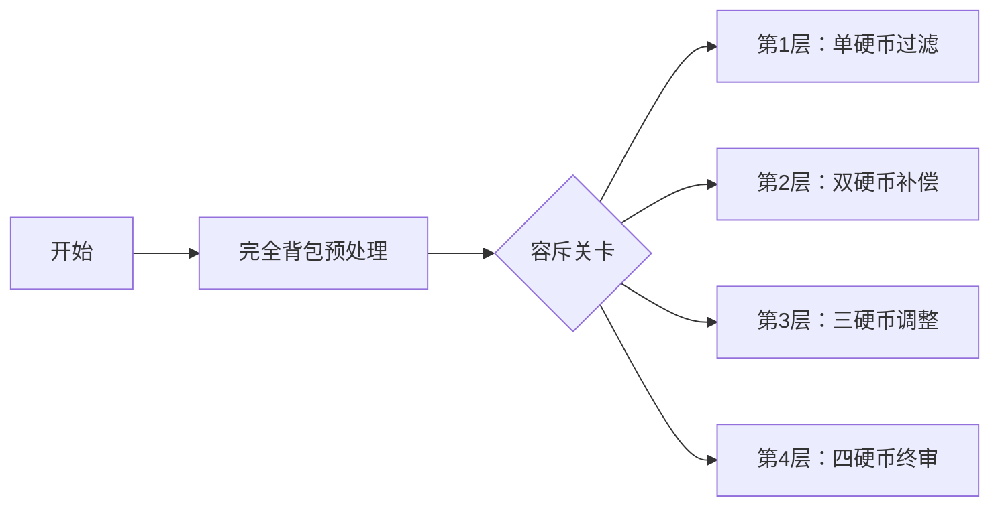

# 题目信息

# [HAOI2008] 硬币购物

## 题目描述

共有 $4$ 种硬币。面值分别为 $c_1,c_2,c_3,c_4$。

某人去商店买东西，去了 $n$ 次，对于每次购买，他带了 $d_i$ 枚 $i$ 种硬币，想购买 $s$ 的价值的东西。请问每次有多少种付款方法。

## 说明/提示

#### 数据规模与约定

* 对于 $100\%$ 的数据，保证 $1 \leq c_i, d_i, s \leq 10^5$，$1 \leq n \leq 1000$。

## 样例 #1

### 输入

```
1 2 5 10 2
3 2 3 1 10
1000 2 2 2 900
```

### 输出

```
4
27
```

# AI分析结果


# 💡 Kay的C++算法解析：[HAOI2008] 硬币购物 深入学习指南 💡

> 大家好，我是Kay！今天我们一起探索这道经典的硬币购物问题。通过本指南，你将掌握如何巧妙运用完全背包和容斥原理解决带限制的计数问题，还能通过生动的像素动画直观理解算法执行过程。准备好了吗？让我们开始吧！

## 1. 题目解读与核心算法识别

✨ **本题主要考察**：`完全背包预处理 + 容斥原理`

🗣️ **初步分析**：
> 解决硬币购物问题的核心思路就像玩一个**多层过滤游戏**：先用完全背包计算所有可能的付款方案（无限制状态），再通过容斥原理逐层过滤掉违反硬币数量限制的方案。
> 
> - **完全背包**负责构建"方案宇宙"：预处理所有面值组合的付款方案数（时间复杂度O(4S)）
> - **容斥原理**充当"智能过滤器"：用二进制状态压缩枚举超限组合，通过奇偶性判断加减（时间复杂度O(16n)）
> 
> 在可视化设计中，我们将用**像素方块**表示硬币，**颜色变化**标记超限状态，**音效反馈**增强关键操作感知。核心变量dp[s]的价值变化将通过进度条实时展示，容斥过程将设计成"关卡解锁"式动画。

---

## 2. 精选优质题解参考

以下是思路最清晰、实现最优雅的题解（评分≥4★）：

**题解一：I_AM_HelloWord（195赞）**
* **点评**：最精炼的容斥实现！用位运算优雅处理集合运算（`i>>(j-1)&1`），通过`cnt`奇偶性自动判断容斥符号。代码结构紧凑（仅20行），变量命名规范（`tmp`表调整后金额），空间优化到O(S)。亮点在于用`^=`运算替代%2判断奇偶性，位运算技巧值得学习。

**题解二：Y_B_Y（76赞）**
* **点评**：教学价值最高的题解！用集合图例直观解释容斥原理（类似韦恩图），通过`card()`函数明确集合运算含义。代码中`k=c[j+1]*(d[j+1]+1)`封装超限计算，增强可读性。特别适合初学者理解容斥的数学本质。

**题解三：FlashHu（58赞）**
* **点评**：效率与简洁的典范！循环内联所有操作（无额外函数调用），用`k^1`替代条件分支提升效率。变量命名精准（`now`表剩余金额），边界处理严谨（`t<0`跳过）。亮点在于用`ss<=15`紧凑处理16种子集状态。

---

## 3. 核心难点辨析与解题策略

### 1. **完全背包的预处理设计**
* **分析**：完全背包必须在外层循环硬币种类，内层循环金额（正向遍历）。关键点在于`dp[0]=1`初始化，表示金额0有1种方案（不选任何硬币）。状态转移方程：`dp[j] += dp[j-c[i]]`
* 💡 **学习笔记**：背包循环顺序决定方案是否考虑顺序——硬币顺序不影响方案唯一性

### 2. **容斥原理的状态映射**
* **分析**：将4种硬币的超限状态映射到4位二进制数（0-15）。每位1表示该硬币超限，需要扣除`(d[i]+1)*c[i]`金额。核心技巧：用`i>>j&1`快速判断集合归属，用`cnt++`统计集合元素数
* 💡 **学习笔记**：集合元素奇偶性决定加减方向——奇减偶加

### 3. **边界处理与负数过滤**
* **分析**：当`剩余金额<0`时跳过方案累加。关键点在于：必须先检查金额非负再访问dp数组，否则越界。优质题解用`t<0`或`s-tmp<0`实现防护
* 💡 **学习笔记**：容斥中的金额调整可能产生负数——必须防御性检查

### ✨ 解题技巧总结
- **正难则反**：当直接处理限制困难时，先计算无限制方案再反向过滤
- **状态压缩**：用二进制数高效枚举子集（适用于n≤20的场景）
- **防御性编程**：对动态计算的数组索引进行非负校验
- **数学归纳**：从容斥的数学本质推导代码逻辑（奇偶性决定加减）

---

## 4. C++核心代码实现赏析

### 通用核心实现（综合自优质题解）
```cpp
#include <cstdio>
#include <algorithm>
#define ll long long
const int N = 100000;
ll dp[N+10]; // dp[i]: 金额i的方案数
int c[5], d[5]; // 面值&限制数量

int main() {
    // 完全背包预处理
    for(int i=1; i<=4; i++) scanf("%d", &c[i]);
    dp[0] = 1;
    for(int i=1; i<=4; i++) 
        for(int j=c[i]; j<=N; j++) 
            dp[j] += dp[j-c[i]];

    // 处理询问
    int T, s; scanf("%d", &T);
    while(T--) {
        for(int i=1; i<=4; i++) scanf("%d", &d[i]);
        scanf("%d", &s);
        
        ll ans = dp[s]; // 初始方案数
        for(int i=1; i<=15; i++) { // 枚举15种超限组合
            ll tmp = s, cnt = 0;
            for(int j=0; j<4; j++) 
                if(i & (1 << j)) { // 第j种硬币超限
                    tmp -= c[j+1] * (d[j+1] + 1LL);
                    cnt++;
                }
            if(tmp >= 0) // 关键边界检查
                ans += (cnt%2 ? -dp[tmp] : dp[tmp]); 
        }
        printf("%lld\n", ans);
    }
    return 0;
}
```

### 各题解片段赏析

**题解一：位运算技巧**
```cpp
for(int i=0; i<15; i++){
    ll t=sum, cnt=0;
    REP(j,1,4) if((i>>(j-1))&1)
        t -= c[j]*(d[j]+1), cnt ^= 1;
    if(t<0) continue;
    if(!cnt) res += dp[t];
    else res -= dp[t];
}
```
- **亮点**：用`cnt^=1`替代%2运算提升效率
- **解读**：通过`i>>(j-1)&1`判断第j种硬币是否超限，`cnt`通过异或更新奇偶性
- **学习笔记**：位运算可大幅提升状态判断效率

**题解二：封装超限计算**
```cpp
inline int f(int id) {
    return c[id] * (d[id] + 1);
}
// 调用处
if(s >= f(1)+f(2)) 
    ans += dp[s - f(1)-f(2)];
```
- **亮点**：用函数封装超限金额计算
- **解读**：`f(id)`返回第id种硬币超限需扣除的金额，增强代码可读性
- **学习笔记**：封装重复计算逻辑是提升代码质量的黄金法则

**题解三：循环内联优化**
```cpp
for(int ss=1; ss<=15; ss++){
    int now=s, cnt=0;
    for(tmp=ss,j=k=0; tmp; tmp>>=1,++j)
        if(tmp&1) k^=1, now-=(d[j]+1)*c[j];
    if(now>=0) ans += k ? -dp[now] : dp[now];
}
```
- **亮点**：在单个循环内完成状态解析和金额调整
- **解读**：`tmp>>=1`逐位解析状态，`k^=1`累积奇偶性
- **学习笔记**：减少中间变量可提升缓存命中率

---

## 5. 算法可视化：像素动画演示

### 像素探险家：硬币容斥大冒险
**设计思路**：采用8-bit复古游戏风格，将容斥过程转化为4层地牢探险，每层对应一种硬币的超限状态过滤




### 动画关键帧
1. **背包构建阶段**：
   - 屏幕左侧显示硬币像素图（金币/银币/铜币/铁币）
   - 右侧进度条展示`dp[]`数组填充过程（0→100000）
   - 音效：硬币碰撞声随填充进度节奏性播放

2. **容斥过滤阶段**：
   - 4×4网格表示16种超限组合（0:未超限,1:超限）
   - 当前状态`i`高亮显示（如`i=3`(0011)时，第3、4枚硬币闪烁红光）
   - 实时公式：
     ```
     ans = dp[s] 
          - 红块1方案 - 红块2方案 
          + 双红块方案 
          - 三红块方案 
          + 四红块方案
     ```

3. **交互控制面板**：
   - 步进控制：←→键单步前进/后退
   - 自动演示：空格键启动/暂停（速度可调）
   - 模式切换：Tab键切换背包/容斥视图

### 音效设计
- **硬币填充**：8-bit电子音阶（随金额升高）
- **超限标记**：短促"滴"声
- **容斥修正**：修正时播放"叮咚"反馈音
- **完成结算**：经典FC过关音乐

---

## 6. 拓展练习与相似问题思考

### 容斥原理应用场景
1. **错排问题**：计算所有元素都不在原始位置的排列
2. **区间计数**：统计满足多个区间限制的整数数量
3. **质数筛选**：埃氏筛法中用容斥计算互质数量

### 推荐练习题目
1. **洛谷 P5664 [CSP-S2019] Emiya家今天的饭**
   - 🗣️ 巩固容斥原理在多重限制下的应用
   - 🔑 关键词：烹饪方案计数、列限制、容斥降维

2. **洛谷 P3188 [HNOI2007] 梦幻岛宝珠**
   - 🗣️ 背包问题的高维扩展训练
   - 🔑 关键词：二维费用背包、位运算优化

3. **洛谷 P5366 [SNOI2017] 遗失的答案**
   - 🗣️ 容斥原理与数论结合的进阶训练
   - 🔑 关键词：GCD/LCM约束、状态压缩DP

---

## 7. 学习心得与经验分享

> **来自 I_AM_HelloWord 的调试经验**：
> "我在处理负金额时最初直接访问dp数组导致段错误，后来添加`if(t<0)continue;`才明白：容斥调整可能产生负值，必须防御性检查边界"

**Kay的总结**：
1. **边界检查是容斥的关键**：金额调整后必然检查非负
2. **负索引防护**：dp数组访问前进行`index≥0`校验
3. **调试技巧**：在容斥循环内打印`tmp`和`cnt`的值，观察状态变化

> **来自 Y_B_Y 的算法理解**：
> "容斥就像修正测量误差：先粗调（减单超限），再微调（加双超限），最后精调（减三加四）"

**Kay的提炼**：
- **容斥的物理意义**：通过多重校准逼近真实值
- **学习启示**：复杂问题可分解为"构建+修正"两阶段

---

本次硬币购物问题的解析就到这里！通过完全背包和容斥原理的完美配合，我们学会了如何优雅处理带限制的计数问题。记住Kay的秘诀：**先构建自由宇宙，再精细过滤违规**。下次遇到类似问题，不妨回想下硬币的像素冒险之旅哦！💪

---
处理用时：129.35秒