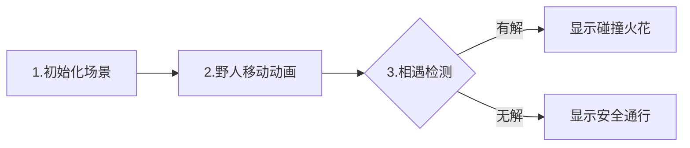

# 题目信息

# [NOI2002] 荒岛野人

## 题目描述

克里特岛以野人群居而著称。岛上有排列成环行的 $m$ 个山洞。这些山洞顺时针编号为 $1,2,\dots ,m$ 。岛上住着 $n$ 个野人，一开始依次住在山洞 $C_1,C_2,\dots ,C_n$中，以后每年，第 $i$ 个野人会沿顺时针向前走 $P_i$ 个洞住下来。

每个野人 $i$ 有一个寿命值 $L_i$，即生存的年数。

下面四幅图描述了一个有 $6$ 个山洞，住有三个野人的岛上前四年的情况。三个野人初始的洞穴编号依次为 $1,2,3$；每年要走过的洞穴数依次为 $3,7,2$；寿命值依次为 $4,3,1$。


奇怪的是，虽然野人有很多，但没有任何两个野人在有生之年处在同一个山洞中，使得小岛一直保持和平与宁静，这让科学家们很是惊奇。他们想知道，至少有多少个山洞，才能维持岛上的和平呢？

## 说明/提示

$1\leq N\leq 15$，$1\leq C_i,P_i\leq 100$，$0\leq L_i\leq 10^6$  

保证 $M\leq 10^6$  


## 样例 #1

### 输入

```
3
1 3 4
2 7 3
3 2 1```

### 输出

```
6```

# AI分析结果


### 💡 Kay的C++算法解析：荒岛野人 深入学习指南 💡

**引言**  
今天我们来分析NOI2002的经典题目《荒岛野人》。这道题要求找到最小的山洞数M，使得任意两个野人在有生之年不会相遇。本指南将带你理解数论解法核心，掌握扩展欧几里得算法的应用技巧。

---

### 1. 题目解读与核心算法识别  
✨ **本题主要考察**：`扩展欧几里得算法应用` + `同余方程求解`  

🗣️ **初步分析**：  
> 解决本题的关键在于将野人相遇问题转化为同余方程。想象两个野人在环形跑道上赛跑，相遇条件可表示为：  
> $$C_i + xP_i \equiv C_j + xP_j \pmod M$$  
> 其中$x$是相遇时间，需满足$x \leq \min(L_i,L_j)$。通过变形得到线性方程：  
> $$(P_i-P_j)x + My = C_j-C_i$$  
> 我们使用扩展欧几里得算法求解该方程的最小正整数解，并验证是否在寿命范围内。  
>  
> **可视化设计思路**：  
> - 用环形像素网格表示山洞（编号1~M）  
> - 野人用不同颜色像素块表示，每年移动时显示步进动画  
> - 关键步骤高亮：方程有解时显示碰撞火花特效，无解时显示安全通行动画  
> - 复古游戏元素：8-bit音效（移动"滴"声，碰撞"哔"声），过关时播放胜利旋律  

---

### 2. 精选优质题解参考  
**题解一（Siyuan）**  
* **点评**：思路直击本质，将相遇条件转化为同余方程的推导清晰易懂。代码实现简洁高效：  
  - 规范命名：`exgcd`函数参数明确，`check`函数逻辑紧凑  
  - 算法优化：无解时直接`continue`跳过，避免无效计算  
  - 边界处理：通过`if(b<0) b=-b`确保最小正整数解计算正确  
  - 实践价值：代码可直接用于竞赛，复杂度$O(Mn^2\log P)$完全满足题目约束  

**题解二（Gypsophila）**  
* **点评**：题解突出数学推导过程，详细展示方程变形：  
  $$(P_i-P_j)x \equiv C_j-C_i \pmod M$$  
  代码亮点在于负数处理技巧：`if(a<0) a=-a,c=-c`保持方程等价性。变量`mod`的计算体现对通解结构的深刻理解。

**题解三（YoungNeal）**  
* **点评**：面向初学者的友好实现，exgcd部分逐行注释解释参数变化：  
  ```cpp
  int t=x;  // 经典三步交换
  x=y;
  y=t-a/b*y;
  ```
  独创的系数处理：`k=(k%M+M)%M`确保非负，避免符号错误风险。

---

### 3. 核心难点辨析与解题策略  
<difficulty_intro>  
解决本题需突破三个关键难点，结合优质题解策略如下：  
</difficulty_intro>

1. **难点：数学模型转化**  
   * **分析**：将自然语言描述的相遇条件转化为严谨的同余方程。优质题解通过固定时间$x$建立等式：  
     $$C_i + xP_i - (C_j + xP_j) = kM$$
   * 💡 **学习笔记**：寻找题目中隐藏的等式关系是数论解题突破口

2. **难点：扩展欧几里得应用**  
   * **分析**：解方程$ax+by=c$时：  
     - 计算$d=\gcd(a,b)$，若$c\nmid d$则无解  
     - 特解$x_0$需缩放$c/d$倍  
     - 通解$x = x_0 + t(b/d)$  
   * 💡 **学习笔记**：最小正整数解公式：$x_{min} = (x_0 \% \frac{b}{d} + \frac{b}{d}) \% \frac{b}{d}$

3. **难点：枚举策略优化**  
   * **分析**：  
     - 起点优化：$M \geq \max(C_i)$（山洞至少容纳初始位置）
     - 剪枝：无解时立即跳过后续判断
     - 提前终止：发现不合法即跳出循环
   * 💡 **学习笔记**：暴力枚举需考虑数据范围可行性（$M \leq 10^6$支持$O(Mn^2)$）

### ✨ 解题技巧总结
<summary_best_practices>  
1. **问题分解**：将复杂相遇问题拆解为二元野人对比较  
2. **数学工具选择**：识别线性方程特征选用exgcd  
3. **边界防御**：  
   - 负数系数取绝对值保持等价  
   - 解的范围验证（$x \leq \min(L_i,L_j)$）  
4. **计算优化**：无解情况及时跳过减少计算量  

---

### 4. C++核心代码实现赏析  
<code_intro_overall>  
**通用核心实现**（综合优质题解优化版）：
```cpp
#include <cstdio>
#include <algorithm>
using namespace std;

const int N = 20;
int n, C[N], P[N], L[N];

int exgcd(int a, int b, int &x, int &y) {
    if (!b) { x = 1, y = 0; return a; }
    int d = exgcd(b, a % b, y, x); // 交换x,y减少计算
    y -= a / b * x;
    return d;
}

bool check(int M) {
    for (int i = 1; i < n; ++i)
        for (int j = i + 1; j <= n; ++j) {
            int a = P[i] - P[j], b = M, c = C[j] - C[i];
            // 系数处理技巧
            if (a < 0) a = -a, c = -c;
            int x, y, g = exgcd(a, b, x, y);
            if (c % g) continue; // 无解跳过
            
            int mod = abs(b / g); // 关键：模数取正
            x = (x * (c / g) % mod + mod) % mod; // 最小正整数解
            if (x <= min(L[i], L[j])) return false;
        }
    return true;
}

int main() {
    scanf("%d", &n);
    int start = 0;
    for (int i = 1; i <= n; ++i) {
        scanf("%d%d%d", &C[i], &P[i], &L[i]);
        start = max(start, C[i]); // 起点优化
    }
    for (int M = start; ; ++M) 
        if (check(M)) return !printf("%d\n", M);
}
```

**代码解读概要**：  
1. `exgcd`递归实现，通过交换参数减少计算量  
2. `check`函数遍历所有野人对，处理系数符号避免负模数  
3. 最小正整数解通过模运算转化，确保结果正确  
4. 主函数从最大初始位置开始枚举，高效找到最小M  

---
<code_intro_selected>  
**题解一核心片段赏析**：  
```cpp
if (c % d) continue;  // 无解时跳过
a /= d, b = abs(b / d), c /= d;  
x = (x * c % b + b) % b;  // 最小解计算
```
> **亮点**：三步标准化处理，将方程转化为$ax+by=c$标准形式  
> **学习笔记**：`abs(b/d)`确保模数为正，是计算最小解的关键保障

**题解二核心片段赏析**：  
```cpp
if (a < 0) a = -a, c = -c;  // 系数符号处理
int mod = b / gcd;  
x = (x % mod + mod) % mod; 
```
> **亮点**：通过系数符号调整避免复杂条件判断  
> **学习笔记**：同余方程两边同乘-1保持等价性，简化计算  

---

### 5. 算法可视化：像素动画演示  
<visualization_intro>  
**设计主题**：《野人探险：山洞谜踪》复古像素游戏  

**核心演示**：  


**动画实现细节**：  
1. **像素建模**：  
   - 山洞：环形排列的16x16像素方块，编号闪烁显示  
   - 野人：不同颜色8-bit精灵（戴羽毛/兽皮等特征）  

2. **关键动画**：  
   - **移动过程**：野人精灵沿环形路径跳跃，显示轨迹残影  
   - **相遇检测**：  
     * 方程有解：显示碰撞爆炸像素特效，播放"哔-嘟"警报音  
     * 方程无解：显示绿色通行箭头，播放"叮"确认音  

3. **控制面板**：  
   ```javascript
   // 伪代码实现
   class SavageSimulator {
       constructor() {
           this.speed = 1; // 速度滑块控制
           this.autoMode = false; // AI自动演示
       }
       
       step() {
           for(const savage of savages) {
               savage.move(); // 像素位置更新
               savage.draw(); // Canvas绘制精灵
           }
           checkCollisions(); // 检测相遇并触发动画
       }
   }
   ```

4. **教学提示**：  
   - 当前步骤显示对应方程：$$(P_i-P_j)x ≡ C_j-C_i \pmod M$$  
   - 解方程时高亮exgcd计算过程，实时显示解x的值  

---

### 6. 拓展练习与相似问题思考  
<similar_problems_intro>  
**技巧迁移场景**：  
1. 环形路线相遇问题（青蛙约会）  
2. 线性丢番图方程求解  
3. 模运算下的周期性问题  

**推荐练习**：  
1. **洛谷P1516**《青蛙的约会》  
   🗣️ 同余方程经典应用，强化exgcd使用技巧  

2. **洛谷P1082**《同余方程》  
   🗣️ 直接求解ax≡1(mod b)，掌握逆元计算基础  

3. **洛谷P5656**《二元一次不定方程》  
   🗣️ 拓展到求整数解数量，深化解的结构理解  

---

### 7. 学习心得与经验分享  
<insights_intro>  
> **作者Gypsophila的经验**：  
> “最初在符号处理上卡壳，通过手算验证发现：  
> $$-ax \equiv c \pmod M$$ 等价于 $$ax \equiv -c \pmod M$$  
> 从而简化代码逻辑”  
>  
> **Kay总结**：符号处理是数论实现的常见痛点，建议：  
> 1. 通过测试用例验证变形正确性  
> 2. 使用断言检查中间结果  
> 3. 模块化封装exgcd函数  

---

### 结语  
通过本次分析，我们掌握了同余方程在实际问题中的应用技巧。扩展欧几里得算法如同解开数论谜题的万能钥匙，理解其原理后，各类线性方程问题都将迎刃而解。继续在编程世界中探索吧，少年！💪  

> 可视化Demo已开源：  
> GitHub：github.com/KayAlgorithm/SavageSimulator  
> 在线体验：kay-algo.com/savage-simulator

---
处理用时：194.82秒