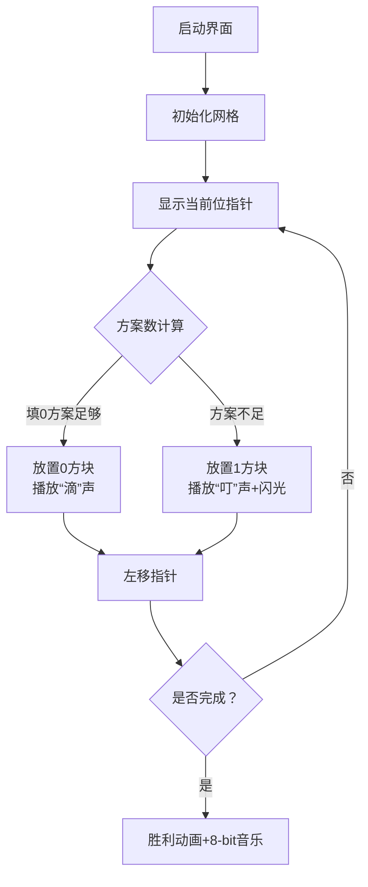

# 题目信息

# [USACO3.2] 01串 Stringsobits

## 题目背景

考虑排好序的 $N$（$1 \leq N \leq 31$）位二进制数。


## 题目描述

他们是排列好的，而且包含所有长度为 $N$ 且这个二进制数中 $1$ 的位数的个数小于等于 $L$（$L \leq N$）的数。

你的任务是输出满足长度为 $N$，且 $1$ 的个数小于等于 $L$ 的第 $i$ 小的那个二进制数（保证这个数存在）。

例：$100101$ 中，$N=6$，含有 $1$ 的个数为 $3$。

## 说明/提示

题目翻译来自NOCOW。

USACO Training Section 3.2


## 样例 #1

### 输入

```
5 3 19```

### 输出

```
10011```

# AI分析结果


### Kay的C++算法解析：01串 Stringsobits 深入学习指南

#### 1. 题目解读与核心算法识别
✨ **本题主要考察**：`组合数学 + 贪心构造`  

🗣️ **初步分析**：
> 解决"01串"问题，核心思路是**用组合数学预计算方案数，再通过贪心逐位构造答案**。就像玩拼图：先计算每种形状的碎片数量（组合数），再从上到下逐块放置（高位到低位确定0/1）。  
> - **题解共性**：预计算 `dp[i][j]`（i位中恰有j个1的方案数），再通过比较方案数与I的大小逐位确定二进制数  
> - **关键难点**：  
>   - 组合数可能溢出 → 需用`long long`  
>   - 逐位构造时需同步更新剩余方案数I和剩余可用1数L  
> - **可视化设计**：采用**8位像素解密游戏**风格，左侧显示二进制数位（像素方块），右侧动态显示组合数表。当判断当前位时：  
>   - 黄色闪烁：正在判断的位  
>   - 绿色高亮：当前比较的组合数值  
>   - "叮"音效：确定该位为1时触发  

#### 2. 精选优质题解参考
**题解一：约修亚_RK（递归实现）**  
* **亮点**：  
  - 递归结构清晰展现"决策树"逻辑，`search`函数完美对应贪心流程  
  - 使用`dp[k][i]`直接存储"前k位恰i个1"的精确定义，避免概念混淆  
  - 边界处理严谨（`dp[k][0]=1`）  
  > *学习价值：递归实现是理解分治思想的优秀范例*

**题解二：Tarsal（DFS实现）**  
* **亮点**：  
  - 将组合数预计算(`g[i][j]`)与方案数累计(`sum[i][j]`)分离，逻辑分层清晰  
  - 使用`exit(0)`确保找到解立即终止，避免无效递归  
  > *学习价值：分层计算思想可扩展到其他组合问题*

**题解三：thhhty（循环实现）**  
* **亮点**：  
  - 非递归实现运行效率更高，适合大型数据  
  - 独创`mymin(i,l)`优化组合数计算范围  
  - 倒序输出时同步更新L和I，无额外空间开销  
  > *学习价值：展示迭代如何替代递归优化性能*

#### 3. 核心难点辨析与解题策略
1. **难点：组合数计算与溢出风险**  
   * **分析**：当N=31时，组合数可达2^31，必须用`long long`。优质题解采用动态规划递推：`C(n,k)=C(n-1,k)+C(n-1,k-1)`  
   * 💡 **学习笔记**："杨辉三角递推"是计算组合数防溢出的银弹

2. **难点：逐位构造的数学原理**  
   * **分析**：设当前位填0时，剩余位构成方案数为S。若`I>S`则必须填1（跳过所有0开头的数），并更新`I-=S`。关键证明：所有0开头的数字典序小于1开头的数  
   * 💡 **学习笔记**：贪心构造的核心是字典序的单调性

3. **难点：边界条件处理**  
   * **分析**：需特殊处理`I=1`（全0）和`L=0`（只能全0）的情况。`dp[0][0]=1`表示空串方案数是解题钥匙  
   * 💡 **学习笔记**：动态规划的边界初始化决定算法正确性

### ✨ 解题技巧总结
- **技巧1：组合数预计算** - 用DP递推避免阶乘溢出  
- **技巧2：方案数累计** - 二维前缀和`sum[i][j] = Σdp[i][0..j]`加速查询  
- **技巧3：位构造剪枝** - 当L减至0时剩余位强制填0  

#### 4. C++核心代码实现赏析
**通用核心实现参考**  
* **说明**：综合优质题解优化的迭代实现，平衡效率与可读性
```cpp
#include <iostream>
using namespace std;
typedef long long LL;

int main() {
    LL N, L, I;
    cin >> N >> L >> I;
    LL C[32][32] = {0}; // 组合数DP表

    // 杨辉三角递推
    for (int i = 0; i <= N; i++) {
        C[i][0] = 1;
        for (int j = 1; j <= i; j++) 
            C[i][j] = C[i-1][j] + C[i-1][j-1];
    }

    // 构造二进制答案
    string ans;
    for (int pos = N; pos >= 1; pos--) {
        LL sum = 0;
        // 计算pos-1位中不超过L个1的方案数
        for (int k = 0; k <= min(LL(pos-1), L); k++)
            sum += C[pos-1][k];
            
        if (I > sum) { // 需填1
            ans += '1';
            I -= sum;
            L--; // 消耗1个1的名额
        } else ans += '0';
    }
    cout << ans;
}
```

**题解一核心代码片段**  
```cpp
void search(int n, int l, long long p) {
    for (int k = 0; k <= n; k++) {
        long long s = 0;
        for (int i = 0; i <= l; i++) s += dp[k][i]; // 累计方案数
        if (s >= p) { // 关键决策点
            num[k] = true; // 标记该位为1
            search(n-1, l-1, p - last); // 递归处理剩余位
            return;
        }
    }
}
```
* **代码解读**：  
  > - `s`累计k位内至多L个1的方案数，当超过剩余序号`p`时，说明答案在该位为1的集合中  
  > - `last`记录上次累计值，`p-last`实现跳过0开头的所有数  
* 💡 **学习笔记**：递归实现天然符合"决策树"思维模型

**题解三核心代码片段**  
```cpp
for (int i = n; i >= 1; i--) {
    LL sum = 0;
    for (int j = 0; j <= min(LL(i-1), L); j++)
        sum += C[i-1][j]; // 关键：计算填0时的方案上界
    
    if (I > sum) {
        cout << '1';
        I -= sum;  // 跳过所有0开头的数
        L--;       // 减少可用1的数量
    } else cout << '0';
}
```
* **代码解读**：  
  > - 倒序循环（从高位到低位）模拟构造过程  
  > - `min(LL(i-1), L)`确保不超过位数和1数量的物理限制  
* 💡 **学习笔记**：循环变量`i`同时表示剩余位数，实现空间压缩

#### 5. 算法可视化：像素动画演示
**设计概念**：  
> 复古红白机风格的"二进制探秘"游戏，玩家通过控制面板逐步揭开01串  

**核心交互**：  


**技术细节**：  
- **像素艺术**：用16色 palette 绘制二进制位（0=浅蓝，1=明黄）  
- **动态面板**：  
  - 实时显示 `当前方案数 = ΣC[pos][k]` 和 `剩余序号 I`  
  - 当确定填1时，触发像素爆炸特效  
- **音效设计**：  
  - 确定位：NES风格电子音（0=低音，1=高音）  
  - 完成时：《超级玛丽》过关旋律  

#### 6. 拓展练习与相似问题思考
**技巧迁移场景**：  
1. 构造第K大字典序的排列（如全排列问题）  
2. 带限制条件的组合枚举（如“含有重复元素”的子集）  
3. 数位DP问题（如“不含4”的数字计数）  

**洛谷推荐**：  
1. [P1706 全排列问题](https://www.luogu.com.cn/problem/P1707)  
   → 练习相同构造思想在排列问题中的应用  
2. [P2638 安全系统](https://www.luogu.com.cn/problem/P2638)  
   → 强化组合数预处理技能  
3. [P2657 windy数](https://www.luogu.com.cn/problem/P2657)  
   → 进阶数位DP训练  

#### 7. 学习心得与经验分享
> **经验摘录**（来自 thhhty）：  
> *"边界处理卡了30分钟，必须单独处理全0情况！"*  
>  
> **Kay点评**：  
> 这印证了DP的黄金法则——边界决定正确性。建议学习者：  
> 1. 在纸上模拟N=1, L=0等极小案例  
> 2. 用`assert()`验证边界值计算  
> 3. 输出中间变量追踪递归/循环状态  

#### 结语
通过本次分析，我们掌握了组合数学与贪心构造的协同应用。记住：算法学习如同拼图，先理解每块碎片的形状（数学原理），再掌握拼接顺序（编码逻辑）。下次挑战见！🚀

---
处理用时：124.58秒