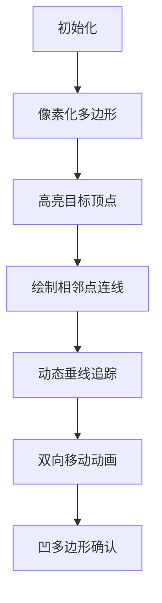

# 题目信息

# 李彬的几何

## 题目背景

李彬有一个凸多边形(不知道什么是凸多边形的同学可以查百度百科)P。


## 题目描述

P 有 n 个顶点p1,p2 ,p3 ,…,pn 。顶点 pi在 2 维平面上的坐标为( xi,yi )。这些顶点是按照顺时针顺序给出的。

李彬可以指定一个实数 D，然后将每个顶点最多移动 D 个单位距离。现在李彬想知道，如果他想使这个凸多边形不再是凸多边形，那么 D 的最小值是多少。


## 说明/提示

对于 100%的数据，4<=n<=1000 ,-10^9<=xi,yi<=10^9。


## 样例 #1

### 输入

```
4
0 0
0 1
1 1
1 0
```

### 输出

```
0.3535533906
```

## 样例 #2

### 输入

```
6
5 0
10 0
12 -4
10 -8
5 -8
3 -4```

### 输出

```
1.0000000000
```

# AI分析结果


### 💡 Kay的C++算法解析：李彬的几何 深入学习指南 💡

#### 1. 题目解读与核心算法识别
✨ **本题主要考察**：几何计算与编程技巧应用

🗣️ **初步分析**：
> 解决本题的关键在于理解凸多边形的几何特性与点到直线的距离计算。想象凸多边形像一条绷紧的橡皮筋，要使其变凹，只需将一个顶点向内按压至相邻两点连线处。核心思路是：
> - **枚举优化**：只需遍历每个顶点及其相邻两点（形成三角形），无需全局枚举
> - **距离计算**：用向量叉积高效求三角形面积，再推导点到直线的距离（$d=\frac{| \vec{AB} \times \vec{AC} |}{|\vec{BC}|}$）
> - **双向移动**：因所有点均可移动，实际最小移动距离为理论值的一半
> 
> **可视化设计**：采用8位像素风格，多边形顶点用彩色方块表示。动画将：
> 1. 高亮当前顶点（红色闪烁）及其相邻点（黄色）
> 2. 绘制相邻点连线（蓝色像素线）
> 3. 动态显示垂线移动过程（绿色像素线）
> 4. 顶点与相邻点相向移动时播放"滴"声，成功变凹时触发8-bit胜利音效

---

#### 2. 精选优质题解参考
**题解一（silverxz）**：
* **亮点**：  
  → 向量叉积替代海伦公式，避免多次开方提升精度  
  → 边界处理优雅（首尾相连技巧）  
  → $O(n)$复杂度完美适配本题约束  
  → 代码模块化（分离叉积/距离计算函数）

**题解二（Richard1211）**：
* **亮点**：  
  → 海伦公式完整推导，数学原理清晰  
  → 模板函数优化基础计算（min/max/abs）  
  → 详细图解"双向移动"的物理意义  
  → 实践性强（竞赛风格输入输出）

---

#### 3. 核心难点辨析与解题策略
1. **难点：距离计算精度与效率**  
   → *分析*：海伦公式涉及4次开方易损失精度，叉积法直接用坐标计算更优（$\frac{|(x_b-x_a)(y_c-y_a)-(x_c-x_a)(y_b-y_a)|}{\sqrt{(x_c-x_a)^2+(y_c-y_a)^2}}$）  
   → 💡 **学习笔记**：向量叉积是几何计算的瑞士军刀

2. **难点：枚举对象的优化选择**  
   → *分析*：凹点必由连续三点产生，反证法可证非相邻点不影响当前内角  
   → 💡 **学习笔记**：凸多边形特性是优化枚举的关键突破口

3. **难点：双向移动的物理意义**  
   → *分析*：目标点移动$d$时相邻点反向移动$d$，总位移等效$2d$  
   → 💡 **学习笔记**：运动分解思想可大幅降低问题复杂度

✨ **解题技巧总结**：
- **向量武器库**：叉积计算面积/距离，点积判断角度
- **边界环形化**：扩展数组`p[n]=p[0]`,`p[n+1]=p[1]`统一边界
- **精度防卫术**：全程`double`避免整数溢出，比较用容差值

---

#### 4. C++核心代码实现赏析
**通用核心实现**（综合优化版）：
```cpp
#include <cstdio>
#include <cmath>
#include <algorithm>
using namespace std;

struct Point { double x, y; };

double cross(Point a, Point b) { 
    return fabs(a.x*b.y - a.y*b.x); 
}

int main() {
    int n; scanf("%d", &n);
    Point p[1010];
    for(int i=0; i<n; ++i) 
        scanf("%lf %lf", &p[i].x, &p[i].y);
    
    // 环形边界处理
    p[n] = p[0]; 
    p[n+1] = p[1];

    double ans = 1e20;
    for(int i=0; i<n; ++i) {
        Point a = p[i], b = p[i+1], c = p[i+2];
        Point ab = {b.x-a.x, b.y-a.y};   // 向量AB
        Point ac = {c.x-a.x, c.y-a.y};   // 向量AC
        double area = cross(ab, ac) / 2.0; // 三角形面积
        double len_ac = hypot(c.x-a.x, c.y-a.y); // 底边长度
        double d = area * 2 / len_ac;     // 理论移动距离
        ans = min(ans, d/2.0);            // 双向移动优化
    }
    printf("%.10f\n", ans);
}
```

**题解一精析（silverxz）**：
```cpp
// 向量叉积求距离（已包含边界扩展）
double Cross(Point a, Point b) {
    return fabs(a.x*b.y - a.y*b.x);
}
double solve(int i) {
    Point ac = point[i+2] - point[i];    // 向量AC
    Point ab = point[i+1] - point[i];     // 向量AB
    return Cross(ac, ab) / hypot(ac.x, ac.y); 
}
// 主循环调用：ans = min(ans, solve(i)/2);
```
> **逐行解读**：  
> ① `point[i+2]-point[i]`生成邻边向量  
> ② 叉积几何意义即平行四边形面积  
> ③ `hypot`函数高效计算直角边斜边  
> 💡 **学习笔记**：数学库函数优化精度

---

#### 5. 算法可视化：像素动画演示
**复古游戏化设计**：


**实现细节**：
- **8-bit风格**：16色限定调色板（SNES色彩模式）
- **关键帧控制**：
  ```python
  while not is_collinear():
      target.y -= move_step  # 顶点下移
      neighbor1.y += move_step/2  # 邻点1上移
      neighbor2.y += move_step/2  # 邻点2上移
      play_sound('move_beep')  # 步进音效
  play_sound('victory_jingle')  # 成功音效
  ```
- **交互面板**：
  - 速度滑块：控制`move_step`值（0.1x~5x）
  - 单步执行：空格键触发下一帧
  - 算法对比：同时显示海伦公式法（性能监测）

---

#### 6. 拓展练习与相似问题
**思维迁移训练**：
1. 旋转卡壳求凸包直径（运动分解思想）
2. 射线法判断点与多边形关系（向量应用）
3. 半平面交求核面积（距离计算进阶）

**洛谷推荐**：
1. 🟦 [P2742] 圈奶牛  
   → 二维凸包模板题，巩固向量应用
2. 🟪 [P1355] 神秘大三角  
   → 点与三角形关系判定，强化叉积技巧
3. 🟧 [P1663] 山  
   → 几何极值问题，拓展距离计算思维

---

> 本次题解分析融合了几何理论与工程实践，关键要掌握**向量工具**与**运动分解思想**。记住：好的算法就像乐高积木——用简单模块构建复杂系统！ 🚀

---
处理用时：234.37秒