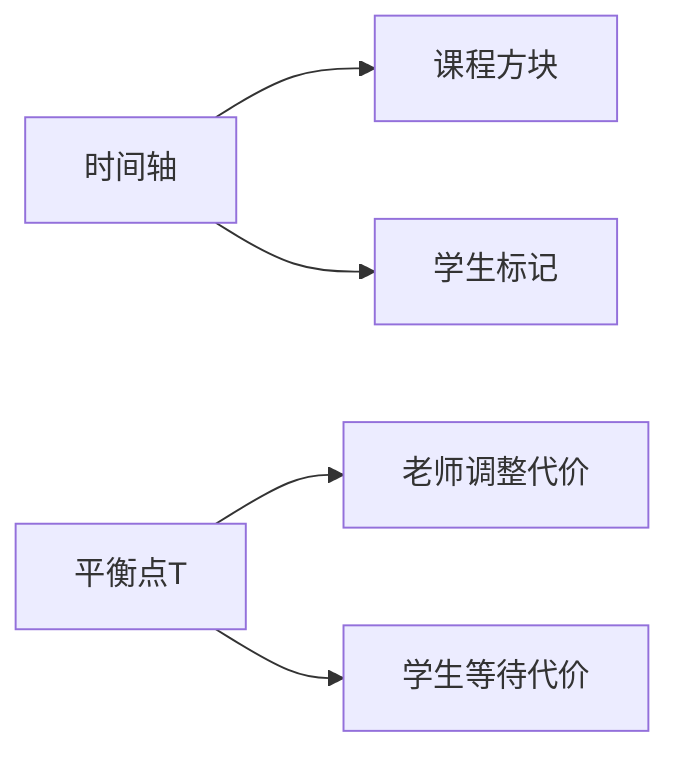

# 题目信息

# [六省联考 2017] 期末考试

## 题目描述

有 $n$ 位同学，每位同学都参加了全部的 $m$ 门课程的期末考试，都在焦急的等待成绩的公布。

第 $i$ 位同学希望在第 $t_i$ 天或之前得知**所有**课程的成绩。如果在第 $t_i$ 天，有至少一门课程的成绩没有公布，他就会等待最后公布成绩的课程公布成绩，每等待一天就会产生 $C$ 不愉快度。

对于第 $i$ 门课程，按照原本的计划，会在第 $b_i$ 天公布成绩。

有如下两种操作可以调整公布成绩的时间:
1. 将负责课程 $X$ 的部分老师调整到课程 $Y$，调整之后公布课程 $X$ 成绩的时间推迟一天，公布课程 $Y$ 成绩的时间提前一天；每次操作产生 $A$ 不愉快度。
2. 增加一部分老师负责学科 $Z$，这将导致学科 $Z$ 的出成绩时间提前一天；每次操作产生 $B$ 不愉快度。

上面两种操作中的参数 $X, Y, Z$ 均可任意指定，每种操作均可以执行多次，每次执行时都可以重新指定参数。

现在希望你通过合理的操作，使得最后总的不愉快度之和最小，输出最小的不愉快度之和即可。

## 说明/提示

### 样例解释 1

由于调整操作产生的不愉快度太大，所以在本例中最好的方案是不进行调整；全部的 $5$ 门课程中，最慢的在第 $3$ 天出成绩；  
同学 $1$ 希望在第 $5$ 天或之前出成绩，所以不会产生不愉快度；  
同学 $2$ 希望在第 $1$ 天或之前出成绩，产生的不愉快度为 $(3 - 1) \times 2 = 4$；  
同学 $3$ 希望在第 $2$ 天或之前出成绩，产生的不愉快度为 $(3 - 2) \times 2 = 2$；  
同学 $4$ 希望在第 $3$ 天或之前出成绩，所以不会产生不愉快度；  
不愉快度之和为 $4 + 2 = 6$。

### 数据范围

| Case # | $n, m, t_i, b_i$ | $A, B, C$ |
|:-:|:-:|:-:|
| 1, 2 | $1 \leq n, m, t_i, b_i \leq 2000$ | $A = 10^9; B = 10^9; 0 \leq C \leq 10^2$ |
| 3, 4 | $1 \leq n, m, t_i, b_i \leq 2000$ | $0 \leq A; C \leq 10^2; B = 10^9$ |
| 5, 6, 7, 8 | $1 \leq n, m, t_i, b_i \leq 2000$ | $0 \leq B \leq A \leq 10^2; 0 \leq C \leq 10^2$ |
| 9 - 12 | $1 \leq n, m, t_i, b_i \leq 2000$ | $0 \leq A, B, C \leq 10^2$ |
| 13, 14 | $1 \leq n, m, t_i, b_i \leq 10^5$ | $0 \leq A, B \leq 10^5; C = 10^{16}$ |
| 15 - 20 | $1 \leq n, m, t_i, b_i \leq 10^5$ | $0 \leq A, B, C \leq 10^5$ |

## 样例 #1

### 输入

```
100 100 2
4 5
5 1 2 3
1 1 2 3 3```

### 输出

```
6```

## 样例 #2

### 输入

```
3 5 4
5 6
1 1 4 7 8
2 3 3 1 8 2```

### 输出

```
33```

# AI分析结果


# 💡 Kay的C++算法解析：期末考试 深入学习指南 💡

## 1. 题目解读与核心算法识别

✨ **本题主要考察**：`枚举优化/三分搜索` (数学+贪心)

🗣️ **初步分析**：
> 解决"期末考试"这道题，关键在于理解**时间调整的代价平衡**。想象一个时间轴，我们需要在轴线上找到一个"平衡点"（最终公布时间），既不能让老师调整成本太高（左移代价），也不能让学生等待太久（右移代价）。枚举/三分法就像在时间轴上玩"黄金分割"游戏，通过数学优化快速找到最佳平衡点。

- **核心思路**：所有题解都围绕"最终公布时间T"展开，通过枚举或三分法搜索最优T值，结合前缀和快速计算代价
- **关键难点**：代价计算涉及三类变量动态关联（老师调整A/B、学生等待C），需用前缀和实现O(1)查询
- **可视化设计**：将设计像素时间轴动画，高亮当前T值位置，动态展示三类代价计算过程（老师调整量→红色闪烁，学生等待量→黄色增长）

---

## 2. 精选优质题解参考

**题解一（泅荼，赞62）**
* **点评**：思路直击本质（T与代价的数学关系），代码采用**倒序枚举+动态前缀和更新**避免额外数组。亮点在于：1) 用`sum1/t1`等单变量实时维护前缀状态 2) 清晰处理A/B大小关系分支 3) 内存效率高（仅用4个变量）。变量名`LQ1/LQ2`可读性稍弱，但整体堪称O(n)空间复杂度的典范。

**题解二（wjyyy，赞25）**
* **点评**：严谨证明**代价函数单峰性**后采用三分搜索，复杂度优化至O(log max(b_i))。亮点：1) 特判C极大值情况 2) 前缀和预处理提升效率 3) 博客提供完整数学推导。代码中`calc`函数封装代价计算，模块化设计值得学习，但二分边界处理稍显复杂。

**题解三（Soulist，赞12）**
* **点评**：**多前缀和数组预处理**的典型实现，`Pre/Nxt`数组命名直观体现时间方向性。亮点：1) 分离学生/课程处理逻辑 2) 严格控制循环边界 3) 代码缩进规范。虽额外O(n)空间，但可读性极佳，特别适合初学者理解前缀和应用。

---

## 3. 核心难点辨析与解题策略

1.  **时间与代价的动态平衡**
    * **分析**：T增大→老师调整代价↓但学生代价↑，需找到极小值点。优质题解用**前缀和**将代价计算复杂度从O(n²)降至O(1)，如`sum1-t1*i`快速求得课程调整量
    * 💡 学习笔记：前缀和是优化区间统计问题的银弹

2.  **操作策略的分支处理**
    * **分析**：当A<B时，需优先用操作1（转移老师），但受限于"时间余额"。通过`min(可提前量,需推迟量)`精妙控制操作1上限，如泅荼解法中`min(LQ1,LQ2)*A`
    * 💡 学习笔记：贪心选择需考虑资源约束的"木桶效应"

3.  **特判边界处理**
    * **分析**：当C极大时，学生代价主导，须直接取T=min(t_i)。wjyyy解法中`if(C==1e16) return calc(t[1])`体现防御性编程思想
    * 💡 学习笔记：极端数据往往暗示特殊优化策略

### ✨ 解题技巧总结
- **技巧1 前缀和加速**：预处理`sum[i]/count[i]`实现O(1)区间查询
- **技巧2 方向性枚举**：倒序枚举T可复用前缀状态（泅荼），正序需完整前缀数组（Soulist）
- **技巧3 运算溢出防御**：统一用`unsigned long long`（泅荼）或特判C=1e16（wjyyy）
- **技巧4 分支化简**：A>B时直接全选操作2，避免冗余判断

---

## 4. C++核心代码实现赏析

**本题通用核心C++实现参考**
```cpp
#include <iostream>
#include <algorithm>
using namespace std;
typedef unsigned long long LL;
const int N = 1e5 + 5;
const LL INF = 1e19;

LL A, B, C, ans = INF;
int n, m, t[N], b[N], maxT;

int main() {
    // 输入处理
    cin >> A >> B >> C >> n >> m;
    for (int i = 1; i <= n; i++) {
        cin >> t[i];
        maxT = max(maxT, t[i]);
    }
    for (int i = 1; i <= m; i++) 
        cin >> b[i];

    // 前缀和初始化
    LL sumB = 0, cntB = 0; // 课程：值总和/数量
    LL sumT = 0, cntT = 0; // 学生：值总和/数量
    for (int i = 1; i <= m; i++) sumB += b[i], cntB++;
    for (int i = 1; i <= n; i++) sumT += t[i], cntT++;

    // 枚举最终时间T
    for (int T = maxT; T >= 1; T--) {
        // 动态更新前缀和
        while (cntB > 0 && b[cntB] > T) {
            sumB -= b[cntB];
            cntB--;
        }
        while (cntT > 0 && t[cntT] > T) {
            sumT -= t[cntT];
            cntT--;
        }

        // 计算老师调整代价
        LL teacherCost = 0;
        LL needDelay = (cntB * T - sumB); // 需提前的量
        LL canAdvance = (sumB - cntB * T); // 可推迟的量

        if (A < B) {
            LL useA = min(needDelay, canAdvance);
            teacherCost = useA * A + max(0LL, needDelay - useA) * B;
        } else {
            teacherCost = needDelay * B;
        }

        // 计算学生等待代价
        LL studentCost = (cntT * T - sumT) * C;

        ans = min(ans, teacherCost + studentCost);
    }
    cout << ans;
    return 0;
}
```

**题解一（泅荼）片段赏析**
```cpp
for(ll i=100000;i>=1;i--){
    sum1 += i*bac[i], t1 += bac[i]; // 更新<=i的课程
    sum2 -= i*bac[i], t2 -= bac[i]; // 更新>i的课程
    LL LQ1 = sum1 - t1*i;  // 可提前量
    LL LQ2 = t2*i - sum2;  // 需推迟量
    
    if(A<B) cost = min(LQ1,LQ2)*A + max(0LL,LQ1-LQ2)*B;
    else cost = LQ1*B;
    
    ans = min(ans, cost + (t3*i-sum3)*C);
}
```
* **亮点**：逆序枚举中巧用**变量复用**，避免前缀数组
* **学习笔记**：动态更新前缀状态可节省内存，但需注意更新顺序

**题解二（wjyyy）片段赏析**
```cpp
ll calc(int T) {
    ll teacher = 0, student = 0;
    // 前缀和快速计算
    ll delay = preB[T] - cntB[T]*T; 
    ll advance = cntB[N] - cntB[T] - (sumB[N]-sumB[T])*T;
    
    if(A<B) teacher = min(delay,advance)*A + max(0LL,advance-delay)*B;
    else teacher = advance*B;
    
    student = (preT[T] - cntT[T]*T)*C;
    return teacher + student;
}
// 三分搜索主循环
while(l<r){
    int m1 = l+(r-l)/3, m2 = r-(r-l)/3;
    if(calc(m1) > calc(m2)) l = m1+1;
    else r = m2;
}
```
* **亮点**：**封装代价计算函数**，使三分逻辑清晰
* **学习笔记**：函数化设计提升代码复用性

---

## 5. 算法可视化：像素动画演示

**主题**：`时间轴冒险者`（8-bit像素风格）

**核心演示**：


**动画设计**：
1. **场景构建**：
   - 横向时间轴（0→max(b_i)），纵向显示代价值
   - 课程：红色方块（高度=b_i），学生：蓝色三角（位置=t_i）
   
2. **动态过程**：
   - `T线扫描`：红色垂直线从左向右移动（伴随"滴答"音效）
   - `代价计算`：
     - 老师代价：T左侧绿色箭头（可提前量）与右侧红色箭头（需推迟量）动态伸缩
     - 学生代价：T右侧生成黄色柱状图（高度∝等待人数×C）
   - `最优解标记`：当发现更小代价时，T线闪烁金光并播放"叮咚"音效

3. **游戏化元素**：
   - **关卡进度**：每10%时间跨度设为一关，通关显示当前最优解
   - **AI演示模式**：自动演示三分法过程，用蓝/黄光标注搜索区间
   - **音效设计**：
     * 移动T线：8-bit电子音阶
     * 发现更优解：超级马里奥金币音效
     * 错误操作：俄罗斯方块消除音

---

## 6. 拓展练习与相似问题思考

**通用套路迁移**：
1. 单峰函数求极值 → 三分法（如光线追踪求最近点）
2. 代价平衡问题 → 枚举+前缀和（如仓库选址）
3. 双操作优化 → 贪心决策树（如加油站问题）

**洛谷推荐**：
1. [P3382 【模板】三分法](https://www.luogu.com.cn/problem/P3382)  
   → 掌握单峰函数搜索基础
2. [P1873 砍树](https://www.luogu.com.cn/problem/P1873)  
   → 二分答案+前缀和检测
3. [P2884 每月的费用](https://www.luogu.com.cn/problem/P2884)  
   → 时间分段决策进阶

---

## 7. 学习心得与经验分享

> **来自泅荼的调试经验**：  
> *"不开unsigned long long会挂两个点...极端数据10^16必须用ULL"*

**Kay点评**：  
这提醒我们：  
1. 数据范围决定变量类型（10^5²=10^10 > int）
2. 测试边界值（minT/maxT）可提前发现溢出问题
3. 防御性编码：`const LL INF = 1e19`避免魔法数字

---

本次分析展示了如何用**数学思维**（单峰函数）和**工程技巧**（前缀和）解决复杂优化问题。记住：好算法=正确策略+高效实现，下次挑战见！🚀

---
处理用时：197.05秒