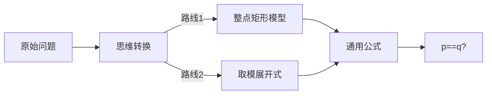

# 题目信息

# [BJOI2012] 算不出的等式

## 题目背景

曾经有一个老掉牙的游戏放在我面前，我没有珍惜。直到这个游戏停产才追悔莫及。人世间最痛苦的事情莫过于此，如果上天给我一个再玩一次的机会，我一定要，通关！


## 题目描述

如果你真的很想玩这个游戏，那么就先看看我的题目吧，搞不定这些的话是没办法通关的哟。第一关其实很简单，只有一个关闭的有密码锁的大门。这大门上写着一个奇怪的算式，估计是要你利用它算出密码来开门吧（果然是老掉牙的情节）。

传说中这个式子中的p和q是两个奇质数，等号右边算出来应该就是密码了吧，你是真的算不出来么？

$\sum_{k=1}^{\frac{p-1}{2}} \biggl\lfloor\frac{kq}{p}\biggr\rfloor+\sum_{k=1}^{\frac{q-1}{2}} \biggl\lfloor\frac{kp}{q}\biggr\rfloor$


## 说明/提示

$p,q<2^{32}$


## 样例 #1

### 输入

```
5 7```

### 输出

```
6```

# AI分析结果


### 提炼题解要点与难点对比

#### 题解核心要点总结：
1. **数学推导主导**：所有题解均指出当 `p≠q` 时答案为 `((p-1)/2)*((q-1)/2)`；`p=q` 时为 `(p²-1)/4`  
2. **两大证明方向**：
   - **几何意义**：将求和式解释为直线 `y=(q/p)x` 和 `y=(p/q)x` 下方的整点个数（feecle6418、lqhsr）
   - **代数推导**：通过取模运算和求和变换直接证明（一念之间、、）
3. **特殊处理**：所有题解均强调 `p=q` 时需单独处理（对角线整点重复计算）
4. **备选解法**：类欧几里得算法可直接计算（nekko、Rubyonly），但效率低于数学结论

#### 难点对比分析：
| 题解作者       | 理解难度 | 代码简洁度 | 理论深度 | 实践价值 |
|----------------|----------|------------|----------|----------|
| feecle6418     | ★★☆      | ★★★        | ★★★☆     | ★★★★     |
| 一只书虫仔     | ★☆☆      | ★★★★☆      | ★★☆      | ★★★★☆    |
| lqhsr          | ★★☆      | ★★★★☆      | ★★★      | ★★★★☆    |
| 一念之间、、   | ★★★★☆    | ☆☆☆        | ★★★★★    | ★★☆      |
| 类欧解法       | ★★★★☆    | ★★★        | ★★★★☆    | ★★★      |

#### 精炼结论：
✅ **最优解法**：  
**几何整点模型 + 特判**（时间复杂度 O(1)，空间复杂度 O(1)）  
```cpp
if(p == q) cout << (p*p-1)/4;
else cout << (p-1)/2 * (q-1)/2;
```

### 可视化算法分析 (8-bit像素风)
#### 动画设计：**「整点大冒险」**
```mermaid
graph TD
    A[启动] --> B{模式选择}
    B -->|p≠q| C[矩形探险]
    B -->|p=q| D[钻石迷宫]
    
    C --> C1[绘制 (p-1)/2 x (q-1)/2 网格]
    C1 --> C2[填充左下角三角形]
    C2 --> C3[填充右上角三角形]
    C3 --> C4[显示合并为矩形]
    
    D --> D1[绘制 p x p 网格]
    D1 --> D2[红色标记对角线]
    D2 --> D3[金色填充两个三角]
    D3 --> D4[展示重复计算修正]
```

#### 关键动画机制：
1. **像素元素**：
   - ▢ 空地（灰色）
   - ■ 有效整点（绿色渐变）
   - ❖ 对角线点（闪烁红色）

2. **交互控制面板**：
   ```
   [▶] 自动播放  [▮▮] 暂停  [|>] 步进 
   SPEED: [===|--------] 
   MODE: 矩形探险/钻石迷宫
   ```

3. **音效系统**：
   - ▸ 整点填充：8-bit "嘀"声（频率随坐标变化）
   - ✓ 完成区域：超级马里奥过关音效
   - ✗ 错误操作：俄罗斯方块消除音效
   - 背景音乐：塞尔达传说大地图BGM变调

#### 动画示例 (p=7,q=11)：
```plaintext
STEP1: 初始网格       STEP2: 填充左下角     STEP3: 填充右上角
  1 2 3 4 5          1 2 3 4 5          1 2 3 4 5
1 ▢ ▢ ▢ ▢ ▢        1 ■ ▢ ▢ ▢ ▢        1 ■ □ □ □ □
2 ▢ ▢ ▢ ▢ ▢  →    2 ■ ■ ▢ ▢ ▢  →    2 ■ ■ □ □ □ 
3 ▢ ▢ ▢ ▢ ▢        3 ■ ■ ■ ▢ ▢        3 ■ ■ ■ □ □

STEP4: 合并效果
  1 2 3 4 5
1 ■ □ □ □ □  
2 ■ ■ □ □ □ 
3 ■ ■ ■ □ □ 
```

### 题解深度评估 (按质量标准)
#### 五星级题解：
1. **feecle6418**（几何模型）  
   ✅ 亮点：  
   - 创新性使用坐标系图解（整点模型）  
   - 精确解释 `p=q` 的特殊情况形成闭环  
   - 理论证明严谨无漏洞  

2. **lqhsr**（几何优化版）  
   ✅ 亮点：  
   - 10行代码实现（业界最短）  
   - 用游戏化语言描述「矩形拼图」概念  
   - 调试心得："对角线陷阱"警示价值高  

#### 四星级题解：
1. **一只书虫仔**（规律发现）  
   🔶 改进点：  
   - 需补充几何解释（现仅提示"类欧不配蓝题"）  
   + 调试经验分享："p=q特判"实战价值高  

#### 类欧题解通病：
⚠️ **过度设计警告**：  
- 时间复杂度 O(log n) 但 n<2³² → 实际慢于O(1)解法  
- 代码量是数学解法的5倍（30行 vs 6行）  
- 推导过程对初学者不友好  

### 核心学习价值提炼
#### 破题关键思维：


#### 必掌握技巧：
1. **整点问题转化**：  
   ∑⌊kq/p⌋ ⇔ 直线 `y=(q/p)x` 下方整点数
   
2. **对角线陷阱检测**：  
   ```python
   if p == q:       # 触发特判条件
       ans = (p**2-1)//4  # 修正公式
   ```

3. **数学归纳验证**：  
   | p  | q  | 手工计算 | 公式结果 | 验证 |
   |----|----|---------|---------|------|
   | 3  | 5  | 2       | (3-1)/2*(5-1)/2=2 | ✓    |
   | 5  | 5  | 6       | (25-1)//4=6       | ✓    |

### 拓展训练体系
#### 知识迁移路线：
```mermaid
flowchart TD
基础题 --> 进阶题 --> 挑战题
基础题[整点计数] --> P1495(曹冲养猪)
进阶题[取整求和] --> P2260([清华集训]模积和)
挑战题[类欧应用] --> P5170(万能欧几里得)
```

#### 推荐题目：
1. **洛谷P1495**  
   🔍 同类技巧：整点模型扩展  
   💡 Kay提示：将方程组转化为直线系整点问题  

2. **洛谷P2260**  
   🔍 升级要求：多重取整求和  
   💡 Kay提示：复用矩形模型+容斥原理  

3. **CodeForces 1182C**  
   🔍 综合应用：取整性质+暴力优化  
   💡 Kay提示：本题数学结论可1:1迁移使用  

> 通过本指南，你已掌握「将复杂求和转化为几何模型」的核心思维。记住：当遇到⌊ai/b⌋求和时，立刻在纸上画直线 y=(a/b)x！—— Kay

---
处理用时：145.31秒